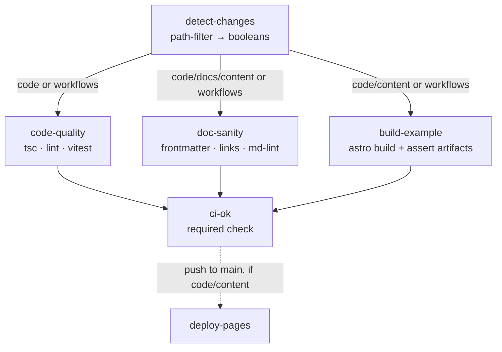

# CI/CD Pipeline

## Problem

doc-kitty must ship with a working CI/CD pipeline that runs unit and integration
tests, documentation sanity checks, and example-site deployment. It must be
efficient: a documentation-only change must not trigger code checks, and a
code-only change must not trigger the documentation build. This is a primary
concern, independent of the feature design.

## Constraints & goals

- **Path-efficient.** Each change runs only the lanes it can affect. No wasted
  builds, no false "required check" waits.
- **Single required status.** One aggregate check gates merges, so skipped lanes
  don't block (a classic branch-protection foot-gun).
- **Fail fast, fail cheap.** Doc problems caught by a build-free validator before
  any Astro build.
- **Deploy only what changed.** The example site redeploys only when the site or
  its toolkit actually changes.
- **Grows with features.** New suites (a11y, glossary/terminology, deck rendering)
  slot into existing lanes without re-architecting.

## Change-surface map

The repo is a pnpm workspace with distinct change surfaces. Every path belongs to
exactly one group (first match wins, top to bottom):

| Group | Paths | Meaning |
|---|---|---|
| `workflows` | `.github/workflows/**` | CI logic itself changed → run **everything** (can't trust selective skips). |
| `code` | `src/**`, `example/src/**`, `example/*.{ts,mjs,js,json}` (astro/config), root `package.json`, `pnpm-lock.yaml`, `pnpm-workspace.yaml`, `tsconfig*.json`, `vitest.config.*` | Toolkit or site code / build config. |
| `example_content` | `example/docs/**`, `example/public/**` | The **deployed** site's content/assets. |
| `repo_docs` | `docs/**`, `agents/**`, root `*.md` (README, AGENTS) | Project documentation that is **not** deployed (yet). |
| `ignored` | `research/**`, `**/*.excalidraw`, editor cruft | No CI. |

Key distinction: **`example_content` is deployed; `repo_docs` is not.** That single
fact drives the efficiency split — deployed content must prove it still builds;
repo docs need only pass sanity checks.

## Lane matrix

Which lanes run for which change group (∪ = union when a PR touches several
groups):

| Lane | `code` | `example_content` | `repo_docs` | `workflows` |
|---|:--:|:--:|:--:|:--:|
| **code-quality** (typecheck, lint, unit tests) | ✅ | — | — | ✅ |
| **doc-sanity** (frontmatter, links, md-lint) | ✅¹ | ✅ | ✅ | ✅ |
| **build-example** (integration: build + assert artifacts) | ✅ | ✅² | — | ✅ |
| **deploy** (Pages, `main` only) | ✅ | ✅ | —³ | ✅ |

¹ Code changes run doc-sanity because a schema/validator change can invalidate
existing docs. It is build-free and cheap.
² Deployed content must prove it still builds (catch invalid frontmatter / broken
links that would break the live site).
³ A change to non-deployed `repo_docs` does **not** redeploy the example.

This satisfies the requirement directly:

- **Doc-only PR** (only `repo_docs`): `doc-sanity` **only** — no tsc, no vitest,
  no Astro build.
- **Deployed-content PR** (`example_content`): `doc-sanity` + `build-example`, but
  **no** `code-quality`.
- **Code-only PR** (`code`): `code-quality` + `build-example` + `doc-sanity` (the
  last as a cheap safety net), but nothing doc-authoring-specific.

## Job DAG

- **`detect-changes`** uses a path-filter action (e.g. `dorny/paths-filter`) to
  emit the group booleans once.
- Each lane is gated by `if:` on those booleans.
- **`ci-ok`** `needs: [code-quality, doc-sanity, build-example]` with
  `if: always()`, and fails only if any need's result is `failure`/`cancelled`
  (a `skipped` need is fine). This is the **single required check** in branch
  protection — skips never block.
- **`deploy-pages`** is a separate `on: push: branches: [main]` workflow, itself
  path-filtered to `code`/`example_content`/`workflows`.

## Test taxonomy

- **Unit** (`vitest`, toolkit only): metadata helpers, schema validation, pure
  route-handler logic. Fast, no build. Already scaffolded in `src/tests/`.
- **Integration** (build-based): `astro build` the example, then assert the
  produced `dist/`:
  - `sitemap*.xml`, `rss.xml`, `llms.txt` exist;
  - `/api/index.json` is valid JSON with the expected shape/count;
  - README-as-index routing resolved (a section `README.md` rendered at its
    directory route);
  - a known page rendered with its metadata-derived chrome.
  A small Node assertion script over `dist/` suffices at first; graduate to
  Playwright when interactive components (lightbox, term tooltips, decks) land.
- **E2E / a11y** (deferred, own lane or nightly): Playwright + axe against the
  built site — nav, search, diagram lightbox, glossary tooltips, deck rendering.
  Aligns with the docs-accessibility doctrine; introduced with M2 components.

## Doc sanity checks

Build-free, ordered cheap→thorough:

1. **Frontmatter validation** — `validate-frontmatter.mjs` over `docs/` **and**
   `example/docs/`: required fields, `doc_status` enum, `divio_type` enum,
   `type`-by-path, bounded `description` length.
2. **Link & reference integrity** — internal `.md`/route links resolve; `related`
   refs resolve (fail on dangling), mirroring the client's build-fail guarantee.
3. **Markdown lint** — `markdownlint-cli2` with a shared config (headings,
   list style, no bare URLs). **In from day one.**
4. **Prose stylecheck** — **Vale** (a syntax-aware prose linter; lints prose,
   skips code/frontmatter). Start with a small style encoding the plain-language /
   accessibility styleguide (word swaps, banned hedges, sentence-case headings,
   meaningful link text, no emoji), gated on `error` severity. **In now** (basic
   ruleset), expanded over time.
5. *(Later)* **Terminology guard** — a custom Vale style enforcing the glossary's
   canonical terms, once the glossary feature lands; **freshness SLA** as a
   scheduled, non-blocking report (not a PR gate).

## Deployment

- Trigger: `push` to `main` only, path-filtered to
  `code`/`example_content`/`workflows`.
- Build the example, publish `dist/` to GitHub Pages (the existing `deploy.yml`
  becomes path-gated and shares the build step with `build-example`).
- A merge that touched only `repo_docs` does not redeploy.
- **No per-PR preview deploys** (decided) — Pages deploys on mainline only. PRs
  may upload `dist/` as a downloadable artifact if a preview is ever wanted.

## Nightly smoke / post-deploy monitoring

A scheduled flow that exercises the **live deployed site** — the checks that only
make sense against the real, published artifact (external link rot, rendered-DOM
a11y/SEO, cross-page click-through). Separate from PR CI; it **reports**, it does
not gate merges.

### Trigger & the "deployed since last run" gate

- `on: schedule` (nightly cron) + `workflow_dispatch` (manual).
- **Gate — run only if the docsite has deployed since the previous smoke run.**
  1. Query the current live deployment SHA via the GitHub Deployments API
     (`gh api repos/:owner/:repo/deployments?environment=github-pages` → newest →
     `sha`).
  2. Compare against the SHA recorded by the last smoke run, persisted in a durable
     marker. Preferred: a lightweight git ref (e.g. tag `smoke/last-run` or a
     one-line file on an orphan `smoke-state` branch) — survives indefinitely.
     Simpler fallback: `actions/cache` (can be evicted, but eviction just causes
     one extra run — a safe failure mode).
  3. If the deployed SHA **equals** the last-smoked SHA → exit early (no-op, cheap).
     Otherwise run the suite, then update the marker to the deployed SHA.
- This keeps the (heavier) browser-based suite from burning minutes on nights with
  no new deploy.

### Suite (against the deployed URL)

**Playwright is deferred to M2** — so the nightly starts browser-light (tools that
bring their own headless Chrome) and gains the click-through / visual / deep-a11y
suite once components exist.

| Phase | Check | Tool (candidate) | What it catches |
|---|---|---|---|
| **M0** | **Broken links** | `lychee` (fast, internal + external; no browser) | Dead internal routes and rotted external links — only visible against the live site. |
| **M0** | **SEO + a11y + perf + best-practices** | Lighthouse CI (`lhci` / `treosh/lighthouse-ci-action`), own Chrome, score thresholds | Meta/canonical/robots/structured-data + Core Web Vitals + a11y (axe subset). |
| **M0** | **Rendering integrity** ("broken style", partial) | Lighthouse **best-practices** audits | Browser **console errors** and **failed asset/network requests** (Lighthouse reports both). |
| **M2** | **Click-through** | Playwright | Key routes load (200, no console errors, elements present): home, each section index, a leaf page, glossary, a deck. |
| **M2** | **Deep accessibility** | `@axe-core/playwright` over the sitemap | Full WCAG sweep on the rendered DOM (beyond Lighthouse's subset). |
| **M2** | **Visual regression** ("broken style", full) | Playwright screenshot baselines | Layout/style breakage a DOM check misses. Deferred until the theme/components stabilize (baselines are noisy before then). |

So the **M0 nightly = `lychee` + Lighthouse CI** — links, SEO, a subset of a11y,
and console-error/failed-request rendering checks, all without Playwright.

### Reporting

- Write a GitHub **Step Summary**; upload artifacts (Lighthouse HTML, axe JSON,
  link-check report, Playwright traces/screenshots).
- On failure, **open/update a tracking Issue** (a nightly needs a durable signal,
  not just a red run buried in history). Non-blocking by nature — nothing to gate.

## Efficiency mechanisms

- One `detect-changes` job + conditional lanes (not many path-triggered
  workflows) → clean skips, one required check.
- `concurrency: { group: ci-${{ github.ref }}, cancel-in-progress: true }`.
- pnpm store + Node cache; install deps only in lanes that need them.
- `vitest` scoped to the toolkit; build scoped to `example`.
- *(Future, if the graph grows)* Turborepo/Nx task caching — not warranted at
  current size; plain pnpm + path filters is enough.

## Settled decisions

The strategy and settled parameters are recorded in
[ADR-0007](../adr/0007-ci-cd-path-scoped-lanes.md): path-scoped lanes with a
single `ci-ok` gate, build-on-deployed-content, Node 22+, `markdownlint` and
`Vale` from the start, Pages on mainline only, and a nightly gated on the
deployment SHA with Playwright deferred to M2. This page holds the design that
implements those decisions.

## Open questions

1. **Smoke-run marker persistence.** A git ref (`smoke/last-run` tag or orphan
   branch) or `actions/cache` for the "deployed since last run" gate. A git ref is
   durable; cache eviction only causes a harmless extra run. Leaning git ref.
2. **Where unit tests live.** Toolkit-only unit tests, with the example covered by
   the build-integration lane. Leaning toolkit-only unit, example via integration.
3. **Fork PRs and secrets.** Test and build lanes need no secrets, so they must
   pass on fork PRs. Deploy and the nightly's Deployments-API call use
   `GITHUB_TOKEN` and run only on the base repo.

## Acceptance criteria (draft)

- A PR touching only `docs/**` runs **only** `doc-sanity`; `code-quality` and
  `build-example` show as skipped, and `ci-ok` passes.
- A PR touching only `src/**` runs `code-quality` + `build-example` (+ cheap
  `doc-sanity`), not doc-authoring-specific work.
- A PR touching only `example/docs/**` runs `doc-sanity` + `build-example`, not
  `code-quality`.
- `ci-ok` is the sole required check and is green when the applicable lanes pass.
- Merging a `repo_docs`-only change to `main` does not redeploy Pages; merging a
  `code`/`example_content` change does.
- The integration lane fails if any expected build artifact (sitemap/rss/llms/api)
  is missing or malformed.
