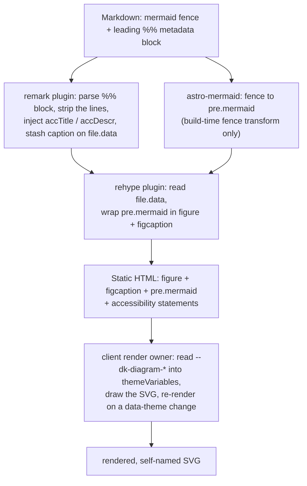

# Diagrams

A diagram is authored as a `` ```mermaid `` fence with an optional leading
`%% key: value` metadata block. The toolkit turns that source into an accessible,
themed figure and renders it in the browser. This page maps the surface — what
the parts are and how they fit. The decisions behind it are
[ADR-0023](../adr/0023-diagram-render-and-metadata-seam.md) (render ownership and
the metadata seam) and
[ADR-0024](../adr/0024-diagram-token-promotion-and-brand-wiring.md) (token
promotion and brand wiring); those records stay authoritative.

Audience: contributors working on the diagram transform, render, or theming, and
site authors who need the theming and CSP consequences.

## The pipeline



## The metadata transform

The metadata block is parsed at build, not in the browser. The split across two
pipeline stages is deliberate, so ordering is fixed by stage rather than by
fragile plugin registration order.

- **remark** parses the leading `%% key: value` block off the fence, strips the
  matched lines, injects the Mermaid accessibility statements (`accTitle` and
  `accDescr`) after the diagram-type declaration line, and stashes the caption
  fields on `file.data`. `astro-mermaid` turns the fence into
  `<pre class="mermaid">` as its build-time fence transform.
- **rehype** reads `file.data` and wraps the `<pre class="mermaid">` in a
  `<figure>` with a `<figcaption>`. remark always runs before rehype, so the
  caption data is present by the time the wrapper is built.

The four fields are `title`, `description`, `attribution`, and `source` — the
non-technical set an author actually needs. `accTitle` supplies the accessible
name (falling back to `description` when `title` is absent); `accDescr` supplies
the accessible description; the visible `<figcaption>` carries `description` and
`attribution`. The field set is closed, so an unknown `%%` line stays a Mermaid
comment and a `%%{ init }%%` directive is never read as metadata.

## The render owner

Exactly one client loop touches any `<pre class="mermaid">`. It reads the
`--dk-diagram-*` custom properties off `:root` into a Mermaid `theme: 'base'`
`themeVariables` object, renders each diagram, and re-renders on a `[data-theme]`
change through a `MutationObserver`. `astro-mermaid` runs with `autoTheme: false`
and its own client render disabled, so it never competes for the same nodes — one
owner means no double render and no wrong-theme flash. `mermaid` runs at
`securityLevel: 'strict'`.

### Token to `themeVariables` map

The diagram tokens are the mapping source; Mermaid's `themeVariables` are the
target. Only `--dk-diagram-*` feeds Mermaid — never the wider `--dk-*` catalog,
never Starlight's `--sl-*`. The map is fixed:

| `--dk-diagram-*` token | Mermaid `themeVariables` target |
| --- | --- |
| `node-fill` | `primaryColor`, `mainBkg`, `edgeLabelBackground` |
| `node-border` | `primaryBorderColor`, `nodeBorder`, `clusterBorder` |
| `node-text` | `primaryTextColor`, `nodeTextColor` |
| `edge` | `lineColor` |
| `subgraph-title` | `titleColor` |
| `cluster-fill` | `clusterBkg` |

The tokens live in the Default catalog with light and dark values and in the
brand token layer, so a vanilla site is themed in both modes and a branded site
renders its motif with no per-diagram styling. See
[theming](./theming.md) and [ADR-0024](../adr/0024-diagram-token-promotion-and-brand-wiring.md)
for the token catalog and the brand wiring.

## The opt-in seam

Diagrams are off by default. A site enables them through the toolkit preset,
which registers the fence transform, the remark and rehype plugins, and the
render owner. A site that authors no diagrams pulls in none of the diagram
runtime, so the feature costs nothing where it is unused.

## The two shells

The transform and the render owner are shared; two shells host them.

- **Documentation pipeline.** Regular pages run the remark and rehype plugins in
  the Markdown pipeline and load the render owner as a page client script. This
  is the common path for docs.
- **`DeckLayout`.** The out-of-frame reveal.js deck bypasses Starlight, so it
  loads the same render owner from its own browser-only client `<script>`,
  mirroring the deck's `reveal-init` pattern. The `--dk-diagram-*` tokens already
  ride the deck's base-token link, so no extra deck token wiring is needed, and
  the demonstrator diagram sits on the active first slide (reveal hides later
  slides, which Mermaid cannot size). See [slide decks](./slide-decks.md).

## Content-Security-Policy note for consumers

Client-side Mermaid injects an inline `<style>` element into each rendered SVG.
A site that sets a Content-Security-Policy must therefore allow
**`style-src 'unsafe-inline'`**, or diagrams render unstyled. The toolkit ships
no CSP of its own, so nothing conflicts today; this is the note a site author
needs when adding one. [ADR-0023](../adr/0023-diagram-render-and-metadata-seam.md)
records the decision — this page is where a consumer finds the consequence.

## Build-time render (dual-mode)

Issue #13 added a **build-time** render for **both Mermaid and PlantUML**
alongside the client render described above ([ADR-0040](../adr/0040-build-time-diagram-render-dual-mode.md)).

- **Mode.** A resolved flag (`DK_DIAGRAM_BUILD_RENDER`, else auto-detect a
  resolvable Playwright Chromium) selects **build** or **client** per build. Build
  mode pre-renders each diagram to a static inline `<svg>` and ships no diagram
  runtime; when no browser is available the build falls back to the client render,
  byte-identical to before. The mode is gate-observable so every diagram gate
  branches on it.
- **Engines.** Mermaid renders via `@beoe/rehype-mermaid` (Playwright/Chromium);
  PlantUML via `astro-plantuml` against a **self-hosted** server — never
  `plantuml.com` (the resolver throws on any such URL). Both exact-pinned.
- **Theme without JavaScript.** Each engine is handed the six `--dk-diagram-*`
  colours as distinct sentinels (Mermaid `themeVariables`, PlantUML `skinparam`);
  a rehype pass rewrites every sentinel in the SVG to `var(--dk-diagram-*)`, so a
  `[data-theme]` toggle re-themes the static SVG by pure CSS. The token contract
  and its contrast guarantees are unchanged.
- **Accessibility + figure.** The `%%` (Mermaid) / `'` (PlantUML) metadata injects
  the accessible name into the SVG (`<title>`/`<desc>`); the same `diagram-figure`
  wraps it in `<figure role="group" aria-labelledby>` + `<figcaption>`.
- **CI + deploy** build-render both engines (Chromium in the build composite; a
  self-hosted PlantUML `services:` container) with a disk cache so an unchanged
  diagram never relaunches the engines. PlantUML has no client renderer, so in
  client mode a ```plantuml block is a plain code fence.
