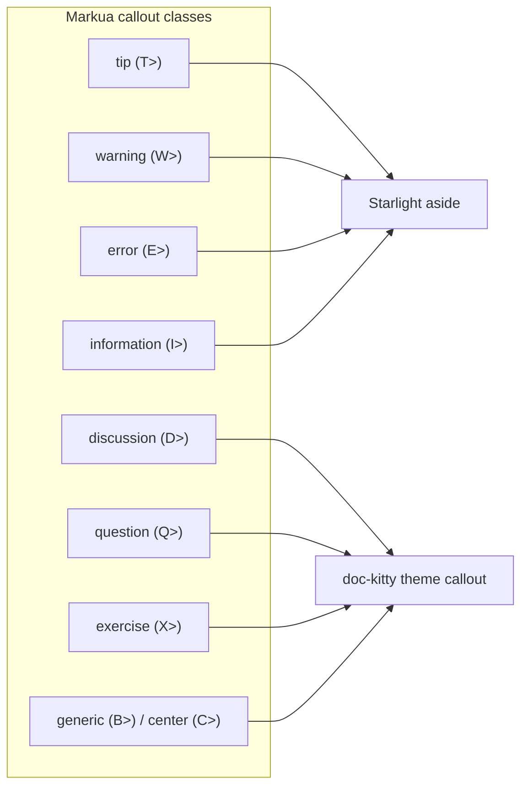
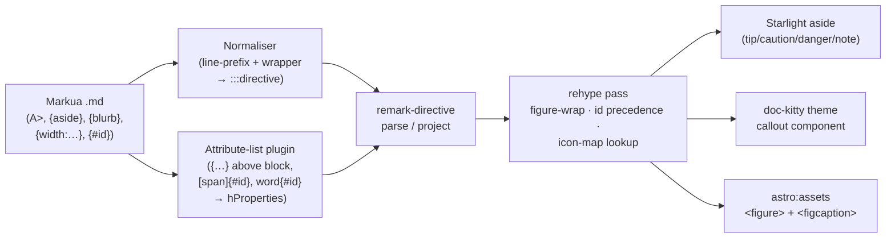

# Markua subset

[Markua](https://leanpub.com/markua) is Leanpub's Markdown dialect, a superset of
CommonMark and GFM. doc-kitty renders a **curated, opt-in subset** of it — asides,
callouts, figure images, crosslink ids, and callout icons — so a Leanpub-authored
page renders as its author intended, without changing base Markdown rendering and
without coupling pages to MDX. The decision behind this design is
[ADR-0030](../adr/0030-markua-preprocess-to-directive.md); that record stays
authoritative for the *why*. This page is the docs of record for the *what*: the
subset surface and its limits.

Audience: doc-kitty authors bringing in Leanpub content, and contributors working
on the `markua-*` remark/rehype plugins.

## Opt-in, additive activation

Support is gated behind an opt-in preset flag, the same shape as the `diagrams`
preset: `defineDocKittyIntegrations({ markua: true })`. With the flag **off** (the
default), Markua-specific lines degrade to literal readable text and every page is
byte-identical to a Markua-unaware build. With it **on**, a page using none of the
constructs below still renders identically — the feature costs nothing until a
site opts in.

## The five constructs

| Construct | Author writes | Renders as |
|-----------|----------------|------------|
| Aside | `A>` run · `{aside}…{/aside}` wrapper | a theme callout (`dk-callout--aside`); headings inside it are excluded from the table of contents |
| Callout | `T>`/`W>`/`E>`/`I>`/`D>`/`Q>`/`X>`/`C>`/`B>` shorthand · `{class: …}`+`B>` · `{blurb, class: …}…{/blurb}` | a Starlight aside (four mapped classes) or a doc-kitty theme callout (the rest) — see the mapping below |
| Figure image | `` (+ an optional attribute list) | an accessible `<figure>`/`<figcaption>` via `astro:assets` |
| Crosslink id | `{#id}`/`{id: …}` above a block · `[span]{#id}` · `word{#id}` | an explicit `id` a standard `[text](#id)` link resolves to |
| Callout icon | `{icon: fa-name}` on a callout | the mapped Starlight icon, or a graceful drop with a build warning |

The three input forms for one callout class (shorthand, `{class:}`+`B>`,
`{blurb, class:}`) always produce identical output — they normalise to a single
directive before mapping runs.

## Callout class → target mapping

Four classes have a native Starlight aside and keep it: tip→`tip`,
warning→`caution`, error→`danger`, information→`note`. The remaining six —
`aside`, `discussion`, `question`, `exercise`, `generic`, and `center` — have no
Starlight equivalent, so they render through a hand-emitted doc-kitty theme
callout: `<aside class="dk-callout dk-callout--{variant}">`, styled by a
`--dk-callout-*` token family in `theme.css`. This mirrors how
`rehype/diagram-figure.ts` already builds a `<figure>` as raw hast rather than an
Astro component — the Starlight `components` map is frozen at exactly four
carriers (ADR-0013/ADR-0015), so no directive → component seam exists for a
markua callout to ride.

### The attribute tradeoff (pinned)

Starlight's own `remarkAsides` rebuilds a mapped directive as a fresh aside and
**discards its attributes**. So a mapped-class callout (tip/warning/error/
information) that carries `{#id}` or `{icon: …}` cannot ride the native aside —
it is routed to the theme-callout hast instead, using a mapped-name fallback
variant (`dk-callout--tip`, `dk-callout--caution`, `dk-callout--danger`,
`dk-callout--note`) styled to echo the native aside look. A mapped callout with
no such attribute keeps the native Starlight aside. This is a deliberate,
recorded tradeoff (ADR-0030 Consequences), not an accident of ordering.

## The build-time pipeline

No client JavaScript ships for any construct; every transform runs at build time
over the mdast/hast the Markdown pipeline already produces:

1. **Normaliser** (remark, mdast-level) compiles the `A>`/shorthand line-prefix
   runs and the `{aside}…{/aside}` / `{blurb, class: …}…{/blurb}` wrappers into
   `remark-directive` container syntax — one directive per run, per the pinned
   [block-detection rules](../../kitty-specs/markua-syntax-support-01M167JG/contracts/normaliser-block-detection.md).
   Because this runs on the already-parsed mdast, a fenced code block or a real
   CommonMark blockquote is never mistaken for a Markua block — CommonMark has
   already classified them into `code`/`blockquote` nodes before the normaliser
   sees the tree.
2. **Attribute-list plugin** (remark) attaches `{…}` values written on their own
   line above a block, or trailing an inline span, onto that target's
   `hProperties` — images, block ids, span ids, and a callout's `class`/`icon`.
   An unsupported key is silently ignored rather than erroring.
3. **`remark-directive`** parses the normaliser's container syntax into directive
   mdast nodes; doc-kitty registers it once, shared with the glossary
   integration when both are active.
4. **Callout mapping** (remark) emits the four mapped classes as a
   `containerDirective` Starlight's own `remarkAsides` renders, and the six theme
   classes as raw hast. A **ToC-demotion** rehype pass runs before
   `rehypeHeadingIds` so a heading inside a callout is excluded from the page's
   table of contents while staying an accessible heading (`role="heading"` +
   `aria-level`) to assistive tech.
5. **Figure rehype** rewrites an image into `<figure>`/`<figcaption>` — the
   bracket text is the caption, `{alt:}` sets the real alt text, `{width:}`/
   `{height:}`/`{align:}` drive sizing and layout — running **before**
   `rehypeImages` so the markua-derived `alt`/sizing survive Astro's image
   optimisation.
6. **Icon lookup** resolves a callout's `{icon: fa-name}` against a curated seed
   map; an unmapped name drops the icon and logs a build warning rather than
   failing.

Doc-kitty's markua plugins are **prepended before `starlight()`** in
`config.ts`, the same ordering the `diagrams` and glossary integrations already
rely on — this is what lets Starlight's `remarkAsides` see the constructed
directives at all.

## Explicit anchor ids

`{#id}`/`{id: …}` above a block, or `[span]{#id}`/`word{#id}` on an inline span,
sets an explicit `id` a standard `[text](#id)` Markdown link resolves to. An
explicit id **deterministically wins** over an auto-generated heading id on
collision: Astro's built-in `rehypeHeadingIds` assigns a slug only when the node
does not already carry an `id`, so this is native precedence — no `rehype-slug`
dependency, no ordering shim. A heading with no Markua id syntax keeps receiving
its auto-generated anchor exactly as it does today.

## Graceful degradation

Nothing in this subset can fail the build. An unrecognised or malformed
construct — an unbalanced `{aside}`/`{blurb}` wrapper, an unsupported attribute
key, an unmapped icon name — degrades to readable text (or renders without the
missing piece plus a warning) rather than breaking the page. With the `markua`
preset off, every one of these lines shows as literal text on a plain-Markdown
host — the portability fallback Markua itself relies on.

## Limits — what this subset does not render

This subset is deliberately **not** a full Markua implementation. The following
are out of scope for this mission and render as literal text (or are silently
ignored, where noted) rather than as intended Leanpub output:

- **Full Markua** — the complete Leanpub grammar; this is a curated subset of
  five constructs, not a general Markua parser.
- **Book/manuscript content types** — Leanpub's `Book.txt`/`Sample.txt`
  structure, parts, and multi-file manuscript concatenation are not a doc-kitty
  page shape.
- **Non-image resources** — audio, video, math figures, and external code
  samples referenced with ``-style syntax are not resolved as
  figures.
- **Quizzes, interactive exercises, and definition lists** — Leanpub's
  quiz/exercise blocks and definition-list syntax are not recognised constructs.
- **Document-settings blocks and directives** — book-level settings blocks have
  no meaning on a single doc-kitty page.
- **Layout-only image attributes with no web analog** — `fullbleed` and
  `float: inside|outside` are Leanpub print/ebook layout hints; the attribute
  list plugin silently ignores them rather than approximating a layout it
  cannot express on the web.
- **Table attributes** — `column-widths` and similar table-specific attributes
  are not honoured.
- **Inline `:fa-name:` icons** — only `{icon: fa-name}` on a callout is
  supported; a standalone inline Font Awesome shorthand is not.

An attribute the subset does not honour for its target (any of the above, plus
any other key not listed in the [attribute-list contract](../../kitty-specs/markua-syntax-support-01M167JG/contracts/attribute-list-plugin.md))
is **silently ignored**, matching Markua's own behaviour for an attribute it
does not recognise — it never errors and never fails the build.

## References

- [ADR-0030: Render Markua by preprocessing to `remark-directive`](../adr/0030-markua-preprocess-to-directive.md) —
  the ratified decision, its alternatives, and its consequences.
- Mission contracts: [normaliser block-detection](../../kitty-specs/markua-syntax-support-01M167JG/contracts/normaliser-block-detection.md),
  [attribute-list plugin](../../kitty-specs/markua-syntax-support-01M167JG/contracts/attribute-list-plugin.md),
  [callout mapping](../../kitty-specs/markua-syntax-support-01M167JG/contracts/callout-mapping.md),
  [figure render](../../kitty-specs/markua-syntax-support-01M167JG/contracts/figure-render.md),
  [icon map](../../kitty-specs/markua-syntax-support-01M167JG/contracts/icon-map.md).
- [Example: Markua showcase](/guides/markua-showcase/) — the published fixture
  page exercising every construct in this subset.
