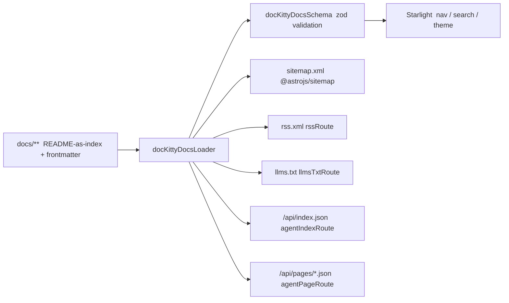

# Overview

The toolkit is a library; a docs repo is a small Astro app that wires it in.

## Components

- **`defineDocKittyIntegrations()`** — Starlight + sitemap preset with the feed
  and agent-API `<head>` links.
- **`docKittyDocsSchema()` / `docKittyDocsLoader()`** — the frontmatter schema
  and the loader that reads repo-root `docs/` and rewrites `README.md` → section
  slug.
- **Route handlers** — `rssRoute`, `llmsTxtRoute`, `agentIndexRoute`,
  `agentPageRoute`; a site mounts them as two-line endpoint files.
- **`lib/metadata.ts`** — framework-agnostic model + helpers (publication
  gating, section ordering, agent-record shaping); unit-tested in isolation.
- **Builder scripts** — `scaffold.mjs` (emit the tree), `new-doc.mjs` (one
  page), `validate-frontmatter.mjs` (CI gate).

## The agent-API

Discovery, not RAG: `llms.txt` is a browsable table of contents grouped by
section; `/api/index.json` is the same as structured JSON; `/api/pages/<id>.json`
returns one page's metadata plus its raw Markdown. An agent discovers the whole
corpus from one file and fetches clean source for exactly what it needs.

## Version-sensitive spots

Two spots depend on the pinned Starlight/Astro versions and are verified when the
build toolchain is wired up: the exact loader API for README-as-index, and
pointing the `docs` collection at repo-root `docs/`. See
[ADR-0002](../adr/0002-readme-as-index.md).
