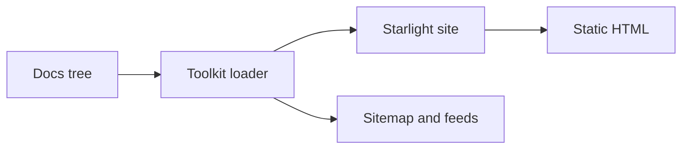
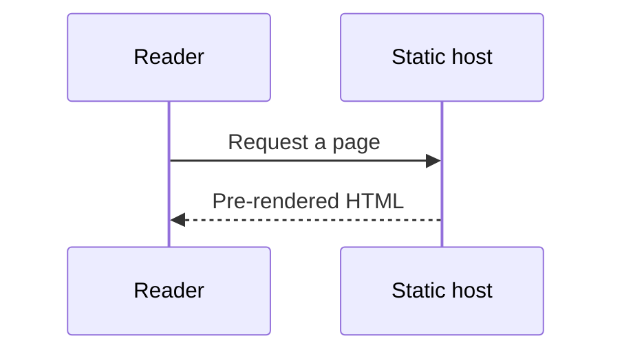

# Diagram demonstrator

A diagram is just a ` ```mermaid ` fenced code block. doc-kitty renders it in the
browser as a themed, accessible figure and — with a small comment block at the top —
gives it a caption, a credit line, and the accessible name and description a screen
reader announces. This page shows the full surface twice, on two different diagram
types, so you can copy whichever shape fits your page.

## What the metadata fields do

Put a short block of Mermaid `%%` comments at the very top of the diagram, using
plain-language keys — all optional:

- **`title`** becomes the diagram's accessible **name** (what a screen reader
  announces first). When you omit it, the **`description`** is used as the name
  instead, so any metadata at all names the diagram.
- **`description`** becomes the figure's **caption** and the diagram's accessible
  **description**. Always provide at least this one.
- **`attribution`** becomes a credit line; when **`source`** is present, the credit
  links there.

A typo in a key (`%% descriptn:`) is harmless — it stays an ordinary comment and the
diagram still renders. One caveat: do **not** use the `%%{ … }%%` form for metadata.
That is Mermaid's reserved init directive, and doc-kitty deliberately never reads it
as a field (the metadata parser requires whitespace after `%%`, so `%%{` can never be
mistaken for a `%% key:` line).

## A fully-annotated flowchart

All four fields are present here, so the figure gets a caption, a linked credit line,
and a distinct accessible name (`title`) separate from its description.



## A description-only sequence

This one omits `title` on purpose, and uses a **sequence** diagram rather than a
flowchart. Because there is no `title`, the `description` becomes *both* the caption
and the accessible name — the name fallback, proven end-to-end on a non-flowchart
type.



## With JavaScript off

Rendering happens in the browser, so if a reader has JavaScript disabled the diagram
does not draw. What survives is the part that carries the meaning: the **raw diagram
source** stays in the page, and the **caption** (the `description`) is right below it.
Nothing is lost silently — the reader sees the source and its plain-language summary
instead of a picture. The diagram JavaScript also loads **only** on pages that
actually contain a diagram, so a diagram-free page pays no cost.
