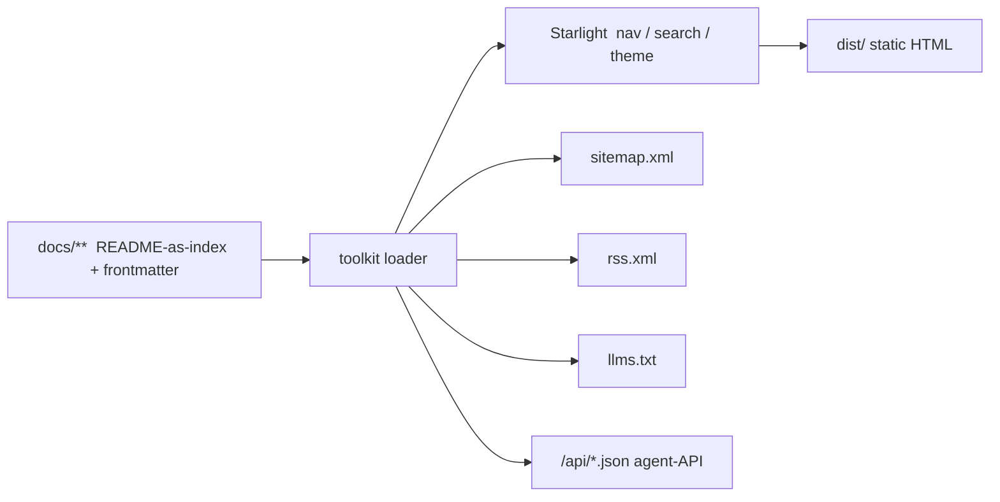

# Overview

The site is a static Astro + Starlight build driven entirely by the `docs/`
tree.

## Key properties

- **Static** — no server; everything renders at build time.
- **Metadata-driven** — nav, feeds, and the agent-API all read from frontmatter.
- **Convention-first** — the `docs/` tree is a valid OKF bundle.

See the toolkit's own architecture docs for the internals.
