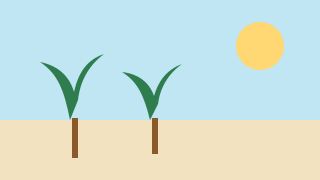

<!-- markdownlint-disable -->
<!-- This is a Markua fixture: it deliberately contains Markua syntax (headings
     inside asides/callouts, fenced code in wrappers, {#id} crosslinks, intentional
     malformed constructs) that conventional markdownlint rules flag. Not conventional
     Markdown; frontmatter + links are still validated by validate:docs/validate:links. -->

# Markua showcase

This page is the author-facing reference for doc-kitty's opt-in **Markua** syntax
(FR-014) and, at the same time, the coverage fixture that the verification gates
scan (NFR-003, the `data-model.md` coverage matrix). Everything here is opt-in: on
a site with `markua: false` the same source renders as plain Markdown — every line
below reads as literal text, never broken markup (SC-003).

## Asides

An **aside** is a tangential block. Write a run of `A>` lines, or wrap a multi-block
body in `{aside}…{/aside}`.

### A single-line aside

A> This is a short aside. <!-- row 1 -->

### A multi-paragraph aside with an internal heading

A> # Notes for the curious
A>
A> An aside can span several paragraphs. Its leading heading is surfaced as the
A> callout title and is deliberately kept out of the table of contents so a
A> tangential note never clutters the on-this-page nav.
A>
A> ## A demoted subheading
A>
A> A non-leading heading inside an aside stays a heading for assistive tech
A> (demoted to a role=heading element) but is excluded from the on-this-page nav
A> by the ToC-demotion pass. <!-- row 2 (+ WP06 ToC-exclusion proof) -->

### A wrapped, nested aside

The wrapper form takes a multi-block body and is **nestable** — an aside can
contain another aside, and the nesting survives the full render pipeline.

{aside}
# A wrapped aside

Wrappers take multi-block bodies.

{aside}
A nested aside sits inside its parent — proof that nesting works end to end.
{/aside}
{/aside}
<!-- row 3 (+ mandatory live nested aside) -->

### An aside wrapping a fenced code block

A fenced block inside an aside keeps its content verbatim, including a leading
`>` that must stay code and never become a blockquote.

{aside}
Here is a shell transcript inside the aside:

```text
> this angle bracket is literal code, not a blockquote
echo "the fence boundary is respected"
```
{/aside}
<!-- row 4 -->

## The same callout, three ways (identical output)

Every callout class can be written three ways — the shorthand line prefix, an
explicit `{class: …}` above a `B>` blurb, and a `{blurb, class: …}` wrapper. All
three normalise to **one** identical block (FR-004). The four Starlight-mapped
classes render as native Starlight asides; the six theme classes render through
the theme callout.

{#eq-tip}
### Tip (Starlight)

T> A tip offers helpful, optional advice.

{class: tip}
B> A tip offers helpful, optional advice.

{blurb, class: tip}
A tip offers helpful, optional advice.
{/blurb}

{#eq-warning}
### Warning → caution (Starlight)

W> A warning flags something to be careful about.

{class: warning}
B> A warning flags something to be careful about.

{blurb, class: warning}
A warning flags something to be careful about.
{/blurb}

{#eq-error}
### Error → danger (Starlight)

E> An error marks a critical problem.

{class: error}
B> An error marks a critical problem.

{blurb, class: error}
An error marks a critical problem.
{/blurb}

{#eq-information}
### Information → note (Starlight)

I> Information gives neutral context.

{class: information}
B> Information gives neutral context.

{blurb, class: information}
Information gives neutral context.
{/blurb}

{#eq-discussion}
### Discussion (theme)

D> A discussion callout opens a point for debate.

{class: discussion}
B> A discussion callout opens a point for debate.

{blurb, class: discussion}
A discussion callout opens a point for debate.
{/blurb}

{#eq-question}
### Question (theme)

Q> A question callout poses something to consider.

{class: question}
B> A question callout poses something to consider.

{blurb, class: question}
A question callout poses something to consider.
{/blurb}

{#eq-exercise}
### Exercise (theme)

X> An exercise callout sets a task for the reader.

{class: exercise}
B> An exercise callout sets a task for the reader.

{blurb, class: exercise}
An exercise callout sets a task for the reader.
{/blurb}

{#eq-center}
### Center (theme)

C> A centered callout draws the eye.

{class: center}
B> A centered callout draws the eye.

{blurb, class: center}
A centered callout draws the eye.
{/blurb}

{#eq-generic}
### Generic (theme)

B> A generic blurb groups a plain, aside-like note.

{class: generic}
B> A generic blurb groups a plain, aside-like note.

{blurb, class: generic}
A generic blurb groups a plain, aside-like note.
{/blurb}

{#eq-aside}
### Aside (theme)

A> An aside holds a tangential remark.

{class: aside}
B> An aside holds a tangential remark.

{blurb, class: aside}
An aside holds a tangential remark.
{/blurb}

## Callouts carrying attributes

A Starlight-mapped class that carries a `{#id}` or a `{icon:}` routes through the
**theme** callout instead of the native aside, because the native aside path
discards attributes. The class becomes the fallback variant (for a tip,
`dk-callout--tip`) so the id and icon survive on the `<aside>`.

{#pinned-tip}
T> This tip carries an id, so it rides the theme callout and keeps `id="pinned-tip"`. <!-- row 15 -->

{icon: fa-lightbulb, #icon-tip}
T> This tip carries a **mapped** icon (`fa-lightbulb`), which resolves and renders. <!-- row 32 -->

## Figures

An image with a `{…}` attribute list above it becomes an accessible `<figure>`:
the bracket text is the caption, `{alt:}` is the alt text, and sizing/alignment/
class/id attributes are honoured.

{alt: "a palm-lined tropical beach", title: "On the shore", width: 75%, align: middle, class: featured, #palm-fig}



<!-- rows 16, 18 (alt), 20 (title), 21 (width, round-trip), 23 (align), 24 (class), 25 (#id) -->

A web image passes through unoptimised, and `{caption:}` overrides the bracket
text while `{height:}` sizes it:

{caption: "The original Macintosh", height: 240, align: left}


<!-- rows 17 (web passthrough), 19 (caption), 22 (height) -->

An unsupported attribute such as `{fullbleed:}` is silently ignored — no error,
the figure still renders:

{fullbleed: true, alt: "a lighthouse at dusk"}


<!-- row 26 -->

## Crosslink ids

Put `{#id}` above a heading to give it a stable anchor, then link to it. Explicit
ids win over the auto-generated slug, and headings with no Markua keep their slug.

{#intro}
## Introduction

This section has an explicit `{#intro}` anchor. Jump to the
[introduction](#intro) or straight to the [overview](#overview). <!-- row 27 -->

{#overview}
## Overview

This heading's text would auto-slug to `overview` too; the explicit `{#overview}`
**wins** and no duplicate anchor is produced. <!-- row 28 -->

## Plain heading, automatic anchor

This heading carries no Markua syntax, so it keeps its automatic
`plain-heading-automatic-anchor` slug (FR-008). <!-- row 29 -->

### Span ids

You can anchor an inline span. The bracketed form wraps its label:
[the beach]{#beach-span} — and the trailing form wraps the preceding word:
shoreline{#shoreline-span}. Jump to the [beach span](#beach-span) or the
[shoreline span](#shoreline-span). <!-- rows 30, 31 -->

## An attribute above a wrapper

An id placed immediately above an `{aside}` (or `{blurb}`) wrapper lands on the
container itself:

{#anchored-aside}
{aside}
This aside carries `id="anchored-aside"` from the attribute line above it.
{/aside}
<!-- row 34 -->
