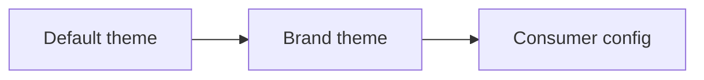

## Already structured — now it's a site

**Your `docs/` tree already has structure. doc-kitty turns it into a site — on brand, agent-readable, self-maintaining — without a redesign.**

Note: three legs carry every slide that follows: zero theme work, built for agents not just humans, and self-checking rather than self-trusting.

## The gap Common Docs leaves open

- Common Docs gives you structure — not a publish path.
- No agent-aware way to expose that structure.
- No generated discovery surface: no site, no agent-API, no feeds.
- Closing that gap, without a theme build, is why doc-kitty exists.

## A page's kind is its layout

- `Default`, `Hub`, `Persona`, `Presentation` — a page's `kind` selects its layout automatically.
- No per-page template authoring, ever.
- Section order, labels, and typing come from `docs/_meta/sections.yaml`.
- Relabel or reorder a section: one data edit, not a deploy.

## Write once, render correctly

- Mermaid diagrams become accessible, themed, self-captioning figures.
- The Markua subset (asides, callouts, figures, crosslinks) renders imported content as its author intended.
- Pages that use none of it: nothing changes.

## The glossary that keeps itself honest

- One shared vocabulary file (Contextive) drives the whole site.
- First-mention auto-linking, scoped per section.
- A hover preview on every linked term.
- An on-page "terms used" list that can never drift from what's linked.

## Every page knows who it's for

A page's metadata says who it's for and what to read next — no hand-built "see also" list.

### Audience

- An audience block links a page to its intended persona.

### Related pages

- Card-style cross-links, with a visible marker when a target has gone stale.

### External references

- A citation catalog for sourced claims, right where the claim is made.

## The same metadata, twice

- `llms.txt` and a JSON agent-API (`/api/index.json`, `/api/pages/*.json`) — a crawlable map, not a RAG index.
- `sitemap.xml` and `rss.xml`, generated from the same source.
- An agent discovers the whole corpus from one file.

Note: the differentiator slide for this audience — the same metadata that drives human navigation also drives machine discovery. Let it breathe; don't crowd it with more bullets.

## One theme contract, three layers

Note: only the Default layer is required to be complete — an unthemed site is still fully styled.

## Correctness the site checks itself

- A fail-closed link-integrity gate: a broken internal link fails the build, not the review.
- WCAG 2.2 AA across every layout, including a mandatory no-JS deck fallback.
- Metadata and vocabulary drift degrade to a warning — never a silent break.

## This deck could have been one of these

- A page with `kind: Presentation` under `presentations/` renders out-of-frame as a static reveal.js deck.
- `##` opens a horizontal slide, `###` opens a vertical stack — no slide DSL.
- Speaker notes and per-slide directives are plain Markdown and HTML comments.
- Live example: `example/docs/presentations/showcase-deck.md`.

## Dark by default, yellow with intent

- Dark mode is the canonical surface; light mode is a derived, AA-checked companion.
- Yellow (`#F5C518`) marks CTAs, active nav, focus rings, and the passport strip — never body text.
- A defined copy voice: sentence case, no exclamation marks, canonical nouns capitalised.
- One flow notation, everywhere: `spec -> plan -> tasks -> implement -> review -> merge`.

## Point it at your docs

Your `docs/` tree already has the structure. doc-kitty turns it into a site — on brand, agent-readable, self-maintaining.

- Try it against the example site, or one section of your own tree.
- Pilot a single section before committing the whole tree.

Note: ask for the decision here — a pilot, a spike, or a named follow-up demo — not just admiration.
