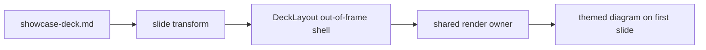

This opening paragraph appends to the synthesized title slide, and carries the
indexed slide sentinel **quokka showcase sentinel** that Pagefind must resolve to
this deck's own URL.

## Horizontal slide with directives

The first `##` opens a fresh horizontal slide. A slide directive paints its
background so the built `<section>` carries the applied attribute.

<!-- .slide: data-background-color="#101828" -->

- Slides are pre-rendered at build; reveal only enhances them.
- This list is revealed as a fragment.

<!-- .element: class="fragment" -->

## Slide that becomes a vertical stack

This paragraph is the first inner slide of the stack.

### Inner stack slide

A `###` heading converts the parent `##` slide into a vertical stack: the
accumulated content becomes inner section one, and this heading opens inner
section two.

---

A thematic break opens this headingless slide, so the transform emits a
`<section>` with an `aria-label` for its accessible name.

Note: armadillo backstage secret — speaker-only content in the notes aside that
must never surface as a Pagefind search result.
