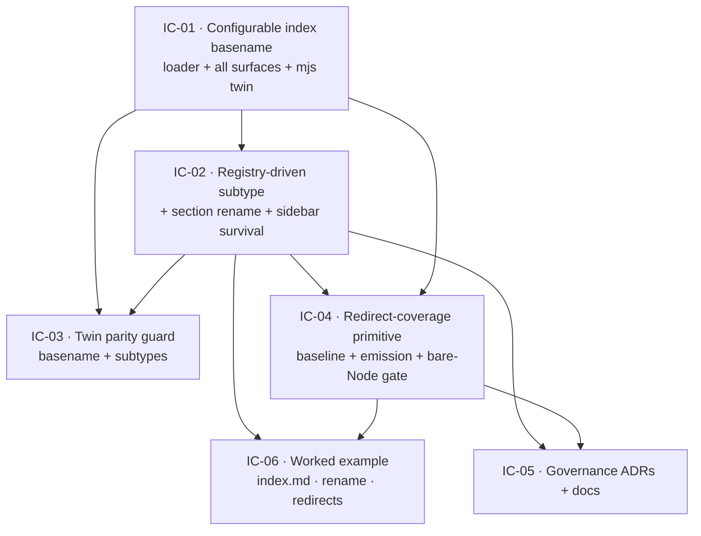

# Implementation Plan: Adopter loader & migration

**Branch**: `feat/adopter-loader-migration` | **Date**: 2026-09-03 | **Spec**: [spec.md](./spec.md)
**Input**: Feature specification from `kitty-specs/adopter-loader-migration-01M1KKYA/spec.md` (revised, commit `25ac369`)

## Summary

Deliver three adopter-migration enablers as first-class toolkit capabilities, in build order US1 → US2 → US3:

1. **Configurable index basename** — the section-index loader and every index-detecting surface accept `index.md` as well as `README.md` (case-insensitive), gated by an `indexBasename` option that defaults to `README`.
2. **Registry-driven section rename** — a section-folder rename (top-level id *and* sub-path subtype) follows the folder through the section registry (a new `subtypes` field), regenerates routes, preserves the sidebar group, and keeps `related:` links resolved — with no per-rename derivation-code edit.
3. **Redirect-coverage primitive** — a committed URL baseline, a redirect map emitted into the build (Astro native `redirects`), and a bare-Node, target-aware coverage gate that reds before an adopter ships a live 404.

Cross-cutting: extend the ts↔mjs derivation-twin parity tests to the new basename + subtypes logic (guarded twins in scope; full #49 single-source consolidation out), and record the governance shift as new ADRs.

## Technical Context

**Language/Version**: TypeScript 5.x (toolkit `src/lib/`) + Node ≥22 ESM (bare-Node gates `src/scripts/*.mjs`); Astro 4 + Starlight (peer-capped `<0.33` per ADR-0029).
**Primary Dependencies**: `astro`, `@astrojs/starlight` (native `redirects` config — no new redirect dependency), `zod` (schema), `js-yaml` (section registry), `vitest` (unit + parity), `@playwright/test` (a11y/build), `markdownlint-cli2`. **No new runtime dependencies planned** (supply-chain posture below).
**Storage**: filesystem — `docs/` tree, `docs/_meta/sections.yaml` (registry, gains an optional `subtypes` field), a new committed URL-baseline artifact, and the emitted redirect map (`_redirects` / Astro config).
**Testing**: Vitest unit + the two parity twins (`section-type-parity.test.ts`, `schema-validator-parity.test.ts`); the example build + `assert-build-artifacts.mjs`; `check-links.mjs`; a new bare-Node redirect-coverage gate; Playwright a11y. ATDD red-first per WP.
**Target Platform**: Node 22+, static Astro build deployed to GitHub Pages (example only; repo docs run sanity).
**Project Type**: single — pnpm workspace splitting the toolkit (`src/`, `@commondocs-kitty/toolkit`) from `example/`.
**Performance Goals**: the redirect-coverage gate adds ≤ a few seconds to the `doc-sanity` job and spawns **no** Astro build (bare-Node, deterministic).
**Constraints**: bare-Node gates must run with no Astro build context; ts↔mjs derivation parity 0 drift (gated); backward-compatible no-op on the current README-based corpus (existing suite + all gates stay green); ADR-0029 Starlight content-root peer cap `<0.33` unchanged.
**Scale/Scope**: toolkit change, ~10–14 files across `src/lib/`, `src/scripts/`, `src/tests/`, `example/`, `docs/adr/`, and the changelog. No data migration; no external service.

**Supply-chain security (051 / advisory)**: The plan adds **no** dependency — redirect emission uses Astro's built-in `redirects`, and YAML/schema parsing reuse the installed `js-yaml`/`zod`. If implementation discovers a genuine need for a new package, apply DIRECTIVE_051 (registry authenticity, freshness, deny-by-default lifecycle scripts, Node Active-LTS) and record the decision in `research.md` before adding it. No security-impacting dependency decision is open at plan time; silence here is a documented "none needed", not an unexamined gap.

## Charter Check

*GATE: Must pass before Phase 0 research. Re-check after Phase 1 design.*

| Charter principle | Status | Note |
|---|---|---|
| ADRs immutable; change via new/superseding ADR (§89-93) | **Action** | Author new ADR(s): supersede ADR-0002 *in part* (README no longer sole index basename) and **reverse** ADR-0004's "adaptation tolerated, not supported" for `index.md`/rename; greenfield redirect-coverage ADR. Regenerate the ADR index (`generate-adr-index.mjs`). |
| Three separated axes (content / IA / presentation) | **Pass** | Index basename + `subtypes` are **IA** (registry `sections.yaml`) concerns; redirect map is **presentation/build-output**. Separation preserved — a consumer changes any one without the others. |
| Amend Common Docs, degrade gracefully (ADR-0004) | **Pass (via reversal ADR)** | The promotion to "supported" is the deliberate, recorded posture shift; README default keeps graceful degradation for non-adopters (C-001). |
| Metadata contract (ADR-0009): `type` optional, registry-derived | **Pass** | No contract change; `subtypes` extends derivation data, `type` stays optional (#38 already shipped). |
| Path-scoped CI (ADR-0007); doc-sanity stays green | **Action** | Wire the redirect-coverage gate into the appropriate lane (code/example); keep the single `ci-ok` aggregate as the only required check. |
| Living documentation | **Action** | Update `docs/context/convention.md` + `docs/guides/authoring.md` for the basename/subtypes options; changelog entry per user-facing change. |
| Dogfooding — README stays default | **Pass** | C-001; doc-kitty's own tree is not migrated; built-in subtype table stays as fallback. |

No charter violations requiring Complexity Tracking. The ADR/doc/CI actions are deliverables, not gate breaks.

## Project Structure

### Documentation (this mission)

```
kitty-specs/adopter-loader-migration-01M1KKYA/
├── plan.md              # This file
├── research.md          # Phase 0 — consolidated decisions (grounding squad + design)
├── data-model.md        # Phase 1 — registry subtypes, redirect map, URL baseline shapes
├── quickstart.md        # Phase 1 — how an adopter uses each capability
├── contracts/           # Phase 1 — indexBasename option, subtypes schema, coverage-gate CLI
└── tasks/               # Phase 2 — /spec-kitty.tasks output (NOT created here)
```

### Source Code (repository root)

```
src/
├── lib/
│   ├── metadata.ts            # readmeToIndexId (~374): add case-insensitive (README|index) + indexBasename;
│   │                          #   expectedDocType (~231-242): consult registry `subtypes` before built-in table
│   ├── sections.ts            # sectionTypes (~199); NEW resolveSubtype(registry) from an optional `subtypes` field (~585 deferred seam);
│   │                          #   registryToSidebar (~527-576): survive a section rename (ADR-0029)
│   ├── schema.ts              # loader generateId (~261): thread indexBasename; sections.yaml zod gains optional `subtypes`
│   ├── config.ts              # draftRoutes (~207): honour indexBasename
│   └── routes/
│       ├── shared.ts          # docs-root derivation (~72): honour indexBasename
│       └── llms-txt.ts        # README-description detection (~60-72): honour indexBasename
├── scripts/
│   ├── validate-frontmatter.mjs   # NEW mjs index-detection twin of readmeToIndexId; root-index exemption (~340,384-388);
│   │                              #   expectedType twin (~224-233): consult registry subtypes
│   ├── check-links.mjs            # index-candidate resolution (~86): honour indexBasename
│   ├── scaffold.mjs / new-doc.mjs # README literals (~169,175 / ~89): honour indexBasename
│   ├── assert-build-artifacts.mjs # README-as-index assertion (~142): accept index.md
│   └── check-redirect-coverage.mjs # NEW bare-Node target-aware coverage gate (patterned off check-links.mjs:75-86)
└── tests/
    ├── section-type-parity.test.ts        # extend: basename detection + subtypes derivation parity
    ├── schema-validator-parity.test.ts    # extend: same
    ├── index-basename.test.ts             # NEW
    ├── section-rename.test.ts             # NEW
    └── redirect-coverage.test.ts          # NEW

example/
├── astro.config.mjs           # add native `redirects` / emit _redirects
└── docs/                      # NEW: an index.md-indexed section; a renamed section w/ subtypes+sidebar; redirect map + committed URL baseline + gate fixtures

docs/adr/                      # NEW ADR(s): flexible-section-identity (supersede-0002-in-part + reverse-0004); redirect-coverage contract
docs/changelog/                # NEW: mission changelog entry
```

**Structure Decision**: Single pnpm-workspace toolkit. Changes are localized to the derivation/loader seam (`src/lib`), its bare-Node gate twins (`src/scripts`), the parity tests, and the worked example — matching DIRECTIVE_024 (locality of change). The redirect-coverage gate is a new bare-Node script sibling to the existing sanity gates.

## Implementation Concern Map

> Concerns are NOT work packages. `/spec-kitty.tasks` slices these into WPs.



### IC-01 — Configurable index basename

- **Purpose**: Accept `index.md` as a section index (case-insensitive) via an `indexBasename` option, across every surface that detects an index — so an `index.md` tree is never half-recognised (the partial-adoption trap).
- **Relevant requirements**: FR-001, FR-002, FR-003, FR-004; US1.
- **Affected surfaces**: `src/lib/metadata.ts` (`readmeToIndexId`), `schema.ts` (`generateId`), `config.ts` (`draftRoutes`), `routes/shared.ts`, `routes/llms-txt.ts`, `deck/deck-slug.ts`; bare-Node `validate-frontmatter.mjs` (NEW index-detection twin + root-index exemption), `check-links.mjs`, `scaffold.mjs`, `new-doc.mjs`, `assert-build-artifacts.mjs`.
- **Sequencing/depends-on**: none (lands first; settles the slug rule the rest build on).
- **Risks**: `readmeToIndexId` has **no** mjs counterpart — the mjs twin is net-new parallel authority (guard with IC-03, keep C-003 honest). Both-file collision (FR-004) must be deterministic + warned. Scattered `README.md` literals must all be caught or the loader accepts what a gate then rejects.

### IC-02 — Registry-driven subtype + section rename

- **Purpose**: Make a section-folder rename (top-level id and sub-path subtype) follow the folder through the registry, regenerate routes, preserve the sidebar group, and keep `related:` links resolved — the adopter edits registry data, not derivation code.
- **Relevant requirements**: FR-005, FR-006, FR-007; US2; SC-002.
- **Affected surfaces**: `src/lib/sections.ts` (NEW optional `subtypes` field + resolver; `registryToSidebar` rename survival), `metadata.ts` (`expectedDocType` consults `subtypes` before the built-in table), `schema.ts` (sections.yaml zod gains `subtypes`); bare-Node `validate-frontmatter.mjs` (`expectedType` twin consults `subtypes`).
- **Sequencing/depends-on**: IC-01 (settled route/slug derivation).
- **Risks**: ADR-0029 Starlight content-root coupling — the `docs/<id>` autogenerate prefix must move with the rename or the sidebar group silently empties (FR-007 asserts it renders). Built-in table stays as fallback so doc-kitty's own tree is a no-op (NFR-003). Twin drift (IC-03).

### IC-03 — Derivation-twin parity guard

- **Purpose**: Pin the two new mirrored code paths (basename detection; registry-`subtypes` derivation) so the TS lib and bare-Node validator cannot drift.
- **Relevant requirements**: NFR-001; C-003.
- **Affected surfaces**: `src/tests/section-type-parity.test.ts`, `schema-validator-parity.test.ts`.
- **Sequencing/depends-on**: IC-01, IC-02 (guards the twins they add).
- **Risks**: The full mjs↔ts consolidation (#49) is explicitly OUT — this concern adds a *test*, not a refactor. Keep the parity fixtures covering the rename + basename + collision cases.

### IC-04 — Redirect-coverage primitive

- **Purpose**: Give a migrating adopter a committed URL baseline, a redirect map emitted into the build, and a bare-Node target-aware coverage gate that reds on an uncovered old URL or a redirect to a dead target.
- **Relevant requirements**: FR-008, FR-009, FR-010, FR-011; NFR-002, NFR-005; US3.
- **Affected surfaces**: `example/astro.config.mjs` (native `redirects` / `_redirects`), NEW committed URL-baseline artifact, NEW `src/scripts/check-redirect-coverage.mjs` (patterned off `check-links.mjs:75-86` + `assert-build-artifacts.mjs`), CI wiring.
- **Sequencing/depends-on**: IC-01, IC-02 (baseline captured against the settled URL scheme).
- **Risks**: Target-aware resolution + redirect chains (US3-AS4) must terminate. Baseline must be committed, not regenerated from the current build (NFR-005), or the gate can never fail. Must stay bare-Node (NFR-002).

### IC-05 — Governance ADRs + docs

- **Purpose**: Record the posture shift and keep living docs true.
- **Relevant requirements**: C-007; FR-012 (docs half); charter Living-Documentation.
- **Affected surfaces**: `docs/adr/` (flexible-section-identity ADR superseding ADR-0002 in part + reversing ADR-0004; greenfield redirect-coverage ADR), `generate-adr-index.mjs` regen, `docs/context/convention.md`, `docs/guides/authoring.md`, `docs/changelog/`.
- **Sequencing/depends-on**: IC-02, IC-04 (design settled).
- **Risks**: The ADR must state the ADR-0004 reversal in words (not smuggle it). ADR index `--check` gate must stay clean.

### IC-06 — Worked example demonstrations

- **Purpose**: Exercise each capability against real build output — an `index.md`-indexed section, a renamed section (subtypes + sidebar + redirects), and the coverage gate in pass + both failure modes.
- **Relevant requirements**: FR-012; all user stories; SC-001..004.
- **Affected surfaces**: `example/docs/`, `example/astro.config.mjs`, `assert-build-artifacts.mjs`.
- **Sequencing/depends-on**: IC-01, IC-02, IC-04.
- **Risks**: Must keep the existing example green (NFR-003) while adding the new fixtures; failure-mode fixtures need to be asserted without red-mained CI (encode as focused tests, not a permanently-red gate).
