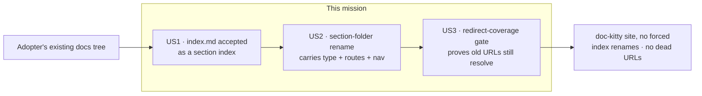

# Mission Specification: Adopter loader & migration

**Mission Branch**: `feat/adopter-loader-migration`
**Created**: 2026-09-03
**Status**: Draft
**Input**: Drive issues #37 (accept `index.md` as a section index), #48 (tolerate a section-folder rename), #42 (redirect-coverage gate) as one governed mission. Grounded in `docs/architecture/research/spec-kitty-adoption-proof.md` (enablers 1, 5-adjacent, 7). Revised after a post-spec adversarial squad (two BLOCKERs + MAJORs folded).

## Context

doc-kitty renders a repository's `docs/` tree as a site. Today a real adopter that already keeps a large, governed docs tree cannot move onto doc-kitty without three avoidable, high-cost churns:

1. Every section index must be renamed from `index.md` to `README.md` (a proving-ground adopter has ~60), which also rewrites ~1,589 internal links.
2. A section folder whose name the adopter's governance dictates (e.g. `plans/missions` rather than `plans/features`) fights doc-kitty's folder-keyed type derivation — the derived type silently reverts to the section default.
3. Switching from a URL-preserving host (DocFX `…/foo.html`) to Starlight clean URLs (`…/foo/`) changes every URL, and doc-kitty ships no way to prove the old URLs still resolve — reopening a ~1,589-link 404 regression.

This mission turns each friction point into a first-class, supported toolkit capability. Each also fixes a doc-kitty inconsistency (the dogfooding dividend). The primary actors are the **migrating adopter** (who configures and consumes the toolkit) and the **doc-kitty maintainer** (who keeps the derivation twin and gates honest).

Build order is US1 → US2 → US3: the loader settles which files become indexes, the rename settles the final route scheme, and the redirect baseline is captured last against that settled scheme.

## Domain Language

- **Section index** — the file whose frontmatter and body represent a section's landing page and whose slug is the section folder itself (today: `README.md`).
- **Index basename** — the configurable filename a section index may use (`README` by default; `index` newly accepted). Matching is case-insensitive (`README`/`readme`, `index`/`Index`).
- **Derived type / subtype** — the `type` a page receives from its section folder (the *section-level* type, registry-keyed on the folder id) and its sub-path (the *subtype*, e.g. `plans/features → Feature`) when `type` is not authored.
- **Section `subtypes` mapping** — an optional per-section registry field declaring sub-path → type rules, so a sub-path rename is a data edit rather than a code edit. The existing built-in sub-path table remains the fallback for doc-kitty's own tree.
- **Derivation twin** — the two hand-mirrored copies of the derivation logic: the TypeScript toolkit lib (`src/lib/metadata.ts`) and the bare-Node validator gate (`src/scripts/validate-frontmatter.mjs`). They are pinned by a parity test.
- **Redirect map** — the adopter-owned mapping from an old URL to its new location, emitted into the build output.
- **URL baseline** — a committed snapshot of the URLs that must keep resolving after a migration, captured *before* the change; the coverage gate's reference. It is never regenerated from the current build.
- **Coverage gate** — a bare-Node CI check that fails when a baselined old URL has neither a live page nor a redirect whose *target* resolves.

## User Scenarios & Testing *(mandatory)*

### User Story 1 - Keep `index.md` section indexes (Priority: P1)

An adopter whose convention names section indexes `index.md` points doc-kitty at their tree and the site builds — every `index.md` becomes its section's landing page and owns the section slug, with no file renamed and no link rewritten. `README.md` remains the default, so doc-kitty's own tree and existing adopters are untouched. Every surface that recognises a section index — not just the content loader — honours the configured basename, so an `index.md` tree is never half-recognised.

**Why this priority**: The research names this "the single biggest adopter churn-reducer" — it alone spares ~60 renames plus the ~1,589-link rewrite. It is also the smallest, most self-contained seam, so it lands first and settles the index rule the later stories build on.

**Independent Test**: Add an `index.md`-indexed section to the worked example; assert it builds, the section slug resolves to the `index.md` page, and each index-detecting surface (below) treats it as the section index.

**Acceptance Scenarios**:

1. **Given** a section folder containing `index.md` (no `README.md`) and the default index basename, **When** the site builds, **Then** the `index.md` page is the section landing page and owns the section slug (`guides/index.md` → `/guides/`, not `/guides/index/`).
2. **Given** a section folder containing `README.md`, **When** the site builds, **Then** behaviour is identical to today (no regression).
3. **Given** a tree using `index.md` indexes, **When** the **content loader / route slug** derives ids, **Then** `index.md` collapses to the section slug.
4. **Given** the same tree, **When** the **bare-Node frontmatter validator gate** runs, **Then** an `index.md` (including a root `index.md`) receives the same section-index exemption `README.md` gets today (it is not required to carry a `type` the build schema exempts).
5. **Given** the same tree, **When** the **link checker**, **scaffolder**, **new-doc tool**, **`llms.txt` description emitter**, and **build-artifact assertions** run, **Then** each recognises `index.md` as the section index (its description is picked up; scaffold/new-doc create/target it; the link checker resolves directory links to it; the artifact assertion accepts it).
6. **Given** a folder-name cased `Index.md` or `readme.md`, **When** the loader runs, **Then** it is matched case-insensitively as the section index.

---

### User Story 2 - Rename a section folder without fighting the type (Priority: P2)

An adopter renames a section folder to the id their governance mandates (e.g. `plans/features` → `plans/missions`, or an arbitrary id) and declares the rename — including any sub-path type rules — in the section registry. The section's derived type **and sub-path subtype** follow the new folder, every child page's route regenerates, the section's sidebar group still renders its hub and children, internal `related:` links stay resolved, and the old URLs are covered by the redirect machinery (US3). The adopter edits registry data, not doc-kitty derivation code.

**Why this priority**: Deferred from mission #51 (C-006a) and required for any adopter whose section vocabulary differs from doc-kitty's defaults. Its illustrative case (`plans/features → plans/missions`) is a **sub-path subtype** rename, so it forces the mission's hardest seam — the folder-keyed subtype derivation, currently a code table mirrored in two files — to become data-driven via a registry `subtypes` field.

**Independent Test**: In the example, rename a section folder to a new id, declare its id (and sub-path `subtypes`) in the registry, and assert the derived type/subtype tracks the new folder, all child routes resolve, the sidebar group renders, and the referential-integrity guard reports zero dangling `related:` links.

**Acceptance Scenarios**:

1. **Given** a section folder renamed to a new registry-declared id (with sub-path `subtypes` declared), **When** derivation runs on a child page with no authored `type`, **Then** the derived type/subtype reflects the new folder via registry data, not the old name or the bare section default — **with no edit to the derivation code**.
2. **Given** the same rename, **When** the derivation twin's parity test runs, **Then** the TypeScript lib and the bare-Node validator agree on the derived value (no split-brain drift), including the registry-`subtypes` path.
3. **Given** the same rename, **When** the build and link/referential-integrity checks run, **Then** every child route resolves at its new slug and no internal `related:` reference dangles.
4. **Given** the same rename, **When** the site builds, **Then** the renamed section's **sidebar group renders its hub link and child pages** (the ADR-0029 content-root coupling survives the rename; the group is not silently empty), asserted against real build output.
5. **Given** a rename to a section id that has **no registry entry**, **When** derivation runs, **Then** it falls back to the documented section default and the missing-registry condition is surfaced as a warning (not a silent mis-type, not a hard failure).

---

### User Story 3 - Prove old URLs still resolve after a migration (Priority: P3)

An adopter migrating from a URL-preserving host captures a committed baseline of their pre-change URLs and declares a redirect map (old URL → new location). The toolkit emits those redirects into the build, and a CI coverage gate fails if any baselined old URL has neither a live page nor a redirect whose target resolves — so the adopter learns about a would-be 404 before shipping, not from users. Rename-induced URL churn from US2 is covered by this same machinery.

**Why this priority**: The research's "highest single technical risk" and a net-new toolkit primitive (no redirect machinery exists today). It is sequenced last so its URL baseline is captured against the route scheme US1 and US2 have settled.

**Independent Test**: In the example, commit a baseline of pre-change URLs, introduce a URL change (including a section rename from US2) with matching redirect entries, and assert the gate passes; remove a redirect entry and assert the gate fails naming the uncovered URL; point a redirect at a dead target and assert the gate fails naming the dead target.

**Acceptance Scenarios**:

1. **Given** a committed URL baseline captured before the change, **When** the coverage gate runs against a redirect map that covers every changed URL with live targets, **Then** it passes.
2. **Given** a declared redirect map, **When** the site builds, **Then** each old URL is emitted as a redirect to its new location in the build output.
3. **Given** a baselined old URL with no live page and no redirect entry, **When** the coverage gate runs, **Then** it fails and names the uncovered URL.
4. **Given** a redirect entry whose **target URL does not itself resolve** (a dead or itself-redirected target), **When** the coverage gate runs, **Then** it fails and names the dead target (a redirect chain is followed to a resolving terminus or reported).
5. **Given** a section renamed in US2, **When** the coverage gate runs, **Then** each orphaned old child URL has a covering redirect and the gate passes.
6. **Given** the coverage gate, **When** it runs in CI, **Then** it runs in bare Node (no Astro build context) and is deterministic across repeat runs.

### Edge Cases

- **Both `README.md` and `index.md` present** in one folder (a real mid-migration state): the configured index basename wins deterministically; the other file is demoted to an ordinary page; the collision is reported as a warning (FR-004). Covered by an acceptance scenario.
- **Rename to an id with no registry entry**: documented section-default fallback + warning (US2-AS5).
- **Redirect target that itself 404s or redirects again**: the gate resolves the target/chain to a live terminus or fails (US3-AS4).
- **Root bundle index** (no path segment) under either basename: keeps its existing special handling in both the loader and the bare-Node gate (US1-AS4 covers the gate exemption).

## Requirements *(mandatory)*

### Functional Requirements

| ID | Title | User Story | Priority | Status |
|----|-------|------------|----------|--------|
| FR-001 | Loader accepts `index.md` as a section index | As a migrating adopter, I want `index.md` accepted as a section index (case-insensitive, alongside `README.md`) via an `indexBasename` option so that I need not rename ~60 index files. | High | Open |
| FR-002 | Configurable basename, README default | As an existing adopter, I want `README.md` to stay the default index basename so that my tree and doc-kitty's own are unchanged. | High | Open |
| FR-003 | Every index-detecting surface honours the basename | As a maintainer, I want all index-detecting surfaces to honour the basename — content loader/route slug, the bare-Node frontmatter validator gate (incl. its root-index exemption), the link checker (`check-links.mjs`), the scaffolder, the new-doc tool, the `llms.txt` description emitter, and the build-artifact assertions — so that an `index.md` tree is never half-recognised. | High | Open |
| FR-004 | Both-index collision is deterministic and surfaced | As a maintainer, I want a folder containing both `README.md` and `index.md` to resolve to the configured basename, demote the other to a normal page, and emit a warning so that the ambiguity is never silently resolved. | Medium | Open |
| FR-005 | Renamed section carries its derived type/subtype via registry | As a migrating adopter, I want a renamed section folder's derived type and sub-path subtype to follow the new folder through a registry `subtypes` mapping so that a rename is a data edit, not a per-rename derivation-code edit. The built-in sub-path table remains the fallback for doc-kitty's own tree. | High | Open |
| FR-006 | Rename regenerates routes and keeps links resolved | As a migrating adopter, I want a section-folder rename to regenerate child routes and keep internal `related:` links resolved so that no page 404s and no reference dangles. | High | Open |
| FR-007 | Rename preserves the sidebar group | As a migrating adopter, I want a renamed section's sidebar group (hub link + child pages) to still render so that the ADR-0029 content-root coupling does not silently empty the nav. | High | Open |
| FR-008 | Capture a committed URL baseline | As a migrating adopter, I want to capture a committed snapshot of pre-change URLs so that the coverage gate has a stable reference that is not regenerated from the current build. | High | Open |
| FR-009 | Redirect map emitted into the build | As a migrating adopter, I want to declare an old-URL→new-location redirect map that the build emits (Astro `redirects` / `_redirects`) so that a URL-preserving host's links keep resolving. | Medium | Open |
| FR-010 | Redirect-coverage gate (target-aware) | As a migrating adopter, I want a CI gate that fails when a baselined old URL has neither a live page nor a redirect whose target resolves so that I catch a would-be 404 — including a redirect to a dead page — before shipping. | High | Open |
| FR-011 | Rename churn is covered by the gate | As a migrating adopter, I want US2 rename-induced URL churn covered by the redirect map and gate so that a rename cannot silently orphan old URLs. | High | Open |
| FR-012 | Worked example demonstrates each capability | As a maintainer, I want the worked example to exercise `index.md` indexing, a section rename (incl. its sidebar + redirects), and the coverage gate (pass + both failure modes) so that each capability is asserted against real build output. | Medium | Open |

### Non-Functional Requirements

| ID | Title | Requirement | Category | Priority | Status |
|----|-------|-------------|----------|----------|--------|
| NFR-001 | Derivation twin parity | The resolved-parity test covers the new index-basename detection AND the registry-`subtypes` rename derivation across both twins (TS lib + bare-Node validator); they agree on 100% of cases (0 drift), enforced by a gate. The mission adds these guarded twins; it does not unify them (see C-003). | Correctness | High | Open |
| NFR-002 | Coverage gate runs in bare Node | The redirect-coverage gate executes without an Astro build context, spawns no Astro build, and adds no more than a few seconds to the existing `doc-sanity` job; deterministic across repeat runs. | Reliability | High | Open |
| NFR-003 | Backward-compatible no-op on today's corpus | On the current corpus (README indexes, no renames, no redirect map) every change is a no-op: the existing toolkit test suite and all doc-sanity / build-artifact gates stay green. | Compatibility | High | Open |
| NFR-004 | Zero dangling references after a rename | After a section-folder rename in the example, the referential-integrity / link checks report zero dangling internal references. | Correctness | High | Open |
| NFR-005 | URL baseline is a committed artifact | The URL baseline is version-controlled and captured before the change; the gate never derives it from the current build output (else it can never fail against real drift). | Correctness | High | Open |

### Constraints

| ID | Title | Constraint | Category | Priority | Status |
|----|-------|------------|----------|----------|--------|
| C-001 | README stays the default | `README.md` remains the default section index; doc-kitty's own tree is not migrated to `index.md`. | Technical | High | Open |
| C-002 | `Feature` stays valid | No vocabulary change: `Feature` remains a valid `type`/`kind`; the per-consumer override that neutralises it already shipped (#40). | Technical | Medium | Open |
| C-003 | Add guarded twins, not the #49 merge | The mission adds new twinned logic (basename detection in the `.mjs` gate; registry-`subtypes` derivation in both twins) and guards it with the parity test. The full single-source mjs↔ts consolidation (#49) — one shared core / codegen — remains OUT. | Technical | High | Open |
| C-004 | License is out of scope | The `#43` license/LICENSE-file decision is a human legal gate; it blocks downstream vendoring, not this toolkit work, and is not resolved here. | Business | Medium | Open |
| C-005 | No corpus migration or Node-in-CI trial | The actual spec-kitty corpus cutover, the ~1,589-link rewrite, and any Node-in-CI trial are downstream adopter work, out of scope. | Technical | Medium | Open |
| C-006 | Era-ADR routing and `#39` deferred | Era-partitioned ADR *typing* already shipped and is twin-pinned (#41); only era-path routing/loader tolerance remains deferred. `durable` doc_status (#39) is a separate additive item, out of scope. | Technical | Low | Open |
| C-007 | Governance via new ADRs | Record the posture shift as new ADR(s): supersede ADR-0002 in part (README no longer the sole index basename) and **explicitly reverse ADR-0004's "adaptation is tolerated, not supported"** for `index.md` and section-rename (now first-class supported). Add a greenfield redirect-coverage ADR. Splitting the index-basename and rename decisions into two ADRs is at the author's discretion; a single combined "flexible section identity" ADR is acceptable if it states the reversal in words. ADRs are immutable — this is new records, not edits. | Regulatory | High | Open |

### Key Entities

- **Section index**: the landing page of a section; identified by the configured index basename; owns the section slug.
- **Section registry entry**: the data record binding a section id (folder) to its order, label, feeds, derived type, and (new) sub-path `subtypes` mapping; the authority a rename edits.
- **Redirect map**: adopter-owned old-URL→new-location records emitted into the build output.
- **URL baseline**: a committed snapshot of URLs that must keep resolving; the coverage gate's reference.

## Success Criteria *(mandatory)*

### Measurable Outcomes

- **SC-001**: An adopter whose section indexes are all `index.md` builds the site with **zero** index-file renames and **zero** link rewrites, and the default (`README.md`) corpus is unaffected.
- **SC-002**: Renaming a section folder (including a sub-path subtype rename) is a **data/config** change (registry entry + `subtypes` mapping + redirect entries) with **no per-rename edit to derivation code**, producing **zero** dangling internal links, **zero** type-derivation mismatches between the two twins, and a **rendered** sidebar group.
- **SC-003**: The redirect-coverage gate **fails** when a baselined old URL is uncovered **and** when a redirect points at a dead target, and **passes** when every changed URL has a redirect to a live target — all demonstrated against real example build output.
- **SC-004**: **Zero** regressions on the existing corpus — the full toolkit test suite and every doc-sanity / build-artifact gate stay green with all capabilities added.

## Assumptions

- The capabilities are doc-kitty-side toolkit enablers exercised through the worked example; no live external adopter site is migrated in this mission.
- `index.md`/rename are being promoted from "tolerated with graceful degradation" (ADR-0004) to "first-class supported"; this is a deliberate governance shift recorded via new ADRs (C-007), not an edit to the immutable ADR-0002/0004 text.
- The registry `subtypes` field is the chosen mechanism for FR-005 (resolving the post-spec BLOCKER that a sub-path rename cannot be data-only against the hardcoded switch); the built-in table stays as the backward-compatible fallback so doc-kitty's own tree is a no-op.
- Astro's native `redirects` config / a generated `_redirects` file is the emission mechanism for FR-009; the coverage gate (FR-010) patterns off the existing bare-Node link/build-artifact gates.
