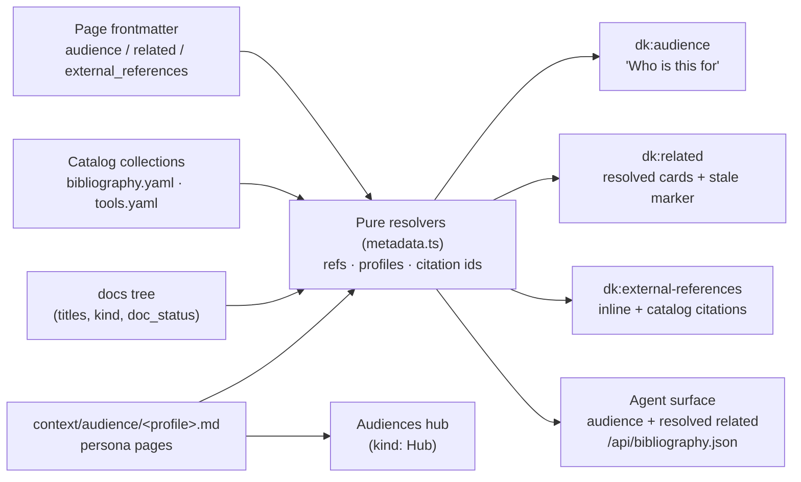

# Mission Specification: Audience, Related & External References

**Mission Branch**: `feat/audience-related-external-references`
**Created**: 2026-08-24
**Status**: Draft
**Input**: Mission M3 — wire the `audience`, `related`, and `external_references` frontmatter (schema frozen in M1) into consistent, accessible on-page blocks; give audiences a home with persona pages under `context/audience/` and an Audiences hub; and back citations with a shared `bibliography`/`tools` catalog resolved at build. Keep the M0 `ci-ok` pipeline (four lanes) green.

## Overview

doc-kitty renders a repository's `docs/` tree as a human-first, agent-supported
documentation site. M1 froze and enforced the frontmatter contract; M2 built the
component molecules (`RelatedCard`, `ReferenceItem`, `MetadataBand`), the
`dk:audience` / `dk:related` / `dk:external-references` slot host-points, and the
`Persona` layout **shell** — but deliberately left the three blocks **unwired** to
page data (M2 scope guard C-010). This mission connects them: a page now states
**who it is for**, **what to read next**, and **what it draws on**, rendered from
frontmatter the earlier missions already validate.

Three concerns land together, each already scaffolded and each with a real delta:

- **Audience** — the schema and slot exist; M3 renders the "Who is this for" block
  and resolves each `profile` to a persona page (soft: link if present, else warn).
- **Related** — the schema, integrity check, and molecule exist; M3 renders
  resolved cards (target title/kind/status) and marks stale targets. Direction is
  as-declared (no backlinks this mission).
- **External references** — the schema and molecule exist, but the **catalog they
  cite does not**. M3 ships the `bibliography` + `tools` data collections (named in
  ADR-0009 and explicitly deferred to M3), resolves `{ type, id }` citations at
  build, and renders a per-page references list.

Personas get a real home: the shipped example persona moves to `context/audience/`
(reconciling the code with the design of record), the `Persona` kind gains
attribute fields (role / goals / responsibilities), and a new **Audiences** hub
lists them. The agent surface grows to carry `audience`, resolved `related`, and a
`/api/bibliography.json` catalog endpoint.

The settled design is authoritative and is **not** re-opened: ADR-0009 (frozen
field shapes; the `bibliography`/`tools` catalog collections), ADR-0011 (curated
`dk:` slot surface; `Persona` is in-frame, not `splash`), ADR-0013 (single
layout-resolution site in the carrier; the `dk:` slot substrate), ADR-0015 (merged
virtual manifest transport; `resolveLayout` stays synchronous), and the
architecture docs `metadata-model.md` and `theming.md`. Any change to a frozen
field shape, the persona attribute fields, the catalog collections, or the persona
location is a **new ADR**, never a silent change (C-001).

### Resolution is one shared, build-verified seam

The three blocks share one thing: each renders **resolved** data, and an
unresolvable reference is either a hard build failure or a build warning — never a
silently dropped block. `related` refs and citation `{ type, id }` ids **fail the
build** when they do not resolve (matching ADR-0009's `related` posture);
`audience` profiles **warn** when the persona page is absent (soft, so a tree need
not ship a full persona set to publish). All resolution lives as **pure functions
in `src/lib/metadata.ts`** (Astro-free, unit-testable, reused by the build-free
gates and the agent-API routes); the `.astro` slot bodies stay thin (resolve, then
render). The catalog collections and the persona attribute fields are **additive
schema** landing behind new ADRs; they do not alter any frozen M1 field shape.

## User Scenarios & Testing *(mandatory)*

### User Story 1 - Readers see who a page is for (Priority: P1)

A reader opens a page whose frontmatter declares an `audience`. Above the content
they see a titled "Who is this for" block: for each entry, the persona's name
(a link to its persona page when that page exists) and the author's one-line
`guidance_text` for that reader. When a declared `profile` has no persona page yet,
the block still renders the humanized profile name as plain text and the build
emits a warning — it does not fail.

**Why this priority**: Audience targeting is the most distinctive half of the
"human-first" promise and the block the roadmap names first. It is also the
narrowest slice that delivers standalone value.

**Independent Test**: Build the example; assert a page with `audience` renders a
`dk:audience` section with a visible "Who is this for" heading, a list whose items
carry the persona link (to the resolved `context/audience/<profile>/` URL) and the
`guidance_text`; and assert a fixture page whose `profile` resolves to no persona
page renders the humanized slug as text and produces an observable build warning
(not a failure).

**Acceptance Scenarios**:

1. **Given** a page with `audience: [{ profile: contributor, guidance_text: … }]`
   and a persona page at `context/audience/contributor.md`, **When** it renders,
   **Then** a "Who is this for" block appears with the persona's **page title** as a
   link to its URL, followed by the `guidance_text`.
2. **Given** a page whose `audience.profile` resolves to **no** persona page,
   **When** the build runs, **Then** the block renders the humanized profile name
   as non-link text and the build emits an **observable warning** and exits zero.
3. **Given** a page with `audience: []` or no `audience`, **When** it renders,
   **Then** no audience block appears and the build does not fail.
4. **Given** the audience block, **When** its accessibility is checked, **Then** it
   is a `<section>` named by a real heading (`aria-labelledby`), its entries are a
   `<ul>`/`<li>` list, and meaning is never conveyed by colour alone.

### User Story 2 - Readers see where to go next (Priority: P1)

A reader reaches the end of a page and sees a "Related pages" block: a list of
cards, each naming a **resolved** target by its real page title, with the target's
`kind` and a one-line note or the target's own description. A target that is
`deprecated` or `superseded` carries a visible, text-labelled status marker so the
reader is warned before clicking into stale content. A `related` reference that
resolves to no page **fails the build**.

**Why this priority**: Author-declared relationships are the curated navigation the
tree promises; they must be trustworthy (build-verified) to be worth rendering.

**Independent Test**: Build the example; assert a page with `related` renders a
`dk:related` navigation block whose links' accessible names are the **resolved
target titles** (never bare slugs), showing target `kind` and note/description, and
a marker on a `deprecated`/`superseded` target; and assert (via the build-free link
checker and the build) that a dangling `related` ref — bare or `{ ref }` — fails.

**Acceptance Scenarios**:

1. **Given** a page with `related: [architecture/overview, { ref: guides/x, note: … }]`
   whose targets exist, **When** it renders, **Then** each item is a card-wide link
   whose accessible name is the **target's title**, showing the target's `kind` and
   the `note` (else the target's `description`).
2. **Given** a `related` entry whose target has `doc_status: deprecated` or
   `superseded`, **When** it renders, **Then** the card shows a **text-labelled**
   stale-status marker.
3. **Given** a `related` ref (bare or `{ ref }`) that resolves to no page, **When**
   the build-free link checker and the build run, **Then** each reports the dangling
   ref as a **blocking error**.
4. **Given** the related block, **When** its accessibility is checked, **Then** it
   is a `<nav>` with the distinct accessible name "Related pages", its items are a
   list, and card targets are ≥24×24px with a visible focus ring.
5. **Given** "A relates to B" declared only on A, **When** B renders, **Then** no
   automatic backlink to A appears on B (declared-direction only this mission).

### User Story 3 - Readers see what a page draws on (Priority: P1)

A reader sees an "External references" block listing the page's sources. An inline
reference (`{ url, title, note? }`) renders directly. A catalog reference
(`{ type, id }`) is resolved against the shared catalog — `type: biblio` against the
`bibliography` collection, `type: tool` against `tools` — and rendered from the
single catalog record, so the same source reads identically wherever it is cited. A
citation whose id is not in the catalog **fails the build**.

**Why this priority**: Citations are the third block and the one genuinely new build
(the catalog); shipping it completes the metadata trio the mission is named for.

**Independent Test**: Build the example; assert a page with both an inline and a
`{ type, id }` reference renders a `dk:external-references` block whose links'
accessible names are the human **titles** (the mono citation key is secondary), the
catalog entry's fields (authors/year/container) render from the catalog record; and
assert a `{ type, id }` citing an absent id fails the build; and assert
`/api/bibliography.json` lists the catalog records.

**Acceptance Scenarios**:

1. **Given** a page with `external_references: [{ url, title, note }]`, **When** it
   renders, **Then** the item is a link whose accessible name is `title`, `href` is
   `url`, opens in a new tab with the hidden "(opens in a new tab)" affordance and
   `rel="noopener noreferrer"`.
2. **Given** a page citing `{ type: biblio, id: divio-2017 }` and a matching record
   in `bibliography`, **When** it renders, **Then** the item resolves to that
   record — accessible name = record **title** (not the id), with author/year/
   container as adjacent muted text.
3. **Given** a citation `{ type: biblio, id: missing }` with no matching record,
   **When** the build (and the build-free gate) runs, **Then** it reports an
   unresolvable-citation **blocking error**.
4. **Given** the `bibliography` catalog, **When** the site builds, **Then**
   `/api/bibliography.json` is emitted listing each record by its stable `id`.
5. **Given** the external-references block, **When** its accessibility is checked,
   **Then** it is a `<nav>` named "External references", uses list semantics, and
   the external-references tint meets AA contrast (no colour-only signal).

### User Story 4 - Audiences have a home (Priority: P1)

Personas live under `context/audience/`, each a `kind: Persona` page whose passport
now shows persona **attribute** fields (role, goals, responsibilities). A new
`kind: Hub` **Audiences** page lists them. This reconciles the code with the design
of record (`metadata-model.md` already says `context/audience/<profile>.md`) — the
shipped example persona moves out of `personas/`, and the build assertion that
hard-codes the old path is rewritten.

**Why this priority**: The audience block (US1) resolves into these pages; without
their home and identity fields, US1 has nothing to link to and personas cannot be
authored richly. Co-required with US1.

**Independent Test**: Build the example; assert `context/audience/<slug>/` renders a
Persona passport carrying the new attribute fields, no persona remains under
`personas/`, the Audiences hub lists the persona(s) as described links, and the
migrated tree passes doc-sanity; and assert the schema/validator accept the new
persona fields and reject a malformed one (parity fixture).

**Acceptance Scenarios**:

1. **Given** the shipped example persona, **When** the tree is scanned, **Then** it
   lives at `context/audience/<slug>.md` (not `personas/`) and doc-sanity passes.
2. **Given** a `kind: Persona` page carrying the new attribute fields, **When** it
   renders, **Then** its passport shows role / goals / responsibilities, and the
   standalone validator and build schema agree on those fields (parity).
3. **Given** a persona page missing a required new persona sub-field, **When** the
   validator runs, **Then** it reports a blocking error.
4. **Given** the Audiences hub (`kind: Hub`), **When** it renders, **Then** it lists
   the persona pages as described links in the Starlight frame, its body text in the
   Pagefind index.
5. **Given** `audience.profile` resolution (US1), **When** it resolves, **Then** it
   targets `context/audience/<profile>.md` — the single reconciled location.

### User Story 5 - Agents read the enriched surface (Priority: P2)

An agent reads the per-page JSON and the catalog endpoint. Each page record now
carries its `audience` and its **resolved** `related` (ref → title, kind,
doc_status), and `/api/bibliography.json` exposes the citation catalog by stable id
— a dereferenceable registry an agent resolves instead of re-parsing prose.

**Why this priority**: The agent-interoperability half of the promise; mechanical
once the resolvers (US1–US3) exist, but must stay coherent and keep the pinned
build-artifact assertions green.

**Independent Test**: Build the example; assert a page record carries `audience` and
a resolved `related` array (each item with `ref`, `title`, `kind`, `doc_status`),
and `/api/bibliography.json` lists every `bibliography` record with its `id`, title,
and url.

**Acceptance Scenarios**:

1. **Given** a page with `audience` and `related`, **When** the agent record is
   generated, **Then** it carries `audience` and a **resolved** `related` array
   (not bare slugs).
2. **Given** the `bibliography` catalog, **When** the site builds, **Then**
   `/api/bibliography.json` is emitted and lists each record by stable `id`.
3. **Given** a `draft` page, **When** the surfaces are generated, **Then** it stays
   absent from the agent-API (the M1 `doc_status` gating still holds).

### Edge Cases

- Empty `audience: []` / `related: []` / `external_references: []`: valid (M1);
  no block renders.
- `audience.profile` with no persona page: warn, render humanized slug as text
  (soft) — contrast with `related`, which fails hard.
- `related` ref resolves but target is `draft`: renders (a related target need not
  be published); a `deprecated`/`superseded` target gets the stale marker.
- Inline external reference (`{ url, title }`) needs **no** catalog — renders
  directly; only `{ type, id }` is resolved.
- Unknown catalog `type` (neither `biblio` nor `tool`): treated as an unresolvable
  citation → **blocking error** (fail-fast, matching the unresolvable-id posture).
- `bibliography`/`tools` id collision, or an id cited by many pages: one catalog
  record is the single source of truth; every citation renders identically.
- The external-references "lilac" tint currently maps to the neutral pair as an AA
  placeholder — M3 adds a real `--dk-color-tint-lilac` AA token pair (or ratifies
  the neutral mapping in the token ADR).
- Pagefind drops raw `<nav>` — the related/external-references blocks use the
  established `role="navigation"` workaround so their text stays indexed inside
  `data-pagefind-body` (NFR-003).
- `.worktrees/` copies are gitignored; the persona relocation operates on
  git-tracked paths only.

## Requirements *(mandatory)*

### Functional Requirements

| ID | Title | User Story | Priority | Status |
|----|-------|------------|----------|--------|
| FR-001 | Wire `dk:audience` block | As a reader, I want the `dk:audience` slot rendered from `entry.data.audience` as a titled "Who is this for" `<section>` (eyebrow + heading) with a `<ul>`/`<li>` of entries, each showing the persona and its `guidance_text`. | High | Open |
| FR-002 | Soft persona resolution | As a doc author, I want `audience[].profile` resolved to `context/audience/<profile>.md`: link with the persona's page title when it exists, else render the humanized slug as text and emit a **build warning** (not a failure). | High | Open |
| FR-003 | Wire `dk:related` block | As a reader, I want the `dk:related` slot rendered from `entry.data.related` as a `<nav aria-label="Related pages">` list of cards, each a card-wide link whose accessible name is the **resolved target title**, showing the target's `kind` and the `note` (else the target's `description`). | High | Open |
| FR-004 | Related integrity (build-fail) preserved | As CI, I want a `related` ref (bare or `{ ref }`) that resolves to no page to remain a **blocking error** in both the build and the build-free `check-links.mjs`; resolution for rendering must not silently swallow a missing ref. | High | Open |
| FR-005 | Stale-target marker | As a reader, I want a related card whose target is `deprecated` or `superseded` to carry a **text-labelled** status marker (reusing the MetadataBand status vocabulary), so I am warned before navigating to stale content. | Medium | Open |
| FR-006 | Wire `dk:external-references` block | As a reader, I want the `dk:external-references` slot rendered from `entry.data.external_references` as a `<nav aria-label="External references">` list via `ReferenceItem`: inline `{ url, title, note? }` rendered directly, catalog `{ type, id }` rendered from its resolved record. | High | Open |
| FR-007 | Citation catalog collections | As a doc author, I want `bibliography` and `tools` data collections (CSL-JSON-lite: stable string `id`, plus title/url and, for bibliography, authors/issued/container/note), authored as `docs/_meta/bibliography.yaml` and `docs/_meta/tools.yaml`, wired as content-layer collections with zod schemas beside the docs schema. | High | Open |
| FR-008 | Catalog resolution (build-fail) | As CI, I want `{ type, id }` resolved — `biblio`→`bibliography`, `tool`→`tools` — with an unresolvable id (or an unknown `type`) a **blocking error** in the build and the build-free gate, matching the `related` posture. | High | Open |
| FR-009 | `ReferenceItem` accessible name = title | As a screen-reader user, I want `ReferenceItem`'s link accessible name to lead with the human **title** (inline `title` or resolved record title), with the mono citation key a secondary affordance — not the sole/leading accessible name. | High | Open |
| FR-010 | Persona attribute fields | As a persona author, I want the `Persona` kind to gain attribute fields (role, goals, responsibilities) in the build schema and the standalone validator (with parity), behind a new ADR, so persona pages carry real identity — additive, altering no frozen M1 field. | Medium | Open |
| FR-011 | Persona passport renders attributes | As a reader, I want `Persona.astro` to render the new attribute fields in the in-frame passport (ADR-0011: in-frame, not `splash`). | Medium | Open |
| FR-012 | Reconcile persona location to `context/audience/` | As a maintainer, I want the shipped example persona moved from `personas/` to `context/audience/<slug>.md` (git-tracked move), the hard-coded `personas/example-persona/index.html` path in `assert-chrome-artifacts.mjs` rewritten, and `metadata-model.md` kept as the single location of record. | High | Open |
| FR-013 | Audiences hub page | As a reader, I want a new `kind: Hub` **Audiences** page (`context/audience/README.md`) listing the persona pages as described links, so audiences are discoverable. | Medium | Open |
| FR-014 | Agent-API surfaces `audience` + resolved `related` | As an agent, I want `toAgentRecord` (`src/lib/metadata.ts`) to carry `audience` and a **resolved** `related` (each `{ ref, title, kind, doc_status }`), extending the current raw-`related`-only surface. | Medium | Open |
| FR-015 | `/api/bibliography.json` endpoint | As an agent, I want a `/api/bibliography.json` route (reusing the `src/lib/routes/` pattern) exposing the `bibliography` catalog by stable `id`, so citations are dereferenceable. | Medium | Open |
| FR-016 | Pure resolvers in `metadata.ts` | As a maintainer, I want ref, profile, and citation resolution as **pure, Astro-free functions** in `src/lib/metadata.ts`, unit-tested with vitest and reused by the build-free gates and the API routes; `.astro` bodies stay thin. | High | Open |
| FR-017 | `--dk-color-tint-lilac` AA token | As the toolkit, I want a real `--dk-color-tint-lilac` token (paired with an AA-verified foreground) added to the token catalog for the external-references tint, or the neutral mapping explicitly ratified in the token ADR. | Medium | Open |
| FR-018 | `metadata.ts` type sync | As a maintainer, I want `DocKittyFrontmatter` in `src/lib/metadata.ts` extended with `audience` and `external_references` (and `moscow`) so the framework-agnostic model matches the schema it feeds. | Medium | Open |
| FR-019 | Build-artifact assertions for the three blocks | As CI, I want `assert-chrome-artifacts.mjs` extended to assert the rendered audience, related (incl. stale marker), and external-references blocks (bound to populated `.dk-related-card`/`.dk-reference-item`/audience markers), plus the persona relocation path and `/api/bibliography.json`. | High | Open |
| FR-020 | Fixtures for resolution outcomes | As a maintainer, I want fixtures for: catalog hit and miss, unknown catalog `type`, dangling `audience.profile` (warn), and a malformed persona field (error), exercised by the schema/validator parity test. | High | Open |
| FR-021 | Docs of record updated | As a maintainer, I want `metadata-model.md` (catalog section + persona location) and `theming.md` (the three wired blocks + persona attributes) updated, plus new ADR(s) for the catalog collections, the persona attribute fields, and the persona-location reconciliation. | Medium | Open |

### Non-Functional Requirements

| ID | Title | Requirement | Category | Priority | Status |
|----|-------|-------------|----------|----------|--------|
| NFR-001 | Accessibility AA (Playwright-verified) | The three blocks clear the `a11y` axe lane: `dk:related`/`dk:external-references` are `<nav>` with **distinct** accessible names ("Related pages" / "External references"); `dk:audience` is a `<section aria-labelledby>` with a real heading (not a nav); all use list semantics; every card-wide link's accessible name is a human title (never a bare slug/URL/citation key); interactive targets ≥24×24px with `:focus-visible`; no colour-only signal; the external-references tint meets ≥4.5:1 contrast. | Accessibility | High | Open |
| NFR-002 | `ci-ok` stays green | All four lanes pass on the PR: `code-quality` (typecheck + lint + vitest), `doc-sanity` (validate:docs/example/links + markdownlint + Vale), `build-example` (build + `assert:artifacts`), `a11y` (`test:a11y`). | Reliability | High | Open |
| NFR-003 | Search coverage preserved | The three blocks render inside the carrier's `data-pagefind-body` region and carry no `data-pagefind-ignore`; raw `<nav>` (dropped by Pagefind) is avoided via the established `role="navigation"` workaround — verified by asserting related titles / citation titles appear in the built Pagefind index. | Reliability | High | Open |
| NFR-004 | Validator parity for new schema | The standalone validator and the build schema agree on the persona attribute fields and the catalog record shapes — verified by running both against a shared fixture corpus with identical pass/fail per fixture. | Maintainability | High | Open |
| NFR-005 | Pure, unit-tested resolution | Ref/profile/citation resolution is Astro-free and covered by vitest (hit, miss, warn, and precedence of `note` over `description`), independent of the Playwright lane. | Maintainability | High | Open |
| NFR-006 | Self-contained, no heavy deps | No new runtime/build dependency beyond what ships (Astro/Starlight/zod/gray-matter); CSL-JSON-lite is a hand-rolled subset, no citation-processing library; verified by a lockfile/manifest diff. | Portability | Medium | Open |

### Constraints

| ID | Title | Constraint | Category | Priority | Status |
|----|-------|------------|----------|----------|--------|
| C-001 | Settled design authoritative | Implement to ADR-0009/0011/0013/0015 and the architecture docs; any change to a frozen field shape, the new persona attribute fields, the catalog collections, or the persona location is a **new ADR**, never a silent change. | Governance | High | Open |
| C-002 | Slot substrate seams | Render on the existing `dk:` slot surface (ADR-0011/0013); `resolveLayout` stays synchronous with no runtime dynamic import (ADR-0015); no new Starlight `components` overrides. The plan chooses whether page data flows through `slotComponents` props or the block bodies render directly in the carrier — and records that choice. | Technical | High | Open |
| C-003 | Tokens before overrides / AA by construction | Any new interactive card carries a ≥24px target + `:focus-visible`; themes/consumers set `--dk-*` only (C-007 carried from M1); new tint tokens use pre-verified AA pairs. | Technical | High | Open |
| C-004 | Frozen field shapes | The `audience` / `related` / `external_references` field **shapes** are frozen (M1/ADR-0009) and not re-litigated; M3 wires and resolves them. Only additive schema (persona attributes, catalog records) is introduced, each behind a new ADR. | Scope | High | Open |
| C-005 | Deferred (out of this mission) | No rendered site-wide **bibliography page**; no `related` **backlinks** / "referenced by"; no audience **personalization**/filtered views; no full CSL in-text numbering or reference-string formatting; no schema.org JSON-LD. These are named as future extensions, not built. | Scope | High | Open |
| C-006 | Persona relocation is git-tracked and localized | The `personas/` → `context/audience/` move touches only the shipped example persona + its asset, the one hard-coded assertion path, and the design doc; it is a localized move, not a cross-file identifier rename (not a governed bulk edit). Operate on git-tracked paths only. | Process | Medium | Open |
| C-007 | Green-at-every-boundary | No work-package boundary leaves `doc-sanity`, `build-example`, or `a11y` red; the catalog collections and persona relocation land coherently (an unresolved citation or a half-moved persona fails a gate). | Process | High | Open |
| C-008 | Runtime baseline | Node ≥22, pnpm workspace, Astro 5 / Starlight; direct-render default (ADR-0006); carriers read `Astro.locals.starlightRoute`. | Technical | High | Open |

### Key Entities

- **Audience entry**: `{ profile, guidance_text }` — `profile` is a kebab slug
  resolving to `context/audience/<profile>.md`; `guidance_text` is why this reader
  should read this page.
- **Related reference**: a bare slug or `{ ref, note }` into the `docs` tree;
  resolved at build to `{ ref, title, kind, doc_status }` for rendering and the
  agent surface.
- **External reference**: inline `{ url, title, note? }` **or** catalog `{ type, id }`
  (`type` ∈ `biblio | tool`) resolved against the catalog.
- **Bibliography record** (CSL-JSON-lite): `{ id, type?, title, authors?, container?,
  url, issued?, accessed?, note? }` in `docs/_meta/bibliography.yaml`; the single
  source of truth for a citation.
- **Tools record**: `{ id, name, url, note? }` in `docs/_meta/tools.yaml`.
- **Persona page**: `kind: Persona` under `context/audience/`, carrying the new
  attribute fields (role / goals / responsibilities) rendered in the passport.
- **Audiences hub**: `kind: Hub` page listing the persona pages.
- **Agent record (extended)**: per-page JSON now carrying `audience` and resolved
  `related`; plus the `/api/bibliography.json` catalog projection.

## Assumptions

- **Persona resolution is soft (warn), `related` is hard (fail).** A page may
  target an audience whose persona page does not exist yet (warn + humanized slug);
  a `related` ref must resolve (fail). This matches the open-vocabulary posture for
  audience and the ADR-0009 integrity posture for `related`.
- **Related is declared-direction only this mission.** Backlinks / "referenced by"
  are deferred (C-005); the reverse index is a clean later addition over the same
  data.
- **The rendered site-wide bibliography *page* is deferred** (C-005); M3 ships the
  data, the per-page references list, and the `/api/bibliography.json` endpoint.
- **Catalog discriminator**: `type: biblio` → `bibliography`, `type: tool` →
  `tools`; an unknown `type` is a build error (fail-fast).
- **Catalog authoring shape**: one YAML file per catalog under `docs/_meta/`
  (mirrored under `example/docs/_meta/`), keyed by a stable `id`; fields are a
  CSL-JSON-lite subset (flat author strings, year-or-date `issued`) — full CSL
  name-parts and structured dates are a later extension.
- **Persona attribute field set** (role / goals / responsibilities) is finalized in
  the new persona-fields ADR during plan; the spec fixes the intent, the ADR fixes
  the exact keys.
- **Example demonstrators re-tag / relocate existing pages** where possible; any
  deliberate change to the example's published-page count updates the pinned
  `EXPECTED_INDEX_ENTRY_COUNT` in the same change.

## Success Criteria *(mandatory)*

### Measurable Outcomes

- **SC-001**: Every published example page that declares `audience` renders a
  "Who is this for" block; a resolvable `profile` links to its
  `context/audience/<profile>/` page and an unresolvable one renders as text with an
  observable build warning (no failure).
- **SC-002**: Every page that declares `related` renders resolved cards named by
  target title (never bare slug), showing `kind` and note/description, with a
  text-labelled marker on a `deprecated`/`superseded` target; and a dangling
  `related` ref fails both the build-free link checker and the build.
- **SC-003**: Every page that declares `external_references` renders inline and
  catalog-resolved citations named by human title; a `{ type, id }` (or unknown
  `type`) that does not resolve fails the build; and `/api/bibliography.json` lists
  the catalog by stable id.
- **SC-004**: No persona remains under `personas/`; the example persona lives at
  `context/audience/<slug>/`, renders attribute fields in its passport, is listed on
  the Audiences hub, and the migrated tree passes doc-sanity; the schema/validator
  agree on the new persona fields (parity).
- **SC-005**: A page's agent record carries `audience` and a resolved `related`
  array; the single `draft` example page stays absent from the agent surface.
- **SC-006**: `ci-ok` is green on the PR — all four lanes pass, the `a11y` axe lane
  passes for the pages rendering the three blocks — with no intermediate boundary
  leaving `doc-sanity`, `build-example`, or `a11y` red, and the branch is mergeable
  into `feat/audience-related-external-references` (and thence `main`) once branch
  protection is satisfied.
