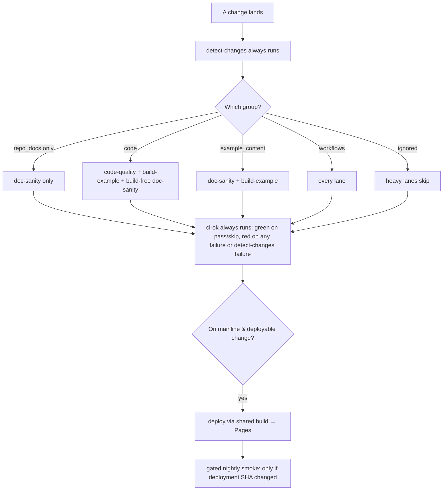

# Mission Specification: Path-Scoped CI/CD Pipeline

**Mission Branch**: `feat/ci-cd-pipeline`
**Created**: 2026-08-22
**Status**: Draft
**Input**: User description: "Spec out mission M0: the CI/CD pipeline. Mission type: software-dev."

This mission specifies and builds the CI/CD pipeline whose design is already
authored and settled. It does **not** re-open those decisions. The authority
sources are:

- [CI/CD Pipeline design](../../docs/architecture/ci-cd-pipeline.md)
- [ADR-0007: Path-scoped CI/CD lanes](../../docs/adr/0007-ci-cd-path-scoped-lanes.md)
- [Feature card: CI/CD pipeline](../../docs/plans/features/ci-cd-pipeline.md) (MoSCoW: Must)

Per the project charter's amend-via-ADR rule, any deviation from that design is a
new ADR, not a silent change (see C-007). The requirements below **restore**
several design guarantees that an earlier draft under-specified (exact path-group
membership, the deploy/build shared step, and the `ci-ok` failure semantics);
restoring fidelity is not a deviation.

## User Scenarios & Testing *(mandatory)*

The actors are the people the pipeline serves: **contributors** who open pull
requests, and **maintainers** who own the mainline branch and the live site. The
"system" is the delivery pipeline itself. Every user story carries both happy-path
and **failure-path** acceptance scenarios, because the pipeline's value *is* its
ability to turn red when a guarantee is violated — a lane that always passes is
worthless.

### User Story 1 - The repo is provably green locally (Priority: P1)

The repository is structure-first: it has never been installed or built. Before
any workflow can be trusted to gate anything, a fresh checkout must install,
test, and build on Node 22, with the resulting lockfile committed so every later
run is reproducible.

**Why this priority**: CI is meaningless until the thing builds. This is the
foundational precondition for every other story — the first work package. Without
it, a green workflow would be green over nothing.

**Independent Test**: On a clean checkout with Node 22, run install → test →
build and confirm all three succeed, that a `pnpm-lock.yaml` now exists and is
committed, and that a frozen-lockfile install then succeeds — all runnable
locally, no CI required. Delivers value on its own: the project becomes buildable.

**Acceptance Scenarios**:

1. **Given** a fresh checkout on Node 22 with no `pnpm-lock.yaml`, **When** a
   contributor installs dependencies, **Then** installation succeeds and produces
   a `pnpm-lock.yaml` that is committed to the branch.
2. **Given** the installed workspace, **When** the toolkit test suite runs,
   **Then** the scaffolded unit tests in `src/tests/` execute (a non-zero,
   non-trivial count) and pass with exit 0.
3. **Given** the installed workspace, **When** the example site is built, **Then**
   the build exits 0 with no error-level output and produces a non-empty site
   output directory (`example/dist/`).
4. **Given** the committed lockfile, **When** a frozen-lockfile install runs
   (locally or in CI), **Then** it succeeds without resolving or mutating the
   lockfile.
5. **Given** a manifest changed without updating the lockfile, **When** a
   frozen-lockfile install runs, **Then** it fails — the intended signal to
   regenerate and commit the lockfile (verifies NFR-008).

---

### User Story 2 - Only the affected lanes run, gated by one required check (Priority: P2)

A contributor opens a PR. The pipeline classifies what the change touches and runs
only the lanes that change can affect — code checks for code, documentation sanity
for docs, a build for deployed content — and a single aggregate check gates the
merge. A skipped lane never blocks the merge; a *failed* lane always does.

**Why this priority**: This is the headline deliverable and the stated primary
concern of the roadmap: a documentation-only change must not trigger code checks,
and a code-only change must not trigger a documentation build. Depends on Story 1.
The `detect-changes` classifier (FR-005) is the first internal work package of
this story and gates every lane and the aggregate check.

**Independent Test**: Open throwaway PRs — one per single group, one multi-group,
one overlapping-path, one with an injected defect per lane, and one ignored-only —
and confirm each runs exactly the expected lanes, that injected defects turn the
aggregate red, and that the ignored-only PR is mergeable.

**Acceptance Scenarios** *(happy path)*:

1. **Given** a PR that changes only `docs/**` (repo docs, not deployed), **When**
   CI runs, **Then** only the doc-sanity lane executes real checks; code-quality
   and build-example report a `skipped` conclusion (the jobs exist and are
   observably skipped, not absent); the aggregate check passes.
2. **Given** a PR that changes only `src/**` (toolkit code), **When** CI runs,
   **Then** code-quality and build-example execute plus a build-free doc-sanity
   safety net; no documentation-authoring build step runs.
3. **Given** a PR that changes only `example/docs/**` (deployed content), **When**
   CI runs, **Then** doc-sanity and build-example execute; code-quality reports
   `skipped`.
4. **Given** a PR that changes `.github/workflows/**`, **When** CI runs, **Then**
   every lane executes (a change to CI logic cannot be trusted to skip selectively).
5. **Given** a PR that touches several groups, **When** CI runs, **Then** the set
   of lanes that runs is the union of the lanes for each touched group.
6. **Given** a single file that matches more than one group's globs (e.g. a file
   under `.github/workflows/` that also ends in `.md`, or `example/astro.config.mjs`
   which is code-config, not example content), **When** the classifier runs,
   **Then** it resolves to the higher-precedence group per the change-surface map
   (workflows → code → example_content → repo_docs → ignored) and only that group's
   lanes run.
7. **Given** a PR that changes only files in the ignored set (`research/**`,
   `**/*.excalidraw`, editor cruft), **When** it is opened, **Then** `detect-changes`
   and `ci-ok` still run and `ci-ok` self-passes, every heavy lane reports
   `skipped`, and the PR is in a mergeable state (the required check is green, not
   pending).

**Acceptance Scenarios** *(failure path — these prove the guarantees)*:

8. **Given** a PR whose code introduces a TypeScript type error or a lint
   violation, **When** code-quality runs, **Then** the lane fails and the aggregate
   check reports failure.
9. **Given** a PR that adds a doc with malformed/missing frontmatter under `docs/`,
   a dangling `related` reference, a markdownlint violation, or a Vale `error`-level
   prose issue, **When** doc-sanity runs, **Then** the lane fails and the aggregate
   check reports failure (each of the four validator classes independently).
10. **Given** a PR whose example build omits or malforms an expected artifact,
    **When** build-example runs, **Then** the artifact assertions fail and the
    aggregate check reports failure.
11. **Given** any PR where an applicable lane fails or is cancelled, **When** the
    aggregate check evaluates, **Then** it reports failure (not a false green).
12. **Given** a PR where the `detect-changes` classifier itself fails, **When** the
    aggregate check evaluates, **Then** it reports failure rather than treating all
    lanes as harmlessly skipped.
13. **Given** any PR, **When** the applicable lanes pass and inapplicable lanes
    skip, **Then** the single aggregate check is green and is the only check
    required to merge.

**Fork safety**:

14. **Given** a PR opened from a fork, **When** CI runs, **Then** code-quality,
    doc-sanity, and build-example run and can pass (they need no secrets), and no
    job requiring repository secrets or the write-scoped token executes.

---

### User Story 3 - The example site deploys from mainline (Priority: P3)

When a change that affects the deployed site lands on the mainline branch, the
example site is rebuilt — using the same build definition the build-example lane
uses — and published to the live URL. A change that touches only non-deployed repo
docs does not redeploy.

**Why this priority**: Deployment is the "CD" half and the visible outcome, but it
is only meaningful once a clean build (Story 1) and gating (Story 2) exist. Deploy
depends on Story 2's reusable build definition, not merely Story 1's local build.

**Independent Test**: Merge a deployed-content change to mainline and confirm the
live site updates; merge a repo-docs-only change and confirm no redeploy; confirm
deploy and build-example share one build definition.

**Acceptance Scenarios**:

1. **Given** a merge to mainline that touched `code`, `example_content`, or
   `workflows`, **When** the deploy flow runs, **Then** the example site is built
   via the shared build definition and published to GitHub Pages.
2. **Given** a merge to mainline that touched only `repo_docs`, **When** the push
   lands, **Then** the site is not redeployed.
3. **Given** deployment is enabled, **When** a PR (not on mainline) is opened,
   **Then** no deployment to the live site occurs (no per-PR previews).
4. **Given** a mainline push arrives while a Pages publish is already in flight,
   **When** the new run reaches the publish step, **Then** the in-flight publish is
   not cancelled; deploys serialize one at a time (verifies NFR-007).

---

### User Story 4 - A gated nightly smoke watches the live site (Priority: P4)

A scheduled flow exercises the live, published site for problems only visible
against the real artifact — broken links, SEO/accessibility regressions, and
rendering integrity. It runs only when the site has actually been redeployed since
the last run, never blocks a merge, and leaves a durable signal when something is
wrong.

**Why this priority**: Post-deploy monitoring is valuable but non-blocking and
depends on a live deployment (Story 3) existing.

**Independent Test**: Trigger the nightly flow manually twice with no deployment in
between and confirm the second run exits early doing no work; change the deployment
and confirm the suite runs, updates the marker, and reports.

**Acceptance Scenarios**:

1. **Given** the live deployment SHA (newest *successful* `github-pages`
   deployment from the Deployments API) equals the SHA recorded by the last smoke
   run, **When** the nightly flow triggers, **Then** it exits early and runs no
   checks (verifies NFR-005).
2. **Given** the live deployment SHA differs from the last recorded SHA, **When**
   the nightly flow triggers, **Then** the broken-link (lychee) and Lighthouse CI
   checks run against the live URL and the recorded git-ref marker is updated to
   the deployed SHA.
3. **Given** the suite runs and every check meets its configured threshold, **When**
   it finishes, **Then** the marker is updated, a run summary is written, and **no**
   tracking issue is opened.
4. **Given** the suite runs and a check fails its threshold (a dead link, or a
   Lighthouse category below its configured minimum score), **When** it finishes,
   **Then** it opens or updates a tracking GitHub issue and uploads its artifacts,
   and no merge is blocked by the result.
5. **Given** no prior marker exists (first run or missing marker), **When** the
   nightly flow triggers, **Then** it treats the site as newly deployed and runs
   the suite (a safe, at-most-one-extra-run failure mode).
6. **Given** a maintainer invokes the flow manually (`workflow_dispatch`), **When**
   it runs, **Then** it applies the same deploy-change gate as the scheduled run.

---

### Edge Cases

- **Multi-group PR**: touching `src/**` and `docs/**` together runs the union of
  both groups' lanes.
- **Overlapping single file**: a file matching two groups is classified by the
  precedence order (workflows → code → example_content → repo_docs → ignored); the
  classifier must construct first-match-wins over the underlying multi-match filter.
- **Workflow change**: any change under `.github/workflows/**` forces every lane,
  because selective skips cannot be trusted when the CI logic itself changed.
- **All-ignored PR**: `detect-changes` and `ci-ok` still run so the required check
  reports green; the heavy lanes skip; the PR stays mergeable.
- **detect-changes failure**: `ci-ok` must fail rather than read all-skipped lanes
  as a pass.
- **Fork PR without secrets**: PR CI runs on `pull_request` (never
  `pull_request_target`), so fork code never gains secret access; test/build/doc
  lanes still pass; deploy and the nightly Deployments-API call are base-repo-only
  by trigger (`push`/`schedule`).
- **Stale lockfile**: a frozen-lockfile install fails when the committed lockfile
  no longer matches the manifests, turning CI red — the intended signal.
- **Deploy race**: a new mainline push while a publish is in flight must not cancel
  the in-progress publish (deploys serialize; one at a time).
- **Nightly marker eviction/first run**: an absent marker causes at most one extra
  run, never a missed regression.
- **Node baseline vs. local**: the pipeline runs on Node 22 (the ADR floor);
  developers may use any Node ≥ 22 locally (the repo's `.nvmrc` pins 24, which
  satisfies the floor). No version matrix is introduced.
- **Artifact assertion scope**: the build lane asserts the artifacts the example
  site produces today (sitemap, RSS, `llms.txt`, agent index JSON, README-as-index
  routing, a rendered page). Metadata-model chrome beyond what the example already
  renders belongs to M1 and is out of scope here.

## Change-surface map (binding classifier oracle)

The `detect-changes` classifier is verified against this table, lifted from the
[design](../../docs/architecture/ci-cd-pipeline.md). Every path belongs to exactly
one group; **first match wins, top to bottom**.

| Group | Paths | Runs |
|---|---|---|
| `workflows` | `.github/workflows/**` | everything (CI logic changed) |
| `code` | `src/**`, `example/src/**`, `example/*.{ts,mjs,js,json}` (astro/config), root `package.json`, `pnpm-lock.yaml`, `pnpm-workspace.yaml`, `tsconfig*.json`, `vitest.config.*` | code-quality + build-example + doc-sanity |
| `example_content` | `example/docs/**`, `example/public/**` | doc-sanity + build-example |
| `repo_docs` | `docs/**`, `agents/**`, root `*.md` (README, AGENTS) | doc-sanity only |
| `ignored` | `research/**`, `**/*.excalidraw`, editor cruft | no CI (detect-changes + ci-ok still run) |

## Requirements *(mandatory)*

### Functional Requirements

| ID | Title | User Story | Priority | Status |
|----|-------|------------|----------|--------|
| FR-001 | Install green on Node 22 | As a contributor, I want dependency installation to succeed on Node 22 so that the workspace is reproducibly buildable. | High | Open |
| FR-002 | Committed lockfile | As a maintainer, I want the resolved `pnpm-lock.yaml` committed so that every install (local and CI) is reproducible and frozen-lockfile installs succeed. | High | Open |
| FR-003 | Toolkit tests pass | As a contributor, I want the scaffolded toolkit unit tests in `src/tests/` to run (non-trivial count) and pass so that the code the site depends on is verified. | High | Open |
| FR-004 | Example builds clean | As a maintainer, I want the example site to build with exit 0 and no error-level output, producing a non-empty `example/dist/`, so that deployed content is provably buildable. | High | Open |
| FR-005 | Change classifier | As a maintainer, I want a detect-changes step that classifies a diff into `code`, `example_content`, `repo_docs`, `workflows`, and `ignored` using the exact globs and first-match precedence of the change-surface map above, constructing first-match-wins over the underlying multi-match path filter, so that lanes run selectively and deterministically. | High | Open |
| FR-006 | Selective skips are lane-level | As a maintainer, I want lanes gated by conditional skips driven by the detect-changes booleans — never by workflow-level trigger path filtering — so that `detect-changes` and `ci-ok` always run and an ignored-only or all-skip change still reports the required check green instead of leaving it pending. | High | Open |
| FR-007 | code-quality lane scoping | As a contributor, I want the code-quality lane (typecheck, lint, unit tests) to run only for `code` and `workflows`, using a real `typecheck` gate and a real lint config, so that doc-only changes skip code checks and an injected type/lint error fails the lane. | High | Open |
| FR-008 | doc-sanity lane scoping | As a contributor, I want the build-free doc-sanity lane to run for `code`, `example_content`, `repo_docs`, and `workflows` so that documentation is validated cheaply without a build. | High | Open |
| FR-009 | doc-sanity checks | As a maintainer, I want doc-sanity to validate frontmatter across **both** `docs/` and `example/docs/`, resolve internal links and `related` references (failing on dangling), run markdownlint with a shared config, and run a Vale prose stylecheck gated at `error` severity, so that each defect class turns the lane red before any build. | High | Open |
| FR-010 | build-example lane scoping | As a contributor, I want the build-example lane to run for `code`, `example_content`, and `workflows` so that deployed content and code both prove the site still builds, while repo-docs-only changes skip it. | High | Open |
| FR-011 | build-artifact assertions | As a maintainer, I want the build lane to assert that expected artifacts exist and are well-formed — sitemap, RSS, `llms.txt`, the agent index JSON (valid JSON with the shape **and count** the example produces today), README-as-index routing resolved, and a known page rendered — and to fail if any is missing or malformed. | High | Open |
| FR-012 | Single aggregate gate | As a maintainer, I want one `ci-ok` aggregate job that depends on `detect-changes` and the three PR lanes, evaluates with `always()`, passes when applicable lanes pass and inapplicable lanes skip, and **fails on any lane failure or cancellation or on a detect-changes failure**, so that it can be the sole required status check with no false green. | High | Open |
| FR-013 | Path-gated mainline deploy | As a maintainer, I want the deploy flow to run only on pushes to the mainline branch and only when `code`, `example_content`, or `workflows` changed, publishing the example build to GitHub Pages, so that only deployment-relevant changes redeploy. | High | Open |
| FR-014 | No redeploy for repo-docs-only | As a maintainer, I want a mainline change touching only `repo_docs` to not redeploy the site so that non-deployed docs never trigger a publish. | Medium | Open |
| FR-015 | Deploy reuses the build definition | As a maintainer, I want the deploy flow to build the site using the **same build definition/step** as build-example (not a second, divergent build path) so that what is gated is what is published. | Medium | Open |
| FR-016 | Nightly deploy-change gate | As a maintainer, I want the nightly smoke flow to run only when the live deployment SHA differs from the SHA recorded by the last run, persisted in a durable git-ref marker, and to update the marker after a run, so that it does no work on nights without a new deployment. | Medium | Open |
| FR-017 | Live deployment SHA source | As a maintainer, I want the "live deployment SHA" read from the GitHub Deployments API filtered to the newest **successful/active** `github-pages` deployment, so the gate never smoke-tests a pending or failed deploy. | Medium | Open |
| FR-018 | Nightly M0 suite | As a maintainer, I want the nightly suite to run broken-link checking (lychee) and Lighthouse CI (SEO, an accessibility subset, and rendering integrity via console-error and failed-request detection) against the live URL, each with a configured pass/fail threshold. | Medium | Open |
| FR-019 | Nightly non-blocking reporting | As a maintainer, I want the nightly flow to always write a run summary, upload artifacts, open or update a tracking GitHub issue **only** when a check fails its threshold, and never gate a merge, so that failures leave a durable signal without blocking delivery. | Medium | Open |
| FR-020 | Fork-safe trigger and secret scoping | As a contributor from a fork, I want PR CI to trigger on `pull_request` (never `pull_request_target`) so fork code has no secret access, while deploy (`push`) and the nightly (`schedule`) are base-repo-only by trigger, so forks are unblocked and secrets are never exposed. | Medium | Open |
| FR-021 | Manual nightly trigger | As a maintainer, I want to trigger the nightly smoke flow manually via `workflow_dispatch`, applying the same deploy-change gate, so that I can verify the live site on demand. | Low | Open |
| FR-022 | Branch-protection activation documented | As a maintainer, I want the mission to document the required branch-protection setting (mainline requires exactly the `ci-ok` status check) as the activation step, since it is a repo setting outside the workflow files and the whole design hinges on it. | Medium | Open |

### Non-Functional Requirements

| ID | Title | Requirement | Category | Priority | Status |
|----|-------|-------------|----------|----------|--------|
| NFR-001 | Doc-only efficiency | A PR touching only `repo_docs` executes 0 Astro builds and 0 test runs; only the doc-sanity lane runs real checks. | Efficiency | High | Open |
| NFR-002 | Build-free doc lane | The doc-sanity lane performs 0 site builds; all its checks are static validators. | Efficiency | High | Open |
| NFR-003 | Single required check | Branch protection requires exactly 1 status check (`ci-ok`); skipped lanes contribute 0 blocking pending/failed required checks. | Reliability | High | Open |
| NFR-004 | Node baseline | All CI jobs run on exactly 1 Node major version (22); no version matrix is present. | Portability | Medium | Open |
| NFR-005 | Nightly cost gate | On a scheduled run with no new deployment, 0 link checks and 0 Lighthouse runs execute. | Efficiency | Medium | Open |
| NFR-006 | Run supersession | At most 1 in-progress CI run exists per branch ref; superseded runs are cancelled (`cancel-in-progress`). | Efficiency | Medium | Open |
| NFR-007 | Deploy serialization | At most 1 Pages publish runs at a time; an in-progress publish is never cancelled by a newer one. | Reliability | Medium | Open |
| NFR-008 | Reproducible install | CI installs use a frozen lockfile and never mutate `pnpm-lock.yaml`; a drifted lockfile fails the install. | Reliability | High | Open |

### Constraints

| ID | Title | Constraint | Category | Priority | Status |
|----|-------|------------|----------|----------|--------|
| C-001 | Node 22+ only | Node 22 and above only; no Node 20; no version matrix. | Technical | High | Open |
| C-002 | Prose linters from day one | markdownlint and a Vale prose stylecheck run from the first release. | Technical | High | Open |
| C-003 | Mainline-only deploy | GitHub Pages deploys on the mainline branch only; no per-PR preview deploys. | Technical | High | Open |
| C-004 | Deployed vs. non-deployed split | `example_content` is deployed and therefore builds; `repo_docs` is not deployed and receives sanity checks only, never a build. | Technical | High | Open |
| C-005 | ci-ok is the sole gate | `ci-ok` is the single required status check; skipped lanes must not block a merge; a failed lane must. | Technical | High | Open |
| C-006 | Required-check via lane-level skips | The single-required-check invariant is delivered by lane-level conditional skips plus always-run `detect-changes`/`ci-ok`, never by trigger-level `paths-ignore`. | Technical | High | Open |
| C-007 | Durable smoke marker | The "deployed since last run" gate uses a durable git-ref marker (preferred over cache); writing it requires `contents: write` and must not itself retrigger workflows. | Technical | Medium | Open |
| C-008 | Amend via ADR | Any deviation from the authored design (ADR-0007 / the CI/CD design doc) requires a new ADR, not a silent change. | Governance | High | Open |
| C-009 | Playwright deferred to M2 | Playwright-based checks (click-through, visual regression, deep accessibility) are deferred to M2; the M0 nightly is lychee + Lighthouse CI only. Perf/Core-Web-Vitals is not an M0 gate. | Scope | High | Open |
| C-010 | Out of scope | The metadata contract/schema/chrome (M1), the theme and per-kind layouts (M2), PR previews, and any content beyond what the example site already needs to build are out of scope. | Scope | High | Open |

### Key Entities

- **Change group**: the classification of a PR/push diff into exactly one of
  `code`, `example_content`, `repo_docs`, `workflows`, or `ignored` (first match
  wins per the change-surface map). Distinguishing attribute: whether the group is
  deployed (`example_content`) or not (`repo_docs`).
- **Lane**: a conditionally-executed CI job — `code-quality`, `doc-sanity`,
  `build-example`, or `deploy` — gated by the detect-changes booleans it serves.
- **Aggregate check (`ci-ok`)**: the single required status derived from
  `detect-changes` + the PR lanes; passes on lane-pass or lane-skip, fails on any
  lane failure/cancellation or a detect-changes failure.
- **Build definition**: the single `astro build` step shared by build-example and
  deploy, so the gated build and the published build are identical.
- **Build artifact set**: the produced site outputs the build lane asserts on
  (sitemap, RSS, `llms.txt`, agent index JSON with today's shape and count, routed
  pages).
- **Deployment SHA marker**: the durable git-ref recording the newest successful
  `github-pages` deployment SHA last checked by the nightly flow; the input to the
  "deployed since last run" gate.
- **Nightly report issue**: the tracking GitHub issue opened/updated only when a
  nightly check fails its threshold.

## Which lanes run (acceptance surface)

The core requirement, restated as the matrix the acceptance scenarios verify
(∪ = union when a PR touches several groups; skips are never blocking):

| Lane | `code` | `example_content` | `repo_docs` | `workflows` | `ignored` |
|---|:--:|:--:|:--:|:--:|:--:|
| **detect-changes** + **ci-ok** | always | always | always | always | always |
| **code-quality** | yes | no | no | yes | no |
| **doc-sanity** (build-free) | yes | yes | yes | yes | no |
| **build-example** | yes | yes | no | yes | no |
| **deploy** (mainline only) | yes | yes | no | yes | no |

## Success Criteria *(mandatory)*

### Measurable Outcomes

- **SC-001**: A PR that changes only project documentation runs a single sanity
  lane; no build or test job executes, and the aggregate check passes.
- **SC-002**: A PR that changes only toolkit code runs code checks and an example
  build with only a build-free documentation sanity net; no documentation build
  step runs.
- **SC-003**: A PR that changes only deployed example content runs sanity and build
  but no code checks.
- **SC-004**: The aggregate check is the only status required to merge, is green
  whenever the applicable lanes pass and the rest skip, and is red whenever any
  applicable lane fails.
- **SC-005**: An ignored-only PR is mergeable (the required check reports green
  without any heavy lane running).
- **SC-006**: Merging a documentation-only change to mainline does not redeploy the
  site; merging a code or deployed-content change does.
- **SC-007**: The example site builds and publishes to the live URL from mainline
  via the same build definition the PR build lane uses.
- **SC-008**: A fresh checkout installs, tests, and builds successfully on Node 22
  using the committed lockfile; a drifted lockfile fails the frozen install.
- **SC-009**: The nightly check runs only after a new deployment, opens an issue
  only when a check fails its threshold, and never blocks a merge; on a night with
  no new deployment it performs no checks.
- **SC-010**: The build lane fails if any expected published artifact is missing or
  malformed; each doc-sanity validator class and the code-quality gate each turn
  the aggregate check red when its defect is injected.

## Assumptions

- The mainline branch is `main` (the repository's primary branch); the eventual
  human-facing PR lands `feat/ci-cd-pipeline` → `main`.
- **Branch protection is an out-of-band repo-admin step**: activating the design
  requires setting mainline branch protection to require exactly the `ci-ok`
  status check. This cannot be committed as a workflow file; FR-022 makes
  documenting it a tracked deliverable, and a repo admin applies the setting.
- The existing `.github/workflows/ci.yml` and `deploy.yml` are scaffold stubs to be
  reshaped into the path-scoped design; they are not treated as settled behavior.
- Build-lane artifact assertions target what the current example site produces;
  richer metadata chrome arrives with M1 and is not asserted here.
- pnpm-store / Node-module caching and installing deps only in lanes that need them
  are efficiency implementation details left to implementation latitude; the
  efficiency *outcomes* are pinned by NFR-001/002/005.
- The design doc's open questions are resolved by ADR-0007 and the mission brief:
  git-ref marker for the smoke gate (C-007), toolkit-only unit tests with the
  example covered by the build-integration lane, and fork-PR handling per FR-020.
  No new decisions are deferred.

## Out of Scope

- The metadata contract, schema, validator changes, and rendered chrome (mission M1).
- The theme layer and per-kind layouts (mission M2).
- Playwright-based nightly checks — click-through, visual regression, deep
  accessibility (deferred to M2); perf/Core-Web-Vitals gating.
- Per-PR preview deployments.
- Any new example or repo content beyond what the example site already needs to
  build.
