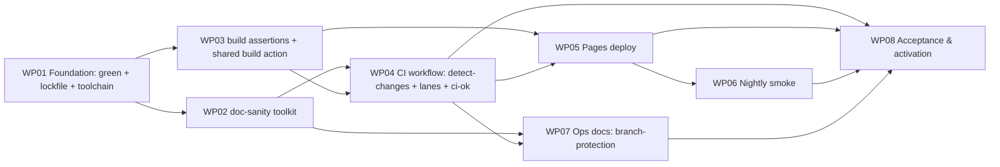

# Tasks: Path-Scoped CI/CD Pipeline

**Mission**: ci-cd-pipeline-01M0N1DZ · **Branch**: `feat/ci-cd-pipeline` →
merges to `feat/ci-cd-pipeline` (human PR later lands → `main`).

8 work packages, 41 subtasks. MVP = WP01 (local green). Ownership is disjoint per
WP (see each WP's `owned_files`).

## Dependency graph

Execution lanes: WP01 → (WP02 ∥ WP03) → WP04 → (WP05 ∥ WP07) → WP06 → WP08.

## Subtask Index

| ID | Description | WP | Parallel |
|----|-------------|----|----------|
| T001 | pnpm install on Node 22; commit pnpm-lock.yaml | WP01 | |
| T002 | Add CI devDeps (eslint+plugins, markdownlint-cli2, @lhci/cli) to the right manifests | WP01 | |
| T003 | Add scripts: typecheck, lint, doc validators, assert:artifacts wiring | WP01 | |
| T004 | Author eslint flat config; a lint violation must fail | WP01 | |
| T005 | Ensure toolkit Vitest suite runs non-trivially and passes | WP01 | |
| T006 | Ensure example `astro build` is clean (exit 0, non-empty dist); fix breakage | WP01 | |
| T007 | Verify frozen install passes and fails on a drifted lockfile | WP01 | |
| T008 | Extend validate-frontmatter.mjs to cover docs/ AND example/docs/ | WP02 | [P] |
| T009 | Add internal link/related integrity check; fail on dangling | WP02 | [P] |
| T010 | Add .markdownlint.jsonc shared config | WP02 | [P] |
| T011 | Add Vale config + minimal starter style, gated at error | WP02 | [P] |
| T012 | Fix doc violations surfaced under docs/ (boy-scout) | WP02 | |
| T013 | Verify each doc-sanity defect class fails locally | WP02 | |
| T014 | Author assert-build-artifacts.mjs over example/dist/ | WP03 | [P] |
| T015 | Pin expected agent-index shape+count from today's example output | WP03 | [P] |
| T016 | Author composite action .github/actions/build-example (shared build) | WP03 | [P] |
| T017 | Wire assert script to run after the shared build | WP03 | |
| T018 | Verify a missing/malformed artifact exits non-zero | WP03 | |
| T019 | detect-changes job: paths-filter + change-surface map + first-match + run_* outputs | WP04 | |
| T020 | code-quality job (if run_code_quality): typecheck+lint+test | WP04 | |
| T021 | doc-sanity job (if run_doc_sanity): frontmatter+links+markdownlint+vale (build-free) | WP04 | |
| T022 | build-example job (if run_build_example): shared build + assert | WP04 | |
| T023 | ci-ok job: needs detect-changes+3 lanes, always(), red on failure/detect-changes-failure | WP04 | |
| T024 | Triggers (pull_request only, push main), least-privilege permissions, concurrency | WP04 | |
| T025 | Verify lane matrix, ignored-only mergeable, failure paths | WP04 | |
| T026 | deploy.yml path-gate: only code/example_content/workflows redeploy | WP05 | |
| T027 | deploy reuses the composite build action (shared definition) | WP05 | |
| T028 | concurrency pages/cancel-in-progress:false; least-privilege pages permissions | WP05 | |
| T029 | Verify repo_docs-only push does not redeploy; deployable change does | WP05 | |
| T030 | nightly.yml schedule+dispatch; deploy-change gate (Deployments API vs smoke/last-run) | WP06 | |
| T031 | lychee link check (lychee.toml) against live URL | WP06 | [P] |
| T032 | Lighthouse CI (lighthouserc.json) SEO+a11y subset+rendering thresholds | WP06 | [P] |
| T033 | Marker update (contents:write, no retrigger); early-exit when unchanged | WP06 | |
| T034 | Reporting: always summary+artifacts; issue only on threshold failure; never gate | WP06 | |
| T035 | Verify gate no-ops when unchanged; first-run runs | WP06 | |
| T036 | Write branch-protection activation note (require ci-ok, enable Pages) | WP07 | [P] |
| T037 | Operating notes (lane matrix, nightly, marker) | WP07 | [P] |
| T038 | Ensure docs/ops/ci-cd.md passes doc-sanity | WP07 | |
| T039 | Run + record offline acceptance (local green, table tests, failure demos, actionlint) | WP08 | |
| T040 | Document the live post-activation acceptance checklist | WP08 | |
| T041 | Map SC-001..SC-010 to evidence (offline-proven vs live-pending) | WP08 | |

---

## WP01 — Foundation: green build, committed lockfile, toolchain

- **Goal**: Make a fresh checkout install, test, and build on Node 22; commit the
  lockfile; and establish all package manifests, scripts, and CI devDependencies
  the rest of the mission needs. Single owner of every `package.json` + lockfile.
- **Priority**: P1 (MVP). Nothing else is trustworthy until this is green.
- **Independent test**: clean checkout → `pnpm install` → `pnpm test` → `pnpm build`
  all succeed; `pnpm-lock.yaml` committed; `pnpm install --frozen-lockfile` passes
  and fails on a drifted manifest.
- **Subtasks**: T001 T002 T003 T004 T005 T006 T007
- **Dependencies**: none.
- **Prompt**: [tasks/WP01-foundation-green-build.md](./tasks/WP01-foundation-green-build.md) (~360 lines)

## WP02 — Doc-sanity toolkit (validators + configs)

- **Goal**: The build-free doc-sanity checks as runnable tools: frontmatter across
  `docs/` and `example/docs/`, link/`related` integrity, markdownlint, Vale(`error`).
- **Priority**: P2.
- **Independent test**: each defect class (bad frontmatter, dangling ref, md-lint
  violation, Vale error) fails its validator locally; clean tree passes.
- **Subtasks**: T008 T009 T010 T011 T012 T013
- **Dependencies**: WP01.
- **Prompt**: [tasks/WP02-doc-sanity-toolkit.md](./tasks/WP02-doc-sanity-toolkit.md) (~330 lines)

## WP03 — Build-integration assertions + shared build action

- **Goal**: A Node assertion script over `example/dist/` and a composite build
  action shared by the CI build lane and deploy (FR-015).
- **Priority**: P2.
- **Independent test**: assertions pass on a clean build; a missing/malformed
  artifact makes them exit non-zero.
- **Subtasks**: T014 T015 T016 T017 T018
- **Dependencies**: WP01.
- **Prompt**: [tasks/WP03-build-assertions-shared-action.md](./tasks/WP03-build-assertions-shared-action.md) (~320 lines)

## WP04 — CI workflow: detect-changes + lanes + ci-ok

- **Goal**: Assemble `ci.yml` — the classifier, the three conditional lanes wired to
  WP02/WP03 tooling, and the always-running `ci-ok` aggregate; fork-safe triggers.
- **Priority**: P2 (headline deliverable).
- **Independent test**: lane matrix holds per the change-surface map; ignored-only
  PR is mergeable; injected lane failure and detect-changes failure turn ci-ok red.
- **Subtasks**: T019 T020 T021 T022 T023 T024 T025
- **Dependencies**: WP01, WP02, WP03.
- **Prompt**: [tasks/WP04-ci-workflow-lanes-gate.md](./tasks/WP04-ci-workflow-lanes-gate.md) (~430 lines)

## WP05 — Pages deploy (path-gated, shared build)

- **Goal**: `deploy.yml` deploys the example to Pages on mainline only, path-gated,
  reusing WP03's composite build; serialized publishes.
- **Priority**: P3.
- **Independent test**: repo_docs-only push does not redeploy; a deployable change
  does; deploy uses the shared build definition.
- **Subtasks**: T026 T027 T028 T029
- **Dependencies**: WP03, WP04.
- **Prompt**: [tasks/WP05-pages-deploy.md](./tasks/WP05-pages-deploy.md) (~250 lines)

## WP06 — Nightly smoke (gated, reporting)

- **Goal**: `nightly.yml` — git-ref-gated lychee + Lighthouse CI against the live
  site, marker update, issue-only-on-failure, never gates.
- **Priority**: P4.
- **Independent test**: no-op when deployment SHA unchanged; runs and reports on
  change; first run runs.
- **Subtasks**: T030 T031 T032 T033 T034 T035
- **Dependencies**: WP05.
- **Prompt**: [tasks/WP06-nightly-smoke.md](./tasks/WP06-nightly-smoke.md) (~340 lines)

## WP07 — Ops docs: branch-protection activation

- **Goal**: Document the out-of-band repo-admin step (require `ci-ok`, enable Pages)
  and operating notes — the setting the whole design hinges on (FR-022).
- **Priority**: P3.
- **Independent test**: `docs/ops/ci-cd.md` exists, is accurate, and passes doc-sanity.
- **Subtasks**: T036 T037 T038
- **Dependencies**: WP02, WP04.
- **Prompt**: [tasks/WP07-ops-branch-protection-docs.md](./tasks/WP07-ops-branch-protection-docs.md) (~180 lines)

## WP08 — Acceptance & activation

- **Goal**: Own end-to-end acceptance so SC-001..SC-010 are provably closed —
  offline-provable checks executed in-mission, live checks a tracked post-activation
  checklist. Produces `acceptance.md`.
- **Priority**: P4 (final gate).
- **Independent test**: `acceptance.md` records green offline evidence, the live
  checklist, and an SC → evidence table with live-only SCs labeled pending.
- **Subtasks**: T039 T040 T041
- **Dependencies**: WP04, WP05, WP06, WP07.
- **Prompt**: [tasks/WP08-acceptance-and-activation.md](./tasks/WP08-acceptance-and-activation.md) (~140 lines)
