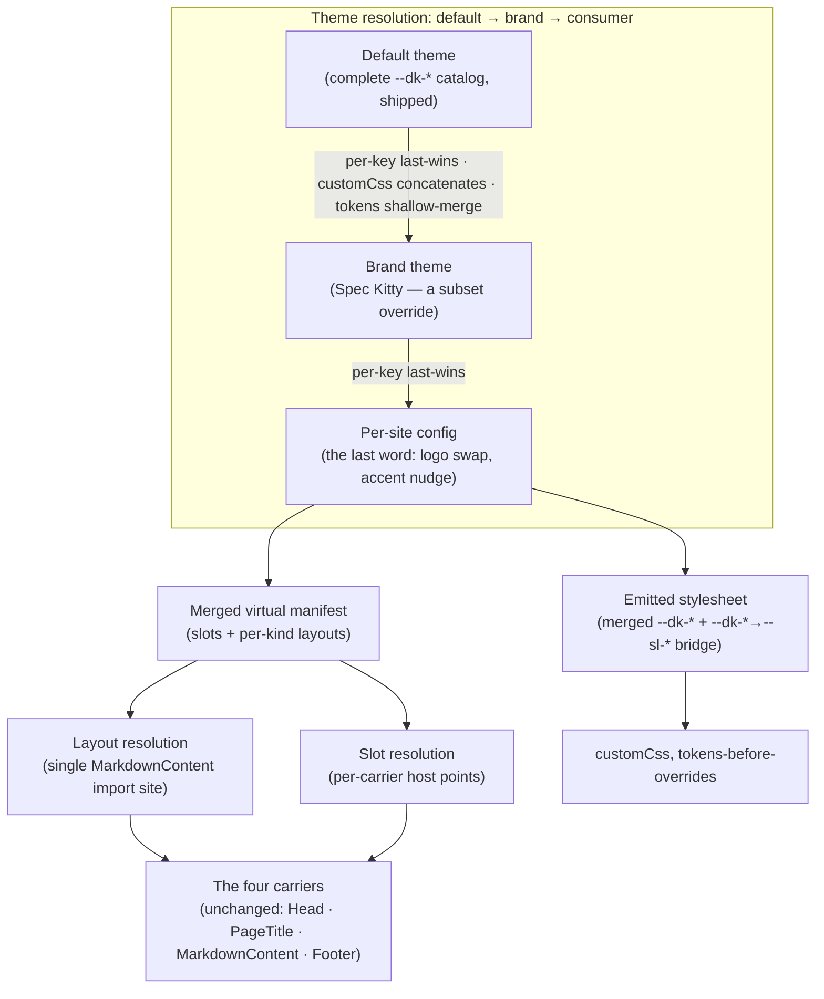

# Mission Specification: Component system + swappable theme

**Mission Branch**: `feat/component-system-and-theme`
**Created**: 2026-08-23
**Status**: Draft
**Input**: Mission M2 — a component and per-kind layout system with a swappable theme
layer a consumer can rebrand without forking. Design is authored and settled
(ADR-0008, ADR-0011, ADR-0013, ADR-0014, ADR-0015, `docs/architecture/theming.md`,
`docs/architecture/theming-spec-kitty-brand.md`). This mission specs and builds that
design; it does not re-open its decisions.

## Context and settled design

M1 landed and is live (merge `07079d7`). It ships the ADR-0011 slot surface in its
ADR-0013 **degenerate single-layer** form: four carriers on
`Astro.locals.starlightRoute`, a **static** `kind → layout` module resolved at a
single import site in the `MarkdownContent` carrier, the complete neutral Default
`--dk-*` catalog plus the `--dk-* → --sl-*` bridge as one cascade-positioned
stylesheet, the Starlight `components` map wired to the four carriers, and the
`dk:page-hero` / `dk:metadata-band` / Head share-metadata / bespoke `Hub` layout
chrome. CI is live and gating (`ci-ok`); the non-fakeable chrome and build-artifact
assertions guard the M1 surface.

This mission grows that substrate to its complete ADR-0011 form. The layering it
implements:

The three ADR-0013 extension **seams** this mission extends without rewriting M1's
render sites:

1. swap the static `kind → layout` module for the merged manifest **at the same
   single `MarkdownContent` import site**, preserving the exact synchronous
   `resolveLayout(kind): LayoutComponent` signature so the carrier body is
   byte-unchanged (ADR-0015 decision 1);
2. append brand/consumer CSS **after** the token sheet (cascade order);
3. leave the Starlight `components` map as the four carriers (ADR-0015 decision 3).

**Layout vs. slot resolution (ADR-0015).** The single import site resolves
`kind → layout` only. `dk:` slots resolve **per-carrier** from the same merged
manifest: `dk:head` + share metadata in `Head`; `dk:page-hero` + `dk:metadata-band`
in `PageTitle`; layout resolution + the M3 content slots in `MarkdownContent`;
`dk:site-footer` in `Footer`. The `components` map holds only doc-kitty's four
carriers; a theme never writes it.

## User Scenarios & Testing *(mandatory)*

### User Story 1 - A consumer rebrands by selecting a theme, without forking (Priority: P1)

A consumer adopting doc-kitty as a docsite template wants their own brand — colour,
type, logo, chrome — applied to the same `docs/` tree. They pass a theme to
`defineDocKittyIntegrations({ theme })`; doc-kitty resolves the three layers
(default → brand → consumer) and renders the site under that brand. No file is
copied out of the toolkit; no toolkit CSS is hand-edited.

**Why this priority**: This is the mission's headline and the hard requirement of
ADR-0008. Without it the template goal fails — every brand would fork.

**Independent Test**: A merge-resolver unit test drives the layer merge with fixture
themes; a build of the branded example confirms the emitted stylesheet, assets, and
`customCss` order reflect the merged result; the no-theme resolver path is asserted
byte-compatible with M1.

**Acceptance Scenarios**:

1. **Given** a site calling `defineDocKittyIntegrations({ theme })` with a brand
   theme, **When** the site builds, **Then** the emitted stylesheet carries the
   merged `--dk-*` values (brand over default, consumer over brand) and the
   `--dk-* → --sl-*` bridge, with brand/consumer `customCss` appended after the
   token sheet.
2. **Given** a theme overriding a subset of `--dk-*` tokens, **When** merged over
   Default, **Then** the un-overridden tokens retain their Default values
   (per-key last-wins; `tokens` shallow-merge).
3. **Given** an existing M1-style `defineDocKittyIntegrations(options)` call with no
   `theme`, **When** it resolves, **Then** `customCss` is the single static
   `theme.css` entry (token generation bypassed) and the chrome renders exactly as
   in M1 — byte-identical `customCss` shape and Default catalog values.

---

### User Story 2 - The merged manifest drives slot + per-kind-layout overrides from the seams (Priority: P1)

A theme targets doc-kitty's `dk:` slot names and per-kind layouts through a merged
virtual manifest — never Starlight's `components` map. The `MarkdownContent` carrier
resolves a page's `kind` through the manifest at the **same single import site** M1
used for the static module; the other carriers resolve their own `dk:` slots from
the manifest. M1's chrome (hero, band, share metadata, Hub layout) renders unbroken.

**Why this priority**: The manifest transport is the mechanism that makes slot and
layout overrides swappable. It must replace the static module without scattering
edits or regressing M1 chrome.

**Independent Test**: Register a layout for a `kind` through a theme's `layouts`
map and confirm the carrier renders it; confirm an unknown/absent `kind` still
falls back to `Default`; confirm the Starlight `components` map is still the four
carriers (a build assertion).

**Acceptance Scenarios**:

1. **Given** a theme with a `layouts` entry `kind → layout`, **When** a page of that
   `kind` renders, **Then** the `MarkdownContent` carrier wraps its content in the
   manifest-resolved layout via a **synchronous** `resolveLayout(kind)`, in the
   normal Starlight frame (sidebar, TOC, search, pagination intact).
2. **Given** a page with an unknown or absent `kind`, **When** it renders, **Then**
   it falls back to the `Default` layout and the validator warns rather than fails
   (ADR-0009 open vocabulary).
3. **Given** a theme with a `slots` entry `dk:slot-name → .astro`, **When** a page
   renders, **Then** the owning carrier hosts the theme's component at that `dk:`
   slot, while Starlight's `components` map remains doc-kitty's four carriers.
4. **Given** M1's Hub pages, **When** the manifest replaces the static module,
   **Then** the Hub layout still renders and its cards remain in the Hub's own
   Pagefind fragment.

---

### User Story 3 - The Spec Kitty brand theme renders, self-contained, both modes, AA (Priority: P1)

doc-kitty ships the first real brand theme (Spec Kitty). It is **derived, not
imported**: its own `--dk-*` values, atomic components, logo/favicon/fonts, and
diagram token values, with no build- or run-time dependency on `spec-kitty-design`.
It renders in both light and dark and meets WCAG 2.2 AA. The brand's non-negotiable
logo-in-nav header ships via Starlight-native `logo`/`title` config plus brand CSS
(ADR-0015 decision 5) — no `components`-map expansion.

**Why this priority**: The brand theme is what proves the contract end-to-end
(ADR-0008 consequence) and is the mission's Definition of Done anchor.

**Independent Test**: Build the example under the brand theme and verify the brand's
signature markers render (yellow-scalpel accent, ALL-CAPS mono eyebrows, flat dark
surfaces, logo-in-nav header) in both modes with no accessibility violations; grep
the build for any `@spec-kitty/*` import (must find none).

**Acceptance Scenarios**:

1. **Given** the brand theme selected, **When** the example builds, **Then** the
   brand `--dk-*` overrides (colour, type families, radius, focus, caps tracking)
   are emitted and the un-overridden tokens inherit from Default.
2. **Given** the brand theme, **When** the site renders in dark and in light,
   **Then** every mode-varying `--dk-*` token (the enumerated colour subset) is
   re-declared under the brand's own dark selector so overrides apply in both modes.
3. **Given** the brand theme, **When** the accessibility harness runs axe-core
   against the enumerated page set in both modes, **Then** there are zero serious
   and zero critical WCAG 2.2 AA violations.
4. **Given** the built site, **When** the bundle is inspected, **Then** nothing
   references `@spec-kitty/tokens`, the CDN, or the `spec-kitty-design` repo; logo,
   favicon, fonts, and diagram token values are doc-kitty's own copies; and the
   brand/consumer emitted sheets contain zero direct `--sl-*:` assignments (the
   bridge owns `--sl-*`).
5. **Given** the brand theme, **When** the header renders, **Then** the logo ``
   and the wordmark render in the top nav via Starlight-native config, and the
   Starlight `components` map is still exactly the four carriers.

---

### User Story 4 - The Persona per-kind layout shell renders through the manifest (Priority: P2)

The `Persona` per-kind layout (the passport / character-sheet shell) is authored as
a brand organism and resolved through the manifest: a bounded card with an accent
identity strip, the persona name as an `<h1>` in the display font, a `<dl>` grid of
the page's **existing generic frontmatter**, and an avatar from `hero_image.alt`. It
renders in-frame (keeps the sidebar). Persona-*attribute* schema, persona-page
authoring, audience resolution, and the audience/related/reference blocks are out of
scope (M3).

**Why this priority**: A second bespoke layout (Hub + Persona) is a materially
stronger proof that the manifest drives per-kind-layout override than Hub alone, and
the passport is the brand's signature organism. It rides on the P1 manifest.

**Independent Test**: Add a fixture page at a fixed route with `kind: Persona`;
confirm the passport shell renders its fields as a `<dl>`, carries the
layout-unique `.dk-passport` marker, keeps the sidebar, and its content (with a
persona-unique string) appears in its own Pagefind fragment.

**Acceptance Scenarios**:

1. **Given** a page with `kind: Persona` (already in the M1 `KINDS` vocabulary),
   **When** it renders, **Then** the manifest resolves the Persona layout and the
   passport shell renders the name (from `title`) as an `<h1>`, a `<dl>` of the
   existing generic fields (`doc_status`, `updated`, `type`, `authors`, `tags`),
   and the avatar alt from `hero_image.alt`.
2. **Given** the Persona page, **When** it renders, **Then** the sidebar, TOC,
   search, and pagination remain (in-frame), and its content is in the Pagefind
   searchable region.
3. **Given** the Persona layout, **When** the accessibility harness runs, **Then**
   the `<dl>` field relationships are programmatic and targets/focus meet AA.
4. **Given** the Persona layout is stubbed to fall back to `Default`, **When** the
   assertion runs, **Then** it fails (the `.dk-passport` marker is absent) — the
   assertion binds to a Persona-layout-unique marker, not to generic `<h1>`/`<dl>`.

---

### User Story 5 - The accessibility harness gates the theme layer in CI (Priority: P2)

Playwright arrives with this mission as a new CI lane, a member of `ci-ok`. It runs
axe-core accessibility checks (and a bounded visual-regression baseline) against the
branded example and fails the build on a serious/critical violation, without
breaking the existing three lanes.

**Why this priority**: The DoD requires WCAG 2.2 AA "verified by Playwright". A gate
that runs a real accessibility engine against the rendered pages in both modes is
stronger than one that only asserts markers.

**Independent Test**: Run the lane locally against a clean build; confirm it fails
when a known contrast/target regression is introduced and passes on the shipped
brand theme; confirm the existing `code-quality`, `doc-sanity`, and `build-example`
lanes still pass and that `ci-ok` requires the new lane.

**Acceptance Scenarios**:

1. **Given** the harness in CI as a lane `ci-ok` requires, **When** `ci-ok` runs,
   **Then** axe-core runs against the enumerated page set in both light and dark
   (the harness sets `data-theme="dark"` / emulates `prefers-color-scheme: dark`
   and asserts each state), and the build fails on any serious/critical violation.
2. **Given** a deliberately regressed contrast/target rule (stub-and-fail proof),
   **When** the harness runs, **Then** it fails; **and When** the regression is
   reverted, **Then** it passes.
3. **Given** the new lane, **When** it is added, **Then** the three existing CI
   lanes continue to pass unchanged, and the lane consumes the example build
   artifact (it does not fold into the `code-quality` lane).

---

### User Story 6 - Per-site config is the last word (Priority: P3)

A site tweaks a logo or nudges an accent without editing the brand theme, by passing
a consumer-layer theme that extends the brand. Consumer overrides win over brand,
which wins over default.

**Why this priority**: Completes the three-layer contract (ADR-0008). Lower priority
because layers 1–2 already prove swappability; layer 3 is the convenience last word.

**Independent Test**: Apply a consumer theme overriding a single token and one asset
over the brand; confirm only those keys change and everything else inherits the
brand (resolver unit test).

**Acceptance Scenarios**:

1. **Given** a consumer theme extending the brand and overriding one `--dk-*` token,
   **When** merged, **Then** that token takes the consumer value and all others keep
   the brand value.
2. **Given** a consumer theme overriding `assets.logo`, **When** the site renders,
   **Then** the consumer logo is used and the rest of the brand assets remain.

### Edge Cases

- A theme sets a `--sl-*` variable directly (violating the `--dk-*`-only contract):
  forbidden; the bridge owns `--sl-*`. A build check asserts zero `--sl-*:`
  assignments in brand/consumer sheets.
- A theme's `customCss` is ordered before the token sheet: cascade would break. A
  build assertion holds brand/consumer CSS strictly after the token sheet.
- A theme names a `kind` layout for a `kind` no page uses: harmless; no page resolves
  it, no error.
- A theme overrides a `dk:` slot with a component rendering outside the searchable
  content region: Pagefind coverage would regress; bespoke layouts must keep content
  in the searchable region.
- No theme selected: `customCss` stays the single static `theme.css` entry, token
  generation is bypassed, and layout resolution is identical to M1's static
  single-layer behaviour (Default catalog, Hub registered, everything else Default).
- A brand token override omits its dark-mode re-declaration: the override would apply
  in one mode only; every mode-varying token must be re-declared under the dark
  selector, and the completeness check enumerates them.
- A `dk:site-header` pass-through override is attempted via a `Header` component
  registration: forbidden in M2 (ADR-0015 decision 4) — it would expand the
  `components` map past four; the brand header rides native `logo`/`title` config.

## Requirements *(mandatory)*

### Functional Requirements

| ID | Title | User Story | Priority | Status |
|----|-------|------------|----------|--------|
| FR-001 | Theme parameter, backward-compatible | As a consumer, I want `defineDocKittyIntegrations({ theme })` to accept an optional theme while the M1 `(options)` call keeps working unchanged, so adopting a theme is additive. | High | Open |
| FR-002 | Three-layer merge | As a consumer, I want default → brand → consumer merged per-key last-wins, with `customCss` concatenated in precedence order and `tokens` shallow-merged, so layers compose predictably. | High | Open |
| FR-003 | Emit merged token stylesheet + bridge | As a contributor, I want the merged `--dk-*` map emitted as a generated stylesheet carrying the `--dk-* → --sl-*` bridge, positioned tokens-before-overrides, so brand/consumer CSS appended after it wins by cascade. When no theme is given, generation is bypassed and `customCss` stays the single static `theme.css` entry. | High | Open |
| FR-004 | `--dk-*`-only contract | As a theme author, I want to set `--dk-*` tokens only and have the base stylesheet bridge each into its `--sl-*` counterpart (brand/consumer sheets carry zero direct `--sl-*` assignments), so a Starlight rename is a one-file fix, not a per-theme break. | High | Open |
| FR-005 | Merged manifest — layouts at the single seam | As a contributor, I want the static `kind → layout` module replaced by the merged manifest read at the same single `MarkdownContent` import site, preserving the synchronous `resolveLayout(kind): LayoutComponent` signature so the carrier body is byte-unchanged (ADR-0015 decision 1). | High | Open |
| FR-006 | Slot overrides via manifest, per-carrier | As a theme author, I want to override `dk:` slot names through the manifest, each resolved by its owning carrier (never the Starlight `components` map), so themes stay insulated from Starlight internals (ADR-0015 decision 2). | High | Open |
| FR-007 | Per-kind layout overrides via manifest | As a theme author, I want to override a `kind`'s layout through the manifest with a `Default` fallback for unknown/absent kinds (validator warns, not fails), so structural kinds get bespoke layouts without touching doc-kitty. | High | Open |
| FR-008 | Carriers + components map unchanged | As a contributor, I want the Starlight `components` map to remain exactly doc-kitty's four carriers, so all theme choice flows through the manifest and the M1 substrate is preserved (ADR-0013 seam 3). | High | Open |
| FR-009 | Forward theme assets | As a consumer, I want theme `assets` (logo, favicon, socialImage, fonts) forwarded to Starlight-native `logo`/`favicon`/`title` and `socialImage` to `dk:head`, so rebrand assets apply without manual wiring and without expanding the components map. | High | Open |
| FR-010 | Spec Kitty brand theme (self-contained, derived) | As doc-kitty, I want to ship the Spec Kitty brand theme with its own `--dk-*` values, atomic components, logo/favicon/fonts, and diagram token values and no dependency on `spec-kitty-design`, so doc-kitty stays standalone. | High | Open |
| FR-011 | Brand token subset + both modes | As a theme author, I want the brand to override a subset of `--dk-*` (colour, type families, radius, focus, caps tracking), inherit the rest from Default, and re-declare every enumerated mode-varying token under its own dark selector, so the brand applies in light and dark. | High | Open |
| FR-012 | Atomic-design component language | As a contributor, I want the atoms/molecules/organisms the brand chrome needs (eyebrow, status pill, kind tag, focus ring, related-card, field row, site header/footer, typed tint panels) authored self-contained; the M1 metadata band is reused, not rebuilt; and the M3 content blocks (audience/related/external-references) are NOT wired to resolved data in M2. | High | Open |
| FR-013 | Persona per-kind layout shell | As a consumer, I want a `Persona` passport layout (identity strip, name `<h1>`, `<dl>` of existing generic frontmatter, avatar from `hero_image.alt`, layout-unique `.dk-passport` marker) resolved through the manifest and rendered in-frame, so persona-kind pages get their bespoke shell and the manifest is proven with a second layout. It introduces no new frontmatter fields. | Medium | Open |
| FR-014 | Rebrand the live example without forking | As a consumer, I want the example site to carry the Spec Kitty brand theme (deployed live) without copying any toolkit file, so the no-fork promise is demonstrated end-to-end. | High | Open |
| FR-015 | Consumer (per-site) override layer | As a consumer, I want a per-site config layer that overrides the brand (e.g. logo swap, accent nudge) without editing the brand theme, so small tweaks need no theme fork. | Medium | Open |
| FR-016 | Playwright accessibility gate as a ci-ok lane | As a maintainer, I want a Playwright lane (axe-core across the enumerated pages in both modes, plus a bounded visual-regression baseline) added as a member of `ci-ok` that fails on serious/critical WCAG violations, consumes the example build artifact, and does not break the existing three lanes. | High | Open |
| FR-017 | Update build/chrome assertions for the themed surface | As a maintainer, I want the build-artifact and chrome assertions updated so `build-example` stays green under the manifest and brand theme, with new non-fakeable assertions for: the Persona layout (`.dk-passport` marker + persona-unique Pagefind text), the `components`-map-is-four-carriers invariant, the cascade order (brand/consumer after the token sheet), and the mode-varying token completeness. | High | Open |
| FR-018 | Pass-through slot surface scope | As a theme author, I want the `dk:` slot surface delivered per ADR-0015: own-chrome slots and the `Footer`-carrier `dk:site-footer` are themeable through the manifest in M2; pass-through overrides that would register non-carrier Starlight components (Header, SiteTitle, Banner, and the rest) are sequenced to a later mission and NOT delivered in M2. | Medium | Open |

### Non-Functional Requirements

| ID | Title | Requirement | Category | Priority | Status |
|----|-------|-------------|----------|----------|--------|
| NFR-001 | WCAG 2.2 AA, both modes | The brand theme meets WCAG 2.2 AA in light and dark: axe-core (run with the `wcag22aa` tag) reports 0 serious and 0 critical violations on the enumerated page set (a Persona fixture, a Hub page, and a prose page) in both modes; a CSS `min-height`/`min-width` ≥24px rule holds on the brand interactive targets (`.dk-hub__card`, `.dk-passport` targets); a `.dk-*:focus-visible` rule holds for the brand focus ring. Target-size and focus are verified by the CSS construction checks (not attributed to axe). | Accessibility | High | Open |
| NFR-002 | M1 backward compatibility | The no-theme resolver path is verified byte-compatible with M1 by a unit test (single static `theme.css` `customCss` entry; Default catalog; static Hub+Default layout resolution), and the M1 non-fakeable chrome/build assertions (theme-agnostic structural markers) plus the pinned agent-index shape/count (12) stay green on the branded example build. | Compatibility | High | Open |
| NFR-003 | Clean two-way CI | `pnpm install --frozen-lockfile` from empty `node_modules` followed by the full `ci-ok` set — code-quality, doc-sanity, build-example, and the new Playwright accessibility lane (all members of `ci-ok`) — completes green, locally and on the PR. | Reliability | High | Open |
| NFR-004 | Search coverage preserved | Bespoke per-kind layouts (Hub, Persona) keep content inside Starlight's searchable content region: the Persona fixture's persona-unique string and the Hub cards appear in their own Pagefind fragments. | Search | High | Open |
| NFR-005 | Zero new runtime deps in gates | The assertion scripts keep the zero-runtime-dependency contract (string/`node:zlib` only); Playwright and axe-core are dev/test-only dependencies, not shipped runtime deps. | Maintainability | Medium | Open |
| NFR-006 | Stable, versioned theme surface | The theme contract (`DocKittyTheme` shape, `dk:` slot names, `kind` layout keys, `--dk-*` catalog) is treated as a stable, backward-compatible public surface; a breaking change to it requires an ADR. | Maintainability | Medium | Open |

### Constraints

| ID | Title | Constraint | Category | Priority | Status |
|----|-------|------------|----------|----------|--------|
| C-001 | Extend the three ADR-0013 seams | Land at the three named seams without rewriting M1 render sites: (1) swap the static module for the manifest at the single `MarkdownContent` import site, preserving the synchronous `resolveLayout(kind): LayoutComponent` signature (carrier body byte-unchanged); (2) append brand/consumer CSS after the token sheet; (3) leave the `components` map as the four carriers. | Technical | High | Open |
| C-002 | Starlight pin 0.32.6 | Do not regress the M1 Starlight pin at 0.32.6 (ADR-0014). | Technical | High | Open |
| C-003 | pnpm sharp/@img hoist | Keep the `pnpm-workspace.yaml` hoist of `sharp`/`@img/*`. | Technical | High | Open |
| C-004 | Keep M1 gates green | Every M1 non-fakeable chrome assertion (token-catalog completeness, `--dk-*→--sl-*` bridge, four carriers, metadata band with text-labelled status, hero ``, three distinct share images, Hub Pagefind cards, AA `.dk-hub__card` ≥24px + dk `:focus-visible`) and the pinned agent-index shape/count stay green; assertions are updated (never weakened) if theming changes their surface, with stub-and-fail proof for any touched or added assertion. | Technical | High | Open |
| C-005 | Brand self-contained / derived | The Spec Kitty brand theme is derived, not imported: no build- or run-time dependency on `spec-kitty-design` or `@spec-kitty/*` (ADR-0011). | Technical | High | Open |
| C-006 | Astro 5.18.2 integration API | The virtual-manifest transport must be compatible with the pinned Astro 5.x integration API (5.18.2 per ADR-0014); it must yield a synchronous `resolveLayout(kind) → Component` (integration codegen or eager `import.meta.glob`, not a runtime dynamic import of a string path), proven by a build spike before implementation. | Technical | High | Open |
| C-007 | Searchable content region | Bespoke per-kind layouts must keep content inside Starlight's searchable content region or Pagefind coverage regresses. | Technical | High | Open |
| C-008 | Carriers read route-data API | Carriers read `Astro.locals.starlightRoute` (Starlight ≥0.32), never `Astro.props`. | Technical | Medium | Open |
| C-009 | Deviations become new ADRs | Any deviation from the settled design (ADR-0008/0011/0013/0014/0015, `theming.md`, `theming-spec-kitty-brand.md`) is recorded as a new ADR, not a silent change. | Governance | High | Open |
| C-010 | Scope boundary M2↔M3↔M6 | In scope (M2): the theme wiring + merge, the merged-manifest transport, the brand theme, the atomic component language, the `Persona` per-kind layout SHELL, and the accessibility lane. Out of scope: the audience/related/external-reference BLOCKS wired to resolved data, persona-*attribute* schema and persona-PAGE authoring, and the citation catalog (M3); the reveal.js Presentation ROUTE (M6) — the manifest exposes `Presentation` only as the documented route-exception hook, never resolved as an in-frame layout at the `MarkdownContent` seam; the "diagram theme" is brand token VALUES only, not a diagram renderer (M5); re-opening the shipped metadata contract (M1) or the section registry. The brand atoms that the M3 blocks will later consume may be authored for Hub/brand chrome, but the three M3 blocks stay unwired and absent in M2. | Scope | High | Open |

### Key Entities

- **DocKittyTheme**: the theme record — `name`, `extends`, `tokens` (`--dk-*`
  values or a css path), `customCss[]`, `assets` (logo/favicon/socialImage/fonts),
  `slots` (`dk:` slot name → `.astro` path), `layouts` (`kind` → `.astro` path).
- **Layer**: one of Default (complete, shipped), Brand (subset override), Consumer
  (per-site last word); resolved default → brand → consumer.
- **Merged virtual manifest**: the resolved `slots` + `layouts` transport. Layouts
  resolve at the single `MarkdownContent` import site (synchronous `resolveLayout`);
  slots resolve per-carrier. Replaces the static `kind → layout` module.
- **Carrier**: one of the four Starlight component overrides (`Head`, `PageTitle`,
  `MarkdownContent`, `Footer`) — unchanged; each hosts the `dk:` slots it owns.
- **`dk:` slot**: a doc-kitty-owned named slot a theme may override via the manifest.
- **Per-kind layout**: a `kind → layout` mapping resolved through the manifest;
  `Default` fallback; `Hub` and `Persona` are the in-frame bespoke layouts;
  `Presentation` is the route-exception hook (M6).
- **Token catalog**: the `--dk-*` set plus the `--dk-* → --sl-*` bridge assignments;
  its mode-varying subset is enumerated for the completeness check.
- **Brand atomic components**: the atoms/molecules/organisms the brand chrome is
  built from, self-contained in doc-kitty.

## Success Criteria *(mandatory)*

### Measurable Outcomes

- **SC-001**: A consumer changes the site's brand (colour, type, logo, chrome) by
  selecting a theme with **zero** files copied out of the toolkit and **zero**
  toolkit CSS hand-edits (no fork).
- **SC-002**: The Spec Kitty brand theme renders in both light and dark with **0
  serious and 0 critical** WCAG 2.2 AA violations reported by axe-core across the
  enumerated page set (Persona fixture, Hub page, prose page) in both modes.
- **SC-003**: The no-theme resolver path is byte-compatible with M1 (resolver unit
  test) **and** the branded example keeps **100%** of the M1 chrome and
  build-artifact gates green.
- **SC-004**: Manifest-driven per-kind-layout override is proven for **two** distinct
  kinds (Hub and Persona), each with a non-fakeable assertion bound to a
  layout-unique marker (`dk-hub__list`; `.dk-passport`) that fails when the layout
  is stubbed or removed.
- **SC-005**: `ci-ok` is green on the PR — code-quality, doc-sanity, build-example,
  and the new Playwright accessibility lane, all members of `ci-ok` — verified both
  on a clean `--frozen-lockfile` install locally and on the PR.
- **SC-006**: Every design deviation introduced by the mission is recorded as a new
  ADR (count of silent deviations = 0; ADR-0015 records the slot-resolution seam).

## Domain Language *(canonical terms)*

- **Theme layer / swappable theme**: the layered presentation contract
  (default → brand → consumer). Avoid "skin"; "template" means the whole toolkit,
  not the theme.
- **Carrier**: one of the four Starlight component overrides. Not "wrapper" or
  "shim" loosely.
- **`dk:` slot**: a doc-kitty-owned named slot. Distinct from a Starlight slot.
- **Pass-through slot**: a `dk:` slot mapping 1:1 onto a non-carrier Starlight
  override; its override delivery is sequenced past M2 (ADR-0015).
- **Merged virtual manifest** (or "manifest"): the resolved slots + layouts
  transport. Not "registry" (the M1 static module was the registry it replaces).
- **Per-kind layout**: a layout selected by a page's `kind`. Distinct from the
  Starlight page template.
- **Brand theme, derived not imported**: doc-kitty carries its own transcribed
  `--dk-*` values and components; it does not depend on `spec-kitty-design`.
- **Persona layout shell**: the passport chrome/structure rendering generic
  frontmatter (M2). Distinct from persona-attribute schema, persona-page authoring,
  and audience resolution (M3).
