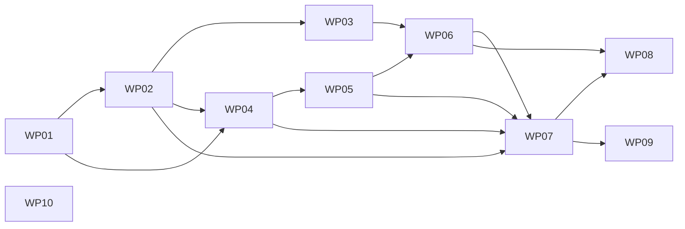

# Tasks: Component system + swappable theme

**Mission**: `component-system-and-theme-01M0QHDH` | **Branch**: `feat/component-system-and-theme`
**Spec**: [spec.md](./spec.md) · **Plan**: [plan.md](./plan.md)

10 work packages, 45 subtasks, derived from the 9 implementation concerns (IC-01…IC-09).
Progress is event-sourced: record completion with
`spec-kitty agent tasks mark-status Txxx --status done` (not by ticking boxes).

## Subtask Index

| ID | Description | WP | Parallel |
|----|-------------|----|----------|
| T001 | `DocKittyTheme` type + `DkSlotName` + `Kind` re-export | WP01 | |
| T002 | `mergeTheme` resolver (extends-chain; per-key last-wins; customCss concat; tokens shallow-merge) | WP01 | |
| T003 | `emitTokenSheet` (merged `--dk-*` + `--dk-*→--sl-*` bridge; mode-varying under dark selector) | WP01 | |
| T004 | No-theme degenerate path (single static `theme.css`; Default catalog) | WP01 | |
| T005 | vitest: merge semantics + no-theme byte-compat + `--dk-*`-only | WP01 | |
| T006 | Build spike: integration virtual module resolves a layout synchronously (pinned toolchain) | WP02 | |
| T007 | `manifest.ts`: Astro integration → `virtual:doc-kitty/manifest` (codegen static imports) | WP02 | |
| T008 | `kind-layouts.ts`: manifest-backed `resolveLayout`, signature preserved, Default fallback | WP02 | |
| T009 | `config.ts`: accept `{ theme }`; resolveTheme+emitTokenSheet; register integration; customCss after tokens; components map = four carriers | WP02 | |
| T010 | Verify no-theme example builds green (manifest=default → Hub+Default); M1 gates pass | WP02 | |
| T011 | `Head` carrier: read manifest slots for `dk:head` + share metadata | WP03 | [P] |
| T012 | `PageTitle` carrier: read manifest for `dk:page-hero` + `dk:metadata-band` (M1 chrome preserved) | WP03 | [P] |
| T013 | `MarkdownContent` carrier: layout resolution byte-unchanged; M3 slot host points wired to manifest (unwired in M2) | WP03 | |
| T014 | `Footer` carrier: `dk:site-footer` from manifest; assert components map stays four carriers | WP03 | |
| T015 | `spec-kitty/index.ts`: theme def (extends default; tokens; assets; slots; layouts Persona) | WP04 | |
| T016 | `spec-kitty/tokens.css`: brand `--dk-*` (colour, type, radius, focus, caps), both modes | WP04 | |
| T017 | Mode-varying tokens re-declared under brand dark selector (enumerated colour subset) | WP04 | |
| T018 | Assets: logo/favicon/fonts (`@font-face` + Google JetBrains Mono)/diagram values — own copies, no `@spec-kitty/*` | WP04 | |
| T019 | Native `logo`/`title` header wiring + active-nav accent CSS | WP04 | |
| T020 | AA contrast self-check both modes (document derived light column) | WP04 | |
| T021 | Atoms: eyebrow, status pill (text-labelled), kind tag, focus ring, hairline | WP05 | [P] |
| T022 | Molecules: related-card, reference-item, field row (`<dl>`) | WP05 | [P] |
| T023 | Organisms: site header, footer, typed tint panels (sky/lilac/mint/butter) | WP05 | |
| T024 | Wire atoms into brand own-chrome styling; M1 metadata band REUSED, not rebuilt | WP05 | |
| T025 | Component-level AA (≥24px targets, focus-visible) construction | WP05 | |
| T026 | `Persona.astro`: passport (identity strip, name `<h1>`, `<dl>` generic fields, avatar), `.dk-passport` marker, in-frame, searchable | WP06 | |
| T027 | Register `Persona` in the brand's `layouts` map | WP06 | |
| T028 | `example/docs/personas/example-persona.md` fixture (draft; persona-unique string; no pinned-count change) | WP06 | |
| T029 | Verify Persona renders in-frame + falls back to Default when unregistered | WP06 | |
| T030 | `example/astro.config.mjs`: pass `theme: specKittyTheme` | WP07 | |
| T031 | Verify M1 structural chrome/build assertions stay green under the brand build | WP07 | |
| T032 | Confirm no toolkit files copied (no-fork proof); deployed example is branded | WP07 | |
| T033 | assert-chrome: Persona `.dk-passport` marker + persona-unique Pagefind text (stub-and-fail) | WP08 | |
| T034 | assert-chrome: cascade order (brand/consumer sheet after token sheet) | WP08 | |
| T035 | assert-chrome: mode-varying completeness + zero `--sl-*:` in brand sheets | WP08 | |
| T036 | vitest config-invariants: components map = exactly four carriers | WP08 | |
| T037 | Keep all M1 assertions green on the branded build; prove each new/touched assertion fails on a stub | WP08 | |
| T038 | Add `@playwright/test` + `@axe-core/playwright` (dev); pin minor; supply-chain notes; explicit chromium install | WP09 | |
| T039 | `playwright.config.ts` (target `example/dist`; both modes) | WP09 | |
| T040 | `tests/a11y`: axe `wcag22aa` across enumerated pages, both modes → 0 serious/critical | WP09 | |
| T041 | Bounded visual-regression baseline (brand home both modes, pixel-diff threshold) | WP09 | |
| T042 | CI: add a11y lane; `ci-ok` requires it; consume build artifact; three lanes unbroken | WP09 | |
| T043 | Verify: stub-and-fail regression + clean `--frozen-lockfile` run | WP09 | |
| T044 | `theming.md`: reference ADR-0015 + M2 shipped state (pass-through sequencing) | WP10 | [P] |
| T045 | Note shipped brand + Persona layout in `theming.md`; doc-sanity passes | WP10 | [P] |
| T046 | Brand AA construction assertions (≥24px + focus) on brand atom classes | WP08 | |
| T047 | Slot-override (`dk-site-footer--brand`) + Hub stub-fail through the manifest | WP08 | |

## Work Packages

### WP01 — Theme merge and token emission (IC-01, IC-02)

- **Goal**: `DocKittyTheme` type + `mergeTheme` (default→brand→consumer) + `emitTokenSheet`, and the no-theme byte-compat path. Pure toolkit logic, unit-tested.
- **Priority**: P1 (foundation). **Independent test**: vitest drives the merge with fixture themes and asserts the no-theme path is byte-identical to M1.
- **Subtasks**: T001, T002, T003, T004, T005. **Depends on**: none. **Prompt**: `WP01-theme-merge.md` (~320 lines).
- **Risks**: the no-theme path must stay byte-identical (single static `theme.css`, Default catalog).

### WP02 — Manifest transport and layout-resolution swap (IC-03) — MVP core

- **Goal**: the Astro integration + `virtual:doc-kitty/manifest`; swap the static module for the manifest at the single `MarkdownContent` import site preserving the synchronous `resolveLayout` signature; wire `config.ts` for `{ theme }`; components map stays four carriers.
- **Priority**: P1. **Independent test**: no-theme example builds green (manifest = default layer); a fixture theme's `layouts` entry renders; unknown kind → Default.
- **Subtasks**: T006, T007, T008, T009, T010. **Depends on**: WP01. **Prompt**: `WP02-manifest-transport.md` (~420 lines).
- **Risks**: synchronous resolution on Astro 5.18.2 (build spike gates it); carrier byte-stability; components-map invariant.

### WP03 — Per-carrier slot resolution (IC-03) 

- **Goal**: each of the four carriers reads the merged manifest for the `dk:` slots it owns; the components map stays exactly four carriers; M1 chrome preserved.
- **Priority**: P1. **Independent test**: a fixture theme overriding `dk:site-footer` renders through the Footer carrier; M1 hero/band unbroken.
- **Subtasks**: T011, T012, T013, T014. **Depends on**: WP02. **Prompt**: `WP03-carrier-slots.md` (~300 lines).
- **Risks**: MarkdownContent layout body must stay byte-unchanged; no new Starlight overrides.

### WP04 — Spec Kitty brand: tokens, assets, header (IC-04) 

- **Goal**: the brand theme's own `--dk-*` values (both modes), assets (logo/favicon/fonts/diagram values, self-contained), and the native logo/title header wiring.
- **Priority**: P1. **Independent test**: branded build emits the brand overrides; bundle has zero `@spec-kitty/*`; header renders logo + wordmark.
- **Subtasks**: T015, T016, T017, T018, T019, T020. **Depends on**: WP01, WP02. **Prompt**: `WP04-brand-tokens.md` (~460 lines).
- **Risks**: derived-not-imported discipline; mode-varying completeness; AA in the derived light column.

### WP05 — Brand atomic component language (IC-04) 

- **Goal**: the brand's atoms/molecules/organisms, self-contained; the M1 metadata band is reused, not rebuilt; the M3 content blocks stay unwired.
- **Priority**: P2. **Independent test**: the atoms render with AA construction (≥24px, focus-visible); no M3 block is wired to resolved data.
- **Subtasks**: T021, T022, T023, T024, T025. **Depends on**: WP04. **Prompt**: `WP05-brand-atoms.md` (~380 lines).
- **Risks**: scope drift into M3 blocks; rebuilding vs reusing the band.

### WP06 — Persona per-kind layout shell + fixture (IC-05) 

- **Goal**: the `Persona` passport shell resolved through the manifest, rendering generic frontmatter, with a layout-unique `.dk-passport` marker; a draft fixture page demonstrates it without changing pinned counts.
- **Priority**: P2. **Independent test**: the fixture renders the passport in-frame; unregistering the layout falls back to Default (the marker vanishes).
- **Subtasks**: T026, T027, T028, T029. **Depends on**: WP05, WP03. **Prompt**: `WP06-persona-layout.md` (~300 lines).
- **Risks**: M3 drift (generic fields only); keep content searchable.

### WP07 — Example rebrand (IC-06) 

- **Goal**: wire the example to the brand theme (deployed live) without copying toolkit files; M1 structural gates stay green.
- **Priority**: P1. **Independent test**: the branded example builds; `assert:artifacts` stays green; no toolkit file copied.
- **Subtasks**: T030, T031, T032. **Depends on**: WP02, WP04, WP05, WP06 (the first themed build statically imports the brand-referenced footer organism and Persona.astro). **Prompt**: `WP07-example-rebrand.md` (~220 lines).
- **Risks**: example content must stay stable so content-derived M1 assertions hold.

### WP08 — Themed-surface assertions and invariants (IC-08) 

- **Goal**: extend the non-fakeable gates for the themed surface (Persona marker + Pagefind, cascade order, mode-varying completeness, components-map invariant); keep every M1 gate green with stub-and-fail proof.
- **Priority**: P1. **Independent test**: each new assertion fails on a stub and passes on the real build; M1 gates green.
- **Subtasks**: T033, T034, T035, T036, T037, T046, T047 (also covers NFR-001 brand AA construction + the SC-004 Hub stub-fail through the manifest). **Depends on**: WP06, WP07. **Prompt**: `WP08-assertions.md` (~400 lines).
- **Risks**: assertions strengthened, never weakened; stub-and-fail proof required.

### WP09 — Playwright accessibility lane (IC-07) 

- **Goal**: the axe-core (both modes, enumerated pages) + bounded visual-regression harness as a new `ci-ok` member lane consuming the example build artifact; the three existing lanes stay unbroken.
- **Priority**: P2. **Independent test**: a regressed contrast/target turns the lane red; the shipped brand is green; three lanes unchanged.
- **Subtasks**: T038, T039, T040, T041, T042, T043. **Depends on**: WP07. **Prompt**: `WP09-a11y-lane.md` (~440 lines).
- **Risks**: `ci-ok` required-check wiring; dev-only deps + supply-chain; both-modes drive mechanism.

### WP10 — Living documentation (IC-09) 

- **Goal**: keep `theming.md` consistent with the shipped behaviour (ADR-0015 cross-ref, pass-through sequencing note, shipped brand + Persona).
- **Priority**: P3. **Independent test**: doc-sanity (validator + links + markdownlint + Vale) passes.
- **Subtasks**: T044, T045. **Depends on**: none. **Prompt**: `WP10-living-docs.md` (~160 lines).
- **Risks**: doc-sanity hedge rule (Vale).

## Dependency graph

**MVP scope**: WP01 + WP02 (theme parameter + merge + manifest transport at the seam)
is the foundational slice. WP04 + WP07 make it visible (the brand on the live example).

**Parallelization**: WP10 is independent throughout. Within WP03 and WP05 the atom/
carrier subtasks marked `[P]` are file-independent. WP08 and WP09 both follow WP07 and
can proceed together.
