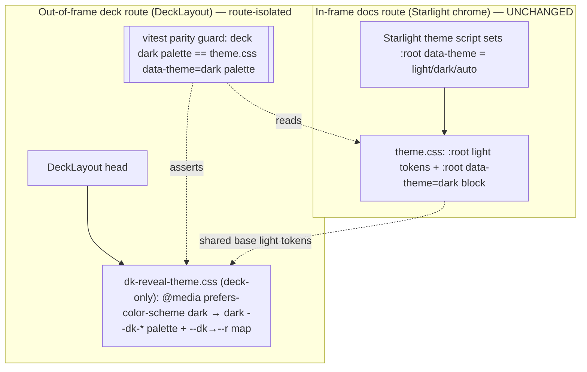

# Implementation Plan: Deck & Layout Polish

**Branch**: `feat/deck-layout-polish` | **Date**: 2026-09-05 | **Spec**: [spec.md](./spec.md)
**Input**: Feature specification from `kitty-specs/deck-layout-polish-01M1R1EB/spec.md` (committed babe577)

## Summary

Remediate three confirmed docsite-review defects, each verified with a browser pixel
pass:

- **#65** — give the out-of-frame reveal deck a real light/dark theme mechanism that
  follows the viewer's `prefers-color-scheme`, implemented in the **route-isolated deck
  sheet** so it is separable from the Starlight chrome; and replace the demo slide's
  hardcoded `data-background-color="#101828"` with a theme-flipping brand surface token
  so it is legible in both schemes.
- **#66** — reshape the synthesized title slide to `h1 + hero` only, move the intro
  paragraph (search sentinel) + first Mermaid diagram to their own following slide, cap
  slide content in **stage units** (not `vh`), and add an up/down affordance that appears
  only when the active slide belongs to a vertical stack.
- **#67** — cap and center Starlight's `.main-frame` on wide viewports (≥100rem →
  max-width ≈90rem, centered), keeping the reading measure unchanged.

## Technical Context

**Language/Version**: TypeScript 5.x + Astro 5.18 (Starlight), reveal.js 6.0.1, Node 24 (repo runs pnpm workspace); CSS (design tokens).
**Primary Dependencies**: `@astrojs/starlight`, `reveal.js` (+ Notes plugin), `mermaid` (client render), Playwright + axe (a11y/pixel gates). No new runtime dependencies added.
**Storage**: N/A (static SSG docsite).
**Testing**: vitest unit (`src/tests/*`), `astro check` typecheck, Playwright a11y/axe (`test:a11y`), build-artifact/link/markua asserts, and a mission-required Playwright pixel pass (chromium) at 1600/1920/2560 + deck slides + both colour schemes.
**Target Platform**: Static site (GitHub Pages, base `/doc-kitty`), modern browsers.
**Project Type**: Single toolkit package (`src/`) + example site (`example/`).
**Performance Goals**: No runtime perf change; theme decision must not add a visible flash of the wrong scheme on the deck (set before first paint).
**Constraints**: WCAG 2.2 AA (≥4.5:1 body text) on the demo slide in both schemes; deck theme route-isolated (no shared `theme.css`/chrome change); in-frame Starlight Light/Dark/Auto unchanged; reuse existing `--dk-*` dark catalog (parity-guarded, no forked colour source); dated changelog fragment under `docs/changelog/`.
**Scale/Scope**: 3 defects, ~6 source files + 1 example content file + 1 changelog fragment + tests. No API/schema surface.

## Charter Check

*GATE: Must pass before Phase 0 research. Re-check after Phase 1 design.*

Charter mode `compact`; governance template `software-dev-default`. Relevant directives
honored:

- **DISCIPLINED_REFACTORING / RECONCILE_CHANGE_SCOPE_TENSIONS**: the C-001 (route-isolated
  deck theme) vs C-003 (single-source dark tokens) tension is reconciled explicitly in
  research.md via a **parity-guard test** (house pattern, mirrors the existing mjs/ts twin
  parity) rather than an unexamined duplication.
- **DIRECTIVE_051 supply-chain**: **no dependency added, upgraded, or removed** — the
  supply-chain gate is N/A for this mission (recorded, not skipped silently).
- **Authority paths / terminology** (`docs/context/`): no new domain terms introduced;
  "deck", "stage", "chrome", "frame" used per existing usage.
- **USE_C4_MODEL / show-me**: a small container-level diagram of the deck theme seam is
  included below (the only non-trivial new boundary).

No charter violations → Complexity Tracking is empty.

## Deck theme seam (container view)



## Project Structure

### Documentation (this mission)

```
kitty-specs/deck-layout-polish-01M1R1EB/
├── plan.md              # This file
├── research.md          # Phase 0 — design decisions & the C-001/C-003 reconciliation
├── quickstart.md        # Phase 1 — the pixel-pass + gate verification runbook
├── contracts/
│   ├── deck-theme.md         # deck colour-scheme behavior contract
│   └── stack-affordance.md   # vertical-stack up/down affordance contract
└── tasks/               # /spec-kitty.tasks output (NOT created here)
```

(No `data-model.md`: this mission introduces no data entities.)

### Source Code (repository root)

```
src/
├── styles/
│   ├── dk-reveal-theme.css        # #65: add @media prefers-color-scheme dark (deck-only); #66: stage-unit content cap; affordance button styles
│   └── theme.css                  # #67: wide-frame cap lives in a BASE sheet so it survives brand swaps (see research); NO deck-theme change here (C-001)
├── layouts/
│   └── DeckLayout.astro           # #66: add up/down affordance buttons markup
├── lib/deck/
│   └── reveal-init.client.ts      # #66: expose availableRoutes()/stack state via DeckController; wire up/down + visibility
├── tests/
│   ├── deck-theme-parity.test.ts  # #65: parity guard (deck dark palette == theme.css dark) + no raw hex on demo slide
│   └── (existing deck/theme tests extended as needed)
example/
└── docs/presentations/showcase-deck.md   # #66: insert a ## heading to move intro+diagram off the title slide; #65: demo bg → theme token
docs/
└── changelog/2026-09-05-deck-layout-polish.md   # C-006 dated fragment
```

**Structure Decision**: Single toolkit package. All deck-theme work is confined to the
route-isolated deck surfaces (`dk-reveal-theme.css`, `DeckLayout.astro`,
`reveal-init.client.ts`) per C-001; the wide-frame cap is the only in-frame/chrome change
and lands in a **base** global sheet (not `brand-components.css`) so it survives brand
swaps — see research.md (deviation from the issue's suggested location, justified).

## Complexity Tracking

*No charter violations — none.*

## Implementation Concern Map

> Concerns, not work packages. `/spec-kitty.tasks` maps these to WPs.

### IC-01 — Deck colour-scheme theme mechanism (route-isolated)

- **Purpose**: Make the out-of-frame deck present in the viewer's preferred light/dark
  scheme, reusing the existing `--dk-*` dark catalog, without touching shared chrome.
- **Relevant requirements**: FR-001, FR-002; C-001, C-002, C-003; NFR-001 (partial).
- **Affected surfaces**: `src/styles/dk-reveal-theme.css` (add `@media (prefers-color-scheme: dark)` dark palette + keep the `--dk→--r` map resolving); `src/tests/deck-theme-parity.test.ts` (new parity guard).
- **Sequencing/depends-on**: none (foundational for IC-02's demo slide).
- **Risks**: dark-value duplication drift (mitigated by parity guard); must NOT leak into in-frame pages (guaranteed by route-import isolation — the sheet is linked only by DeckLayout); a11y/pixel gates may run under a colour-scheme — confirm the gates' scheme assumption doesn't flip unexpectedly.

### IC-02 — Legible demo background slide

- **Purpose**: Replace the hardcoded navy `data-background-color` with a theme-flipping
  brand surface token so the demo slide is legible in both schemes while still
  demonstrating a real `.slide` background directive.
- **Relevant requirements**: FR-003; C-004; NFR-001.
- **Affected surfaces**: `example/docs/presentations/showcase-deck.md:36`; possibly a fallback rule in `dk-reveal-theme.css` if reveal's inline `var()` application proves unreliable.
- **Sequencing/depends-on**: IC-01 (the token only flips once the deck is theme-aware).
- **Risks**: reveal applies `data-background-color` as an inline style — confirm a `var(--dk-color-*)` value resolves when set that way; if not, fall back to a `.slide` class + deck-sheet rule.

### IC-03 — Title-slide reshape + stage-bounded content + stack affordance

- **Purpose**: Stop the title slide overflowing and give vertical stacks a visible cue.
- **Relevant requirements**: FR-004, FR-005, FR-006, FR-008; NFR-002.
- **Affected surfaces**: `example/docs/presentations/showcase-deck.md` (insert a `##` heading before the intro paragraph so intro+first diagram form their own slide — title becomes `h1 + hero`); `src/styles/dk-reveal-theme.css` (replace `max-block-size:65vh` on `section img` with a stage-relative cap; affordance button CSS); `src/layouts/DeckLayout.astro` (up/down button markup in `.dk-deck-controls`); `src/lib/deck/reveal-init.client.ts` (extend `DeckController` with stack/route awareness via reveal `availableRoutes()`, wire up/down, toggle visibility on `slidechanged` + initial slide).
- **Sequencing/depends-on**: none (independent of IC-01/02); content edit + CSS + client wiring.
- **Risks**: stage-unit cap must not clip legit diagrams or reintroduce a scroll region; affordance must not break the existing AX-2 labelled-controls a11y contract or the `slidechanged` diagram-render ordering (NFR-004); keep the Pagefind sentinel on a published slide (FR-008).

### IC-04 — Wide-screen frame cap

- **Purpose**: Cap + center the reading frame on wide viewports so content isn't marooned.
- **Relevant requirements**: FR-007; C-005, C-007; NFR-003.
- **Affected surfaces**: a base global sheet (`src/styles/theme.css` or `src/styles/dk-components.css`) — `@media (min-width:100rem){ .main-frame{ max-width:90rem; margin-inline:auto } }` targeting the verified Starlight `.main-frame` class; confirm header alignment.
- **Sequencing/depends-on**: none.
- **Risks**: `.main-frame` contains both the left sidebar-pane and main-pane — centering the whole band is intended; verify the fixed top header stays aligned with the centered band (add a matching cap to the header content if needed); ensure below-breakpoint layout is byte-unchanged.

### IC-05 — Persona (stakeholder profile) layout polish

- **Purpose**: Make a `kind: Persona` page render ONE coherent identity (the passport)
  instead of a broken full-bleed hero + duplicated name/metadata + two `<h1>`s.
- **Relevant requirements**: FR-009, FR-010, FR-011; C-008; NFR-006.
- **Affected surfaces**: `src/components/PageTitle.astro` (gate on `kind === 'Persona'` to
  suppress `dk:page-hero`, Starlight's default `<h1>`, and `dk:metadata-band` — all other
  kinds byte-identical); `src/layouts/Persona.astro` (passport `<h1>` carries `id="_top"` so
  it is the page's sole h1 + skip/back-to-top target; keep `.dk-passport` + fields).
- **Sequencing/depends-on**: none (independent of IC-01…IC-04; distinct files).
- **Risks**: must not change the header of non-Persona kinds (gate precisely); the double-h1
  fix must keep a valid `id="_top"` target; preserve the `.dk-passport` WP08 branded-build
  proof; verify a11y (single h1) and both themes in the pixel pass.

## D-08 — Persona polish approach (scope addition, 2026-09-05)

**Decision**: The passport becomes the SOLE identity header for `kind: Persona`. In
`PageTitle.astro`, gate strictly on `kind === 'Persona'` to skip the page-hero slot,
Starlight's default `<h1>`, and the metadata band; every other kind renders byte-identical.
In `Persona.astro`, the passport supplies the page's single `<h1>` with `id="_top"` (the
skip-link / back-to-top target Starlight's title normally provides). The `.dk-passport`
marker and its field rows stay (WP08 proof). **Governance note**: the `decision open` CLI
returned MISSION_NOT_FOUND after finalize-tasks (it resolves the feature_dir to the
coordination worktree, which does not carry `meta.json`); this decision is therefore
recorded here in the plan rather than via a decision-moment artifact. Rationale is the
layout's own documented intent (Persona.astro header: "the passport IS the identity") and
the pixel-confirmed triple-identity defect.

## Post-design Charter Re-check

Re-evaluated after the design above: no new violations. The single cross-cutting risk
(the C-001/C-003 tension) is resolved by the parity-guard decision in research.md;
supply-chain remains N/A (no dependency change).
