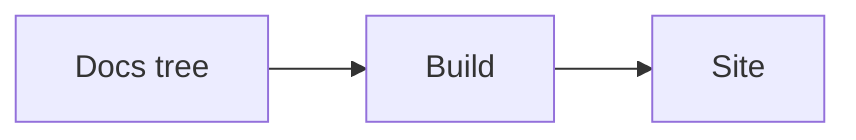

# Quickstart: authoring a diagram

A diagram is a **fenced code block**. Write ` ```mermaid `, and it renders in the browser as
a themed, accessible figure — on documentation pages and slide decks alike.

## Enable diagrams (site setup, once)

```js
// astro.config.mjs
integrations: defineDocKittyIntegrations({ theme: myTheme, diagrams: true }),
```

Diagrams are **opt-in**: with `diagrams: true` the toolkit wires Mermaid (before Starlight)
and the metadata transform. Leave it off and your site pays no diagram cost.

## A minimal diagram

````markdown

````

Renders as a flowchart, themed by the site's `--dk-diagram-*` colours (light and dark).

## Add non-technical metadata (recommended)

Put a small block at the top of the diagram, in Mermaid's own `%%` comment syntax, using
plain-language fields — **`title`**, **`description`**, **`attribution`**, **`source`** (all
optional):

````markdown

````

- `description` becomes the figure's **caption** and the diagram's **accessible description**.
- `title` (or `description` if you omit `title`) becomes the diagram's **accessible name** —
  what a screen reader announces first. Always provide at least a `description`.
- `attribution` becomes a credit line; if `source` is present it links there.
- A typo in a field (`%% descriptn:`) is harmless — it stays an ordinary comment and the
  diagram still renders.
- Do **not** use the `%%{ … }%%` form for metadata — that is Mermaid's reserved init
  directive.

## In a slide deck

The same ` ```mermaid ` block works inside a `kind: Presentation` deck. Put a diagram on the
**first slide** of a deck (later slides are hidden until you navigate, and a hidden diagram
can't size itself).

## What you get

- A themed, accessible diagram figure with a caption, on any page or deck.
- With JavaScript off: the raw diagram source and the caption (the meaning is preserved).
- The diagram JavaScript loads **only** on pages that actually have a diagram.

## Good to know

- Guaranteed-accessible diagram types in v1: **flowchart, sequence, class**.
- Self-contained: Mermaid is bundled, no CDN, no external service. (A build-time static-SVG
  render — for zero runtime JS — and PlantUML are a tracked follow-up, issue #13.)
