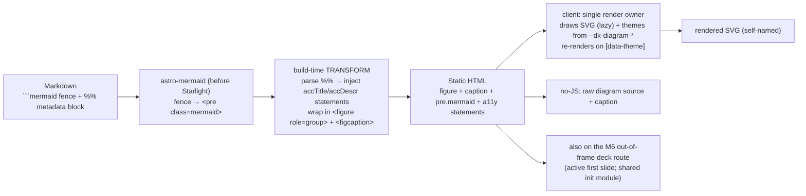

# Mission Specification: Diagrams (Mermaid)

**Mission Branch**: `feat/diagrams`
**Created**: 2026-08-25
**Status**: Draft (rev 2 — post-spec squad folded)
**Input**: Mission M5 — author diagrams as `` ```mermaid `` fenced code blocks; render **client-side** (astro-mermaid + mermaid, self-hosted, no CDN, no build-time headless browser); a leading `%% key: value` metadata block (title/description/attribution/source) is parsed at build into an accessible **diagram figure** and injected as Mermaid `accTitle`/`accDescr` **accessibility statements** so the rendered SVG names itself; theme via `--dk-diagram-*` tokens; opt-in preset packaging; render on doc pages **and** slide decks. Keep the M0 `ci-ok` pipeline (four lanes) green.

## Overview

doc-kitty renders a repository's `docs/` tree as a human-first, agent-supported
site, and **diagrams are a high-value content type for technical docs**. M2 already
shipped the brand's `--dk-diagram-*` colour tokens as an **orphan asset** ("ready for
the surface that lands later" — `src/themes/spec-kitty/assets/diagram-tokens.css`,
imported nowhere), and an inert `` ```mermaid `` fence already sits in the example tree
— but **nothing renders a diagram today**: there is no `mermaid` dependency, no
integration, no metadata convention, no theming wired anywhere, and no a11y coverage.
**M5 builds that surface.**

An author writes a diagram as ordinary Markdown — a fenced `` ```mermaid `` block — and
it renders in the browser as a **brand-themed, accessible diagram figure** with a
caption. There is no new authoring DSL: diagrams are code fences, portable and readable
on the repository host. Concretely, five capabilities land together:

- **Rendering** — the `astro-mermaid` integration (self-hosted `mermaid`, **no CDN**)
  turns each `` ```mermaid `` fence into a `<pre class="mermaid">` that renders to an SVG
  in the browser on load; the `mermaid` library chunk is loaded **only** on pages that
  contain a diagram. Exactly **one render loop** touches any `pre.mermaid` (ADR-0023).
- **Accessible metadata** — a leading block written in Mermaid's **own `%%` comment
  syntax** (`%% description: …`) carries four pre-defined, **non-technical** fields
  (`title`, `description`, `attribution`, `source`). A build-time **transform** parses
  it, injects Mermaid `accTitle`/`accDescr` **accessibility statements** so the
  **rendered SVG names itself** (passing the a11y gate with no runtime code of ours), and
  wraps the diagram in a `<figure role="group">` + `<figcaption>`.
- **Theming** — the `--dk-diagram-*` tokens are promoted into the **Default** catalog
  (with light-mode values added) **and** wired into the **brand** layer (retiring the
  orphan), so both a vanilla and a branded site are themed; a single render owner maps the
  tokens to Mermaid's `themeVariables` and re-themes on a light/dark toggle.
- **Graceful degradation** — with JavaScript off, the page shows the raw **diagram
  source** plus the visible caption; the meaning is never lost.
- **Everywhere** — diagrams render on documentation pages **and** inside the M6
  out-of-frame slide decks, closing the "diagrams-in-slides" gap M6 deferred (C-008).

The design is grounded in
[findings-D](../../research/2026-08-21-astro-feature-discovery/findings-D-contextive-diagrams.md)
(topic 4) and [`docs/plans/features/diagrams.md`](../../docs/plans/features/diagrams.md);
the genuinely new **seams** — the render-ownership + plugin-ordering + deck-script decision
(ADR-0023) and the token-promotion + brand-wiring decision (ADR-0024) — are authored in the
**plan phase before implementation** (C-001, mirroring M6). Two capabilities are
**explicitly deferred** to a tracked follow-up (**issue #13**, "Enhanced diagram support"):
the **build-time render** (static-SVG, zero-runtime-JS, full no-JS rendering, via a
Playwright/Chromium render) and **PlantUML** (no JS renderer; needs a self-hosted render
workflow). M5 is the **client-side, accessible, themed** first slice.



### The accessible-name trick is the load-bearing idea — and its fallback

A rendered SVG with no accessible **name** is an unlabeled graphic. Mermaid does not add
one on its own. The mission's mechanism: the build-time transform reads the author's
`%% title:`/`%% description:` and **injects Mermaid's native `accTitle`/`accDescr`
accessibility statements** into the diagram source (immediately after the *diagram-type
declaration* line — not blindly "line 1", which may be an init directive or YAML
frontmatter). Mermaid then emits `<title>`/`<desc>` with `aria-labelledby`/
`aria-describedby` on the `<svg>`. **`accTitle` supplies the accessible name; `accDescr`
supplies the description.** Because `title` is optional and `description` is the primary
field, the transform **derives `accTitle` from `title`, falling back to `description`
when `title` is absent**, so the accessible **name** is set whenever *any* metadata
exists (a description-only diagram must not be nameless — R-01). The same metadata drives
the visible `<figcaption>` and the no-JS caption. The `%% key: value` form is a real
Mermaid comment (stripped by the parser), so a mistyped or un-parsed field never breaks
the diagram; the only reserved form is the `%%{ … }%%` init **directive**, which the
metadata block must never use.

Because axe's `svg-img-alt` rule may not even fire on Mermaid's emitted role (A-06), the
a11y gate does **not** rely on axe to enforce the name: a **direct accessible-name
assertion** (querying the rendered SVG's accessible name) is the primary check, with axe
secondary. And diagram-internal **contrast** (SVG `<text>` on node fill, edges, subgraph
titles) is verified by a **vitest computing the WCAG ratio from the `--dk-diagram-*` hex
pairs** in both modes — axe does not evaluate SVG contrast (R-02).

### Layered landing (decomposition guidance for plan/tasks)

The user stories are **not** the work-package boundaries. Two seam decisions are authored
in **plan** (ADR-0023 render-ownership + plugin-ordering + deck-script; ADR-0024
token-promotion + brand-wiring + orphan retirement) so nothing load-bearing is decided
silently (C-001). The critical path, adopting the squad's 7-WP shape:

1. **Foundation** — pinned deps (verify the astro-mermaid↔mermaid peer range), the opt-in
   preset (`mermaid()` before Starlight; `securityLevel: 'strict'`), the rehype
   registration point, and the `--dk-diagram-*` **token promotion**: into the Default
   catalog (light **and** dark) **and** the brand `tokens.css`, retiring the orphan, with
   the catalog/CSS-signature build assertion co-updated **and a vitest proving the promoted
   token pairs meet AA in both modes** (the value is proven where it is authored, not two
   groups later). The example stays `diagrams: false`.
2. **Transform** — the pure `%%` parse + `accTitle`/`accDescr` injection (at the
   type-declaration line) + `<figure>` emission, with its Astro-free vitest; **flip the
   example `diagrams: true` here**, co-landed with the transform, so the pre-existing
   `overview.md` fence is rendered already-wrapped and already-named (never an unlabeled
   graphic in a foundation→transform window).
3. **Theme hook (doc surface)** — the single-render-owner theming: token→`themeVariables`
   + re-render on `[data-theme]` (ADR-0023's render owner).
4. **Doc demonstrator + assertions + pins** — publish `architecture/diagram-demonstrator.md`
   (all four fields, plus a **title-absent** diagram for the fallback); the build/chrome
   assertions (figure, injected statements, no-JS source+caption, pinned-version
   golden-file, no-external-request) + the count-pin re-pin. **a11y still green (the page is
   not yet scanned).**
5. **Doc a11y** — add the demonstrator to `ROUTES`/`AXE_PAGES` **with the render-gate +
   direct accessible-name/figure assertion** (a change to the axe-harness *flow*, not just
   `routes.ts`), axe both modes, and the `[data-theme]` toggle re-render check.
6. **Deck diagram (separable)** — the deck-script path from ADR-0023 (a shared exported
   init module, or auto-injection), a fence on the showcase deck's **active first slide**,
   the deck smoke test, and **the showcase-deck axe entry's render-wait updated atomically**
   (the fence otherwise reds the already-scanned deck route). Runs ‖ WP04/05; a deck
   failure does not block the doc-page core.
7. **Docs of record** — feature page + diagrams architecture doc (the two ADRs already
   authored in plan).

Critical path: **plan ADRs → foundation → transform ‖ theme → doc demo/pins → doc a11y ‖
deck ‖ docs.**

## User Scenarios & Testing *(mandatory)*

### User Story 1 - An author writes a Mermaid diagram and it renders as a themed figure (Priority: P1)

An author writes a `` ```mermaid `` fenced code block in a Markdown page. On the built
site the block renders (in the browser) as a Mermaid diagram wrapped in a figure, themed
to the active brand — no CDN, no external service, no separate diagram file.

**Why this priority**: This is the mission — Markdown-authored diagrams rendered on the
site. It is the narrowest slice that delivers the core value.

**Independent Test**: Build the example and serve it in the Playwright lane; assert a page
with a `` ```mermaid `` fence emits a `<pre class="mermaid">` carrying the diagram source,
that a rendered `<svg>` appears inside the figure on load, and — capturing **network
requests** — that a page **with** a diagram requests the `mermaid` library chunk while a
diagram-free control route does **not**.

**Acceptance Scenarios**:

1. **Given** a page with a `` ```mermaid `` flowchart, **When** it builds, **Then** the
   static HTML contains `<pre class="mermaid">` with the diagram source as its text, and
   Expressive Code does **not** syntax-highlight the fence (mermaid claimed it first).
2. **Given** that page loaded with JavaScript, **When** it renders, **Then** the single
   render owner replaces the `<pre>` content with a rendered `<svg>`.
3. **Given** a page with **no** `` ```mermaid `` fence, **When** it loads (Playwright
   network capture), **Then** the `mermaid` **library** chunk is **not** requested — only
   the tiny per-page loader shim, if any (the library is loaded lazily, diagram pages only).
4. **Given** the toolkit preset, **When** a consumer calls `defineDocKittyIntegrations({
   diagrams: false })`, **Then** `mermaid()` is **absent** from the returned integrations
   array (a pure unit test), and `{ diagrams: true }` prepends it **before** `starlight()`.

### User Story 2 - The diagram is accessible and degrades without JavaScript (Priority: P1)

A screen-reader user reaches a page with a diagram and hears a meaningful name and
description. A visitor with JavaScript disabled still gets the meaning — the raw source
and the caption. The diagram clears the accessibility gate in both light and dark.

**Why this priority**: Accessibility is a hard `ci-ok` gate, and a rendered SVG is an
unlabeled graphic by default. The no-JS fallback is the honest degradation story for
client-side rendering.

**Independent Test**: In the a11y lane (Playwright, JS-enabled, both modes), after a
**render-gate** waits for `figure svg[aria-labelledby]` (and asserts `pre.mermaid` no
longer holds the raw source), assert a **direct** non-empty accessible name on the SVG and
zero serious/critical axe violations on the surrounding HTML; verify diagram-internal
contrast in a **vitest** from the `--dk-diagram-*` pairs (both modes); and assert the raw
diagram source + the caption are present in the **built HTML** (the no-JS DOM) in document
order.

**Acceptance Scenarios**:

1. **Given** a diagram with a `%% description:` (with or **without** `%% title:`), **When**
   it renders, **Then** the `<svg>` has a **non-empty accessible name** — from `accTitle`
   when `title` is present, else derived from `description` — plus a description from
   `accDescr`; the direct accessible-name assertion passes in **both** modes.
2. **Given** the figure, **When** its structure is checked, **Then** it is a `<figure
   role="group">` containing a visible `<figcaption>`; the inner named SVG is **not**
   `aria-hidden`.
3. **Given** the page's **built HTML** (the no-JS DOM), **When** it is inspected, **Then**
   the raw `` ```mermaid `` source **and** the `<figcaption>` (description + attribution)
   are present in document order — the meaning is not lost without JavaScript.
4. **Given** a static flowchart (no author-added links), **When** accessibility is checked,
   **Then** the diagram introduces no focusable elements and no keyboard trap.
5. **Given** the `--dk-diagram-*` colour pairs (node text on node fill; edge / subgraph
   title against cluster fill), **When** contrast is computed in a vitest, **Then** each
   pair meets WCAG 2.2 AA (size-aware) in **both** light and dark.

### User Story 3 - An author annotates the diagram with non-technical metadata (Priority: P2)

An author adds a small metadata block at the top of the diagram, in Mermaid's `%%` comment
syntax, using plain-language fields — `title`, `description`, `attribution`, `source`.
These become the caption, the accessible name/description, and a credit line. A typo never
breaks the diagram.

**Why this priority**: The metadata is what makes a diagram accessible (US2) and credited,
but a diagram renders without any of it, so it rides just behind the core.

**Independent Test**: Build a diagram with all four fields; assert the `<figcaption>` shows
the `description` and the `attribution` (with `source` as a link when present), the SVG's
accessible name/description derive from `title`/`description` (with the description
fallback), and a diagram whose metadata line is mistyped (`%% descriptn:`) still renders
(the unknown key stays a comment).

**Acceptance Scenarios**:

1. **Given** a leading block of `%% title:` / `%% description:` / `%% attribution:` /
   `%% source:`, **When** it builds, **Then** the four fields are parsed, the metadata lines
   are removed from the rendered source, and `accTitle`/`accDescr` are injected after the
   **diagram-type declaration** line (skipping any leading init directive / frontmatter).
2. **Given** `description` and `attribution`, **When** the figure renders, **Then** the
   `<figcaption>` shows the description text and an attribution credit line; when `source`
   is present the attribution links to it.
3. **Given** an **unknown** `%% key:` (a typo or an author's own note), **When** it builds,
   **Then** the diagram still renders and the unknown line is left as an ordinary Mermaid
   comment (no error, no field applied); a `%%{ … }%%` init directive is likewise never
   treated as metadata.
4. **Given** a diagram with **no** metadata block, **When** it builds, **Then** it renders
   as a figure with no caption and a generic/absent accessible name — valid, just
   unannotated.

### User Story 4 - Diagrams match the active brand (Priority: P2)

A diagram's colours — node fills, borders, edges, subgraph titles — come from the site's
`--dk-diagram-*` tokens, in both light and dark, on a branded site **and** a vanilla one.
Toggling the theme re-colours the diagram.

**Why this priority**: Diagrams must look like the rest of the site, but a diagram is
legible on Mermaid's defaults before theming, so this rides behind the core.

**Independent Test**: Build the example (Spec Kitty brand) and assert the rendered diagram
uses the **brand** `--dk-diagram-*` values (the motif now lives in `tokens.css`, not the
retired orphan); assert the Default catalog defines `--dk-diagram-*` for a vanilla site in
**both** modes; and (a11y-lane Playwright spec) toggle `[data-theme]` and assert the
single render owner re-renders the diagram with the other mode's colours.

**Acceptance Scenarios**:

1. **Given** the Spec Kitty brand, **When** a diagram renders, **Then** its node fill/
   border/text, edges, subgraph titles, and cluster background derive from the **brand**
   `--dk-diagram-*` values (wired into `tokens.css`) via Mermaid `theme: 'base'` + the
   token→`themeVariables` map — the branded example is brand-themed, not vanilla.
2. **Given** a **vanilla** site (no brand theme), **When** it builds, **Then** the Default
   catalog defines `--dk-diagram-*` (light **and** dark), so diagrams are legibly themed
   without the brand.
3. **Given** a diagram rendered in one mode, **When** the reader toggles `[data-theme]`,
   **Then** the single render owner re-renders it using the other mode's token values (no
   double-render, no flash of the wrong theme).

### User Story 5 - Diagrams render inside slide decks (Priority: P2)

A deck author puts a `` ```mermaid `` block in a `kind: Presentation` deck, and it renders
as a themed, accessible diagram on the out-of-frame reveal deck — the same authoring
experience as a doc page.

**Why this priority**: Decks are a shipped M6 pillar and explicitly deferred diagrams
(C-008); closing that gap makes diagrams a uniform content type. It rides behind the doc-
page core because the deck route bypasses the Starlight frame and needs the render path
resolved (ADR-0023).

**Independent Test**: Build the example with a deck whose **first (active)** slide contains
a `` ```mermaid `` block; assert the deck route emits `<pre class="mermaid">` + the
figure/metadata treatment; assert the mermaid render path reaches the out-of-frame deck
document (per the ADR-0023 decision); and (a11y-lane) that the diagram renders + is themed
on the deck, with the showcase-deck scan's render-wait updated so the existing deck axe
scan stays green.

**Acceptance Scenarios**:

1. **Given** a deck slide with a `` ```mermaid `` block, **When** it builds, **Then** the
   deck route's HTML carries `<pre class="mermaid">` and the `<figure>`/`accTitle`
   treatment (the shared build-time transform runs on deck markdown too).
2. **Given** the out-of-frame deck document, **When** it renders, **Then** the mermaid
   render path reaches it (a shared exported init module, or auto-injection — the ADR-0023
   decision), and the `--dk-diagram-*` tokens are already present via DeckLayout's existing
   base-token link (no new deck token wiring).
3. **Given** the deck's **active first slide** diagram loaded with JS, **When** it renders,
   **Then** the mermaid diagram renders inside the slide and is themed by the
   `--dk-diagram-*` tokens (deck smoke test); the showcase-deck axe scan (with its updated
   render-wait) stays green in both modes.

### Edge Cases

- **Metadata uses the reserved init form** (`%%{ … }%%`): not a metadata line — left
  untouched as Mermaid's init directive (C-003). The parser only matches `%% key: value`.
- **Init directive or YAML frontmatter precedes the type declaration**: the `accTitle`/
  `accDescr` injection targets the actual **diagram-type declaration** line, not line 1
  (A-07) — verified by a vitest case.
- **Unknown `%%` key**: left as an ordinary comment; no error, no field applied (US3.3).
- **`title` absent, `description` present**: `accTitle` falls back to `description` so the
  accessible name is non-empty (R-01) — the demonstrator includes this case.
- **No metadata block**: valid — a figure with no caption; the accessible name is
  absent/generic (US3.4).
- **Diagram type without `accTitle` support** (e.g. mindmap): out of the a11y-guaranteed
  set for v1; the tested/guaranteed types are flowchart/sequence/class (FR-013).
- **A `` ```mermaid `` fence on a non-example doc page** (`docs/**`): `docs/**` triggers
  doc-sanity only (never build-example), so those fences are not rendered or gated — only
  `example/docs/**` diagrams are built and asserted.
- **Deck later slides are `display:none`**: reveal hides non-active slides, and mermaid
  cannot size a hidden container (and axe skips aria-hidden slides) — the deck demonstrator
  diagram is on the **active first slide** (A-04).
- **JavaScript disabled**: raw diagram source + caption (US2.3); a fully-rendered no-JS SVG
  is the deferred **build-time render** (#13), not this mission.
- **CSP**: Mermaid injects inline `<style>` into the SVG, so a consumer's CSP must allow
  `style-src 'unsafe-inline'`; `script-src 'self'` suffices (bundled, no CDN, no eval).
  doc-kitty ships no CSP today, so nothing here conflicts — documented as a consumer note.
- **Mermaid version bump**: the SVG DOM/aria output is the assertion surface, so `mermaid`
  and `astro-mermaid` are pinned exactly and treated as a golden-file dependency (NFR-004).

## Requirements *(mandatory)*

### Functional Requirements

| ID | Title | User Story | Priority | Status |
|----|-------|------------|----------|--------|
| FR-001 | Opt-in mermaid integration, before Starlight | As the toolkit, I want `defineDocKittyIntegrations({ diagrams: true })` to prepend `mermaid()` (astro-mermaid) **before** `starlight()` only when enabled — pinning `astro-mermaid@2.1.0` + `mermaid@11.17.1` (verify the astro-mermaid↔mermaid peer range admits the pin; no Playwright pulled transitively), self-hosted/bundled (**no CDN**), `securityLevel: 'strict'` — with a **unit test** that `{ diagrams: false }` omits `mermaid()` and `{ diagrams: true }` prepends it before `starlight()`. | High | Open |
| FR-002 | `` ```mermaid `` → client-rendered figure, single render owner | As an author, I want a `` ```mermaid `` fence turned into a `<pre class="mermaid">` (source preserved) that a **single render owner** draws to `<svg>` on load, coexisting with Expressive Code (which never sees the fence); the `mermaid` **library** chunk is loaded only on pages that contain a diagram; **exactly one render loop** touches any `pre.mermaid` (ADR-0023 — astro-mermaid `autoTheme` disabled). | High | Open |
| FR-003 | `%%` metadata parse (4 non-technical fields) | As an author, I want a leading `%% key: value` block (Mermaid-comment syntax) parsed at build for the closed field set **`title`, `description`, `attribution`, `source`** (all optional); the matched lines are stripped from the rendered source; an unknown `%%` key is left as a comment; the reserved `%%{ … }%%` init directive is never treated as metadata. The parse runs as a **remark plugin before astro-mermaid**, handing caption data forward via `file.data` (the ordering fallback ADR-0023 adopts unless astro-mermaid's fence transform is proven remark-staged, making a rehype-after plugin safe). | High | Open |
| FR-004 | Inject `accTitle`/`accDescr` (self-naming SVG), name from title-or-description | As a screen-reader user, I want `accTitle`/`accDescr` **accessibility statements** injected **after the diagram-type declaration line** (skipping any leading init directive / frontmatter): `accTitle` (→ accessible **name**) from `title`, **falling back to `description`** when `title` is absent, and `accDescr` (→ accessible **description**) from `description` — so the rendered SVG names itself whenever any metadata exists, with no runtime code of ours. | High | Open |
| FR-005 | Accessible `<figure>` wrapper | As a reader, I want the diagram wrapped in a `<figure role="group">` with a visible `<figcaption>` (the `description`, plus an `attribution` credit line linking to `source` when present), mirroring the `PageHero` figure idiom; the figure sits inside the searchable content region; the inner named SVG is **not** `aria-hidden`. | High | Open |
| FR-006 | Promote `--dk-diagram-*` to Default (light+dark) AND the brand layer; retire the orphan | As the toolkit, I want the `--dk-diagram-*` tokens added to the **Default** catalog (`DEFAULT_BASE`/`DEFAULT_DARK`, `theme.css` `:root`/`:root[data-theme=dark]`, and `emitTokenSheet`'s mode-varying set) with **light-mode values** added, **and** wired into the **brand** `tokens.css` (so the branded example/deck are brand-themed via `resolveTheme` + the deck's existing base-token link), **retiring the orphan `diagram-tokens.css`** (single source of truth); the catalog/CSS-signature build assertion is co-updated and a **vitest proves the token pairs meet AA in both modes**. | High | Open |
| FR-007 | Token → Mermaid theme, single-owner re-render on toggle | As the toolkit, I want Mermaid configured `theme: 'base'` with the **single render owner** reading `--dk-diagram-*` off `:root` into `themeVariables` (the documented token→variable map) and re-rendering on a `[data-theme]` change — so a diagram matches the active brand and follows the toggle with no double-render or wrong-theme flash. | Medium | Open |
| FR-008 | No-JS fallback = diagram source + caption | As a visitor without JavaScript, I want the built HTML (the no-JS DOM) to contain the raw `` ```mermaid `` source **and** the `<figcaption>` (description + attribution) in document order, so the meaning is never lost; full static-SVG no-JS rendering is deferred to #13. | High | Open |
| FR-009 | Diagrams inside slide decks (render path + active first slide) | As a deck author, I want a `` ```mermaid `` block in a `kind: Presentation` deck to render as a themed, accessible diagram on the out-of-frame deck route: the shared build-time transform runs on deck markdown, and the mermaid **render path reaches DeckLayout** per ADR-0023 (a shared exported init module, or auto-injection — decided, not assumed; the `--dk-diagram-*` tokens already ride DeckLayout's existing base-token link, so **no new deck token wiring**); the deck demonstrator diagram is on the **active first slide**; a deck smoke test verifies render + theming (closes M6 C-008). | Medium | Open |
| FR-010 | Example demonstrator page(s) | As CI and as a showcase, I want a dedicated `example/docs/architecture/diagram-demonstrator.md` (mirroring `blocks-demonstrator`) with an all-four-fields diagram **and a title-absent diagram** (exercising the `accTitle`→`description` fallback), plus a diagram on the example deck's active first slide, so the whole pipeline (render, metadata, figure, theming, a11y name incl. fallback, no-JS) is exercised end-to-end. | High | Open |
| FR-011 | a11y gate: render-gate + direct name/figure assertion (harness flow change) | As CI, I want the demonstrator route added to `tests/a11y/routes.ts` (`ROUTES` + `AXE_PAGES`) **and** the axe-harness **flow** changed (in `axe.spec.ts`, per shell): a real render-gate (`await expect(locator('figure svg[aria-labelledby]')).toBeVisible()` + assert `pre.mermaid` no longer holds the raw source) **before** `analyze()`, plus a **direct** non-empty-accessible-name and `<figure role="group">`/`<figcaption>` assertion (axe alone won't check them, and `svg-img-alt` may not fire — A-06). Runs in **both** modes. | High | Open |
| FR-012 | Build assertions: footprint (Playwright), figure, no-JS, determinism, pins | As CI, I want: the **footprint** asserted in the **Playwright lane** via network capture (a diagram page requests the `mermaid` library chunk; a diagram-free control route does not — after a spike confirms astro-mermaid code-splits the library); `assert-*-artifacts.mjs` asserting the demonstrator emits `<figure>` + `<pre class="mermaid">` + the injected `accTitle`/`accDescr`, the no-JS source+caption, and the pinned `astro-mermaid`/`mermaid` versions + no external runtime request; and `EXPECTED_INDEX_ENTRY_COUNT`/`EXPECTED_SITEMAP_URL_COUNT` **re-pinned** (the demonstrator is a new published page) — cross-checked against any published route the example deck adds. | High | Open |
| FR-013 | Pure, unit-tested metadata transform (incl. placement cases) | As a maintainer, I want the transform's pure pieces — the `%%` field parse, the `accTitle`/`accDescr` injection with the `title`→`description` fallback, the injection-placement logic (locate the diagram-type declaration; a **leading `%%{ init }%%`** case; a **frontmatter-first** case), and the `<figure>` emission — as **Astro-free** vitest across the enumerated cases and the guaranteed diagram types (flowchart / sequence / class), independent of the Playwright lane. | High | Open |
| FR-014 | Self-contained; strict; CSP note (clauses homed) | As the toolkit, I want no CDN or external runtime request (mermaid bundled — asserted in the build WP), Mermaid `securityLevel: 'strict'` (set in foundation), and the `style-src 'unsafe-inline'` CSP requirement documented for consumers (in the docs WP; doc-kitty ships no CSP today, so nothing conflicts — noted in ADR-0023 for a future CSP). | Medium | Open |
| FR-015 | Docs of record + plan-phase ADRs | As a maintainer, I want **ADR-0023** (client-side render **ownership**, the `%%`→accessible-figure seam incl. the `accTitle`/`accDescr` mechanism + name fallback + injection placement, the **plugin-ordering contract + fallback**, and the **deck render-path**) and **ADR-0024** (token promotion to Default + **brand-layer wiring** + orphan retirement) authored in the **plan phase before implementation**; and `docs/plans/features/diagrams.md` + a diagrams **architecture doc** updated (client-side v1 + the #13 deferrals) in the final docs WP. | Medium | Open |

### Non-Functional Requirements

| ID | Title | Requirement | Category | Priority | Status |
|----|-------|-------------|----------|----------|--------|
| NFR-001 | Accessibility AA (direct name + figcaption axe + vitest contrast) | The demonstrator (and the deck diagram) clear the `a11y` lane in **both** modes: after the render-gate, a **direct** non-empty accessible name on the rendered SVG (from `accTitle`, or `description` fallback), a `<figure role="group">` + `<figcaption>` (asserted directly), zero serious/critical axe violations on the surrounding HTML, no diagram-introduced focusable element / no trap; diagram-internal `--dk-diagram-*` contrast (≥4.5:1 / ≥3:1 size-aware) is proven by a **vitest** on the token pairs in both modes (axe does not evaluate SVG contrast). | Accessibility | High | Open |
| NFR-002 | `ci-ok` stays green | All four lanes pass: `code-quality` (typecheck + lint + vitest), `doc-sanity` (validate:docs/example/links + markdownlint + Vale), `build-example` (`astro build` + `assert:artifacts`), `a11y` (`test:a11y`). Client-side rendering keeps `build-example` **browser-free** (no new build-time headless dependency). | Reliability | High | Open |
| NFR-003 | No-JS fallback completeness | The built HTML (the no-JS DOM) contains the raw diagram source **and** the caption in document order; no diagram content is gated solely behind client rendering beyond the SVG picture itself. | Accessibility | High | Open |
| NFR-004 | Self-contained, no CDN, pinned deps | The only new dependencies are `astro-mermaid@2.1.0` + `mermaid@11.17.1` (self-hosted, Vite-bundled, **no CDN**, no external runtime request, no transitive Playwright in the build graph), pinned exactly and treated as a golden-file dependency (a bump re-verifies the a11y lane); verified by a lockfile/manifest diff. | Portability | High | Open |
| NFR-005 | Pure, unit-tested transform | The metadata parse, `accTitle`/`accDescr` injection (incl. the fallback + placement cases), figure emission, the opt-in-off preset assertion, and the token-contrast check are Astro-free and covered by vitest (FR-013/FR-001/FR-006), independent of the Playwright lane. | Maintainability | High | Open |
| NFR-006 | Footprint — diagram JS only where needed | The `mermaid` **library** chunk is loaded **only** on pages that contain a diagram; verified in the **Playwright lane** by network capture (diagram page vs a diagram-free control route), after a spike confirms astro-mermaid code-splits the library. | Performance | Medium | Open |
| NFR-007 | Single render loop | Exactly one render loop touches any `pre.mermaid` (astro-mermaid `autoTheme` disabled; the render owner from ADR-0023 owns both the initial draw and the `[data-theme]` re-render) — no double-render, no wrong-theme flash; verified by the toggle re-render spec. | Reliability | High | Open |

### Constraints

| ID | Title | Constraint | Category | Priority | Status |
|----|-------|------------|----------|----------|--------|
| C-001 | Settled design authoritative; seam ADRs in plan | Implement to findings-D (topic 4) + the locked decisions; the render-ownership + plugin-ordering + deck-script seam (**ADR-0023**) and the token-promotion + brand-wiring seam (**ADR-0024**) are authored in **plan before implementation**, never silent. | Governance | High | Open |
| C-002 | Client-side render in v1; build-time render + PlantUML deferred | v1 renders Mermaid **client-side**; the **build-time render** (static-SVG, both engines) and **PlantUML** are deferred to issue #13 and NOT built here. This keeps `build-example` browser-free. | Scope | High | Open |
| C-003 | Metadata is `%% key: value`, closed non-technical field set | The metadata block uses Mermaid's `%% key: value` comment form (a space after `%%`, **never** the reserved `%%{ … }%%` init directive); the field set is **closed** to `title`/`description`/`attribution`/`source`, all optional and non-technical (never `alt`); unknown `%%` keys stay comments. | Technical | High | Open |
| C-004 | Opt-in preset packaging, mermaid before Starlight | Diagrams are enabled via `defineDocKittyIntegrations({ diagrams: true })`, which prepends `mermaid()` before `starlight()`; the toolkit owns the ordering; a consumer who leaves it off pays no `mermaid` cost (unit-tested). | Technical | High | Open |
| C-005 | Self-contained, no CDN, sanitized, CSP-noted | No CDN or external runtime request; `mermaid` bundled; `securityLevel: 'strict'`; the `style-src 'unsafe-inline'` CSP requirement is documented for consumers (doc-kitty ships no CSP today; ADR-0023 notes it for any future CSP). | Technical | High | Open |
| C-006 | Accessibility via self-naming SVG; single render owner | The accessible name/description come from the injected `accTitle`/`accDescr` (name from `title`-or-`description`), not a wrapper `role="img"`; the `<figure>` is `role="group"`; the inner named SVG is never `aria-hidden`; exactly one render loop owns the SVG. | Technical | High | Open |
| C-007 | Green-at-every-boundary | No work-package boundary leaves `doc-sanity`, `build-example`, or `a11y` red. Atomic care points: the example flips `diagrams: true` **in the transform WP** (never rendering an unwrapped/unnamed fence in a foundation window); the demonstrator publishes with a11y still green, then is scanned; the deck fence co-lands with the showcase-deck render-wait update. See the Layered-landing note. | Process | High | Open |
| C-008 | Deferred (out of this mission) | Not built this mission: the **build-time render** (#13), **PlantUML** (#13), **clickable/interactive** diagrams + their keyboard-nav a11y, diagram types beyond the guaranteed flowchart/sequence/class a11y set, and the **glossary/Contextive** feature (M4, which shares findings-D). | Scope | High | Open |
| C-009 | Runtime baseline | Node ≥22, pnpm workspace, Astro 5 / Starlight; direct-render default (ADR-0006); `[data-theme]`-driven dark mode (no `prefers-color-scheme` fallback — the site-wide behavior). | Technical | High | Open |

### Key Entities

- **Diagram**: the umbrella content type — a `` ```mermaid `` fence and everything the build
  makes of it (rendered on doc pages and decks, client-side).
- **Diagram source**: the raw Mermaid text inside the fence (what the no-JS fallback shows).
- **Rendered SVG**: the picture mermaid draws in the browser (v1).
- **Metadata block**: the leading `%% key: value` lines; its **fields** are the closed set
  `title`/`description`/`attribution`/`source` (all optional). Not "frontmatter", not a
  "directive".
- **Diagram figure**: the `<figure role="group">` + `<figcaption>` wrapper the transform
  emits around the `<pre class="mermaid">`; caption from `description`/`attribution`.
- **Accessibility statements (`accTitle`/`accDescr`)**: the two Mermaid a11y lines injected
  from `title`/`description` (name from `title`-or-`description` fallback), which make the
  rendered SVG name itself.
- **Diagram tokens**: `--dk-diagram-*` (node fill/border/text, edge, subgraph-title,
  cluster), promoted to the Default catalog (light + dark) **and** the brand `tokens.css`
  (orphan retired); mapped to Mermaid `themeVariables` by the render owner.
- **Render owner**: the single client loop that draws every `pre.mermaid` and re-themes on
  `[data-theme]` (ADR-0023); shared by the doc and deck surfaces.
- **Preset option**: `defineDocKittyIntegrations({ diagrams: true })` — the opt-in switch
  that wires `astro-mermaid` before Starlight.

## Domain Language *(canonical terms)*

- **diagram** — the umbrella content type: a `` ```mermaid `` fence and everything the
  build makes of it. Use the part-name when only one part is meant; reserve bare "diagram"
  for the umbrella.
- **diagram source** — the raw Mermaid text inside the fence (what the no-JS fallback
  shows). Always "diagram source" / "raw source" — never bare "source", because **`source`**
  is also one of the four metadata fields (an attribution URL); the field is always written
  code-formatted (`source`).
- **rendered SVG** — the picture mermaid draws in the browser (v1). The word for the image
  itself; not "diagram" (the umbrella) and not "figure" (the wrapper).
- **diagram figure** — the `<figure role="group">` + `<figcaption>` wrapper the transform
  emits around the `<pre class="mermaid">`.
- **metadata block** — the leading `%% key: value` lines; its **fields** are the closed set
  `title` / `description` / `attribution` / `source` (all optional). Not "frontmatter" (the
  page's YAML) and not a "directive".
- **directive** — reserved for Mermaid's `%%{ … }%%` init form (e.g. `%%{init: …}%%`) and
  nothing else. The `%% key: value` lines are the **metadata block**; the injected
  `accTitle`/`accDescr` are **accessibility statements** — neither is ever a "directive".
- **accessibility statements (`accTitle`/`accDescr`)** — the two Mermaid a11y lines the
  transform injects after the diagram-type declaration line: `accTitle` supplies the
  **accessible name** (`<title>` + `aria-labelledby`), `accDescr` the **accessible
  description** (`<desc>` + `aria-describedby`). Never "directives", never "alt".
- **accessible name / description** — what a screen reader announces: the **name** from
  `accTitle` (or the `description` fallback), the **description** from `accDescr`.
- **caption** — the visible `<figcaption>` text (from `description`, + `attribution`).
- **build-time transform** — the v1 metadata parse + `accTitle`/`accDescr` injection +
  `<figure>` wrapping that runs at build and **ships in v1**. Distinct from the deferred
  **build-time render** (#13). Never say bare "build-time"; say "transform" or "render".
- **client-side render** — mermaid drawing the rendered SVG in the browser on load (v1).
  The deferred **build-time render** (#13) draws the SVG at build.
- **render owner** — the single client loop that draws every `pre.mermaid` and re-themes on
  `[data-theme]`; exactly one such loop exists (NFR-007).
- **`--dk-diagram-*` / `--dk-*` / `themeVariables`** — three distinct cascades.
  `--dk-diagram-*` are the doc-kitty diagram tokens brands set (a **subset** of the wider
  `--dk-*` catalog); Mermaid's `themeVariables` are the mapping **target**
  (`themeVariables.<x>: var(--dk-diagram-<y>)`). Only `--dk-diagram-*` maps into Mermaid —
  never generic `--dk-*`, never Starlight's `--sl-*`. In prose "theme variables" is the
  config key `themeVariables`.

## Assumptions

- **Client-side rendering in v1**; the build-time render (both engines) and PlantUML are
  deferred to issue #13. No build-time headless browser.
- **Exactly one render owner** touches any `pre.mermaid` (astro-mermaid `autoTheme` off);
  the render/ordering/deck-script seam is decided in ADR-0023 (plan phase).
- **The `%%` field set is closed** to `title`/`description`/`attribution`/`source`; unknown
  keys stay comments; `%%{ }%%` is never metadata.
- **Accessibility is delivered by injecting `accTitle`/`accDescr`**, with the accessible
  name from `title` **or `description`**; the a11y gate asserts the name **directly** (not
  via axe alone) and contrast **via vitest** (not axe); `mermaid` is pinned as a golden-file
  dependency.
- **`--dk-diagram-*` is promoted to the Default catalog (light+dark) AND the brand
  `tokens.css`**, the orphan retired; theming is `theme:'base'` + the render owner's token
  read, re-rendering on `[data-theme]`.
- **Diagrams render on doc pages and decks**; the deck render path is the ADR-0023 decision;
  the deck diagram is on the active first slide; tokens ride DeckLayout's existing base link.
- **Packaging is an opt-in preset option**, unit-tested for the off path.
- **The demonstrator is a dedicated new example page**; the count pins are re-pinned
  atomically, and the guaranteed a11y diagram types are flowchart/sequence/class.

## Success Criteria *(mandatory)*

### Measurable Outcomes

- **SC-001**: A `` ```mermaid `` fence in an example page builds to `<pre class="mermaid">`
  wrapped in a `<figure>`, renders to an `<svg>` client-side, and a diagram-free control
  route never requests the `mermaid` library chunk (Playwright network capture); the opt-in
  **off** path omits `mermaid()` (unit test).
- **SC-002**: A diagram with a `%% description:` (with **or without** `%% title:`) has a
  **non-empty accessible name** on the rendered SVG (asserted directly, both modes), a
  `<figure role="group">` + `<figcaption>`, zero serious/critical axe violations on the
  HTML, and passing `--dk-diagram-*` AA contrast (vitest, both modes); with JavaScript off
  the diagram source + caption are in the built HTML in document order.
- **SC-003**: The four non-technical fields parse into the caption + accessibility
  statements; the `accTitle` name falls back to `description` when `title` is absent; an
  unknown `%%` key leaves the diagram rendering; the `%%{ }%%` init directive is never
  consumed as metadata; injection lands at the diagram-type declaration line even behind a
  leading init directive / frontmatter.
- **SC-004**: The **branded** example diagram is themed by the brand `--dk-diagram-*` values
  (wired into `tokens.css`, orphan retired), the Default catalog defines `--dk-diagram-*`
  (light + dark) for a vanilla site, and toggling `[data-theme]` re-renders the diagram in
  the other mode's colours with a single render loop (no flash).
- **SC-005**: A `` ```mermaid `` block on the example deck's active first slide renders as a
  themed, accessible diagram on the out-of-frame deck route (render path reaches DeckLayout,
  tokens present via the base link), and the showcase-deck axe scan (render-wait updated)
  stays green in both modes — closing M6 C-008.
- **SC-006**: `ci-ok` is green on the PR — all four lanes pass, `build-example` stays
  browser-free, the a11y lane scans the rendered diagram (render-gated, direct name/figure
  assertion) in both modes — with no work-package boundary leaving `doc-sanity`/`build-
  example`/`a11y` red; the count pins are updated atomically with the new demonstrator page;
  and the work packages merge into `feat/diagrams`, which is mergeable into `main` via PR
  once branch protection is satisfied.
