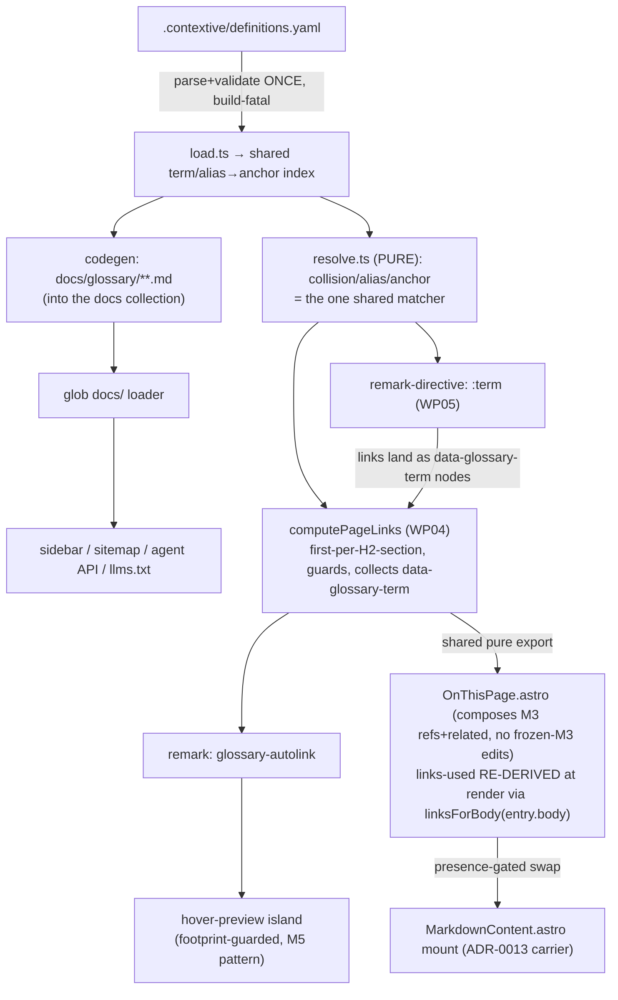

# Implementation Plan: Glossary + Contextive (M4)

**Branch**: `feat/glossary` | **Date**: 2026-08-26 | **Spec**: [`spec.md`](./spec.md) (rev 2)
**Input**: Feature specification from `kitty-specs/glossary-01M0YCHB/spec.md`

## Summary

M4 gives a docsite a **multi-context glossary** sourced from a single Contextive Community
file (`.contextive/definitions.yaml`), **auto-links** terms at the first eligible mention
per H2 section, shows a **custom hover preview**, opens the full definition in a **new tab**,
provides a **`:term[text]{context=…}`** escape hatch, and appends a per-page **"On this
page" block**. Technical approach: parse-and-validate the definitions file **once** into a
shared term/alias→anchor index; a **pure resolver** owns collision/alias/anchor logic; a
thin **remark auto-linker** and a **`remark-directive` `:term` plugin** consume it; glossary
pages are **codegen'd as Markdown into the `docs` collection** so every generator sees them;
a new **`OnThisPage.astro` block composes the M3 renderers** and reads "links used" via a
shared-matcher result surfaced through `remarkPluginFrontmatter`. Four ADRs (0025–0028)
settle the squad-surfaced risks; activation is presence-driven and lands atomically in a
terminal example WP so `ci-ok` stays green at every boundary.

## Post-tasks squad remediation (2026-08-26)

A 3-lens post-tasks squad (anti-laziness, decomposition, seams) reviewed the finalized tasks;
findings + dispositions in [`reviews/post-tasks-squad.md`](./reviews/post-tasks-squad.md). Two
are material to this plan:

- **AS-3 channel corrected.** The `remarkPluginFrontmatter` primary is architecturally dead
  (`docsSchema({extend: z.object})` strips undeclared keys; `entry.data` freezes at load). The
  links-used datum is now **re-derived at render** by one shared helper (`linksForBody` = parse
  `entry.body` → `remarkDirective` → `glossary-term` → `computePageLinks`, collecting all
  `data-glossary-term` nodes so `:term` links are included). The `OnThisPage` **mount** is now
  owned (WP07, in the ADR-0013 carrier `MarkdownContent.astro`) and **presence-gated** to avoid
  double-render and hold NFR-002. ADR-0025 + contracts + WP04/05/07/08 updated.
- **FR-013 partial descope (documented deviation, DIRECTIVE_010).** The `_meta/sections.yaml`
  registry that would place the glossary under a named "Reference" nav group is **unwired**
  today (draft spec; the only live section-identity is the M3-frozen `SECTION_ORDER`/
  `SECTION_LABEL`, which this mission must not edit). M4 ships the glossary in the sidebar via
  Starlight **tree-autogeneration** and in the sitemap/agent-API/`llms.txt` via the real globbed
  files (FR-013's "generators pick them up" is met); the **named-group relocation** is deferred
  to a filed `sections.yaml`-registry follow-up issue.

## Technical Context

**Language/Version**: TypeScript 5.9 (ESM, `strict`), Node ≥ 20 (Active LTS); Astro 5.2,
Starlight 0.32.6 (pinned by `example/package.json`).
**Primary Dependencies**: Existing — `astro`, `@astrojs/starlight`, `@astrojs/sitemap`,
`gray-matter`, `zod` (via `docKittyDocsSchema`), `unified`/`mdast` (Astro's remark chain).
**New, pinned (ADR-0027, AS-2)** — `remark-directive` + `mdast-util-directive` (for
`:term`). No Contextive runtime dependency (the definitions file is read directly;
NFR-006). No CDN, no headless browser at build (NFR-003).
**Storage**: Source files only. Input: `.contextive/definitions.yaml` (Contextive
Community format). Output: generated `docs/glossary/**.md` in the tracked docs tree
(ADR-0026 codegen-into-collection).
**Testing**: Vitest (`src/vitest.config.ts`) for pure units — loader/validation, resolver
(collision/alias/anchor), section-walk, `:term`, scheme-check; Playwright + `@axe-core/
playwright` (`tests/a11y/`) for the a11y lane incl. hover 1.4.13 direct assertions and the
NFR-003 network-capture footprint twin; the a11y visual baselines regenerate only in the
pinned `mcr.microsoft.com/playwright:v1.62.1-noble` container.
**Target Platform**: Static site build (browser-free build; client island only where
glossary links exist).
**Project Type**: Single TypeScript toolkit package (`@commondocs-kitty/toolkit`) + an
`example/` consumer site.
**Performance Goals**: Deterministic build — same input → byte-identical generated pages,
anchors, injected links (NFR-004). Single parse of the definitions file; one shared matcher
(NFR-004, D6).
**Constraints**: `ci-ok` green (code-quality, doc-sanity, build-example, a11y) at **every**
WP boundary (NFR-002); browser-free build (NFR-003); no-JS fallback keeps plain anchors +
the block (NFR-005); unresolved collision never auto-linked, greppable warning, exit 0
(NFR-007); self-contained, Community file only (NFR-006). Only `example/docs/**` + the
example definitions file are auto-linked/rendered/asserted; the toolkit's own `docs/**`
stays doc-sanity only (C-004). Exactly two new frontmatter fields (C-007). No edits to
M3-owned files (ADR-0025 composes, never mutates).
**Scale/Scope**: 9 work packages (8 dormant infra/logic + 1 terminal activation); 4 ADRs;
2 contexts + ≥1 real `policy` collision + a malformed fixture in the demonstrator.

### Supply-chain security (advisory, ADR-0027)

`remark-directive` + `mdast-util-directive` are added. Both are mainstream unified/`remark`
packages (registry-authentic, widely depended upon, no install-time lifecycle scripts of
concern). Pin exact versions in `package.json`; deny-by-default `preinstall`/`install`/
`postinstall`; install under Node Active LTS. No security-impacting default is left
unexamined — see `research.md` for the adversarial-evidence dispositions.

## Charter Check

*GATE: Must pass before Phase 0. Re-checked after Phase 1.*

Charter present (`.kittify/charter/charter.md`; three-axis separation, doctrine baseline).
Directives loaded via `charter context --action plan`. Relevant gates:

- **DIRECTIVE_001 (Architectural Integrity) / three-axis separation** — PASS. The pure
  resolver is isolated from the AST plugin (D1); config-driven nav placement via
  `_meta/sections.yaml` keeps display vs structure orthogonal (FR-013); the block composes
  M3 rather than mutating it (ADR-0025).
- **DIRECTIVE_003 / DIRECTIVE_010 (Decision Documentation / Spec Fidelity)** — PASS. Four
  ADRs (0025–0028) record every load-bearing decision and the squad-surfaced risks; the IC
  map traces each concern to FRs.
- **DIRECTIVE_024 (Locality) / DIRECTIVE_025 (Boy Scout)** — PASS. Diffs stay minimal and
  WP-scoped; one justified campsite fix (ADR README index rows 0021–0028, previously
  missing) is recorded here, not silent. No M3 file is widened.
- **USE_C4_MODEL / show-me** — the data-flow diagram below satisfies the visual doctrine at
  the level that answers the planning question (the remark→render channel).

No charter violations require Complexity Tracking.

## Data flow (the load-bearing seam)



## Project Structure

### Documentation (this mission)

```
kitty-specs/glossary-01M0YCHB/
├── plan.md              # This file
├── research.md          # Phase 0 — decisions, dependency/supply-chain, adversarial evidence
├── data-model.md        # Phase 1 — entities, invariants, the shared index
├── quickstart.md        # Phase 1 — author + consumer walkthrough
├── contracts/           # Phase 1 — resolver, loader/validation, codegen, :term, on-this-page
└── tasks.md             # Phase 2 (/spec-kitty.tasks — NOT created here)
```

### Source Code (repository root)

```
src/lib/glossary/
├── load.ts                 # parse + validate ONCE, build-fatal; emits the shared index (ADR-0026)
├── load.internal.ts        # pure schema + validation (vitest)
├── resolve.ts              # PURE resolver: collision/alias/anchor = the one shared matcher (ADR-0027, D1/D6)
├── generate.ts             # codegen docs/glossary/**.md into the docs collection (ADR-0026)
└── anchor.ts               # deterministic slug(name) (shared, D6)

src/lib/remark/
├── glossary-autolink.ts    # thin remark plugin over resolve.ts; first-per-section; publishes links-used (ADR-0027)
└── glossary-term.ts        # remark-directive :term → same link node (ADR-0027)

src/lib/glossary/
└── preview.client.ts       # footprint-guarded hover-preview island (M5 injectScript pattern, ADR-0025 sibling)

src/components/slots/
└── OnThisPage.astro        # composes M3 metadata.ts resolvers + molecules; reads links-used (ADR-0025)

src/lib/schema.ts           # +glossary_context, +glossary_autolink (ADR-0028) — single owner
src/lib/config.ts           # single-owner integration: plugin order, generator hook, island inject (D2, M5 WP03)

example/
├── .contextive/definitions.yaml     # 2 contexts + policy collision (terminal WP on-switch)
├── docs/glossary/**                  # GENERATED (terminal WP)
├── docs/_meta/sections.yaml          # Reference nav placement (terminal WP)
├── docs/**/*.md                      # demonstrator pages: auto-link, hover, :term
└── tests/fixtures/definitions.malformed.yaml   # FR-002 proof, kept out of the normal build

tests/a11y/routes.ts        # +glossary AXE_PAGES entry with renderCount non-vacuity gate (terminal WP)
```

**Structure Decision**: Single toolkit package. All new logic lives under `src/lib/
glossary/` (pure, Astro-free, vitest) and `src/lib/remark/` (thin plugins), consumed by the
single `src/lib/config.ts` integration owner. The example site is the demonstrator and the
atomic on-switch. No M3-owned file (`src/components/slots/{ExternalReferences,Related}.astro`,
`src/themes/spec-kitty/components/molecules/*`) is modified — `OnThisPage.astro` imports them.

## Implementation Concern Map

> Concerns are NOT work packages. `/spec-kitty.tasks` translates these into executable WPs.
> The recommended shape is one WP per concern (~9), with the resolver split from the
> auto-link plugin (D1), config.ts a single-owner WP (D2), and the terminal example WP the
> atomic on-switch (D3). All infra/logic WPs are **dormant** (registered but no-op /
> unreferenced) until the terminal WP lands the example definitions file.

### IC-01 — Definitions loader + validation

- **Purpose**: Parse `.contextive/definitions.yaml` once and validate build-fatally against
  the pinned Contextive schema; emit the shared term/alias→anchor index; scheme-check `meta`
  URLs.
- **Relevant requirements**: FR-001, FR-002, FR-004; NFR-006; C-002/C-003.
- **Affected surfaces**: `src/lib/glossary/load.ts`, `load.internal.ts`, `anchor.ts`; new
  `zod` schema.
- **Sequencing/depends-on**: none (root).
- **Risks**: Contextive schema drift → pin + validate on load (ADR-0026). Presence-gating
  must keep a no-file build byte-identical.

### IC-02 — Pure resolver (collision / alias / anchor) — the one shared matcher

- **Purpose**: Given `(surface, pageContext, index)` return link / unresolved / none;
  aliases as names; deterministic anchors.
- **Relevant requirements**: FR-007, FR-012; NFR-004, NFR-007.
- **Affected surfaces**: `src/lib/glossary/resolve.ts` (+ exhaustive vitest).
- **Sequencing/depends-on**: IC-01 (consumes the index).
- **Risks**: The four-way shared contract (D6) — keep it pure and the single source of
  truth so generator/linker/`:term`/block cannot drift.

### IC-03 — Glossary page generator (codegen-into-collection) + hub + nav default

- **Purpose**: Write `docs/glossary/index.md` + `docs/glossary/<context>/index.md` with real
  frontmatter and markdown-rendered definitions/`meta`, deterministic anchors,
  `domainVisionStatement`; fold the default Reference nav entry in here (D7).
- **Relevant requirements**: FR-003, FR-004, FR-013; NFR-004; AS-6.
- **Affected surfaces**: `src/lib/glossary/generate.ts`; nav default (generator-owned).
- **Sequencing/depends-on**: IC-01 (index).
- **Risks**: Idempotency/determinism; generated pages must self-declare `glossary_context`.

### IC-04 — Auto-link remark plugin (first-per-section, guards, warn) + links-used publish

- **Purpose**: Thin remark plugin over IC-02: first eligible per H2 section, ancestor-type
  guards, whole-word case-insensitive; unresolved → skip + greppable warning (exit 0);
  publish distinct links-used to `remarkPluginFrontmatter`; explicit deck no-op.
- **Relevant requirements**: FR-005, FR-006, FR-007, FR-008, FR-009; NFR-002, NFR-004,
  NFR-007; AS-1.
- **Affected surfaces**: `src/lib/remark/glossary-autolink.ts` (+ vitest for section-walk).
- **Sequencing/depends-on**: IC-02.
- **Risks**: Append-order sensitivity (assert in a test); over-linking (ignore-list +
  opt-out bound it).

### IC-05 — `:term` directive (remark-directive) + suppress form

- **Purpose**: Parse `:term[text]{context=…}` / `link=false`; emit the same link node as
  IC-04; resolve via IC-02 against the explicit context; count as used + as the section's
  first eligible.
- **Relevant requirements**: FR-011; AS-2.
- **Affected surfaces**: `src/lib/remark/glossary-term.ts`; new pinned deps
  `remark-directive`, `mdast-util-directive`.
- **Sequencing/depends-on**: IC-02; ordered before IC-04 (plugin order in IC-08).
- **Risks**: Supply-chain (advisory check, research.md); directive-parse-before-linker
  ordering.

### IC-06 — Hover-preview island (footprint-guarded, WCAG 1.4.13)

- **Purpose**: Custom popover on hover/focus (not `title`): hoverable, Esc-dismissible,
  persistent, both colour modes; loads only where glossary links exist (M5 footprint
  discipline); click opens the new tab.
- **Relevant requirements**: FR-009; NFR-001, NFR-003, NFR-005.
- **Affected surfaces**: `src/lib/glossary/preview.client.ts` (injectScript('page') +
  early-return when no `[data-glossary-term]` + dynamic import).
- **Sequencing/depends-on**: IC-04 (the marker attributes it keys on).
- **Risks**: 1.4.13 direct assertions; NFR-003 network-capture twin (glossary page requests
  the chunk, control route does not).

### IC-07 — "On this page" block (composes M3, re-derives links-used) + owned mount

- **Purpose**: New `OnThisPage.astro` carrier-body block: compose M3 refs+related resolvers/
  molecules (`metadata.ts` + `catalog.ts` + molecules, no frozen-M3 edits), plus the distinct
  glossary links used **re-derived at render** (`linksForBody` = parse `entry.body` → directive
  → :term → `computePageLinks`, `:term` included); omit-when-empty, dedup, stable order; JS-off.
  **Owns the presence-gated mount** in the ADR-0013 carrier `MarkdownContent.astro` (swap
  standalones → `OnThisPage` when glossary active; byte-identical when inactive).
- **Relevant requirements**: FR-010; NFR-002, NFR-004, NFR-005; AS-3.
- **Affected surfaces**: `src/components/slots/OnThisPage.astro`, `src/components/MarkdownContent.astro`.
- **Sequencing/depends-on**: IC-04 (`computePageLinks`) + IC-05 (`:term`); imports M3 (merged);
  IC-01 (`isGlossaryActive`).
- **Risks**: AS-3 corrected post-tasks-squad — the `remarkPluginFrontmatter` primary is **dead**
  (schema strips undeclared keys; `entry.data` frozen at load), so the deterministic render-time
  re-derive is the sole mechanism (no spike). Mount must stay presence-gated to hold NFR-002.

### IC-08 — Single-owner integration (config.ts): plugin order, generator hook, island inject

- **Purpose**: Own the one config.ts seam — pin remark order (`gfm → remarkDirective →
  glossary-term → glossary-autolink`), wire the generator hook, inject the island page-wide,
  add the two frontmatter fields to the schema; all presence-gated so a glossary-free site
  is byte-identical.
- **Relevant requirements**: FR-008, FR-013; NFR-002; C-005, C-007; AS-1; D2.
- **Affected surfaces**: `src/lib/config.ts`, `src/lib/schema.ts` (ADR-0028) — single owner.
- **Sequencing/depends-on**: IC-01..IC-07 (wires them); the M5 WP03 pattern.
- **Risks**: config.ts contention — one owner only; keep the diff additive and gated.

### IC-09 — Terminal example demonstrator (the atomic on-switch)

- **Purpose**: Land `example/.contextive/definitions.yaml` (2 contexts + real `policy`
  collision), demonstrator pages (auto-link, hover, `:term`), the malformed fixture (FR-002),
  `example/docs/_meta/sections.yaml` (Reference placement), the generated `docs/glossary/**`,
  the `AXE_PAGES` glossary entry with the **non-vacuity** assertion (≥1 auto-link + ≥1
  `:term`-resolved collision before the scan), and the count-pins — **atomically**, all prior
  WPs dormant/green until here (D3).
- **Relevant requirements**: FR-013, FR-014; NFR-001, NFR-002, NFR-003, NFR-007; SC-001..006.
- **Affected surfaces**: `example/**`, `tests/a11y/routes.ts`, count-pins.
- **Sequencing/depends-on**: all of IC-01..IC-08.
- **Risks**: This is the only WP that flips activation — its `ci-ok` must be green with the
  full seam live; a11y baselines regenerate in the pinned container.

## Complexity Tracking

*No Charter Check violations require justification.* The one recorded campsite fix (ADR
README index rows 0021–0028) is a doc-only correction of a gap left by prior missions, kept
minimal and out of any code WP diff.

## Branch contract (restated)

- **Current branch**: `feat/glossary` — matches target (`branch_matches_target: true`).
- **Planning/base branch**: `feat/glossary` (all WP lanes cut from and merge back to it).
- **Final merge target**: `feat/glossary` → `main` via an origin (spec-kitty) PR at mission
  end (per the mission-PR topology). `/spec-kitty.tasks` is the next step.
