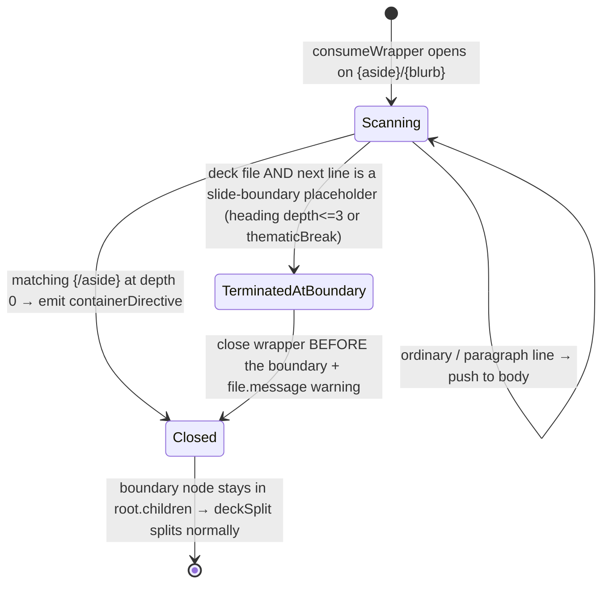

# Data Model: Markua-capable decks

This mission has no persistent data. The "model" is the set of AST nodes/flags and the state transition that governs wrapper-vs-boundary handling during the build-time transform. It is captured here so the contracts and tests have a shared vocabulary.

## Nodes & flags

| Entity | Where produced | Shape / key fields | Notes |
|--------|----------------|--------------------|-------|
| **Slide-boundary node** | authored markdown | `heading` (`depth` 2 → horizontal, `depth` 3 → stack inner) or `thematicBreak` (`---`) | `deckSplit` matches on `type`+`depth` only; `data`/`hProperties` are ignored for boundary detection. |
| **Marker-bearing paragraph** | authored markdown | `paragraph` whose text starts with a Markua line-prefix (`A>`…`W>`) or is a lone `{…}`/`{aside}`/`{blurb}` line | Input to `markuaNormalise`. |
| **`containerDirective` (aside/blurb)** | `markuaNormalise` | mdast `containerDirective` carrying `data.hName`/`hProperties` | Must never contain a slide-boundary node on a deck (D3). |
| **`dk-callout` aside** | `markuaCallouts` (theme path) | hast `<aside class="dk-callout dk-callout--{variant}">` with optional `dk-callout__icon`, `dk-callout__title`, `dk-callout__body` | Self-contained; styled by `dk-components.css`. On a deck this is **forced** (never native). |
| **Deck hero image** | `deckSplit.titleChildren` | `paragraph > image{url,alt}` **tagged** `data.hProperties['data-deck-hero']=''` | New tag (D4). Must survive mdast→hast as `properties['data-deck-hero']`. |
| **Body slide figure** | `markuaFigure` | hast `<figure class="dk-figure"><figcaption></figure>` | Produced for every slide `` **except** the hero-tagged one. |
| **`isPresentationFile(file)`** | `src/lib/deck/is-presentation.ts` | predicate `data.astro.frontmatter.kind === 'Presentation'` | Sole delegation seam Markua passes read; unchanged. |

## Guard posture (after this mission)

| Pass | Layer | Deck posture | Mechanism |
|------|-------|--------------|-----------|
| `markuaNormalise` | remark | **runs** (wrapper terminates at boundary) | bare in `config.ts:683`; `isPresentationFile` used only inside `consumeWrapper` |
| `markuaAttributes` | remark | **runs** (provably boundary-safe) | bare in `config.ts:683` |
| `markuaCallouts` | remark | **runs** (forced `dk-callout`) | bare in `config.ts:683`; `isPresentationFile` → `forceTheme` |
| `markuaFigure` | rehype | **runs** (skips hero ``) | bare in `config.ts:685`; per-`` `data-deck-hero` skip |
| `markuaTocDemote` | rehype | **no-op (guarded)** | `guardDeck`-wrapped in `config.ts:685` |
| `deckSplit` | remark | owns splitting | never wrapped (C-002) |

## State transition — wrapper vs slide boundary (D3)

**Invariants**:
- INV-1: a slide-boundary node is never re-parented into a `containerDirective` on a deck.
- INV-2: the hero image's `` is non-empty and un-captioned after the full pipeline.
- INV-3: for a deck whose markers do not straddle a boundary, `deckSection` count/structure equals the marker-free equivalent.
- INV-4: off-deck (non-`Presentation`) rendering is byte-identical to pre-mission `main`.
