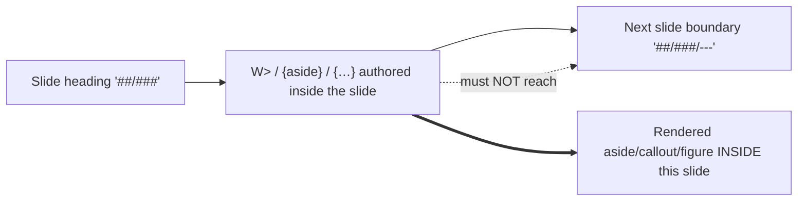

# Mission Specification: Markua-capable decks

**Mission Branch**: `feat/markua-decks`
**Created**: 2026-09-06
**Status**: Draft
**Input**: Follow-up to #36/#46 — issue #47 ("Decks Markua-capable, option b"). Make deck slides genuinely Markua-capable, reversing the option-(a) "decks are Markua-agnostic" resolution recorded in ADR-0030's 2026-08-30 amendment.

## Context & Intent Summary

**Primary actor**: a deck author writing a `kind: Presentation` page under `presentations/`.

**Trigger**: the author writes a Markua construct — a `W>` line-prefix aside, an `{aside}`/`{blurb}` wrapper, a `{…}` attribute list, or an `{alt:}` figure — **inside a slide's content**.

**Today's behaviour (the gap)**: all five Markua passes (`markuaNormalise`, `markuaAttributes`, `markuaCallouts`, `markuaFigure`, `markuaTocDemote`) are deliberately inert on presentation pages. They are wrapped `[…].map(guardDeck)` at the registration arrays and short-circuit through the shared `isPresentationFile()` predicate; `markuaFigure` additionally self-guards because the deck's synthesized hero image would lose its `alt` if wrapped as a figure. So a Markua marker on a slide renders as literal text.

**Desired outcome**: the same marker renders the intended, accessible construct **on the slide** — an aside/callout with the correct accessible name and role, a `<figure>` with a real `` + `<figcaption>`, or an element carrying its `{…}` attributes — with **no slide boundary swallowed and no slide line silently consumed**.

**Rule that must always hold**: transforming a Markua construct must never consume a `##`/`###` slide/stack boundary or a `---` slide separator, and must never empty the deck hero image's `alt`. The documentation corpus off decks stays byte-identical.

**Scope decision (confirmed)**: the deck-capable contract covers the **entire Markua surface** the four content passes handle — line-prefix asides (`A>`/`B>`/`E>`/`I>`/`T>`/`W>`), `{aside}`/`{blurb}` wrappers, `{…}` attribute lists, and `{alt:}` figures — with **no per-construct deck carve-outs**. The shipped fixture and a11y gate exercise a representative subset (`{…}`, `W>`, `{aside}`, figure) as proof. `markuaTocDemote` stays deck-agnostic because a deck route has no on-page table of contents to demote a heading out of.

### Ordering intent (product view)

A Markua construct authored between two slide boundaries must resolve to its rendered construct **within that slide**, never absorbing the boundary that opens the next slide:

## User Scenarios & Testing *(mandatory)*

### User Story 1 - A slide aside/callout renders on the deck (Priority: P1)

A deck author writes a `W>` line-prefix aside (or an `{aside}` wrapper) inside a slide. On the rendered out-of-frame deck route the aside appears as a callout **on that slide**, with the correct accessible name/role, and the surrounding slide boundaries are intact.

**Why this priority**: this is the core of "Markua-capable" — the aside/callout family is the most-used Markua construct and the one whose grouping most threatens a `###` boundary. Delivering it alone proves the ordering composition with `deckSplit` and yields a viable MVP.

**Independent Test**: author a fixture deck with a `W>`/`{aside}` on a mid-deck slide; assert (behaviour + a11y gate on the deck route) that the callout renders inside the correct slide with the expected role/accessible name and that slide count/boundaries are unchanged versus the same deck without the marker.

**Acceptance Scenarios**:

1. **Given** a slide containing a `W>` aside followed by a `###` stack boundary, **When** the deck builds and renders, **Then** the aside renders as a callout inside the current slide and the `###` still opens the next inner slide (boundary not swallowed).
2. **Given** an `{aside}…{/aside}` wrapper authored within one slide, **When** the deck renders, **Then** the wrapped content renders as an aside on that slide with a programmatic role and accessible name, and no slide line is consumed.

---

### User Story 2 - A slide image renders as an accessible figure without breaking the hero (Priority: P1)

A deck author writes a Markua figure `{…}` in slide body content. It renders as a `<figure>` with a populated `` and a `<figcaption>`. The deck's **title-slide hero image is untouched** — its `` stays populated (no `image-alt` violation, no unwanted caption on the title slide).

**Why this priority**: this re-solves the PR #33 hero-image conflict that caused `markuaFigure` to no-op on decks. Resolving it (rather than skipping the pass) is an explicit acceptance requirement of #47, and a broken hero `alt` is an a11y regression the deck a11y gate would (correctly) fail on.

**Independent Test**: fixture deck with (a) a title-slide hero image and (b) a Markua body figure on a later slide; assert the body image becomes an accessible `<figure>` and the hero `` retains its non-empty `alt` with no injected `<figcaption>`.

**Acceptance Scenarios**:

1. **Given** a deck with a `hero_image` frontmatter and a body `{width:…}` on slide 3, **When** it renders, **Then** slide 3 shows a `<figure><figcaption>…</figcaption></figure>` and the title slide's hero `` keeps its authored `alt` with no `<figcaption>`.
2. **Given** the deck a11y gate runs over the rendered deck route, **When** it checks `image-alt`, **Then** there are zero violations (hero and body figure both have accessible names).

---

### User Story 3 - Attribute lists apply to slide elements (Priority: P2)

A deck author writes a `{…}` attribute-list line targeting a slide element (e.g. `{.class}` or `{#id}`). The attributes attach to the intended element on the slide; the `{…}` line itself is consumed as an attribute directive, never left as literal text and never spliced onto a slide heading it was not meant to modify.

**Why this priority**: attributes are the subtlest ordering hazard (a raw `{…}` line adjacent to a `###` could attach to the slide heading or be mis-spliced). It rounds out the "full surface" contract but is lower-frequency than asides/figures.

**Independent Test**: fixture slide with a `{.note}` attribute line on a paragraph adjacent to a `###`; assert the paragraph carries the class, the `###` heading is unaffected, and the attribute line is not emitted as text.

**Acceptance Scenarios**:

1. **Given** a `{.highlight}` line under a paragraph that is followed by a `###` boundary, **When** the deck renders, **Then** the paragraph carries `class="highlight"`, the `###` opens the next slide, and no literal `{.highlight}` text appears.

### Edge Cases

- **Wrapper straddling a boundary**: an `{aside}` opened in one slide whose `{/aside}` would fall past a `##`/`###`/`---` boundary — the transform must not merge the two slides; behaviour is defined (either the wrapper is bounded to its slide or a build warning surfaces) and no boundary is silently consumed.
- **Attribute line on a heading**: a `{…}` line immediately above/below a slide `##`/`###` heading — attributes must not silently retarget the slide-splitting heading in a way that breaks slide identity.
- **Hero image**: the synthesized title-slide hero must never be wrapped as a Markua figure (would relocate `alt`→`<figcaption>` and empty ``).
- **Unknown directive on a slide**: an unmapped Markua marker warns (does not fail the build) and does not corrupt slide grouping — consistent with existing deck-split and Markua warning behaviour.
- **Deck with no Markua**: a Markua-free deck renders byte-identically to today (no new nodes, no changed slide count).
- **Off-deck corpus**: every non-presentation page renders byte-identically to today (the change is additive on decks only).

## Requirements *(mandatory)*

### Functional Requirements

| ID | Title | User Story | Priority | Status |
|----|-------|------------|----------|--------|
| FR-001 | Deck-capable content passes | As a deck author, I want the four Markua content passes (`markuaNormalise`, `markuaAttributes`, `markuaCallouts`, `markuaFigure`) to act on slide content so that Markua markers render their intended constructs on a slide instead of as literal text. | High | Open |
| FR-002 | Enforced composition with slide-splitting | As a maintainer, I want the Markua passes composed with `deckSplit` under a decided, enforced ordering so that a `{…}` line, `W>` aside, or `{aside}`/`{blurb}` wrapper is transformed within its slide and never consumes a `##`/`###`/`---` boundary or a slide line. | High | Open |
| FR-003 | Ordering enforced by a gate, not prose | As a maintainer, I want the chosen pass/`deckSplit` ordering pinned by an automated assertion so that a future re-order fails loudly rather than silently regressing slide boundaries. | High | Open |
| FR-004 | Hero-image conflict re-solved | As a deck author, I want `markuaFigure` to render slide body images as accessible figures while the synthesized title-slide hero image keeps its populated `` and gains no caption, so that the PR #33 hero `image-alt` regression is resolved rather than avoided by skipping the pass. | High | Open |
| FR-005 | Full-surface deck contract | As a maintainer, I want the deck-capable contract to cover the entire Markua surface the four content passes handle (line-prefix asides `A>`/`B>`/`E>`/`I>`/`T>`/`W>`, `{aside}`/`{blurb}` wrappers, `{…}` attributes, `{alt:}` figures) with no per-construct deck carve-outs, so the guard story is "these passes are no longer deck-agnostic," not a split surface. | High | Open |
| FR-006 | `markuaTocDemote` stays deck-agnostic | As a maintainer, I want `markuaTocDemote` to remain guarded on decks (a deck route has no on-page ToC), so the guard predicate is retained precisely for the pass that stays deck-agnostic. | Medium | Open |
| FR-007 | Shipped deck-Markua fixture | As a maintainer, I want a published fixture deck exercising `{…}`, `W>`, `{aside}`, and `{alt:}` on slides, so the capability is demonstrated by a real rendered artifact. | High | Open |
| FR-008 | Deck-route a11y/behaviour gate | As a maintainer, I want a new automated gate on the out-of-frame deck route asserting that each fixture construct renders with correct roles/accessible names and that no slide boundary is swallowed, so the capability is proven and protected. | High | Open |
| FR-009 | Guard removal + test update | As a maintainer, I want `guardDeck` removed for the passes that become deck-capable (predicate kept for the deck-agnostic pass) and the parity/inertness tests updated to assert the new posture, so the deck-inertness tests no longer contradict the shipped behaviour. | High | Open |
| FR-010 | Docs of record updated | As a maintainer, I want `architecture/markua.md`, `architecture/slide-decks.md`, and a new ADR-0038 updated to record decks as Markua-capable (superseding the ADR-0030 2026-08-30 amendment's option (a)), so the docs of record match shipped behaviour. | High | Open |

### Non-Functional Requirements

| ID | Title | Requirement | Category | Priority | Status |
|----|-------|-------------|----------|----------|--------|
| NFR-001 | Slide-construct accessibility | Every Markua construct that renders on a slide exposes a correct programmatic role and non-empty accessible name; the deck a11y gate reports **zero** `image-alt`/role/name violations across the fixture deck in both colour schemes. | Accessibility | High | Open |
| NFR-002 | Off-deck corpus unchanged | For every non-presentation page, rendered output is byte-identical to pre-mission `main` (the change is additive on `kind: Presentation` pages only); proven by the existing docsite gates staying green. | Compatibility | High | Open |
| NFR-003 | Markua-free deck unchanged | A deck containing no Markua markers produces the same slide count and boundaries as pre-mission `main` (no spurious nodes introduced by the now-active passes). | Compatibility | High | Open |
| NFR-004 | Gate determinism | The new deck gate runs green under the repo's CI-serial test invocation (no reliance on parallel-only or machine-specific rendering) and is repeatable. | Reliability | Medium | Open |

### Constraints

| ID | Title | Constraint | Category | Priority | Status |
|----|-------|------------|----------|----------|--------|
| C-001 | Deck route is out-of-frame reveal.js | The capability must render on the existing out-of-frame reveal.js deck route for `Presentation` pages under `presentations/`; no new routing model is introduced. | Technical | High | Open |
| C-002 | Do not wrap the deck processor | `deckSplit`/`deckSplitIntegration` and the unwrapped `remarkDirective` remain outside `guardDeck` and outside this mission's guard changes — they own or are agnostic to the deck-splitting concern. | Technical | High | Open |
| C-003 | Superseding decision recorded | The scope change from option (a) to option (b) is recorded as a new ADR-0038 that supersedes the ADR-0030 2026-08-30 amendment; ADR-0030 is cross-referenced, not silently contradicted. | Governance | High | Open |
| C-004 | Direct-to-feat delivery | Governance artifacts and implementation land together on `feat/markua-decks`; the mission opens a non-draft PR to `main` (Closes #47). Merge is performed by the repository owner. | Process | High | Open |
| C-005 | Pixel + gate verification required | Before PR, the deck route is verified visually in both colour schemes and the full gate suite (tests incl. new deck gate + parity/inertness, build, docs/example/artifact/link/a11y asserts) is green. | Process | High | Open |

### Key Entities

- **Presentation (deck) page**: a `kind: Presentation` Markdown page under `presentations/`, split into slide `<section>`s by `deckSplit`; the unit onto which Markua constructs must now render.
- **Markua content pass**: one of `markuaNormalise` / `markuaAttributes` / `markuaCallouts` (remark) and `markuaFigure` (rehype) — the passes that become deck-capable.
- **Deck hero image**: the title-slide image synthesized from `hero_image` frontmatter; carries its own `alt` and must never be wrapped as a Markua figure.
- **Guard predicate / wrapper**: `isPresentationFile()` + `guardDeck()` — retained only for the pass that stays deck-agnostic (`markuaTocDemote`).
- **Deck-Markua fixture**: the shipped example deck exercising the representative construct subset, backing the new gate.

## Success Criteria *(mandatory)*

### Measurable Outcomes

- **SC-001**: A deck slide authored with a `W>` aside, an `{aside}` wrapper, a `{…}` attribute list, or an `{alt:}` figure renders the intended construct on that slide — verified by the shipped fixture rendered through the deck route.
- **SC-002**: The deck a11y/behaviour gate reports **zero** accessibility violations (roles, accessible names, `image-alt`) across the fixture deck in both light and dark colour schemes.
- **SC-003**: For every fixture construct, the deck's slide count and boundary structure are identical with and without the marker — i.e. **no** slide boundary is swallowed and **no** slide line is emitted as literal text (100% boundary preservation across the fixture cases).
- **SC-004**: The full pre-PR gate suite (tests including the new deck gate and the updated parity/inertness tests, build, `validate:docs`, `validate:example`, `assert:artifacts`, `assert:no-broken-links`, `test:a11y`) passes green in CI.
- **SC-005**: The docs of record (`architecture/markua.md`, `architecture/slide-decks.md`, ADR-0038) state decks are Markua-capable and no longer describe decks as Markua-agnostic; issue #47 is closed by the merged PR.
