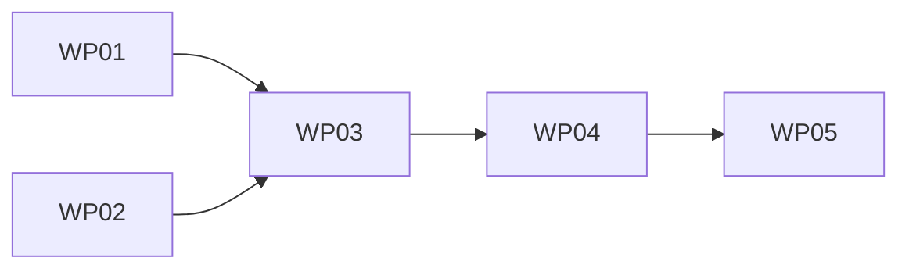

# Tasks: Markua-capable decks (#47)

**Mission**: markua-decks-01M1TTMB · **Branch**: `feat/markua-decks` · **Merge target**: `feat/markua-decks` (then manual PR → `main`, Closes #47)

Derived from `plan.md` (IC-01..IC-07), `research.md` (D1..D7), and the `contracts/`. Tests are in scope (the mission requires a fixture + gate + updated parity tests). Subtask rows are event-sourced reference rows — record completion with `spec-kitty agent tasks mark-status Txxx --status done`, not checkboxes.

## Subtask Index

| ID | Description | WP | Parallel |
|----|-------------|----|----------|
| T001 | `markuaNormalise`: deck-aware `consumeWrapper` terminates `{aside}`/`{blurb}` at a slide boundary + `file.message` warning | WP01 | |
| T002 | `markuaCallouts`: `isPresentationFile` awareness → `forceTheme` into `decideEmission` (never native on a deck) | WP01 | |
| T003 | `markuaCallouts`: ensure `dk-callout` `<aside>` exposes an accessible name/role (add `aria-label`/role if needed) | WP01 | |
| T004 | Unit tests: wrapper-boundary termination + forced-theme emission | WP01 | |
| T005 | `deck-split.internal` `titleChildren`: tag synthesized hero image `data.hProperties['data-deck-hero']` | WP02 | [P] |
| T006 | `markuaFigure`: drop blanket `isPresentationFile` return; skip only the hero-marked `` + its lone-image `
` | WP02 | |
| T007 | Unit tests: body image wraps as `dk-figure`, hero `` intact + un-captioned | WP02 | |
| T008 | `config.ts`: unwrap the four content passes (`:683`/`:685`); keep `guardDeck` on `markuaTocDemote` only | WP03 | |
| T009 | `deck-guard.test.ts`: membership assertions (`:199-220`) → only `markuaTocDemote` wrapped | WP03 | |
| T010 | `deck-guard.test.ts`: per-pass no-op matrix (`:143-150`) → only `markuaTocDemote` deck-guarded | WP03 | |
| T011 | `deck-guard.test.ts`: C36a inertness (`:289-343`) → FR-003 renders-on-decks + wrapper-boundary constraint | WP03 | |
| T012 | `deck-guard.test.ts`: verify/adjust markua-figure guard-string check (`:260`/`:266-267`) | WP03 | |
| T013 | Author `example/docs/presentations/markua-deck.md` fixture ({…}/W>/{aside}/figure + hero) | WP04 | [P] |
| T014 | `tests/a11y/routes.ts`: register `ROUTES.markuaDeck` + `AXE_PAGES` deck-shell entry | WP04 | |
| T015 | `tests/a11y/deck-markua.spec.ts`: new Playwright+axe gate (G1-G5, both schemes) | WP04 | |
| T016 | Verify gate runs CI-serial; rebuild `example/dist` before artifact/link asserts | WP04 | |
| T017 | Author `docs/adr/0038-decks-markua-capable.md` (supersedes ADR-0030 amendment) | WP05 | [P] |
| T018 | Update `docs/architecture/markua.md` (`:197-205`) — decks Markua-capable | WP05 | |
| T019 | Update `docs/architecture/slide-decks.md` (`:53-60`) — remove Markua-agnostic section | WP05 | |
| T020 | Changelog entry (≤180-char description) + ADR index regen if required | WP05 | |

## Work Packages

### WP01 — Deck-capable remark transforms (wrapper safety + forced callouts)
- **Goal**: Make `markuaNormalise` and `markuaCallouts` act correctly on deck slides — asides/callouts render as styled `dk-callout` on the slide, and a wrapper can never swallow a slide boundary.
- **Priority**: P1 · **Requirements**: FR-001, FR-002, FR-005 · **Depends on**: none
- **Independent test**: unit tests prove (a) a `{aside}` straddling a `###` closes at the boundary with a warning and leaves the heading in `root.children`; (b) a deck callout emits `dk-callout` hast, never native.
- **Subtasks**: T001, T002, T003, T004 · **Est.**: ~380 lines
- **Prompt**: `tasks/WP01-deck-capable-remark-transforms.md`

### WP02 — Figure hero-exclusion
- **Goal**: Wrap body slide images as accessible figures while the title-slide hero keeps its `` and gains no caption.
- **Priority**: P1 · **Requirements**: FR-004 · **Depends on**: none
- **Independent test**: unit tests prove the hero-tagged image is skipped and a body image becomes `figure.dk-figure > img[alt] + figcaption`.
- **Subtasks**: T005, T006, T007 · **Est.**: ~300 lines
- **Prompt**: `tasks/WP02-figure-hero-exclusion.md`

### WP03 — Guard removal, wiring & parity/inertness test flips
- **Goal**: Unwrap the four content passes (keep `markuaTocDemote` guarded) and flip the `deck-guard.test.ts` expectations to the new posture.
- **Priority**: P1 · **Requirements**: FR-003, FR-006, FR-009 · **Depends on**: WP01, WP02
- **Independent test**: `deck-guard.test.ts` green with the new membership/inertness assertions; `glossary-substrate-parity.test.ts` unchanged and still green.
- **Subtasks**: T008, T009, T010, T011, T012 · **Est.**: ~420 lines
- **Prompt**: `tasks/WP03-guard-removal-and-test-flips.md`

### WP04 — Deck-Markua fixture + a11y/behaviour gate
- **Goal**: Ship a Markua deck fixture and a Playwright+axe gate proving the constructs render with correct a11y and no boundary swallowed, in both colour schemes.
- **Priority**: P1 · **Requirements**: FR-007, FR-008 · **Depends on**: WP03
- **Independent test**: `tests/a11y/deck-markua.spec.ts` green (G1-G5) in light + dark.
- **Subtasks**: T013, T014, T015, T016 · **Est.**: ~360 lines
- **Prompt**: `tasks/WP04-deck-markua-fixture-and-gate.md`

### WP05 — Docs of record & ADR-0038
- **Goal**: Record decks as Markua-capable; supersede ADR-0030's option-(a) amendment.
- **Priority**: P2 · **Requirements**: FR-010 · **Depends on**: WP04
- **Independent test**: `validate:docs` green (changelog ≤180 chars); ADR index includes 0038; docs no longer describe decks as Markua-agnostic.
- **Subtasks**: T017, T018, T019, T020 · **Est.**: ~260 lines
- **Prompt**: `tasks/WP05-docs-and-adr-0038.md`

## MVP

WP01 + WP02 + WP03 deliver the capability (transforms deck-capable, guard removed, tests green). WP04 proves it end-to-end; WP05 records it. All five are required for mission acceptance (#47 acceptance mandates fixture + gate + docs/ADR).

## Dependency graph

