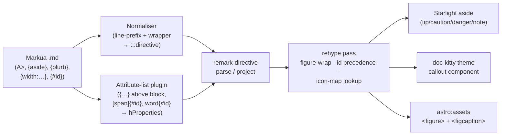

# Implementation Plan: Markua syntax support (subset)

**Branch**: `feat/markua-syntax-support` | **Date**: 2026-08-29 | **Spec**: [spec.md](./spec.md)
**Input**: Feature specification from `kitty-specs/markua-syntax-support-01M167JG/spec.md`

## Summary

Render a curated, opt-in subset of Leanpub's Markua inside the Astro + Starlight
pipeline, keeping every Markua-free page byte-identical. Two constructs are not
CommonMark and must be brought into the AST: the line-prefix blocks
(`A>` and the `B> C> D> E> I> Q> T> W> X>` shorthands) and the
`{aside}…{/aside}` / `{blurb, class: …}…{/blurb}` wrappers; and the attribute
lists (`{key: value}` / `{#id}` above a block, `[span]{#id}` / `word{#id}` on a
span). The ratified approach (ADR-0030, drafted this phase) is **option (b)**: a
**preprocessing normaliser** compiles the line-prefix and wrapper blocks into
`remark-directive` container syntax, and a small **remark attribute-list plugin**
attaches `{…}` values to the following block (images, ids) and to spans.
Downstream, a rehype pass rewrites images into an accessible `<figure>` driven by
`astro:assets`, ids land on `hProperties` (explicit wins over the auto-generated
heading id), the four Starlight-mapped classes render as Starlight asides
(tip→`tip`, warning→`caution`, error→`danger`, information→`note`), and the
classes with no Starlight equivalent render through a doc-kitty theme callout
component (ADR-0008 surface); callout icons resolve through a curated Font
Awesome → Starlight seed map with graceful drop + a build warning for unmapped
names. A micromark syntax extension (option a) is out of scope.

The design is research-backed
([`research.md`](./research.md),
[`docs/architecture/research/markua-syntax-support.md`](../../docs/architecture/research/markua-syntax-support.md))
and grounded in the codebase's existing remark/rehype seam (the M5 diagram and
M6 deck transforms establish the pattern this mission reuses).

## Technical Context

**Language/Version**: TypeScript 5.9.3 on Node ≥22 (Active LTS; CI/dev on Node 24.11) — Astro 5.18.2 + Starlight 0.32.6 remark/rehype pipeline (ESM, mdast/hast).
**Primary Dependencies**: **No new runtime dependency.** Reuses the already-pinned root deps `remark-directive@4.0.0`, `mdast-util-directive@3.1.0`, `remark-parse@11.0.0`, `remark-gfm@4.0.1`, `unified@11.0.5`; `astro:assets` (built into `astro@5.18.2`, `sharp` already hoisted via `pnpm-workspace.yaml`); Starlight's own asides; Astro's built-in heading-id rehype (there is **no** `rehype-slug` dependency in this repo — see research §divergences).
**Storage**: N/A — static SSG. The "data" is Markua text in `docs`-collection Markdown pages; all transformation is in-memory mdast/hast at build time.
**Testing**: Vitest (pure, Astro-free `*.internal.ts` string logic — block detection, attribute parse, callout-class mapping, icon-map lookup, figure fields) + Playwright a11y/render lane (`tests/a11y/*.spec.ts`, `@axe-core/playwright`) on the fixture corpus + `assert-build-artifacts.mjs` / `assert-chrome-artifacts.mjs` build assertions.
**Target Platform**: Static site, modern browsers. No client JavaScript is added by any in-scope construct; on a plain-Markdown host, Markua lines show as literal text (portability fallback).
**Project Type**: single (pnpm workspace: `src` = `@commondocs-kitty/toolkit`, `example` = the demo site CI builds and asserts).
**Performance Goals**: Build-time-only; zero new client-runtime cost (NFR-005). A Markua-free page carries no added markup and no added script.
**Constraints**: `ci-ok` green at every WP boundary; base CommonMark/GFM rendering stays byte-identical (NFR-001, C-002); the build can never fail on an in-scope construct — unknown icon, unsupported attribute, unbalanced wrapper all degrade with a warning and exit 0 (NFR-002); WCAG 2.2 AA on figures and callouts (NFR-004); pages stay plain `.md`, no MDX coupling (C-002); `@astrojs/starlight` peer range stays `>=0.32.0 <0.33.0` (Starlight-aside coupling, C-003).
**Scale/Scope**: One string normaliser + one attribute-list remark plugin + one callout-mapping plugin + one image figure-rehype + one theme callout component + a curated ~12–20-entry icon seed map + an author-doc page + the example fixture corpus + assertions. Roughly eight implementation concerns.

## Charter Check

*GATE: Must pass before Phase 0 research. Re-check after Phase 1 design.*

Charter present (`.kittify/charter/charter.md`, compact mode; `software-dev` baseline
doctrine). Applicable doctrine and disposition:

- **Settled-design / seam-ADR discipline** — a genuinely new rendering seam must be
  ratified by an ADR (charter "Amendment and exceptions"; design-readiness item 7).
  Satisfied: **ADR-0030** is drafted this phase
  ([`contracts/adr-0030-markua-preprocess-to-directive.md`](./contracts/adr-0030-markua-preprocess-to-directive.md)),
  ratifying option (b) and **referencing the pinned block-detection rules** in
  [`contracts/normaliser-block-detection.md`](./contracts/normaliser-block-detection.md)
  (FR-013). **PASS.**
- **Supply-chain install safety (directive 051)** — **no new dependency is added**;
  every package the approach needs is already in the lockfile. Disposition recorded
  in [`research.md`](./research.md) (registry authenticity, freshness, lifecycle-script
  discipline, Node Active-LTS awareness), because silence is not compliance. **PASS.**
- **Accessibility by construction (WCAG 2.2 AA)** — figures expose `{alt:}` as real
  alt text with the bracket text as caption; asides/callouts meet the site bar;
  asserted **directly** on the fixture corpus (axe + figure/caption assertions), not
  via a rule that may not fire. **PASS.**
- **Disciplined refactoring / locality** — net-additive. New logic is pure helpers
  under `src/lib/remark|rehype` (Astro-free, vitest-covered) plus one theme component;
  the shared edit (`src/lib/config.ts` opt-in wiring) is localized and lands atomically
  with the transform it registers, mirroring the M5/M6 pattern. **PASS.**
- **Living documentation** — the author-facing subset doc (FR-014) and the docs of
  record land in the same mission. **PASS.**
- Not a bulk edit (`meta.json change_mode` unset; new identifiers, not a cross-file
  rename) — no `occurrence_map.yaml`. **N/A.**

No violations to justify.

## Project Structure

### Documentation (this mission)

```
kitty-specs/markua-syntax-support-01M167JG/
├── plan.md              # This file
├── research.md          # Phase 0 — approach (b) decisions, supply-chain, toolchain divergences
├── data-model.md        # Phase 1 — construct / callout-class / attribute-list / icon-map entities
├── quickstart.md        # Phase 1 — author + verifier quickstart with a full-surface example
├── contracts/           # Phase 1
│   ├── normaliser-block-detection.md          # PINNED block-detection rules (FR-013)
│   ├── attribute-list-plugin.md               # {…} grammar → hProperties
│   ├── figure-render.md                        # img → <figure> + astro:assets
│   ├── callout-mapping.md                      # class → Starlight aside | theme callout
│   ├── icon-map.md                             # FA → Starlight seed map + graceful drop
│   └── adr-0030-markua-preprocess-to-directive.md  # DRAFT ADR (lands in docs/adr/0030-*.md via a WP)
└── tasks.md             # Phase 2 (/spec-kitty.tasks — NOT created here)
```

### Source Code (repository root)

```
src/
├── lib/
│   ├── config.ts                         # EDIT: opt-in `markua` seam — register normaliser + attribute-list + callout-mapping remark plugins, figure + toc-demote rehype plugins; PREPEND before starlight() (runs before remarkAsides); SINGLE remark-directive owner gated on (glossary-active OR markua-active)
│   ├── remark/
│   │   ├── markua-normalise.ts           # NEW: the block normaliser (line-prefix + wrapper → containerDirective)
│   │   ├── markua-normalise.internal.ts  # NEW: pure block-detection + re-parse helpers — vitest target
│   │   ├── markua-attributes.ts          # NEW: attribute-list plugin ({…} above block / [span]{#id} / word{#id})
│   │   ├── markua-attributes.internal.ts # NEW: pure {…} grammar parse + hProperties mapping — vitest target
│   │   ├── markua-callouts.ts            # NEW: directive → Starlight aside | theme callout mapping
│   │   └── markua-callouts.internal.ts   # NEW: pure class→target + icon-map resolution — vitest target
│   ├── rehype/
│   │   ├── markua-figure.ts              # NEW: img → <figure>+<figcaption> BEFORE rehypeImages, astro:assets sizing/align/alt (mirrors rehype/diagram-figure.ts)
│   │   └── markua-toc-demote.ts          # NEW: demote in-callout ATX headings (role/aria-level) before rehypeHeadingIds so they leave the ToC
│   └── markua/
│       └── icon-map.ts                   # NEW: the curated FA → Starlight seed map + lookup + build-warning
├── styles/theme.css                      # EDIT: --dk-callout-* token family + .dk-callout* CSS for the emitted theme-callout hast (no .astro component — see ADR-0030)
docs/
├── adr/0030-markua-preprocess-to-directive.md  # NEW (landed from the drafted contract by a WP)
├── architecture/markua.md                # NEW (docs of record): the supported subset surface
└── plans/design-readiness.md             # EDIT: mark Markua item 7 closed
example/
├── astro.config.mjs                      # EDIT: enable `defineDocKittyIntegrations({ markua: true })`
└── docs/guides/
    └── markua-showcase.md                # NEW: fixture page exercising every in-scope construct (author doc, FR-014)
tests/
└── a11y/{routes.ts,axe.spec.ts}          # EDIT: add the showcase + a deliberately-malformed fixture; figure/caption/aside assertions
src/tests/
└── markua-*.test.ts                      # NEW: block-detection, attribute-parse, callout-mapping, icon-lookup vitest
```

**Structure Decision**: Single toolkit repo. New logic is pure helpers in
`src/lib/remark|rehype|markua` (unit-tested Astro-free through the `*.internal.ts`
split the repo already uses for `diagram-meta`/`deck-split`) plus one theme
component; the one shared edit (`config.ts` opt-in wiring) is localized and lands
atomically with what it registers. This mirrors the M5 diagrams and M6 deck seams
exactly, including the `diagrams: true`-style opt-in flag so a Markua-free site
carries zero cost.

## Complexity Tracking

*No Charter Check violations — this section is intentionally empty.*

## Pipeline



## Implementation Concern Map

> Concerns are NOT work packages. `/spec-kitty.tasks` translates these into WPs — one
> concern may become several WPs, or small concerns may merge. Dependency order below;
> the substrate (IC-01) is the hard prerequisite for every render concern.
> Critical path: ADR (IC-00) → substrate (IC-01) → {asides/callouts, figures, ids} →
> icons → verification; author docs run in parallel after the ADR.
>
> **Revised WP estimate (post-squad): ~11–13 WPs** across 8 concerns — IC-02 splits
> into IC-02a/b/c (callout plugin · callout theme styling WP · ToC-demotion spike),
> and IC-01 carries the extra `remark-directive`-owner + ordering surface; the ADR
> lands as its own content WP (IC-00/IC-07). Two bounded spikes (mdast wiring, ToC
> demotion) sit inside IC-01/IC-02.

### IC-00 — Gating decision ADR (drafted this phase)

- **Purpose**: Ratify option (b) — preprocess-to-directive — and **pin the normaliser's
  block-detection rules** before implementation, so the decision and its edge-case
  contract are recorded first (FR-013, charter seam-ADR discipline).
- **Relevant requirements**: FR-013; SC-006.
- **Affected surfaces**: the drafted
  [`contracts/adr-0030-markua-preprocess-to-directive.md`](./contracts/adr-0030-markua-preprocess-to-directive.md);
  landed to `docs/adr/0030-markua-preprocess-to-directive.md` by a WP so it passes
  through review as content (the draft stays in `contracts/` until then). The ADR
  **references** `contracts/normaliser-block-detection.md` for the pinned rules.
- **Landing WP obligations (pinned)**: the WP that lands the ADR (IC-00 close / IC-07)
  MUST **(1) flip the ADR Status from Proposed to Accepted** on merge (spec
  C-001/FR-013/SC-006 say the mission *ratifies* the approach), and **(2) update the
  back-link in `normaliser-block-detection.md`** — which currently links the ADR as a
  `contracts/` sibling — to the `docs/adr/0030-…` path once the ADR moves.
- **Sequencing/depends-on**: none — precedes IC-01.
- **Risks**: the ADR number may shift if another ADR lands first (spec assumption);
  the block-detection rules are the load-bearing content, not the number.

### IC-01 — Shared substrate: normaliser + attribute-list plugin (whole) + wiring

- **Purpose**: The two pieces every construct depends on — the **normaliser** (an
  **mdast-level remark plugin**, the ratified route; the pre-parse body-string route is
  not reachable through Astro/Starlight public config) that compiles line-prefix runs
  and `{aside}`/`{blurb}` wrappers into `containerDirective` nodes per the pinned
  block-detection rules, and the **attribute-list remark plugin owned WHOLE here** —
  its `{…}` grammar parse **and** the `hProperties` write for **every** target
  (images, spans, **and ids**). IC-01 also owns the **single `remark-directive`
  owner**: hoist `remark-directive` registration out of the glossary integration into
  a shared registration gated on **(glossary-active OR markua-active)** (the example
  ships `.contextive`, so both will be active), and pin the cross-integration plugin
  order — the markua plugins **prepended before `starlight()`** so they run before
  Starlight's `remarkAsides` (config-ordering contract, with a registration-site
  comment mirroring the deck/glossary comments). Opt-in `markua` flag added; example
  stays off until a render concern proves a construct.
- **Spikes (two bounded, mirroring M5's astro-mermaid spike)**: (1) the **mdast route**
  — plugin ordering (markua before `remarkAsides`), fence/blockquote handling,
  native-aside consumption of the constructed directive, and explicit-id survival;
  (2) the **ToC heading-exclusion demotion pass** (no native hook — see IC-02).
- **Relevant requirements**: FR-001, FR-004, FR-005 (attr half), FR-006 (attr half), FR-007 (attr half), FR-011, FR-012, C-001, C-002.
- **Affected surfaces**: `src/lib/remark/markua-normalise*.ts`,
  `src/lib/remark/markua-attributes*.ts`, `src/lib/config.ts` (opt-in flag + shared
  `remark-directive` owner + prepend order), the block-detection + attribute-parse vitest.
- **Sequencing/depends-on**: IC-00. Boundary: no page renders differently yet (example
  off), all lanes green.
- **Risks**: the wiring seam and the `remark-directive` ownership are the genuine
  unknowns (research D-02/D-07); the three-way callout redundancy (FR-004), the
  `fence-suppresses-line-prefix` + `unterminated-fence-at-EOF` cases, and the
  attribute-above-wrapper rule are bound by the block-detection vitest here, before any
  renderer exists. The `createPageProcessor`/`OnThisPage.astro` markua-unaware note
  (research shared-substrate note) is owned here so a future `entry.body` re-derive
  does not silently regress.

### IC-02 — Asides and callouts (US1) + theme callout component + ToC exclusion

This concern is **2–3 WPs**, not one, so the theme styling's review and a11y bar are
not smuggled through a remark-plugin WP:

- **IC-02a — callout-mapping plugin**: emits **every** directive; the four mapped
  classes (T→tip, W→caution, E→danger, I→note) emit a `containerDirective` Starlight's
  native `remarkAsides` renders (doc-kitty does **not** reimplement aside markup); the
  six theme classes (A> aside, D, Q, X, B/generic, C/center) emit **raw hast**
  (`<aside class="dk-callout dk-callout--{variant}">`, mirroring `diagram-figure.ts`) —
  **not** a `.astro` component, because the Starlight `components` map is frozen at four
  carriers (ADR-0013/0015) and no directive→component seam exists.
  The directive/hast schema **carries an optional `icon` from the start** so IC-05 adds
  only the map + lookup, not re-plumbing. A mapped class carrying `{#id}`/`{icon:}`
  routes to the `dk-callout` hast (native `remarkAsides` discards attributes), via a
  mapped-name fallback variant (`dk-callout--tip/caution/danger/note`).
- **IC-02b — callout theme styling (its own WP)**: the `--dk-callout-*` token family +
  the `.dk-callout*` CSS in `theme.css` (mirroring `--dk-diagram-*`), with class-specific
  styling and the a11y bar of the **emitted hast DOM** reviewed as a theme-surface change,
  not a plugin detail. No `.astro` component is created.
- **IC-02c — ToC heading-exclusion demotion pass (bounded spike, with IC-01)**: a user
  rehype pass **before `rehypeHeadingIds`** that demotes an in-callout ATX heading to a
  non-heading element carrying `role="heading"` + `aria-level`, so
  `rehypeCollectHeadings` omits it while a11y is preserved (there is no native
  aside-heading exclusion — a second real unknown of wiring-seam magnitude).
- **Relevant requirements**: FR-001, FR-002, FR-003, FR-004; NFR-004, NFR-005; C-004.
- **Affected surfaces**: `src/lib/remark/markua-callouts*.ts`,
  `src/lib/rehype/markua-toc-demote.ts`, `src/styles/theme.css` (the `--dk-callout-*`
  token family + `.dk-callout*` CSS), `src/lib/config.ts` (register).
- **Sequencing/depends-on**: IC-01. IC-02b (theme styling) depends on IC-02a (it styles the
  emitted classes). IC-02c (ToC-demotion) is built against synthetic hast so it depends only
  on the substrate and runs **parallel** to IC-02a (real integration proof deferred to the
  verification WP); it pairs conceptually with the IC-01 spike. See tasks.md for the
  authoritative dependency graph.
- **Risks**: native aside consumption depends on the IC-01 plugin ordering; the ToC
  demotion is the second bounded spike; the theme-callout classes need styling
  Starlight does not provide (contract `callout-mapping.md`).

### IC-03 — Figure images (US2)

- **Purpose**: The **image figure-rehype** — rewrite `img` into `<figure>` +
  `<figcaption>` (bracket text = caption, `{caption:}` overrides), `{alt:}` → real alt
  (fallback per contract), width/height % → sizing, `{align:}` → layout class, local
  paths → `astro:assets` optimisation, `http(s)` URLs passed through. Runs **before
  `rehypeImages`** (it is a user rehype plugin), wrapping the `` with `src` intact
  so `rehypeImages` folds `alt`/`title`/`style` into the `__ASTRO_IMAGE_` marker.
  Mirrors `rehype/diagram-figure.ts` (including its `safeHref` allowlist).
- **Relevant requirements**: FR-005, FR-006; NFR-004; US2 sc.1–5.
- **Affected surfaces**: `src/lib/rehype/markua-figure.ts`, `src/lib/config.ts` (register).
- **Sequencing/depends-on**: IC-01 (the attribute-list plugin supplies `{…}` values).
- **Spike/assert**: prove `style="width:75%"` (and `alt`) **survive the
  `__ASTRO_IMAGE_` round-trip** — running before `rehypeImages` is required, not
  optional (`contracts/figure-render.md`). The `resources/`-relative convention is
  **lower risk than first carried** (the native glob loader already resolves
  page-relative images); IC-03 still proves a local and a web image both render, the
  local one optimised.

### IC-04 — Crosslink ids (US3)

- **Purpose**: **Verification and behaviour only** — the `{…}` parser and its
  `hProperties` id write are owned **whole by IC-01**, so this concern does **not**
  re-edit the parser (fixing the earlier IC-01/IC-04 file overlap). IC-04 verifies the
  **precedence** (explicit `{#id}` wins over the auto id), covers the **span** forms
  (`[span]{#id}`, trailing `word{#id}`), and proves **crosslink resolution**
  (`[text](#id)` reaches the target). Headings with no Markua syntax keep their auto id
  (FR-008).
- **Relevant requirements**: FR-007, FR-008; C-005; US3 sc.1–4.
- **Affected surfaces**: the precedence + span + crosslink vitest / a11y assertion;
  fixture rows in the coverage matrix. **No edit to** `markua-attributes*.ts` (owned by
  IC-01).
- **Sequencing/depends-on**: IC-01.
- **Risks**: **none material** — explicit-wins is **native and proven**: Astro's
  `rehypeHeadingIds` (runs last) assigns a slug only when `node.properties.id` is not
  already a string (`rehype-collect-headings.js:52`); no `rehype-slug`, no ordering shim.

### IC-05 — Callout icons (US4)

- **Purpose**: The curated **FA → Starlight seed map** (~12–20 common names), the
  `{icon: fa-name}` lookup on a callout, and the **graceful-drop + build-warning**
  behaviour for an unmapped name (the callout still renders; the build exits 0).
  Because IC-02's directive/hast schema **already carries an optional `icon`** (emitted
  as the `dk-callout__icon` child, or the native aside's icon for a mapped class), this
  concern adds **only** `icon-map.ts` + its lookup — no re-plumbing of IC-02 files.
- **Relevant requirements**: FR-009, FR-010; NFR-002; US4 sc.1–2.
- **Affected surfaces**: `src/lib/markua/icon-map.ts` (new); the icon vitest
  (mapped-hit, unmapped-miss-with-warning).
- **Sequencing/depends-on**: IC-02 (the callout render carries the icon).
- **Risks**: an icon (or `{#id}`) on a mapped class **cannot ride the native aside**
  (`remarkAsides` discards attributes), so such a callout routes to the `dk-callout` hast
  (mapped-name fallback variant) — the pinned attribute-routing rule (`icon-map.md`);
  low priority (P3).

### IC-06 — Verification corpus + gates

- **Purpose**: The example fixture pages (a full-surface showcase and a
  deliberately-malformed page), the Playwright a11y/render assertions, and the
  build assertions. Coverage is measured against the **construct × input-form coverage
  matrix in `data-model.md`** as the explicit denominator (NFR-003, SC-005 — 100% not
  gameable). Named non-fakeable gates: a **`T>` renders `starlight-aside--tip`**
  assertion (locks the IC-01 plugin order against a future array reorder); the
  block-detection `fence-suppresses-line-prefix` + `unterminated-fence-at-EOF` vitest;
  the figure `style="width:75%"` `__ASTRO_IMAGE_` round-trip assertion; the **SC-003
  preset-off render** asserting no raw `:::`/`{…}` leaks; and the malformed-fixture
  **build-exits-0** assertion (assert the build *result*, not just the page).
- **Relevant requirements**: NFR-001, NFR-002, NFR-003, NFR-004, NFR-005; SC-001–SC-005.
- **Affected surfaces**: `example/docs/guides/markua-showcase.md`, a malformed fixture,
  `tests/a11y/routes.ts`, `tests/a11y/axe.spec.ts`, `src/scripts/assert-build-artifacts.mjs`.
- **Sequencing/depends-on**: IC-02, IC-03, IC-04, IC-05.
- **Risks**: the malformed fixture must prove NFR-002 (build exits 0) — assert the
  build result, not just the page.

### IC-07 — Author-facing docs + docs of record

- **Purpose**: The docsite page documenting the supported subset and its limits
  (FR-014), and the architecture doc of record (`docs/architecture/markua.md`);
  close design-readiness item 7. This concern (or IC-00's close) also **lands the ADR**
  to `docs/adr/0030-…`, flipping its Status to **Accepted** and updating the
  `normaliser-block-detection.md` back-link to the `docs/adr/` path (see IC-00).
- **FR-014 acceptance hook (pinned)**: FR-014 is covered when the author-facing page
  exists **and** carries the coverage row `#26/#35`-style check in the coverage matrix
  — a named build/link check that `example/docs/guides/markua-showcase.md` is published
  (`doc_status: active`, in the sidebar) and documents every in-scope construct and its
  limits. Without this hook FR-014 has no verifiable close.
- **Relevant requirements**: FR-014; SC-006 (records the decision alongside the ADR).
- **Affected surfaces**: `example/docs/guides/markua-showcase.md` (doubles as author
  doc + fixture), `docs/architecture/markua.md`, `docs/adr/0030-markua-preprocess-to-directive.md`
  (landed), `docs/plans/design-readiness.md`.
- **Sequencing/depends-on**: IC-00 (ADR). Runs in parallel with the render concerns.
