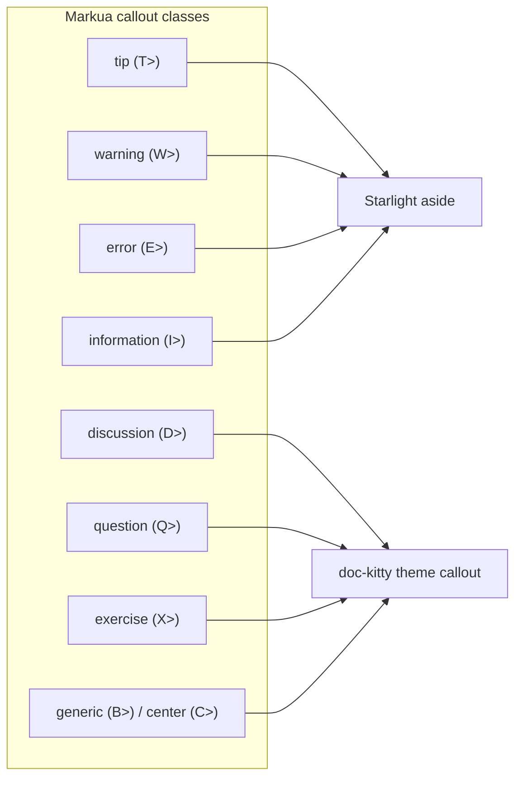

# Mission Specification: Markua syntax support (subset)

**Mission Branch**: `feat/markua-syntax-support`  
**Created**: 2026-08-29  
**Status**: Draft  
**Input**: User description: "Support a practical subset of Markua so Leanpub-authored Markdown renders correctly in the docsite, using Astro's Markdown extension mechanisms (remark/rehype). Base Markdown rendering stays intact (Markua is additive). Include a light ADR that ratifies the chosen approach. Out of scope: full Markua and any book/manuscript content type."

## Overview

[Markua](https://leanpub.com/markua) is the Markdown dialect Leanpub uses for
books and courses. It is a superset of CommonMark and GFM: a page written in
plain Markdown never touches Markua and renders everywhere unchanged. Authors
who bring Leanpub-authored Markdown into doc-kitty, however, hit a handful of
constructs — asides, callouts, figure images, crosslink ids, and callout icons —
that plain Markdown ignores or renders as literal text.

This mission adds **opt-in** support for a curated subset of Markua so those
pages render as their authors intended, using Astro's Markdown extension
mechanisms (remark/rehype), Starlight asides, `astro:assets`, and the doc-kitty
theme's curated component surface. Support is enabled by an opt-in preset flag
(`markua: true`, the same shape as the `diagrams` preset); with it off, Markua
lines degrade to literal readable text, and with it on they render as intended.
Either way, every plain-Markdown page renders exactly as before.

**MoSCoW**: Should · **Scope**: MVP. The base site renders without this feature,
so it is not a Must; it is the stated near-term focus for Leanpub compatibility.

Design backing:
[Supporting Markua syntax](../../docs/architecture/research/markua-syntax-support.md)
and [Astro Markdown extensions](../../docs/architecture/research/astro-markdown-extensions.md).
Per [Design readiness](../../docs/plans/design-readiness.md), this mission also
produces a light ADR that ratifies the chosen approach.

### Callout class → rendered target (product mapping)

## User Scenarios & Testing *(mandatory)*

Throughout, the **author** writes Markua-flavoured Markdown and the **reader**
views the published docsite page. Every story shares one invariant, tested in
each: a page that uses *none* of these constructs is unaffected.

### User Story 1 - Asides and callouts render as intended (Priority: P1)

An author pastes a Leanpub chapter that uses `A>` asides and the callout
shorthands (`T>` tip, `W>` warning, `E>` error, `I>` information, `D>`
discussion, `Q>` question, `X>` exercise, generic `B>`, centered `C>`), plus the
longer `{aside}…{/aside}` and `{blurb, class: …}…{/blurb}` wrapper forms and the
`{class: …}` + `B>` form. On the docsite each renders as a styled callout: the
four classes with a Starlight equivalent map to Starlight asides
(tip→`tip`, warning→`caution`, error→`danger`, information→`note`), and the
classes without one (discussion, question, exercise, generic, center) render
through a doc-kitty theme callout component.

**Why this priority**: Callouts and asides are the most common and most visible
Markua constructs in Leanpub prose, and the flagship reason to add the subset.
Delivering only this story already makes real Leanpub pages render.

**Independent Test**: Author a fixture page containing every aside/callout input
form; verify each renders as its mapped target with correct styling, and that
headings inside an aside stay out of the table of contents.

**Acceptance Scenarios**:

1. **Given** a page with `A> This is a short aside.`, **When** it is published,
   **Then** the reader sees a single aside block containing that text.
2. **Given** a multi-line `A>` run with an internal heading, **When** published,
   **Then** the run renders as one aside and the internal heading does not appear
   in the page's table of contents.
3. **Given** `W> Be careful.`, `{class: warning}` + `B> Be careful.`, and
   `{blurb, class: warning}\nBe careful.\n{/blurb}` on three pages, **When**
   published, **Then** all three produce the identical rendered warning callout.
4. **Given** a `D>` discussion callout, **When** published, **Then** it renders
   through the doc-kitty theme callout component (not a Starlight aside) with
   discussion-specific styling.
5. **Given** an `{aside}…{/aside}` wrapper whose body contains a fenced code
   block that itself contains a `>` character, **When** published, **Then** the
   aside boundaries are detected correctly and the code block is left intact.

---

### User Story 2 - Figure images with captions and attributes (Priority: P1)

An author writes `` and, on the line above it, an
attribute list such as `{alt: "a palm-lined beach", width: "75%"}`. The reader
sees an optimised figure with the bracket text as its caption, the `{alt:}` value
as the real alternative text, and the width applied.

**Why this priority**: Images are the second-most-common Markua construct and the
one where the semantics differ most from plain Markdown (bracket text is the
*caption*, not the alt text). Getting figures right is essential to faithful
rendering and to accessibility.

**Independent Test**: Author a fixture page with local and web-URL images, with
and without attribute lists; verify each renders as a `<figure>` with the correct
caption, alt text, size, and alignment, and that local images are optimised.

**Acceptance Scenarios**:

1. **Given** ``, **When** published, **Then** the
   reader sees a figure whose caption is "Palm Trees".
2. **Given** `{alt: "a red apple"}` above ``, **When**
   published, **Then** the figure's caption is "The original Mac" and its alt
   text is "a red apple".
3. **Given** `{width: "75%"}` above an image, **When** published, **Then** the
   figure is sized to 75% of the content width.
4. **Given** `{align: right}` above an image, **When** published, **Then** the
   figure carries the right-alignment layout treatment.
5. **Given** a local image path and a web `http(s)` image URL, **When** published,
   **Then** both render as figures and the local image is served through the
   site's image-optimisation pipeline.

---

### User Story 3 - Crosslink ids resolve within and across pages (Priority: P2)

An author sets an explicit id on a heading, figure, aside, or blurb with
`{#id}` or `{id: …}`, or on an inline span with `[some text]{#id}`, then links to
it with a standard Markdown link `[see the note](#id)`. The reader can follow the
link to the exact anchor.

**Why this priority**: Crosslinks make Leanpub cross-references work, but headings
already get ids automatically (covering the common case with no Markua syntax),
so the explicit-id forms are valuable rather than blocking.

**Independent Test**: Author a fixture page that sets ids on a heading, a figure,
and a span, links to each, and verify the anchors resolve and that an explicit id
wins over an auto-generated one on collision.

**Acceptance Scenarios**:

1. **Given** `{#intro}` above a heading and a link `[go](#intro)`, **When**
   published, **Then** the link resolves to that heading.
2. **Given** `This is ipsum{#ipsum}.` and a link `[go](#ipsum)`, **When**
   published, **Then** the link resolves to the span.
3. **Given** an explicit `{#overview}` on a heading whose auto-generated id would
   also be `overview`, **When** published, **Then** the explicit id is used and
   the anchor is unambiguous.
4. **Given** a heading with no Markua id syntax, **When** published, **Then** it
   still receives an automatically generated anchor id as it does today.

---

### User Story 4 - Icons on callouts, with graceful fallback (Priority: P3)

An author adds `{icon: fa-name}` to a callout to show a Font Awesome icon. When
the name is in doc-kitty's curated seed map, the reader sees the mapped icon.
When it is not, the callout still renders (without the icon) and the build logs a
warning — the page never fails to publish over an unknown icon.

**Why this priority**: Icons are cosmetic and, per the design research, the
heaviest piece because Font Awesome has thousands of names that do not line up
one-to-one with Starlight's icon set. A bounded seed map plus graceful drop
delivers the common cases without taking on an open-ended mapping burden.

**Independent Test**: Author a fixture page with a mapped icon name and an
unmapped one; verify the mapped icon renders, the unmapped one is dropped with a
build warning, and the build exits successfully.

**Acceptance Scenarios**:

1. **Given** a callout with `{icon: fa-lightbulb}` where `fa-lightbulb` is in the
   seed map, **When** published, **Then** the reader sees the mapped icon on the
   callout.
2. **Given** a callout with `{icon: fa-obscure-name}` not in the seed map,
   **When** the site builds, **Then** the callout renders without an icon, a
   build-time warning names the unmapped icon, and the build exits successfully.

---

### Edge Cases

- **Adjacent blockquotes / code.** An `A>`/shorthand run or an `{aside}`/`{blurb}`
  wrapper must be detected without consuming an adjacent CommonMark blockquote or
  a fenced code block that happens to contain a `>` (US1 scenario 5).
- **Nested wrappers.** `{aside}` and `{blurb}` wrappers are nestable and need
  balanced open/close handling; an unbalanced wrapper degrades to readable text
  rather than breaking the page.
- **Three-way callout redundancy.** The shorthand, `{class:}`+`B>`, and
  `{blurb, class:}` forms for one class must produce identical output (US1
  scenario 3).
- **Id collision.** An explicit `{#id}` that matches an auto-generated heading id
  resolves by explicit-wins precedence (US3 scenario 3).
- **Local image resolution.** Markua references local images relative to a
  `resources/` convention; this must be reconciled with the site's build-time
  asset resolution so local figures optimise correctly (US2 scenario 5).
- **Unknown / unsupported attribute.** An attribute the subset does not support
  (e.g. `fullbleed`) is ignored without error, matching Markua's own
  silently-ignored-attribute behaviour.
- **Portability fallback.** On a plain Markdown host, Markua-specific lines show
  as literal text, never as broken markup.

## Requirements *(mandatory)*

### Functional Requirements

| ID | Title | User Story | Priority | Status |
|----|-------|------------|----------|--------|
| FR-001 | Asides | As an author, I want `A>` runs and `{aside}…{/aside}` wrappers to render as an aside block, with internal headings kept out of the table of contents, so Leanpub asides read correctly. | High | Open |
| FR-002 | Starlight-mapped callouts | As an author, I want `T>`/`W>`/`E>`/`I>` shorthands (and their `{class:}`+`B>` and `{blurb, class:}` equivalents) to render as the mapped Starlight aside (tip→tip, warning→caution, error→danger, information→note). | High | Open |
| FR-003 | Theme-component callouts | As an author, I want the classes with no Starlight equivalent — discussion (`D>`), question (`Q>`), exercise (`X>`), generic (`B>`), and center (`C>`/`{class: center}`) — to render through a doc-kitty theme callout component with class-specific styling. | High | Open |
| FR-004 | Callout input-form equivalence | As an author, I want the three input forms for a given callout class (shorthand, `{class:}`+`B>`, `{blurb, class:}`) to produce identical rendered output. | High | Open |
| FR-005 | Figure images | As an author, I want `` to render as a `<figure>` with the bracket text as `<figcaption>`, local images optimised through the site's image pipeline and web `http(s)` URLs allowed. | High | Open |
| FR-006 | Image attributes | As an author, I want an attribute list above an image (`{alt:}`, `{title:}`, `{width:}`, `{height:}`, `{align:}`, `{caption:}`, `{class:}`) to apply — `{alt:}` as real alt text, width/height percentages as size, `{align:}` as layout treatment, caption text as the figcaption. | High | Open |
| FR-007 | Crosslink ids | As an author, I want `{#id}`/`{id: …}` above a block and `[span]{#id}` on a span to set explicit anchor ids that standard `[text](#id)` links resolve to, with explicit ids winning over auto-generated ids on collision. | Medium | Open |
| FR-008 | Heading anchors | As an author, I want headings to keep receiving auto-generated anchor ids (no Markua syntax) so "link to a heading" keeps working. | Medium | Open |
| FR-009 | Callout icons | As an author, I want `{icon: fa-name}` on a callout to render the mapped icon when the name is in the curated seed map. | Low | Open |
| FR-010 | Icon graceful fallback | As an author, I want an unmapped `fa-` icon name to drop the icon (callout still renders) and emit a build-time warning, so an unknown icon never fails the build. | Low | Open |
| FR-011 | Preset-gated, additive rendering | As a maintainer, I want Markua rendering enabled by an explicit opt-in preset flag (`markua: true`, the same shape as the `diagrams` preset); with the preset off, Markua constructs degrade to literal readable text (FR-012) and every page is byte-identical to today, and with it on a page that uses none of these constructs still renders identically — so the feature costs nothing until a site opts in. | High | Open |
| FR-012 | Graceful degradation | As an author, I want unrecognised or malformed Markua lines to fall back to readable text, never broken markup, so pages stay portable. | Medium | Open |
| FR-013 | Approach ratification (ADR) | As a maintainer, I want a light ADR that ratifies the preprocess-to-directive approach and pins the normaliser's block-detection rules, so the decision is recorded before implementation. | High | Open |
| FR-014 | Author-facing documentation | As an author, I want a docsite page that documents the supported Markua subset and its limits, so I know what will and will not render. | Medium | Open |

### Non-Functional Requirements

| ID | Title | Requirement | Category | Priority | Status |
|----|-------|-------------|----------|----------|--------|
| NFR-001 | Base-render fidelity | Existing render and accessibility baselines for Markua-free pages remain green with zero regressions; any baseline change is additive and justified. | Compatibility | High | Open |
| NFR-002 | Build cannot fail on Markua | No in-scope construct — including unknown icons, unsupported attributes, and unbalanced wrappers — can fail the site build; the build exits 0 for a fixture page exercising each such case, degrading with a warning. | Reliability | High | Open |
| NFR-003 | Construct test coverage | 100% of the in-scope construct list — enumerated as the construct × input-form coverage matrix in `data-model.md` — has at least one example fixture and an automated assertion (render + accessibility). | Testability | High | Open |
| NFR-004 | Accessibility | Figure images expose correct alt/caption and callouts/asides meet the site's existing accessibility bar; the automated accessibility gate reports zero new violations on the Markua fixture pages. | Accessibility | High | Open |
| NFR-005 | No client-runtime cost | Asides, callouts, figures, and crosslink ids ship no new client-side JavaScript; all transformation runs at build time. | Performance | Medium | Open |

### Constraints

| ID | Title | Constraint | Category | Priority | Status |
|----|-------|------------|----------|----------|--------|
| C-001 | Ratified approach (option b) | Implement via a normaliser that emits `remark-directive` container nodes (an mdast-level remark plugin — the pre-parse body-string route is not reachable through Astro/Starlight public config) plus a small remark attribute-list plugin for `{…}` on images and ids; reuse `remark-directive`, `astro:assets`, Starlight's native `remarkAsides` (for the four mapped classes), Astro's built-in heading-id rehype (`rehypeHeadingIds`, which makes explicit-id-wins native — no `rehype-slug` needed), and the theme's curated component surface. A micromark syntax extension (option a) is reserved for later and out of scope here. | Technical | High | Open |
| C-002 | Portability preserved | No change to base CommonMark/GFM rendering; pages stay plain `.md` (no MDX coupling); Markua constructs are opt-in and local. | Technical | High | Open |
| C-003 | Pinned tooling | Build against the repository's pinned Astro / Starlight / remark versions; confirm version-sensitive specifics (GitHub alert syntax, current Starlight component list, `astro:assets` API) against those pins. | Technical | Medium | Open |
| C-004 | Theme home | The extra callout classes and figure styling live in the theme's curated component surface (ADR-0008); per-kind rendering is governed by ADR-0009. | Technical | Medium | Open |
| C-005 | Id precedence | Explicit `{#id}`/`{id:}` ids deterministically win over auto-generated ids on collision. | Technical | Medium | Open |
| C-006 | Scope boundary (Won't) | Out of scope: full Markua; any book/manuscript content type; non-image resources (audio, video, math figures, external code samples via ``); quizzes, interactive exercises, and definition lists; document-settings blocks and directives; parts and multi-file manuscript concatenation; layout-only image attributes with no web analog (`fullbleed`, `float: inside\|outside`); table attributes (`column-widths`); and inline `:fa-name:` icons. | Scope | High | Open |

### Key Entities

- **Markua construct**: an opt-in syntax unit the subset recognises — aside,
  callout, figure image, crosslink id, or callout icon — with one or more input
  forms and a single canonical rendered target.
- **Callout class**: one of `tip`, `warning`, `error`, `information`,
  `discussion`, `question`, `exercise`, `center`, or generic; each maps to either
  a Starlight aside or the doc-kitty theme callout component.
- **Attribute list**: a `{key: value}` / `{#id}` block written above a block-level
  element, or a `{…}` set trailing an inline span, whose values attach to that
  target.
- **Icon map entry**: a curated Font Awesome name → Starlight icon name pair;
  absence of an entry triggers the graceful-drop fallback.

## Success Criteria *(mandatory)*

### Measurable Outcomes

- **SC-001**: A published example page authored in the in-scope Markua subset
  renders every construct as intended — figure with caption, aside, each callout
  class (Starlight-mapped and theme-component), crosslink anchor, and a mapped
  icon.
- **SC-002**: Every existing docsite page renders identically to before the
  feature — no visual or accessibility regression on Markua-free content.
- **SC-003**: Portability is verified concretely, not by inspection. The fixture
  corpus is rendered through a bare CommonMark pipeline — the defined "plain Markdown
  host" surface here is the **preset-off build** of the same pages (or an equivalent
  no-Markua pipeline) — and the output is asserted to leak no raw `:::` directive and
  no `{…}` attribute list as broken markup; every Markua line reads as sensible text.
- **SC-004**: An unknown icon name and a malformed Markua block each leave the
  build succeeding and the page published, with a warning — verified on a
  deliberately malformed fixture.
- **SC-005**: 100% of the in-scope construct list is covered by an automated
  example fixture and assertion, measured against the authoritative construct ×
  input-form coverage matrix in
  [`data-model.md`](./data-model.md#coverage-matrix) (the 5 construct kinds, the 10
  callout classes × their 3 input forms, the 2 span id forms, the ~8 image
  attributes, and the wrapper + shorthand aside forms) as the explicit denominator —
  so "100%" is not gameable.
- **SC-006**: A light ADR ratifying the preprocess-to-directive approach and
  pinning the block-detection rules is merged as part of the mission.

## Assumptions

- **Verification surface** follows doc-kitty convention: example/fixture pages
  exercising each construct, unit tests on the transform, and the existing
  Playwright accessibility + render gates. (Reasonable default; not separately
  confirmed with the user.)
- **ADR number** is expected to be `0030` (next after the current highest,
  `0029`); the exact number is assigned when the ADR is authored and may shift if
  another ADR lands first.
- **Local image convention.** Markua's `resources/`-relative image convention is
  reconciled with the site's native asset resolution during plan/implementation;
  the requirement (FR-005) is that local figures optimise correctly, not a
  specific on-disk layout.
- **Icon seed-map contents** are a small, curated set chosen during
  implementation; the map is designed to grow in later work.
