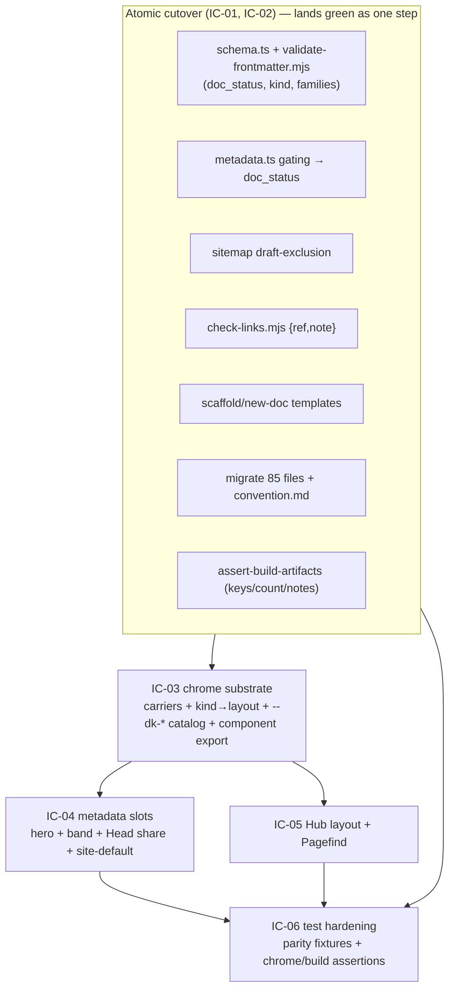

# Implementation Plan: Metadata model and chrome

**Branch**: `feat/metadata-model-and-chrome` | **Date**: 2026-08-23 | **Spec**: [spec.md](./spec.md)
**Input**: Feature specification from `kitty-specs/metadata-model-and-chrome-01M0PFQT/spec.md` (rev 2)

## Summary

Promote the finalized frontmatter contract (ADR-0005/0009/0010/0011) into the
toolkit: rename `status` → `doc_status`, add required `kind`, carry the full
optional families, enforce it in the standalone validator and the Astro schema,
migrate the whole tree, and render the metadata-driven chrome on the ADR-0011
slot surface in its M1 degenerate single-layer form (ADR-0013). The contract
change is an **atomic cutover** (C-010): schema, validator, gating, agent record,
sitemap exclusion, link checker, generators, the 85-file migration, and the
build assertions land so no work-package boundary leaves `doc-sanity` or
`build-example` red. Chrome (carriers, slots, Hub layout, token catalog) fans out
only after the cutover is green.



## Technical Context

**Language/Version**: TypeScript 5.x (ESM) and Node.js ≥22 (repo `engines.node: ">=22"`, `.nvmrc`); plain Node ESM for the standalone `.mjs` scripts.
**Primary Dependencies**: Astro 5, `@astrojs/starlight` ≥0.30, `@astrojs/sitemap`, `zod` ^3.23, `gray-matter`; Astro `.astro` components for the carriers/layouts. No new dependency is added (NFR-006).
**Storage**: Filesystem only — Markdown frontmatter under `docs/` and `example/docs/`; the authored `docs/_meta/sections.yaml` registry. No database.
**Testing**: Vitest unit tests in `src/tests/` (framework-agnostic model + a shared validator/schema parity fixture corpus); post-build assertions in `src/scripts/assert-build-artifacts.mjs` over `example/dist/`; the standalone `validate-frontmatter.mjs` + `check-links.mjs` gates; markdownlint + Vale (error) for prose.
**Target Platform**: Static site (GitHub Pages) built by Astro; the toolkit is a published pnpm workspace package consumed by `example/`.
**Project Type**: single (pnpm monorepo: `src/` toolkit + `example/` consumer site).
**Performance Goals**: Build-time only — hero images served through Astro's optimized pipeline (hashed `/_astro/…`, modern format); no runtime perf budget. Pagefind search coverage must not regress (NFR-004).
**Constraints**: Atomic cutover (C-010) — no red intermediate WP boundary; WCAG 2.2 AA verified by construction + HTML assertion (NFR-001, Playwright deferred to M2); example count pinned at 12 (C-009); carriers use `Astro.locals.starlightRoute` (C-004); custom frontmatter via `docsSchema({ extend })` (C-005); `--dk-*`-only theme surface (C-007); ADR-0013 single-layer substrate (C-002); rename tooling on git-tracked paths only (C-006).
**Scale/Scope**: 85 frontmatter files migrated (72 in `docs/`, 13 in `example/docs/`, incl. both bundle-root READMEs); 25 FR + 6 NFR + 10 C; 4 carriers + 2 layouts (Default, Hub) + the complete `--dk-*` catalog; one new ADR (0013).

### Supply-chain security posture (DIRECTIVE_051)

No dependency is added, upgraded, or removed (NFR-006). The `.astro` carriers and
layouts use the already-present Astro/Starlight peer deps; the token catalog is
plain CSS. Registry authenticity / lifecycle-script review is therefore **N/A this
mission** — recorded as examined, not silently skipped. If a WP finds an
unavoidable new dep (not expected), it must run the `supply-chain-install-safety`
check and record the disposition in `research.md` before adding it.

## Charter Check

*GATE: Must pass before Phase 0 research. Re-check after Phase 1 design.*

Charter present (`.kittify/charter/charter.md`, `software-dev` doctrine baseline).
Gates evaluated:

- **Amend-via-ADR / immutable ADRs** — PASS. The M1 substrate deviation is
  recorded as the new ADR-0013; no accepted ADR is edited.
- **Dogfood the convention / living documentation** — PASS. FR-019/FR-020 migrate
  the tree and amend `convention.md` in the same mission; ADR-0013 itself carries
  the contract and is migrated in the cutover.
- **Path-scoped CI, single `ci-ok`** — PASS. NFR-002/C-010 keep all three lanes
  green; the plan sequences the cutover to avoid a red boundary.
- **Accessibility WCAG 2.2 AA** — PASS (by construction + HTML assertion; NFR-001).
- **Three separated axes (content / IA / presentation)** — PASS. M1 touches the
  contract (content metadata) and presentation (chrome) but leaves the section
  registry (`sections.yaml`) and page content unchanged except the mechanical
  migration.
- **Writing standard (audience-oriented, no AI tells, sentence-case headings)** —
  PASS for the new ADR-0013 and the `convention.md` amendment (verified against
  markdownlint + the Vale hedges gate).

No violations → Complexity Tracking below is empty.

## Project Structure

### Documentation (this mission)

```
kitty-specs/metadata-model-and-chrome-01M0PFQT/
├── plan.md              # This file
├── research.md          # Phase 0 output — settled decisions + mechanism choices
├── data-model.md        # Phase 1 output — the contract, agent record, kind→layout
├── quickstart.md        # Phase 1 output — build/validate/test commands
├── occurrence_map.yaml  # Bulk-edit classification for status → doc_status
├── contracts/           # Phase 1 output — validator/schema/chrome/agent-index/build contracts
└── tasks.md             # Phase 2 output (/spec-kitty.tasks — NOT created here)
```

### Source Code (repository root)

```
src/                                   # @commondocs-kitty/toolkit
├── index.ts
├── lib/
│   ├── schema.ts                      # docKittyFields: + doc_status, kind, hero_image, social_thumb,
│   │                                  #   related {ref,note}, external_references, audience, moscow
│   ├── metadata.ts                    # DocStatus, isPublished/gating → doc_status; AgentRecord + kind
│   ├── config.ts                      # defineDocKittyIntegrations: add Starlight components map (carriers)
│   └── routes/*                       # rss/llms/agent-index/agent-page → doc_status + kind (agent record)
├── components/                        # NEW — the four carriers (Head, PageTitle, MarkdownContent, Footer)
│   └── slots/                         #   dk:page-hero, dk:metadata-band
├── layouts/                           # NEW — Default.astro, Hub.astro + kind→layout map module
├── styles/
│   └── theme.css                      # EXPAND — complete neutral --dk-* catalog + --dk-*→--sl-* bridge
├── assets/                            # NEW — static site-default social image
├── scripts/
│   ├── validate-frontmatter.mjs       # + doc_status/kind/families; observable warnings; parity with schema
│   ├── check-links.mjs                # + resolve related {ref,note} object form
│   ├── assert-build-artifacts.mjs     # + doc_status/kind keys; sitemap draft absent; Hub in pagefind; note fix
│   ├── scaffold.mjs / new-doc.mjs     # emit doc_status + kind placeholder
│   └── ...
├── tests/
│   ├── metadata.test.ts               # gating → doc_status; kind
│   ├── agent-api.test.ts              # record doc_status + kind
│   ├── schema-validator-parity.test.ts# NEW — shared fixture corpus; both validators agree
│   └── fixtures/                      # NEW — valid + each invalid permutation
└── package.json                       # exports + files: ./components/*, ./layouts/*, ./styles/*, ./assets/*

example/
├── astro.config.mjs                   # wire the toolkit components map / layouts (via defineDocKittyIntegrations)
├── src/content.config.ts              # already uses docKittyDocsSchema()
└── docs/                              # 12 files migrated; re-tag one Hub + one hero_image demonstrator

docs/                                  # toolkit's own tree: 72 files migrated + ADR-0013 + convention.md amend
└── _meta/sections.yaml                # unchanged (registry authority)
```

**Structure Decision**: Single pnpm monorepo. The toolkit (`src/`) becomes a
component-shipping package for the first time (new `./components`, `./layouts`,
`./assets` exports; ADR-0013, FR-025); the `example/` site consumes them through
`defineDocKittyIntegrations`. The section registry and page content are untouched
beyond the mechanical migration.

## Complexity Tracking

*No Charter Check violations — section intentionally empty.*

## Implementation Concern Map

> Concerns are architectural areas, not work packages. `/spec-kitty.tasks`
> translates them into WPs. **Sequencing note:** IC-01 and IC-02 together are the
> atomic cutover (C-010) and should land as a single mergeable unit (one WP, or a
> set that merges together with no red boundary); IC-03…IC-06 fan out after.

### IC-01 — Contract schema and validator (the finalized contract)

- **Purpose**: Define the finalized contract once and enforce it in the two
  validators that must agree, with the strict/advisory split.
- **Relevant requirements**: FR-001…FR-009 (schema, validator, families), FR-024
  (generators), NFR-005 (parity).
- **Affected surfaces**: `src/lib/schema.ts`, `src/scripts/validate-frontmatter.mjs`,
  `src/scripts/check-links.mjs` (FR-006 object form), `src/scripts/scaffold.mjs`,
  `src/scripts/new-doc.mjs`, `src/tests/fixtures/`, `src/tests/schema-validator-parity.test.ts`.
- **Sequencing/depends-on**: none (root of the cutover).
- **Risks**: validator/schema drift (mitigate with the shared fixture corpus);
  the bulk-rename decoys (see `occurrence_map.yaml`); the `example/docs/` registry
  fallback (keep the built-in section→type map).

### IC-02 — Gating, agent surface, sitemap, and the migration

- **Purpose**: Move publication gating to `doc_status`, expose it in the agent
  record with `kind`, exclude drafts from the sitemap, and migrate the whole tree
  — the rest of the atomic cutover.
- **Relevant requirements**: FR-010 (gating), FR-018 (agent record), FR-023
  (sitemap exclusion), FR-019 (migration), FR-020 (convention amend), FR-021
  (build assertions).
- **Affected surfaces**: `src/lib/metadata.ts`, `src/lib/routes/*`,
  `example/astro.config.mjs` (sitemap filter), `src/scripts/assert-build-artifacts.mjs`,
  all `docs/**` + `example/docs/**` frontmatter, `docs/context/convention.md`,
  `docs/adr/0013-*` (already added).
- **Sequencing/depends-on**: IC-01 (schema/validator must accept the new contract
  before docs migrate). **Co-atomic with IC-01** (C-010): they land together.
- **Risks**: `isPublished` undefined→draft collapsing the count if any file lags;
  sitemap mechanism (Astro crawls HTML — use the `@astrojs/sitemap` `filter` keyed
  on the draft set); the HTTP `status: 404` decoy in `agent-page.ts`.

### IC-03 — Chrome substrate (carriers, kind→layout, token catalog, packaging)

- **Purpose**: Stand up the ADR-0013 single-layer slot surface the chrome renders on.
- **Relevant requirements**: FR-011 (carriers), FR-015 (kind→layout + Default),
  FR-017 (complete `--dk-*` catalog + bridge), FR-025 (component export), C-004/C-005/C-007.
- **Affected surfaces**: `src/components/*`, `src/layouts/*` (+ kind→layout map),
  `src/styles/theme.css`, `src/lib/config.ts` (components map), `src/package.json`
  (exports + files), `example/astro.config.mjs`.
- **Sequencing/depends-on**: IC-01/IC-02 (custom frontmatter must reach `entry.data`).
- **Risks**: Astro/Vite resolving `.astro` from a `workspace:*` dep; cascade
  position of the token sheet (tokens-before-overrides); carriers must read
  `starlightRoute` not `Astro.props`.

### IC-04 — Metadata slots (hero, band, share metadata)

- **Purpose**: Render the two purely-metadata-derived slots and the head share
  metadata with the fallback chain and a shipped site-default asset.
- **Relevant requirements**: FR-012 (page-hero), FR-013 (metadata-band), FR-014
  (Head + site-default), NFR-001 (text label + alt), NFR-003 (optimized image).
- **Affected surfaces**: `src/components/slots/*`, the `Head`/`PageTitle` carriers,
  `src/assets/` (site-default image).
- **Sequencing/depends-on**: IC-03.
- **Risks**: per-branch social image resolution; optimized-image `src` shape;
  AA-by-construction (min-size + AA token pairs).

### IC-05 — Hub layout and search coverage

- **Purpose**: The one bespoke in-frame per-kind layout, proving per-kind rendering.
- **Relevant requirements**: FR-016 (Hub), NFR-004 (Pagefind coverage).
- **Affected surfaces**: `src/layouts/Hub.astro`, the `MarkdownContent` carrier,
  one re-tagged example Hub page.
- **Sequencing/depends-on**: IC-03.
- **Risks**: keeping Hub content inside Starlight's searchable region (assert Hub
  body text in the built pagefind index).

### IC-06 — Test and assertion hardening

- **Purpose**: Regression-guard the contract and chrome across the two validators
  and the built example.
- **Relevant requirements**: FR-022, NFR-005; underpins SC-002…SC-005.
- **Affected surfaces**: `src/tests/*`, `src/scripts/assert-build-artifacts.mjs`.
- **Sequencing/depends-on**: IC-01…IC-05 (asserts their outputs).
- **Risks**: build assertions are the only signal for chrome/AA/pagefind in M1;
  they must be specific enough to fail on a stub (per the post-spec squad).
