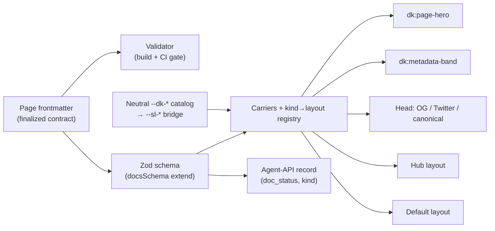

# Mission Specification: Metadata model and chrome

**Mission Branch**: `feat/metadata-model-and-chrome`
**Created**: 2026-08-23
**Status**: Draft (rev 2 — post-spec squad folded)
**Input**: Mission M1 — implement the finalized frontmatter metadata contract (ADR-0005 / ADR-0009 / ADR-0011), its validator, migration of the whole docs tree onto it, and the per-kind, metadata-driven page chrome on the ADR-0011 slot surface, keeping M0's live `ci-ok` pipeline green.

## Overview

doc-kitty renders a repository's `docs/` tree as a human-first, agent-supported
documentation site. Every page's frontmatter is the contract that navigation,
share cards, feeds, and the agent-API read from. Today the code enforces an
interim contract (`status`, no `kind`) and renders Starlight's default chrome
with custom feed/agent-API endpoints. This mission promotes the **finalized**
contract into the code, enforces it with the validator, migrates the whole tree
(and the normative convention) onto it, and renders the metadata-driven page
chrome on the theme's curated slot surface — so every later mission builds on a
stable, enforced foundation.

The settled design is authoritative and is **not** re-opened here: ADR-0005
(`doc_status`), ADR-0009 (finalized contract, `kind` taxonomy), ADR-0010
(planning kinds + `moscow`), ADR-0011 (slot surface + per-kind layouts +
`hero_image` rename), the new ADR-0013 (the M1 degenerate single-layer chrome
substrate this mission ships), and the architecture docs `metadata-model.md`,
`loader-and-schema.md`, `section-registry.md`, and `theming.md`. Any further
deviation from that design is recorded as a **new ADR**, never a silent change
(C-001).

### The contract cutover is one atomic landing

The validator, the build schema, the gating helpers, the agent record, the
build-free link checker, the doc generators, the whole-tree migration, and the
build-artifact assertions form **one atomic cutover**. The current validator
requires `status`; the current `isPublished` gates on `status`. Migrate a page to
`doc_status` while any of these still keys `status` and doc-sanity fails, or every
page is treated as `draft` and the pinned agent-index count collapses below 12
(build-example red). Therefore **no work-package boundary may leave `doc-sanity`
or `build-example` red** (C-010). The chrome (FR-011…FR-017, FR-025) fans
out only after the cutover lands green.

## User Scenarios & Testing *(mandatory)*

### User Story 1 - The finalized contract is enforced (Priority: P1)

A doc author writes a page's frontmatter using the finalized contract
(`doc_status`, `kind`, `type`, bounded `description`, `hero_image`, `related`,
and the rest). The toolkit validates it in two places that agree — the build
schema and the standalone CI gate — failing the build on a genuine contract
violation and warning (without failing) on an open-vocabulary deviation.

**Why this priority**: The contract is what every other feature and mission
reads. Without enforcement it drifts silently; this is the load-bearing slice.

**Independent Test**: Run the validator against the migrated tree (passes) and
against fixtures for each rule below (each fails or warns as specified), and run
both the standalone validator and the build schema against the same fixture
corpus and assert identical pass/fail verdicts.

**Acceptance Scenarios**:

1. **Given** a page missing `doc_status`, **When** the validator runs, **Then**
   it reports a blocking error and exits non-zero.
2. **Given** a page with no `kind`, **When** the validator runs, **Then** it
   reports a blocking error and exits non-zero.
3. **Given** a page with `doc_status: retired` (out of enum), **When** the
   validator runs, **Then** it reports a blocking error.
4. **Given** a page with `description` of 200 characters, **When** the validator
   runs, **Then** it reports a blocking error (upper bound 180).
5. **Given** a page with a 30-character `description`, **When** the validator
   runs, **Then** it emits a **warning** and exits zero (the 50-char lower bound
   is advisory — the preserved existing `DESCRIPTION_SOFT_MIN` behavior).
6. **Given** a page with `kind: Codelab` (not canonical), **When** the validator
   runs, **Then** it emits an **observably printed warning** (matched in output,
   not merely exit 0) and exits zero. Same for an unknown `type` and a
   section/`type` mismatch.
7. **Given** a page whose `related` lists a slug (bare **or** `{ ref, note }`)
   that resolves to no page, **When** the build-free link checker and the build
   run, **Then** each reports the dangling ref as an error.
8. **Given** the bundle-root `docs/README.md` carrying `okf_version`, a
   `doc_status`, and a `kind` but **no** `type`, **When** the validator runs,
   **Then** it passes (only `type` is exempt at the bundle root; `doc_status` and
   `kind` are still required).
9. **Given** a page with `moscow` present but no `rationale`, or a `related`
   object without `ref`, or an `audience` entry without `guidance_text`, or a
   `moscow.level` outside `Must|Should|Could|Won't`, **When** the validator runs,
   **Then** each reports a blocking error.
10. **Given** a page with an empty `related: []` or `audience: []` list, **When**
    the validator runs, **Then** it passes (empty lists are valid; no block
    renders).

### User Story 2 - Readers get metadata-driven page chrome (Priority: P1)

A reader opens a page and sees chrome the toolkit derived from that page's
metadata: a page hero when `hero_image` is set, a metadata band (a text-labelled
`doc_status` indicator, the `updated` date, and the `description`), correct
social/share cards in the head, and — when the page's `kind` is `Hub` — a
described-link list layout instead of the default prose layout. The layout is
selected by `kind` through a registry, in the normal Starlight frame (sidebar,
search, TOC, pagination intact).

**Why this priority**: The visible deliverable and the DoD's "per-kind chrome
renders on the built example."

**Independent Test**: Build the example and assert the rendered HTML/CSS contains
the metadata band and its text-labelled status indicator, an optimized hero
`` (a hashed `/_astro/…` `src` or a `srcset`) with alt text, the
OG/Twitter/canonical tags with the correct resolved image per branch, the Hub
described-link structure, the four carriers registered in Starlight's
`components` map, the full `--dk-*` catalog + bridge in the emitted stylesheet,
and the Hub body text present in the built Pagefind index.

**Acceptance Scenarios**:

1. **Given** a published page, **When** it renders, **Then** a metadata band
   appears below the `<h1>` with a **text-labelled** `doc_status` indicator (a
   text label, never colour-only), the `updated` date, and the `description`.
2. **Given** a page that sets `hero_image {src, alt}` (where `alt` is required),
   **When** it renders, **Then** a hero image appears above the `<h1>` whose `src`
   matches Astro's processed-asset pattern (hashed `/_astro/…` path or `srcset`)
   and which carries the provided alt text.
3. **Given** a page with `social_thumb` set, **When** the head renders, **Then**
   `og:image`/`twitter:image` resolve to `social_thumb`; **Given** only
   `hero_image` is set, **Then** they resolve to `hero_image.src`; **Given**
   neither is set, **Then** they resolve to the shipped site-default asset — the
   resolved value observably differs per branch. The head also carries `og:title`,
   `og:description`, `og:image:alt`, `twitter:card=summary_large_image`, and a
   canonical URL.
4. **Given** a page with `kind: Hub`, **When** it renders, **Then** it shows a
   lead paragraph and a named list of described links to its child pages, in the
   Starlight frame with the sidebar retained, and its body text is present in the
   built Pagefind fragment index (search coverage preserved).
5. **Given** a page with an unknown or absent `kind`, **When** it renders,
   **Then** it falls back to the `Default` prose layout and the build does not
   fail.
6. **Given** the built site, **When** the config and emitted assets are
   inspected, **Then** Starlight's `components` map points at doc-kitty's four
   carriers (`Head`, `PageTitle`, `MarkdownContent`, `Footer`) and the generated
   stylesheet declares the full neutral `--dk-*` catalog together with its
   `--dk-* → --sl-*` bridge assignments, positioned before Starlight's override
   sheets in the cascade.

### User Story 3 - Agents read a coherent machine surface (Priority: P2)

An agent or crawler reads `/api/index.json` and `/api/pages/<id>.json`. The
records reflect the finalized contract: publication gating keys off `doc_status`,
and each record exposes `doc_status` and `kind`. Draft pages are absent from the
sitemap, RSS, and agent-API.

**Why this priority**: The agent-interoperability promise; mostly mechanical but
must stay coherent with the finalized contract and keep the M0 build-artifact
assertions green.

**Independent Test**: Build the example; assert `/api/index.json` has
`count === pages.length === 12`, each record carries string `doc_status` and
`kind`, and the one `draft` page is absent from index, RSS, **and** the sitemap
(loc count / draft-URL absence).

**Acceptance Scenarios**:

1. **Given** the migrated example tree, **When** the agent index is generated,
   **Then** every record carries a `doc_status` and a `kind` field.
2. **Given** a page with `doc_status: draft`, **When** the surfaces are
   generated, **Then** it appears in none of the agent-API, RSS, **or** sitemap
   (the sitemap gains a draft-exclusion filter; the assertion checks the draft URL
   is absent and the loc count matches the published set).
3. **Given** a section whose registry `feeds` omits `rss`, **When** the surfaces
   are generated, **Then** its published pages stay out of RSS while remaining in
   the sitemap — the `feeds` section filter still composes with `doc_status`
   gating after the rename.
4. **Given** the build-artifact assertion runs, **When** it checks the pinned
   agent-index shape and keys, **Then** the updated shape (with `doc_status` and
   `kind`) and `count === 12` pass, and the stale "M1 out of scope" note is gone.

### User Story 4 - The whole tree dogfoods the finalized contract (Priority: P1, co-atomic with US1)

The existing `docs/` and `example/docs/` frontmatter is migrated onto the
finalized contract (`status` → `doc_status`, a `kind` chosen per page,
`banner` → `hero_image` if any), the doc generators (`scaffold.mjs`,
`new-doc.mjs`) are updated to mint conformant frontmatter, and the normative
`docs/context/convention.md` is amended to describe the finalized contract. The
migrated tree passes doc-sanity (frontmatter validation, link/`related`
integrity, markdownlint, Vale).

**Why this priority**: Raised to P1 — it is part of the atomic cutover (C-010),
not a trailing step; an unmigrated tree fails its own new validator.

**Independent Test**: Grep git-tracked files for `^status:` (none remain outside
history) and for pages missing `kind` (none); run doc-sanity across `docs/` and
`example/docs/` (passes); scaffold a fresh doc and validate it (passes).

**Acceptance Scenarios**:

1. **Given** the migration is complete, **When** the git-tracked tree is scanned,
   **Then** no non-reserved page carries the legacy `status:` frontmatter key and
   every page carries `doc_status` and `kind`.
2. **Given** `docs/context/convention.md`, **When** it is read, **Then** it
   describes `doc_status` and `kind` (not the interim `status`), matching the
   finalized contract and the validator.
3. **Given** the migrated tree, **When** doc-sanity runs, **Then** frontmatter
   validation, link/`related` integrity (bare **and** object form), markdownlint,
   and Vale all pass.
4. **Given** `scaffold.mjs` or `new-doc.mjs` is run after the cutover, **When**
   the generated page is validated, **Then** it carries `doc_status` and a `kind`
   and passes the validator (the generators no longer emit `status`).

### Edge Cases

- `social_thumb` set but no `hero_image`: share card uses `social_thumb`; no hero.
- `hero_image` set but no `social_thumb`: the hero also drives the share image;
  neither set → the shipped site-default share asset.
- A canonical `kind` with no bespoke layout in M1 (`Persona`, `Reference`, …):
  resolves to `Default` (only `Hub` has a bespoke layout this mission); no failure.
- `social_thumb` as a bare string vs `{ src, alt }` object: both validate.
- A top-level `docs/` folder with no `sections.yaml` entry, or a registry entry
  with no folder: warns and degrades, never fails (ADR-0004 posture).
- `external_references` catalog `{type, id}`: the **shape** validates in M1;
  catalog resolution against `bibliography`/`tools` is deferred (M3), so an
  unresolved catalog id does not fail the M1 build.
- The `status: 404` in `src/lib/routes/agent-page.ts` is an HTTP response status,
  **not** the frontmatter field — a bulk-rename decoy that must not change.
- Stale `.worktrees/` M0 copies are gitignored; rename tooling operates on
  **git-tracked paths only** so those copies are never swept.

## Requirements *(mandatory)*

### Functional Requirements

| ID | Title | User Story | Priority | Status |
|----|-------|------------|----------|--------|
| FR-001 | `doc_status` rename | As a doc author, I want `status` renamed to `doc_status` (same enum) across the schema, the standalone validator, the framework-agnostic model, the agent record, the tests, **and the doc generators**, so gating keys off it and no new-authored surface emits the legacy key. | High | Open |
| FR-002 | `kind` required (incl. bundle root), open vocabulary | As a doc author, I want a required `kind` field — on **every** page including the bundle-root `docs/README.md` — validated against the canonical set (the four Divio quadrants + Hub, ADR, Changelog, Glossary, Presentation, Persona, and the ADR-0010 planning kinds Planning/Feature/User-Journey) with unknown values warned (observably) not failed. | High | Open |
| FR-003 | Authored `type` validated against the section, with graceful fallback | As a doc author, I want `type` validated against the section default (from `docs/_meta/sections.yaml` where a registry is present, plus the loader's short sub-path override table) with a mismatch warned; a root without a registry (`example/docs/`) degrades via the built-in section→type map, never failing; bundle-root `docs/README.md` exempt from `type`. | High | Open |
| FR-004 | Bounded `description` | As a reader/agent, I want `description` required, an upper bound of 180 chars enforced as an error and a 50-char lower bound as a warning (preserving the existing validator posture), so feeds and cards read without truncation. | High | Open |
| FR-005 | `hero_image` (alt required) and `social_thumb` schema | As a doc author, I want `hero_image {src, alt}` with `alt` **required** (accessibility) and `social_thumb ({src, alt} \| string)` in the contract (superseding `banner`). | High | Open |
| FR-006 | `related` finalized shape + object-form integrity | As a doc author, I want `related` to accept a bare slug **or** `{ ref, note }`, with **both** the build and the build-free link checker (`check-links.mjs`, taught the object form) failing on a ref that does not resolve. (Schema + integrity only; the on-page block is M3.) | High | Open |
| FR-007 | `external_references`, `audience`, `moscow` schema | As a doc author, I want `external_references ({url,title,note?} \| {type,id})`, `audience [{profile, guidance_text}]`, and `moscow {level, rationale}` (level enum; rationale required when present) validated by shape, so the finalized contract is fully carried even where rendering lands later (M3). | Medium | Open |
| FR-008 | Standalone validator enforces the finalized contract | As CI, I want `validate-frontmatter.mjs` to enforce FR-001…FR-007 in build-free Node (no Astro import), keeping the strict/advisory split, so `doc-sanity` gates the contract. | High | Open |
| FR-009 | Build schema mirrors the contract | As the Astro build, I want `src/lib/schema.ts` (`docsSchema({ extend })`) to mirror the finalized contract so custom frontmatter reaches `entry.data`, kept in sync with the standalone validator. | High | Open |
| FR-010 | Publication gating on `doc_status` | As a generator, I want `isPublished`/discovery in `src/lib/metadata.ts` and the RSS/llms/agent surfaces to gate on `doc_status`, so `draft` pages are excluded and the others published. | High | Open |
| FR-011 | Slot-surface carriers | As the toolkit, I want four Starlight component overrides registered (`Head`, `PageTitle`, `MarkdownContent`, `Footer`) reading `Astro.locals.starlightRoute`, hosting doc-kitty's `dk:` slots, wired through `defineDocKittyIntegrations`, so chrome renders on a curated surface. | High | Open |
| FR-012 | `dk:page-hero` slot | As a reader, I want a page hero rendered from `hero_image {src, alt}` through Astro's optimized image pipeline, above the `<h1>`. | High | Open |
| FR-013 | `dk:metadata-band` slot | As a reader, I want a band below the `<h1>` showing a text-labelled `doc_status` indicator, the `updated` date, and the `description`. | High | Open |
| FR-014 | `Head` share metadata + site-default asset | As a crawler, I want the `Head` carrier to emit `og:*`, `twitter:card`, `twitter:image`, and a canonical URL with the `social_thumb` → `hero_image.src` → **shipped site-default asset** fallback chain, where M1 ships a static neutral default share asset consumed directly by `Head`. | High | Open |
| FR-015 | `kind → layout` registry + `Default` layout | As the toolkit, I want the `MarkdownContent` carrier to resolve `entry.data.kind` through a static `kind → layout` map (ADR-0013) to an in-frame layout, falling back to `Default`, so layout is metadata-driven without losing the Starlight frame. | High | Open |
| FR-016 | Bespoke `Hub` layout | As a reader, I want a `kind: Hub` page rendered in-frame as a lead paragraph plus a named list of described links to its child pages (card-wide targets ≥24px), content kept inside the searchable region. M1 inlines the card pattern; M3 may extract a shared primitive. | Medium | Open |
| FR-017 | Neutral Default `--dk-*` token catalog + bridge | As the toolkit, I want the **complete** neutral Default `--dk-*` token catalog and a base stylesheet bridging `--dk-*` → `--sl-*`, shipped as a static cascade-positioned sheet (ADR-0013), driving the M1 chrome. | Medium | Open |
| FR-018 | Agent-API exposes `doc_status` and `kind` | As an agent, I want the agent record and per-page JSON to rename `status` → `doc_status` and add `kind`. | Medium | Open |
| FR-019 | Migrate `docs/` and `example/docs/` frontmatter | As a maintainer, I want every non-reserved page in `docs/` and `example/docs/` migrated (`status` → `doc_status`, a per-page `kind`, `banner` → `hero_image` if present) via git-tracked paths only, with the Hub and hero **demonstrators re-tagging existing example pages** (no file-count change). | High | Open |
| FR-020 | Amend the normative `convention.md` | As a maintainer, I want `docs/context/convention.md` amended to describe `doc_status` and `kind`, so the source-of-truth spec matches the validator and schema. | Medium | Open |
| FR-021 | Update build-artifact assertions | As CI, I want `assert-build-artifacts.mjs` updated so `EXPECTED_PAGE_KEYS`/shape include `doc_status` and `kind`, the index `count` stays 12, the draft is asserted absent from the sitemap, the Hub body is asserted present in the Pagefind index, and the stale "M1 out of scope" note is corrected. | High | Open |
| FR-022 | Tests for schema, gating, and chrome | As a maintainer, I want unit tests for `doc_status` gating and `kind`; a shared fixture corpus asserting the standalone validator and the build schema agree per fixture; and build-time assertions for the metadata band, hero, per-branch share images, carriers/config, the token catalog, and the Hub layout. | High | Open |
| FR-023 | Sitemap draft-exclusion | As a maintainer, I want the sitemap generation to exclude `draft` pages (via the `@astrojs/sitemap` filter or equivalent), so `draft` is absent from the sitemap as the convention requires — a mechanism the current HTML-crawling sitemap lacks. | High | Open |
| FR-024 | Doc generators emit the finalized contract | As an author, I want `scaffold.mjs` and `new-doc.mjs` templates to emit `doc_status` and a `kind` placeholder (not `status`), so a freshly generated page is born conformant. | Medium | Open |
| FR-025 | Toolkit ships carriers as a component export | As the example site, I want the toolkit to expose its four `.astro` carriers (and the `Default`/`Hub` layouts) through a `./components/*` (and `./layouts/*`) export added to `package.json` `exports` + `files`, so `astro.config.mjs` resolves them from the `workspace:*` dependency. | High | Open |

### Non-Functional Requirements

| ID | Title | Requirement | Category | Priority | Status |
|----|-------|-------------|----------|----------|--------|
| NFR-001 | Accessibility AA (verifiable in M1) | The `doc_status` indicator carries a text label and hero images carry alt text — **verified by HTML assertion**. Contrast ≥4.5:1, interactive targets ≥24px, and visible focus are **verified by construction**: the emitted CSS declares `min-height`/`min-width ≥24px` on interactive targets and a `:focus-visible` rule, and the chrome uses only the pre-verified AA `--dk-*` state/`-bg` token pairs; residual pixel-level checks are recorded on a manual checklist (Playwright is M2). | Accessibility | High | Open |
| NFR-002 | `ci-ok` stays green | All three M0 lanes pass on the PR: `code-quality` (vitest + lint + typecheck), `doc-sanity` (validate-frontmatter + links + markdownlint + Vale error-level), `build-example` (build + updated assertions). | Reliability | High | Open |
| NFR-003 | Optimized hero images | Hero `` `src` is Astro's processed asset (hashed `/_astro/…` or `srcset`) in a modern format; `social_thumb` resolves to a stable absolute URL for crawlers. | Performance | Medium | Open |
| NFR-004 | Search coverage preserved | The Hub layout keeps content inside Starlight's searchable region; verified by asserting the Hub page's lead/link text appears in the built `dist/pagefind/` fragment index. | Reliability | High | Open |
| NFR-005 | Validator parity | The standalone validator and the build schema agree on required fields, enums, and the description bounds — verified by running both against a shared fixture corpus and asserting identical pass/fail per fixture. | Maintainability | High | Open |
| NFR-006 | Self-contained, no new heavy deps | No new runtime/build dependency beyond what ships (Astro/Starlight/zod/gray-matter); no dependency on any external brand/design repo; verified by a lockfile/manifest diff. | Portability | Medium | Open |

### Constraints

| ID | Title | Constraint | Category | Priority | Status |
|----|-------|------------|----------|----------|--------|
| C-001 | Settled design is authoritative | Implement to ADR-0005/0009/0010/0011/0013 and the architecture docs; any further deviation is a **new ADR**, not a silent change. | Governance | High | Open |
| C-002 | M2 boundary | No brand theme, no default→brand→consumer 3-layer merge, no virtual-manifest transport, no Persona/Presentation bespoke layouts, no Playwright — those are M2. M1 ships only the complete neutral Default token layer + the substrate + the one Hub layout (ADR-0013). | Scope | High | Open |
| C-003 | M3 boundary | No on-page audience/related/external-reference **blocks**, no persona pages, no citation catalog resolution — those are M3. M1 carries their **schema shapes** only. | Scope | High | Open |
| C-004 | Starlight coupling points | Carriers use `Astro.locals.starlightRoute` (Starlight ≥0.30), not `Astro.props`; Starlight's `components` map is always doc-kitty's carriers; a Starlight rename is a one-file carrier fix. | Technical | High | Open |
| C-005 | Custom frontmatter path | Custom fields reach `entry.data` only via `docsSchema({ extend })`; the toolkit exports the extend schema and the example wires it. | Technical | High | Open |
| C-006 | Governed bulk edit, git-tracked scope | The `status` → `doc_status` rename is a governed bulk edit: an `occurrence_map.yaml` (plan phase) classifies each occurrence as migrate (85 frontmatter files: 72 docs + 13 example/docs, incl. both bundle-root READMEs), rename (code symbols: `DocStatus`, `isPublished`, `AgentRecord.status`, `toAgentRecord` default, tests, generators), or **do-not-touch** (the HTTP `status: 404` decoy in `agent-page.ts`). Tooling operates on git-tracked paths only (never the stale `.worktrees/` M0 copies). | Process | High | Open |
| C-007 | `--dk-*` is the only theme surface | Themes/consumers set `--dk-*` only; the base stylesheet assigns each into its `--sl-*` counterpart, positioned before Starlight override sheets in the cascade. | Technical | Medium | Open |
| C-008 | Node 22+, pnpm, Astro 5 / Starlight | Node ≥22, pnpm workspace, Astro 5, Starlight; direct-render default (ADR-0006). | Technical | High | Open |
| C-009 | Example count invariant | The example keeps 12 published/discoverable pages (13 files − 1 draft); demonstrators re-tag existing pages. Any deliberate change updates the pinned `EXPECTED_INDEX_ENTRY_COUNT` in the same change. | Technical | Medium | Open |
| C-010 | Atomic cutover | The contract cutover (FR-001/008/009/010/018/019/020/021/023/024 + validator/schema/links/generators + the 85-file migration) lands such that no work-package boundary leaves `doc-sanity` or `build-example` red. Chrome (FR-011…FR-017, FR-025) fans out only after the cutover is green. | Process | High | Open |

### Key Entities

- **Page frontmatter (the contract)**: the finalized field set every page carries
  — `title`, `description` (≤180, soft-min 50), `doc_status`, `updated`, `type`,
  `kind`, and the optional families (`hero_image` [alt required], `social_thumb`,
  `related`, `external_references`, `audience`, `moscow`, `agent`, `tags`,
  authorship/freshness).
- **Section registry entry**: `id`/`label`/`order`/`type`/`purpose`/`feeds` in
  `docs/_meta/sections.yaml`; the authority for section-default `type` and feed
  filtering (sub-path `type` overrides live in the loader/validator table).
- **Agent record**: the per-page machine projection in `/api/index.json` and
  `/api/pages/<id>.json`; now carrying `doc_status` and `kind`.
- **Chrome substrate (ADR-0013, single default layer in M1)**: the four carriers,
  the static `kind → layout` map (`Default` + `Hub`), and the complete neutral
  `--dk-*` token stylesheet with its `--sl-*` bridge.

## Success Criteria *(mandatory)*

### Measurable Outcomes

- **SC-001**: 100% of non-reserved git-tracked pages in `docs/` and `example/docs/`
  carry `doc_status` and `kind` and pass the validator; zero pages retain the
  legacy `status:` frontmatter key; a freshly scaffolded page passes.
- **SC-002**: The validator **fails** on each of: a missing required field
  (incl. `kind`), a `description` over 180 chars, an out-of-enum `doc_status` or
  `moscow.level`, a `related`/`audience`/`moscow` object missing a required
  sub-field, and a `related` ref (bare or object) that does not resolve; and
  **warns without failing** (with an observably printed message) on an unknown
  `kind`, an unknown `type`, a section/`type` mismatch, and an under-50
  `description`.
- **SC-003**: Every published page in the built example renders a metadata band
  with a text-labelled status indicator, every page's head carries complete
  OG/Twitter/canonical share metadata with the correct resolved image per
  fallback branch, and the four carriers + full `--dk-*` catalog + bridge are
  present in the built config/assets.
- **SC-004**: A `kind: Hub` page renders as a described-link list visibly distinct
  from a prose page, in the Starlight frame with the sidebar present, and its body
  text appears in the built Pagefind index.
- **SC-005**: `/api/index.json` reports `count === pages.length === 12`, every
  record exposes `doc_status` and `kind`, and the single `draft` page is absent
  from the agent-API, RSS, **and** the sitemap.
- **SC-006**: `ci-ok` is green on the PR — all three lanes pass — with no
  intermediate mission commit leaving `doc-sanity` or `build-example` red, and the
  branch is mergeable into `main` once branch protection is satisfied.
