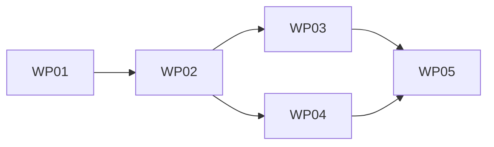

# Tasks: Metadata model and chrome (M1)

**Mission**: metadata-model-and-chrome-01M0PFQT · **Branch**: `feat/metadata-model-and-chrome`
**Spec**: [spec.md](./spec.md) · **Plan**: [plan.md](./plan.md) · **Occurrence map**: [occurrence_map.yaml](./occurrence_map.yaml)

## Sequencing (C-010 atomic cutover)

WP01 is the **atomic contract cutover** — it lands the schema, validator,
gating, agent record, generators, and the whole-tree migration together so
`doc-sanity` and `build-example` stay green (it updates the agent-index assertion
keys/count with the record change; it does **not** tighten the sitemap assertion,
which stays well-formedness-only until WP02 ships the filter). Chrome fans out
after: WP02 (substrate + sitemap exclusion) → WP03 (slots) / WP04 (Hub) →
WP05 (hardening + acceptance). Strict sequential chain; no parallel lanes.

## Subtask Index

| ID | Description | WP | Parallel |
|----|-------------|----|----------|
| T001 | Finalize the zod schema (`schema.ts`): doc_status, kind, families | WP01 | |
| T002 | Finalize the standalone validator (`validate-frontmatter.mjs`) + observable warnings | WP01 | |
| T003 | Teach `check-links.mjs` the `related {ref, note}` object form | WP01 | |
| T004 | Move gating to `doc_status` + agent record `doc_status`/`kind` (`metadata.ts`, `routes/*`) | WP01 | |
| T005 | Update doc generators (`scaffold.mjs`, `new-doc.mjs`) to emit doc_status + kind | WP01 | |
| T006 | Migrate all `docs/` + `example/docs/` frontmatter per the occurrence map | WP01 | |
| T007 | Amend the normative `docs/context/convention.md` | WP01 | |
| T008 | Update `assert-build-artifacts.mjs`: EXPECTED_PAGE_KEYS + doc_status/kind, count 12, drop stale note | WP01 | |
| T009 | Shared validator/schema parity fixtures + parity test | WP01 | |
| T010 | Update `metadata.test.ts` + `agent-api.test.ts` to doc_status/kind; full green sweep | WP01 | |
| T011 | Ship the four `.astro` carriers (Head, PageTitle, MarkdownContent, Footer) | WP02 | |
| T012 | Static `kind → layout` map + `Default` layout; resolve in MarkdownContent | WP02 | |
| T013 | Expand `theme.css` to the complete neutral `--dk-*` catalog + `--sl-*` bridge | WP02 | |
| T014 | Wire the components map + forward the token sheet in `defineDocKittyIntegrations` | WP02 | |
| T015 | Add `./components/*`, `./layouts/*`, `./assets/*` exports + `files[]` | WP02 | |
| T016 | Sitemap draft-exclusion filter + tighten the sitemap assertion | WP02 | |
| T017 | Verify carriers/token catalog/config in the built example | WP02 | |
| T018 | `dk:page-hero` slot from `hero_image` via the optimized image pipeline | WP03 | |
| T019 | `dk:metadata-band` slot (text-labelled doc_status pill, updated, description) | WP03 | |
| T020 | `Head` OG/Twitter/canonical + `social_thumb → hero_image.src → site-default` chain | WP03 | |
| T021 | Ship the static site-default social asset | WP03 | |
| T022 | Re-tag one example page with `hero_image`; assert hero + per-branch share images | WP03 | |
| T023 | `Hub` layout: lead + named described-link list of child pages (in-frame) | WP04 | |
| T024 | Re-tag one existing example section index as `kind: Hub` | WP04 | |
| T025 | AA-by-construction CSS (≥24px targets, `:focus-visible`, AA token pairs) | WP04 | |
| T026 | Assert Hub body text present in the built pagefind index | WP04 | |
| T027 | Chrome build assertions: band, hero, share tags, carriers, token catalog | WP05 | |
| T028 | Full `ci-ok` local sweep across all three lanes | WP05 | |
| T029 | Verify the atomic-cutover invariant (no red boundary) + occurrence-map verification | WP05 | |
| T030 | Update `assert:artifacts` note/comments; confirm count 12 + draft exclusions | WP05 | |
| T031 | Acceptance walkthrough vs. quickstart + success criteria SC-001…SC-006 | WP05 | |

## Work Packages

### WP01 — Atomic contract cutover
- **Goal**: Land the finalized contract, its two agreeing validators, gating,
  agent record, generators, and the whole-tree migration as one green step (C-010).
- **Priority**: P1 (critical path) · **Prompt**: [tasks/WP01-atomic-contract-cutover.md](./tasks/WP01-atomic-contract-cutover.md)
- **Independent test**: `git grep '^status:'` is empty; every page has doc_status+kind; `pnpm test`, `pnpm validate:docs`, `pnpm validate:example`, `pnpm validate:links`, `pnpm --filter example build`, `pnpm assert:artifacts` all pass.
- **Subtasks**: T001–T010 · **Dependencies**: none · **Est.**: ~500 lines

### WP02 — Chrome substrate + sitemap exclusion
- **Goal**: Stand up the ADR-0013 single-layer slot surface (carriers, kind→layout,
  token catalog, component export) and add sitemap draft-exclusion.
- **Priority**: P1 · **Prompt**: [tasks/WP02-chrome-substrate.md](./tasks/WP02-chrome-substrate.md)
- **Independent test**: built example shows the four carriers in the components map, the full `--dk-*` catalog + bridge in the emitted CSS, kind→Default resolution, and the draft absent from the sitemap; build-example green.
- **Subtasks**: T011–T017 · **Dependencies**: WP01 · **Est.**: ~420 lines

### WP03 — Metadata slots (hero, band, share)
- **Goal**: Render the two metadata-derived slots and the head share metadata with
  the fallback chain + a shipped site-default asset.
- **Priority**: P1 · **Prompt**: [tasks/WP03-metadata-slots.md](./tasks/WP03-metadata-slots.md)
- **Independent test**: a published page shows the metadata band + text-labelled status; a hero page shows an optimized `` with alt; the head carries OG/Twitter/canonical resolving correctly per branch.
- **Subtasks**: T018–T022 · **Dependencies**: WP02 · **Est.**: ~360 lines

### WP04 — Hub layout + search coverage
- **Goal**: The one bespoke in-frame per-kind layout, proving per-kind rendering,
  with AA-by-construction and preserved search coverage.
- **Priority**: P2 · **Prompt**: [tasks/WP04-hub-layout.md](./tasks/WP04-hub-layout.md)
- **Independent test**: a `kind: Hub` page renders a described-link list in-frame with the sidebar, ≥24px targets, and its body text appears in the built pagefind index.
- **Subtasks**: T023–T026 · **Dependencies**: WP02 · **Est.**: ~300 lines

### WP05 — Test & assertion hardening + acceptance
- **Goal**: Make the chrome/AA/pagefind assertions specific enough to fail on a
  stub, and prove the whole mission green against the success criteria.
- **Priority**: P2 · **Prompt**: [tasks/WP05-hardening-acceptance.md](./tasks/WP05-hardening-acceptance.md)
- **Independent test**: `pnpm assert:artifacts` fails if any chrome element is stubbed; all three lanes green; SC-001…SC-006 verified.
- **Subtasks**: T027–T031 · **Dependencies**: WP03, WP04 · **Est.**: ~300 lines

## MVP scope

WP01 alone is a coherent MVP: the finalized contract enforced and the whole tree
migrated and green — valuable even before any chrome renders.
