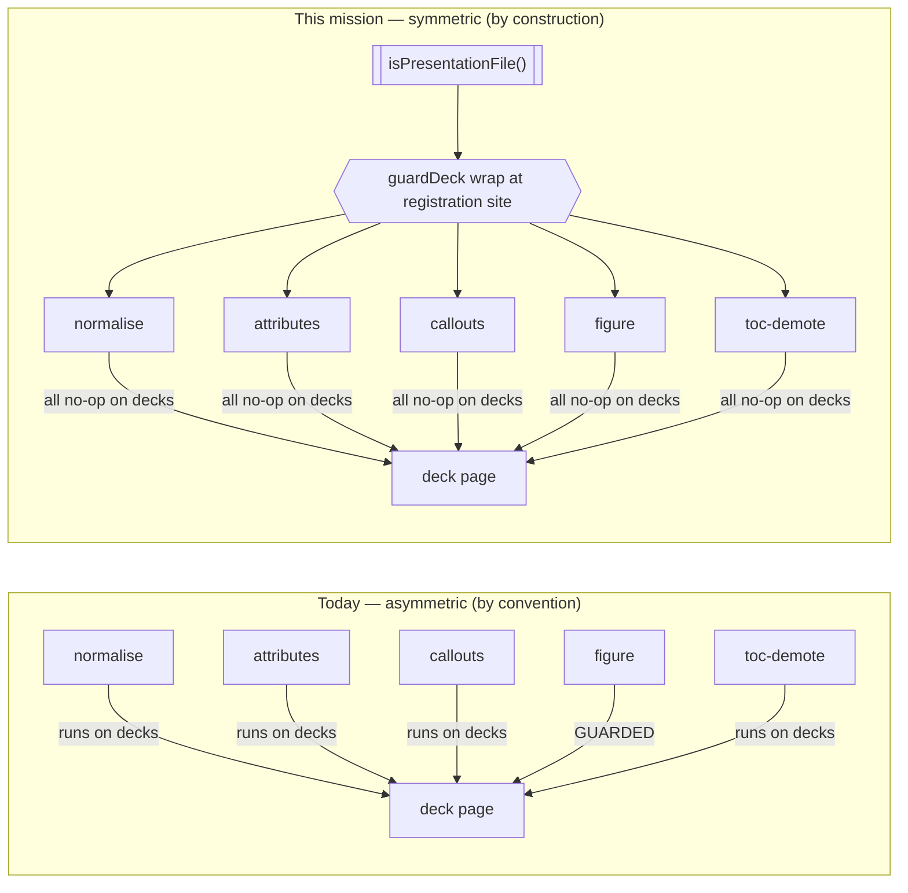

# Mission Specification: Post-Markua Hardening

**Mission Branch**: `feat/post-markua-hardening`  
**Created**: 2026-08-30  
**Status**: Draft  
**Input**: Resolve GitHub issues #34, #35, #36 — the three follow-ups filed after the Markua-subset merge (PR #33, on `main` @ `b56f307`). Brownfield hardening: base behaviour and the merged Markua feature stay intact; every fix closes a defect class with a regression test; the a11y lane must go green.

## Context & Intent Summary

Three follow-ups were filed after the Markua-subset feature merged. They share one theme — **boundaries that are correct today but guarded only by convention** — and this mission converts each convention into a structural guard with a regression test that closes the class (charter DIRECTIVE_040 / DIRECTIVE_043).

- **#34 — a11y flake (the immediate pain).** The deck-diagram theme-toggle colour-equality test flakes in headless CI: the toggle fires a destructive-then-async Mermaid re-render, and the colour read can land during the flush window when the computed fill is still `''`. `toRgbTriple('')` *throws*, and `expect.poll` does **not** retry on a thrown callback — so the bounded wait that was meant to absorb the flush is defeated on the first unlucky tick. Every PR risks a spurious red needing a manual re-run.
- **#35 — re-derive parity drift.** `page-processor.ts` is a hand-maintained mirror of the build remark stack for render-time re-derive sites. It absorbed gfm (#16), smartypants (#20), and directive one feature at a time; the Markua passes were recorded only as a prose breadcrumb. The mirror tracks the build stack **by convention, not by construction** — the exact recurring-boundary class that produced #16/#20.
- **#36 — deck-scope guard asymmetry.** The `markua` preset applies globally. Only `markua-figure` (1 of 5 passes) no-ops on Presentation (deck) pages; the other four still run on decks. Worse than "inert": the three Markua **remark** passes run *before* `deckSplit`, so a future `{…}` slide line would be silently spliced out and an `{aside}` wrapper could swallow a `###` slide boundary.

**Owner decision (recorded):** #36 resolves to **(a) decks are Markua-agnostic now** — all five passes no-op on Presentation pages via one shared predicate consulted at the plugin registration site. **(b) decks-Markua-capable** is out of scope and filed as a tracked follow-up.

**Primary actors:** doc-kitty maintainers and the CI a11y/unit lanes.  
**Audience for artifacts:** doc-kitty maintainers (charter DIRECTIVE_047).

### The correctness invariant #36 establishes

The point of the wrap is that deck-agnosticism becomes a property of **array membership**, so a future sixth pass cannot silently re-open the N-1 asymmetry.

## User Scenarios & Testing *(mandatory)*

### User Story 1 - The a11y lane stops flaking (Priority: P1)

A maintainer opens a PR that runs the a11y lane. The deck-diagram theme-toggle invariant test must pass or fail on the actual invariant — never on a render-timing race that produces an empty-colour parse abort.

**Why this priority**: This is the live, recurring pain — every PR risks a spurious red and a manual re-run (PR #33 needed two). It is also the smallest, lowest-risk fix (test-only).

**Independent Test**: Run `tests/a11y/diagram.spec.ts` theme-toggle test repeatedly across both colour-mode projects in headless mode; it passes every run with zero `Cannot parse colour ''` aborts.

**Acceptance Scenarios**:

1. **Given** a deck-diagram page under a headless a11y run, **When** the theme is toggled and the re-render is still flushing (computed fill momentarily `''`), **Then** the colour-equality read retries within a bounded wait until the fill resolves, and never aborts the test on an empty-colour parse.
2. **Given** either toggle direction (light→dark and dark→light) and the pre-toggle baseline read, **When** the fill is read, **Then** the same empty-tolerant primitive guards every read (not only the one polled site).
3. **Given** a future deck theme-toggle test in `deck.interaction.spec.ts`, **When** it reads a re-rendered node fill, **Then** it uses the shared empty-tolerant colour helper (the throwing duplicate has been removed), so the flake class cannot reappear in the twin file.

---

### User Story 2 - Decks are safe from unintended Markua transformation (Priority: P2)

A maintainer authors a slide deck (`kind: Presentation`). Markua syntax on a slide (e.g. a literal `{…}` line, a `W>` aside, a `:::` block) must not be silently transformed or consumed by the globally-enabled Markua passes, and the deck-scope guard must be consistent across every pass.

**Why this priority**: Latent correctness hazard — a silently-consumed slide line or a swallowed slide boundary would be a confusing, hard-to-diagnose deck bug. Closing the asymmetry structurally prevents the next pass from re-introducing it.

**Independent Test**: A deck fixture containing Markua markers builds to the same slide structure as the same deck without those markers being transformed; a test asserts all five passes no-op on Presentation pages.

**Acceptance Scenarios**:

1. **Given** a Presentation page whose body contains `{…}`, `W>`, and `:::` markers, **When** the build runs with the Markua preset enabled, **Then** none of the five Markua passes transform the deck body — no slide line spliced out, no `###`/`##` slide boundary swallowed.
2. **Given** the deck-detection logic, **When** any Markua pass (and the existing deck-aware consumers deck-split and glossary-autolink) checks whether a page is a deck, **Then** it consults one shared predicate — there is no second copy of the `kind === 'Presentation'` check.
3. **Given** a hypothetical sixth Markua pass added to the registration array later, **When** it is registered the normal way, **Then** it is deck-guarded automatically by array membership without the author adding a guard by hand.

---

### User Story 3 - Re-derive parity cannot silently drift (Priority: P2)

A maintainer adds a new remark stage to the build. The re-derive substrate (`page-processor.ts`) that render-time sites depend on must either mirror the new stage or record a conscious exclusion — and the test suite must fail if neither happens.

**Why this priority**: This is the recurring-boundary root cause behind #16/#20. A structural guard closes the class so no future stage relies on a maintainer remembering a prose breadcrumb.

**Independent Test**: A parity test enumerates the build's remark stages and fails when one is neither mirrored nor listed as a conscious exclusion; demonstrated by temporarily omitting a stage and observing a red.

**Acceptance Scenarios**:

1. **Given** the build remark stack (with the Markua, diagram, and glossary stages forced active), **When** the parity test runs, **Then** every enumerated remark stage is classified as either *mirrored in the re-derive substrate* or *a keyed conscious exclusion*, and the test passes.
2. **Given** a new remark stage registered in the build but not mirrored and not excluded, **When** the parity test runs, **Then** it fails naming the unclassified stage.
3. **Given** the Markua stages are preset-gated and off by default, **When** the parity test builds the stack, **Then** it forces the preset on so the stages appear in the enumeration and the test cannot false-green on an empty list (a stage-count floor also holds).

---

### User Story 4 - Two minor Markua edges are closed (Priority: P3)

**Why this priority**: Low-likelihood / trivial, but cheap to close while the code is open (charter DIRECTIVE_025 Boy Scout, domain-matched).

**Acceptance Scenarios**:

1. **Given** two `{…}` attribute-list paragraphs stacked directly above one target block, **When** `markua-attributes` runs, **Then** both attribute lists are applied to the target (merged, nearest-wins) — the outer is not lost.
2. **Given** the `markua-callouts` three-form-equivalence test, **When** it runs, **Then** the three forms exercise genuinely distinct pre-normalisation inputs (or the equivalence assertion lives where the fold actually happens), so the assertion is non-vacuous.

---

### Edge Cases

- **Theme-toggle flush window** (both directions): computed fill momentarily `''` → the read retries, never aborts.
- **Un-polled reads**: the pre-toggle baseline read and any static-chrome colour read are hardened by the same primitive, not left throwing.
- **Preset-gated build stage**: Markua stages are off by default; the parity guard forces them on so they appear in enumeration.
- **Version drift of a mirrored plugin**: gfm/smartypants are pinned by comment; an identity-based guard cannot see a version change on the same plugin — this residual axis is documented, not silently ignored.
- **Sixth Markua pass added later**: automatically deck-guarded by registration-array membership.
- **Cross-fix identity coupling**: the `guardDeck` wrap changes plugin identity; the #35 parity guard must classify on the wrapped identity (or the wrapper exposes the inner plugin) so #35 and #36 do not land a mutual red on the shared config array.

## Requirements *(mandatory)*

### Functional Requirements

| ID | Title | User Story | Priority | Status |
|----|-------|------------|----------|--------|
| FR-001 | Empty-tolerant theme-toggle colour read | As a maintainer, I want the deck-diagram theme-toggle colour-equality read to retry through the async re-render flush within a bounded wait and never abort on an empty-colour parse, so the a11y lane reflects the real invariant. | High | Open |
| FR-002 | Shared empty-tolerant colour helper (class-close) | As a maintainer, I want the throwing colour helper replaced by one empty-tolerant helper shared by all a11y specs that read computed node fill (with the duplicate removed), so the flake class cannot reappear in the twin deck spec. | High | Open |
| FR-003 | Re-derive parity drift guard | As a maintainer, I want a test that fails when a build remark stage is neither mirrored into the re-derive substrate nor recorded as a conscious exclusion, so parity is enforced by construction. | High | Open |
| FR-004 | Parity guard sourced from the build stack, false-green-proof | As a maintainer, I want the parity guard to enumerate the build remark stages from the same source the build uses (membership derived by the `doc-kitty:` prefix, Markua/diagram/glossary stages forced active, plus a stage-count floor), so it cannot silently enumerate nothing and pass vacuously. | High | Open |
| FR-005 | All five Markua passes deck-agnostic via one seam | As a maintainer, I want all five Markua passes to no-op on Presentation pages, decided by one shared predicate consulted at the plugin registration site, so no pass (present or future) transforms deck content. | High | Open |
| FR-006 | Fold scattered deck checks onto one predicate | As a maintainer, I want the existing `kind === 'Presentation'` copies (deck-split, glossary-autolink, markua-figure, and any other) folded onto the one shared predicate, so consolidation reduces — not expands — the duplicated-check smell. | Medium | Open |
| FR-007 | Preserve stacked attribute-list paragraphs | As a deck/doc author, I want two stacked `{…}` attribute paragraphs above one target to both apply (merged, nearest-wins), so the outer attribute list is not lost. | Low | Open |
| FR-008 | Non-vacuous callouts equivalence test | As a maintainer, I want the three-form-equivalence test to exercise distinct pre-normalisation inputs (or move to the normalise layer), so it actually constrains the fold. | Low | Open |
| FR-009 | Living-documentation sync | As a maintainer, I want the architecture docs whose claims these fixes change updated in the same mission — the re-derive parity claim (ADR-0025 + `docs/architecture/glossary.md`) and the deck-scope decision (`docs/architecture/markua.md` Limits + `docs/architecture/slide-decks.md` + an ADR-0030 Consequences amendment) — so no reader is left with a stale picture. | Medium | Open |
| FR-010 | File the deferred (b) follow-up | As the owner, I want the deferred "decks Markua-capable" design captured as a new tracked issue before mission close, so the intent is not lost. | Medium | Open |

### Non-Functional Requirements

| ID | Title | Requirement | Category | Priority | Status |
|----|-------|-------------|----------|----------|--------|
| NFR-001 | a11y flake eliminated | The deck-diagram theme-toggle test passes 20/20 consecutive headless runs across both colour-mode projects with 0 empty-colour parse aborts. | Reliability | High | Open |
| NFR-002 | No behaviour change on shipped corpus | All pre-existing gates stay green (unit suite ≥ 553 tests, `build`/`validate`/`assert:markua`, a11y baselines) and rendered output on the shipped corpus is byte-identical (guards are no-ops today). | Reliability | High | Open |
| NFR-003 | #34 blast radius is test-only | The #34 fix touches only test files; no production render-path change is introduced. | Maintainability | High | Open |
| NFR-004 | Regression tests are mutation-effective | Each new regression test fails when its defect is reintroduced (verified by reverting the fix or by a targeted mutation on the changed scope, per charter USE_MUTATION_TESTING_TO_VALIDATE_TEST_QUALITY). | Testability | Medium | Open |

### Constraints

| ID | Title | Constraint | Category | Priority | Status |
|----|-------|------------|----------|----------|--------|
| C-001 | Preserve base + Markua behaviour | Base behaviour and the merged Markua subset stay intact; no regression to shipped rendering. | Technical | High | Open |
| C-002 | #34 stays distinct from #31 | The #34 flake fix must not be coupled to #31 (blocked geometry-measurement proof); different predicate, different lifecycle. | Technical | High | Open |
| C-003 | Decks Markua-agnostic ((a)), (b) deferred | This mission implements (a); making decks genuinely Markua-capable ((b)) is out of scope and deferred to a filed follow-up. | Business | High | Open |
| C-004 | Exclusions force justification | The parity guard's conscious-exclusions allow-list must produce a red when an unclassified stage appears, so it does not become a new by-convention surface. | Technical | Medium | Open |
| C-005 | Consolidation, not proliferation | The deck-guard fix must extract one predicate and fold existing copies, never add the check to more sites (charter DIRECTIVE_044). | Technical | High | Open |
| C-006 | #35/#36 coordination on the shared array | The parity guard (#35) must classify on the wrapped plugin identity (or `guardDeck` exposes the inner), because both fixes touch the same config remark array. | Technical | High | Open |

### Key Entities

- **Re-derive substrate** (`page-processor.ts`): the single shared parse config that render-time re-derive sites (`OnThisPage.astro` `linksForBody`, `definitions-payload.ts` `stripMarkdown`) use to match the build's mdast tree. Obligation bounded to the **remark/mdast** stack (rehype passes cannot be mirrored by a remark processor).
- **Build remark stack**: the ordered plugin registration in `config.ts` — the authoritative source the parity guard enumerates.
- **`isPresentationFile()` predicate**: the single deck-detection seam, in a neutral home, consulted by all deck-aware logic.
- **`guardDeck` wrapper**: registration-site decorator that makes deck-agnosticism a property of array membership.
- **`CONSCIOUS_EXCLUSIONS` allow-list**: keyed record of build stages deliberately not mirrored into the re-derive substrate, each entry justified.
- **Empty-tolerant colour helper**: shared a11y test primitive returning a not-ready sentinel (never throwing) so `expect(...).toPass` / poll can retry.

## Success Criteria *(mandatory)*

### Measurable Outcomes

- **SC-001**: The a11y lane goes green with **zero** `Cannot parse colour ''` aborts across **20 consecutive** headless runs of the theme-toggle test in both colour-mode projects.
- **SC-002**: Registering a new build remark stage without mirroring it or listing it as a conscious exclusion **fails** the suite, naming the stage (demonstrated by an intentional omission).
- **SC-003**: A deck page containing `{…}` / `W>` / `:::` renders to the **same slide structure** as the same deck without those markers being transformed — no slide line consumed, no boundary swallowed (deck-Markua-inertness regression test).
- **SC-004**: All pre-existing gates remain green and rendered output on the shipped corpus is byte-identical.
- **SC-005**: Issues #34, #35, #36 are closed, and the deferred (b) "decks Markua-capable" design is captured in a new tracked issue.

## Decision Moments

- **DM (resolved) — Deck Markua scope (#36):** *Is the deck (Presentation) route in scope for Markua slide content, or Markua-agnostic?* → **(a) Markua-agnostic now**, via one shared `isPresentationFile()` predicate + a `guardDeck` wrap at the registration site across all five passes; **(b) decks-Markua-capable** filed as a tracked follow-up. Rationale: today's four deck sources contain zero Markua, so (a) is byte-identical and reversible; the research note only *positions* decks as in-scope and ships no deck-Markua fixture; (a) does not preclude (b). `decision_id: 01M18HEA94W7DVZBX3CD5GY5AV`.

## Assumptions

- The local `node_modules` is healthy this session (unit suite runs 553/553), so the a11y lane is locally runnable and can be used to prove the #34 fix (run the spec N×). **CI remains the authoritative verifier.**
- `markua-toc-demote` and `markua-figure` are **rehype**, not remark; the #35 mirror obligation is therefore bounded to the remark/mdast stack, and the deck guard for those two is applied at the rehype registration site.
- The `guardDeck` wrap must be applied at **both** the remark and rehype registration arrays (the five passes span both), and `deckSplit` itself must **not** be wrapped (it is the deck processor).
- Pre-existing a11y baselines may need regeneration if any run surfaces environment-specific drift; that is a known operational step, tracked, not a spec change.
