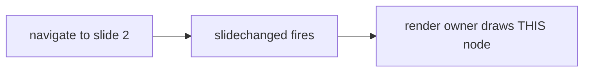
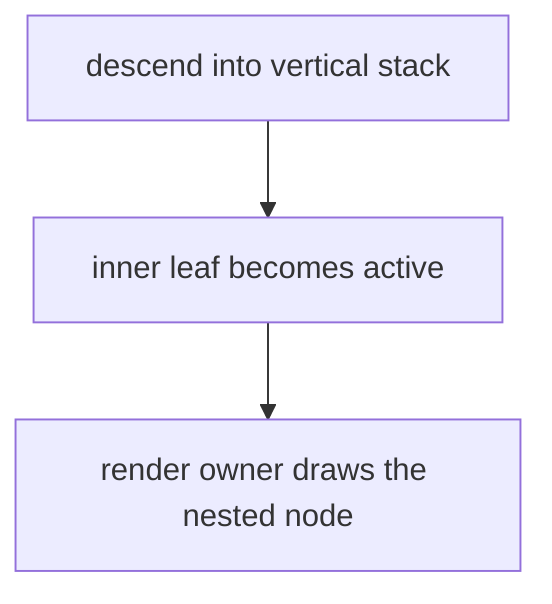

## ⚡ Do This First: Load Agent Profile

Run `/ad-hoc-profile-load frontend-freddy` (role: implementer) BEFORE anything else.
Apply its initialization, boundaries, directives, and tactics. Then read this WP in
full, plus:
- [../spec.md](../spec.md) — FR-004, NFR-002; the Edge Cases (vertical/nested, diagram-free deck).
- [../plan.md](../plan.md) — **IC-04** (the example-deck diagram targets) and **IC-06**'s
  fixture notes (the diagram-free published deck for NFR-002).
- [../contracts/slide-aware-diagram-render.md](../contracts/slide-aware-diagram-render.md)
  — rows **C2** (distinguishable identity), **C3** (print completeness targets), **C7**
  (diagram-free published deck).
- [../reviews/post-plan-squad.md](../reviews/post-plan-squad.md) — findings **C2**, **D5**,
  **C7**, and the count-moving note under **C7** ("showcase gains diagrams; draft-preview
  is a draft — no diagram-free published deck exists after IC-04").

## Objective

Provide the fixtures WP05's non-fakeable assertions need, and keep the build-count gate
green atomically. Three fixture changes plus one count-pin bump:
1. a diagram on a NON-first horizontal slide of the showcase deck, with a distinguishable
   identity (so the FR-004 test can select THAT node, not the already-working title one);
2. a diagram on an INNER-STACK (vertical) slide (the nested branch);
3. a NEW diagram-free PUBLISHED deck (`roadmap-deck.md`) for the NFR-002 footprint test —
   because after (1)/(2) the showcase deck has diagrams and `draft-preview.md` is a DRAFT
   (different treatment), so no diagram-free *published* deck exists;
4. bump the two published-count pins in `assert-build-artifacts.mjs` so the new published
   deck does not red the build gate (atomic, BA-1).

You own the two deck markdown files and the build-artifact assertion script. WP05 consumes
your fixtures; do not edit any test file.

## Subtasks

### T013 — Diagram on a NON-first horizontal slide, with a DISTINGUISHABLE identity
Edit `example/docs/presentations/showcase-deck.md`. It currently has: a title slide with a
diagram titled "Out-of-frame deck pipeline" (`:21-29`), slide 2 "Horizontal slide with
directives" (`:31`), a vertical stack (`:43-51`), and a headingless slide (`:53-59`).

Add a Mermaid fence to **slide 2** ("Horizontal slide with directives"). Give it a
DISTINGUISHABLE identity via its `%%` metadata so a Playwright test can select exactly this
node by its caption text (finding C2 — the already-working title diagram must not let the
test pass vacuously). Use a distinctive description sentence, e.g.:



- The `%% title:`/`%% description:` become the accessible figure's accTitle/accDescr (see
  `example/docs/presentations/showcase-deck.md:22-23` for the existing pattern). A
  metadata-carrying fence is required so the render-gate `figure.dk-diagram svg[aria-labelledby]`
  appears (routes.ts DIAGRAM_SVG_ROOT).
- **PRESERVE the BA-5 sentinels** the chrome gate keys on: the `quokka showcase sentinel`
  in the opening paragraph (`:17-19`) and `armadillo backstage secret` in the `Note:`
  (`:58-59`). `assert-chrome-artifacts.mjs:264-265` asserts the first is indexed and the
  second is NOT — do not remove or reword either.
- Do NOT add a new top-level slide — put the diagram INSIDE the existing slide 2 — so the
  IX-3a `slideSentinels` array and the deck axe `renderCount` (both WP05's concern) are
  affected as little as possible. (A slide-2 diagram is `display:none` at load, so it does
  NOT change the load-time render count — that is why WP05 keeps `renderCount:1`.)

### T014 — Diagram on an INNER-STACK (vertical) slide, with a distinguishable identity
Still in `showcase-deck.md`, add a Mermaid fence to the **inner-stack slide** "Inner stack
slide" (`:47-51`) — the `###` leaf inside the vertical stack. Give it its own
distinguishable identity, e.g.:



This is the vertical/nested branch (finding D5): the render owner must draw it when the
inner leaf first becomes active. Keep the fence inside the `###` slide's content so the
transform keeps it on that inner `<section>`.

### T015 — Create the diagram-free PUBLISHED deck `roadmap-deck.md` (NFR-002 target)
Create NEW file `example/docs/presentations/roadmap-deck.md` — a PUBLISHED
(`doc_status: active`) `kind: Presentation` deck with **no diagrams at all**. It is the
footprint-test target: WP05 asserts that on this route 0 request URLs match `/mermaid/i`
(finding C7 / NFR-002). Keep it minimal and diagram-free (no ```mermaid fences, no
hero_image needed). **Keep `description` within `validate-frontmatter.mjs` bounds:
50–180 chars (`DESCRIPTION_SOFT_MIN`=50, `DESCRIPTION_MAX`=180; the upper bound is a
build ERROR) — F5.** The sample below is 152 chars (compliant); if you reword it, recount.
Suggested content:

```markdown
---
title: Roadmap Deck
description: A published, diagram-free slide deck used to prove a deck with no diagrams never pulls the Mermaid runtime onto its route (the NFR-002 footprint guard).
doc_status: active
updated: 2026-08-28
type: Presentation
kind: Presentation
sidebar:
  hidden: true
authors:
  - stijn@sddevelopment.be
---

This deck deliberately contains no diagrams, so its route must resolve zero Mermaid
runtime chunks — the footprint guard short-circuits before importing Mermaid.

## Where we are

A short text-only slide.

## Where we are going

Another text-only slide, so the deck has more than one slide boundary for reveal to
enhance.
```

Frontmatter must satisfy the doc-sanity validator (`validate-frontmatter.mjs`): description
length in range, valid `kind`/`type`, and the ADR-0021 path+kind invariant (a
`kind: Presentation` MUST live under `presentations/` — this path does). Confirm it builds
and its route is `/<base>/presentations/roadmap-deck/`.

### T016 — Bump the two published-count pins in `assert-build-artifacts.mjs` (atomic, BA-1)
Adding one PUBLISHED deck moves the discovery counts by +1. In
`src/scripts/assert-build-artifacts.mjs`:
- `EXPECTED_INDEX_ENTRY_COUNT` (`:87`) — currently `25`. Bump to `26`.
- `EXPECTED_SITEMAP_URL_COUNT` (`:91`) — currently `25`. Bump to `26`.
- Update the authoring derivation comment (the block at `:39-91`, esp. `:84-91`) to add a
  line for this mission's delta: "reveal-deck-remediation adds one published diagram-free
  deck (presentations/roadmap-deck.md, doc_status:active, +1) → 25 → 26." Keep the
  comment's cross-check narrative honest (BA-1: the pin and the content change land
  together, in this one WP).

Confirm both directions: the showcase deck edits (T013/T014) add NO new URL (it is already
published — a diagram inside an existing deck moves no count); only `roadmap-deck.md` moves
the counts. So the delta is exactly +1, 25 → 26. Cross-check by counting published `.md`
under `example/docs/` (published = not draft) after your changes.

## Branch Strategy

Planning base and final merge target: `fix/reveal-deck-remediation`. Work in the worktree
allocated to this WP's lane in `lanes.json`; changes merge back into the mission branch.
No dependencies — runs in Wave 1 alongside WP01, WP03, WP06. (WP05 consumes these fixtures
in Wave 3.)

## Definition of Done

- The showcase deck has a diagram on slide 2 (non-first horizontal) AND on the inner-stack
  leaf, each with a distinguishable `%% title`/`%% description` identity (FR-004, C2, D5).
- The BA-5 sentinels (`quokka showcase sentinel`, `armadillo backstage secret`) are intact.
- `example/docs/presentations/roadmap-deck.md` is a NEW published, diagram-free deck that
  builds and serves at its `presentations/` route (NFR-002 target, C7).
- `EXPECTED_INDEX_ENTRY_COUNT` and `EXPECTED_SITEMAP_URL_COUNT` are both `26`, with the
  derivation comment updated to explain the +1 (BA-1, atomic with the new deck).
- `pnpm build` (example) + `node src/scripts/assert-build-artifacts.mjs` (the
  `assert:artifacts` gate) green; doc-sanity (`validate-frontmatter.mjs`) green on the new
  deck.

## Risks

- Forgetting T016 reds the build gate the moment the new published deck exists — the count
  bump MUST land in this same WP (that is why this WP owns the assertion script).
- Removing/rewording a BA-5 sentinel while editing the showcase deck reds
  `assert-chrome-artifacts.mjs`. Add diagrams; do not disturb the sentinel text.
- Adding a NEW top-level slide to the showcase deck (instead of a diagram inside an
  existing slide) would force WP05 to update the `slideSentinels` array and risk the deck
  axe `renderCount`. Keep diagrams inside existing slides.
- The roadmap deck must be genuinely diagram-free — a single ```mermaid fence would pull
  the Mermaid chunk and red the NFR-002 test WP05 writes against it.

## Reviewer guidance

- Grep the showcase deck for the two BA-5 sentinels — both present.
- Confirm the two new fences carry distinct `%% description` sentences (identity for C2/D5).
- Grep `roadmap-deck.md` for `mermaid` — zero matches.
- Confirm both count pins read `26` and the comment explains the +1; recount published
  `.md` under `example/docs/` to cross-check.
