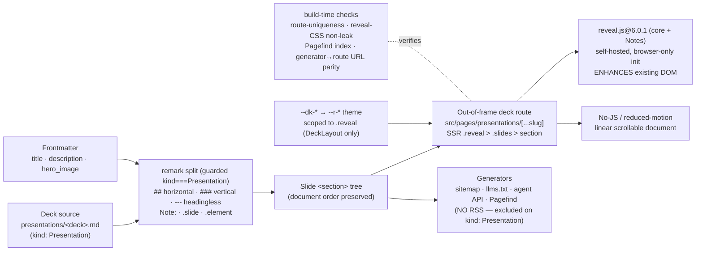

# Mission Specification: Slide Decks (reveal.js)

**Mission Branch**: `feat/slide-decks`
**Created**: 2026-08-24
**Status**: Draft (rev 2 — post-spec squad folded)
**Input**: Mission M6 — let authors write slide decks as **plain Markdown** (`kind: Presentation`) under `presentations/`; a build-time remark transform splits headings into reveal.js slide sections; render each deck through a dedicated **out-of-frame** route with a mandatory no-JS linear fallback; self-hosted `reveal.js@6.0.1` (core + Notes plugin) enhances the server-rendered DOM; theme via `--dk-*` → reveal `--r-*` scoped to `.reveal`. Keep the M0 `ci-ok` pipeline (four lanes) green.

## Overview

doc-kitty renders a repository's `docs/` tree as a human-first, agent-supported
documentation site, and treats **presentations as a first-class output pillar**
alongside it (ADR-0004). Every prior mission built the substrate a deck needs:
the frontmatter contract froze `Presentation` as a legal `type` **and** `kind`
(M1 — `src/lib/schema.ts:35,53`, `src/scripts/validate-frontmatter.mjs:45,51`);
the section registry declares `presentations/` (`docs/_meta/sections.yaml`, order
115, `feeds: [sitemap, llms, agent]` — no RSS); and ADR-0011 reserved a
`Presentation` as **the one kind that leaves the Starlight frame** for a dedicated
reveal route with a mandatory fallback. What does **not** yet exist is the deck
itself: there is no `reveal.js` dependency, no `presentations/` content, no deck
route, no slide-splitting transform, and no `--dk-*` → reveal theme. **M6 builds
that renderer.**

A deck is authored as ordinary Markdown and reads as a normal document; the build
turns it into slides. There is no hand-authored slide HTML and no new authoring
DSL — the anti-pattern the discovery run flagged. Concretely, four capabilities
land together, each with a real, measured delta:

- **Splitting** — a build-time remark transform groups a parsed deck into slide
  `<section>`s: `##` starts a **horizontal slide**, `###` a **vertical slide**
  stacked under it, content before the first `##` is the **title slide** (from
  `title`/`description`/`hero_image`), and `---` forces a **headingless slide**.
  Guarded to `kind: Presentation` pages so `---` stays an ordinary `
`
  everywhere else.
- **Rendering** — a dedicated **out-of-frame deck route** server-renders
  `.reveal > .slides > section` at build; self-hosted `reveal.js@6.0.1` (core +
  Notes only) **enhances** that existing DOM on load (reveal never produces the
  slides). With JS off, the same sections are a readable, scrollable document —
  the **linear fallback**.
- **Authoring controls** — `Note:` speaker notes and `<!-- .slide -->` /
  `<!-- .element -->` HTML-comment **directives** are parsed in the same pass; an
  unused deck is indistinguishable from prose, and an unknown directive **warns,
  never fails**.
- **Theming & discovery** — a `--dk-*` → reveal `--r-*` mapping scoped to
  `.reveal` themes the deck through the active brand, imported **only** by the
  deck layout; the example ships one **published** deck that flows into sitemap,
  llms.txt, the agent API, and Pagefind — but **not** RSS — discharging ADR-0012's
  build-time search risk.

The settled design is authoritative and is **not** re-opened *except* for one
correction this mission is chartered to make (see the routing subsection and
FR-020):
[ADR-0012](../../docs/adr/0012-slide-decks-static-reveal-from-markdown.md)
(Markdown authoring + static reveal pipeline, heading-driven splitting, invisible
directives, self-contained reveal, mandatory fallback + token theme),
[ADR-0011](../../docs/adr/0011-theme-slot-surface-and-per-kind-layouts.md)
(`Presentation` is the one out-of-frame kind; the mandatory fallback;
`hero_image`), [ADR-0004](../../docs/adr/0004-amend-common-docs-as-extensible-variation.md)
(the `presentations/` section; canonical `type: Presentation`), and the design of
record [`architecture/slide-decks.md`](../../docs/architecture/slide-decks.md).
That document's **Open Questions** are resolved by this mission (see Assumptions):
`###` vertical slides **ship in v1**; `reveal.js` is pinned at **6.0.1**; Pagefind
coverage is a **build-time assertion**; the per-file `deck:` theme override is
**deferred**. Any genuinely new decision — the deck **routing seam**, the reveal
**integration** (version pin, plugin set, init contract), the `--dk-*` → `--r-*`
**mapping** — is recorded as a **new ADR (0021/0022)**, never a silent change
(C-001).

### The deck is a docs-collection page, path-scoped and rendered out-of-frame by route override

The load-bearing decision, and the one place this mission **corrects** the design
of record: a deck **stays a `docs`-collection page** (`kind: Presentation`) so it
inherits the whole existing contract — the zod schema, the standalone validator,
doc-sanity, `related`/citation resolution, and the generators that read
`collectDocEntries()` (`src/lib/routes/shared.ts:14`). But it renders
**exclusively out-of-frame**, and the mechanism is precise:

- **The switch is path + kind, not "anywhere."** ADR-0012 decision 1 says a
  `Presentation` page "anywhere routes to the deck renderer"; that is
  **architecturally infeasible** and is amended by this mission. Starlight injects
  a single `[...slug]` catch-all over the whole `docs` collection; the only clean
  way to serve a collection entry out-of-frame without breaking every other page
  is a **higher-specificity, path-prefixed route** (`src/pages/presentations/
  [...slug].astro`) that **shadows** Starlight's catch-all **only under
  `/presentations/*`**. A site-root `src/pages/[...slug].astro` would override
  Starlight wholesale and 404 every URL its `getStaticPaths` omits. So decks are
  necessarily scoped to the `presentations/` section, and a `kind: Presentation`
  page filed **anywhere else is a hard build/validator error** (FR-022), never a
  silent in-frame render.
- **Starlight's route is shadowed, not "excluded."** Starlight exposes no API to
  drop an entry from its generated routes; the entry stays enumerated. What makes
  the deck win the URL is **Astro higher-specificity route override**. The real
  invariant is therefore "exactly one HTML is emitted at `/presentations/<deck>/`,
  and it contains `.reveal > .slides` — the deck — not the Starlight article
  shell," and that invariant is **asserted at build** (FR-017), not assumed.
- **Generator↔route URL parity is enforced.** llms.txt and the agent API build a
  deck's URL from its **collection slug**, a different code path from the deck
  route's `getStaticPaths` params; a trailing-slash/base drift would list a URL
  that 404s while every lane stays green. ADR-0021 fixes the deck route's
  trailing-slash/base contract to equal the slug normalization the sitemap filter
  uses, and a build assertion (FR-017) checks the listed URL is byte-identical to
  the emitted deck path.

The in-frame kind→layout registry (`src/components/MarkdownContent.astro:41` →
`resolveLayout` → `src/lib/manifest.ts`) renders **inside** the Starlight shell and
therefore **cannot** host a deck; a `Presentation` is **not** a kind→layout entry.
The exact route-override wiring, the URL contract, and whether presentations appear
in the in-frame autogenerated sidebar (decided: **no** — surfaced only via the
overview page) are fixed in the **deck routing ADR (0021)** during plan. This is
the M6 analogue of M2's single-layout-resolution seam.

### Splitting and directives are one guarded, build-time seam

All slide structure is produced **once at build time** by a single remark
transform that **early-returns unless `frontmatter.kind === 'Presentation'`**, so
it has **zero effect on doc pages** — `---` stays an ordinary `
`, and the deck
inherits Astro's already-configured remark/rehype chain (GFM, Shiki) so a deck
renders identically to a doc. The transform runs at **mdast** level, emitting
section nodes (`data.hName='section'`) that `mdast-util-to-hast` renders as real
`<section>`s; speaker notes and the `.slide`/`.element` comment directives are
parsed in the **same pass** (the "preceding element" is simply the previous
sibling — no DOM re-scan). The pure pieces — slide grouping, the horizontal→
vertical-stack conversion, directive parsing, `Note:` extraction — are **Astro-free
functions unit-tested with vitest** (NFR-005), matching the house pattern
(`metadata.ts` resolvers). reveal's **client-side Markdown plugin is rejected**
(ADR-0012 Option A): slides exist in the built HTML before any JavaScript runs,
which is what makes the fallback, SEO, print, and Pagefind coverage possible — and
what makes the build immune to reveal's Vite/Rolldown directive-ordering hazard.

### Layered landing (decomposition guidance for plan/tasks)

The user stories are **not** the work-package boundaries. Like the prior missions,
M6 decomposes along its dependency edges, and several boundaries carry a
green-at-every-boundary hazard (C-007) that must land atomically. The critical
path is essentially **serial** (a deck cannot render until both the route and the
transform exist); the only genuine concurrency is transform ‖ discovery-wiring
(both inert after foundation) and a11y ‖ print/docs (both after the deck).

0. **Plan-phase ADR gate** — **ADR-0021** (routing seam: path+kind switch,
   route-override shadowing, deck-URL trailing-slash/base contract, sidebar
   exclusion) and **ADR-0022** (reveal integration: `6.0.1` pin, core+Notes, the
   browser-only-`import`+`prerender=true` init contract, `--dk-*` → `--r-*`
   mapping) are **decisions that gate foundation** and are authored in plan, not
   scheduled last (C-001: no silent seam).
1. **Foundation** — the out-of-frame route + `getStaticPaths` + route-override
   wiring, the `DeckLayout` shell (browser-only reveal init, real `<button>`
   controls, `data-pagefind-body`/`ignore` scaffolding), the `--dk-*` → `--r-*`
   theme sheet, `reveal.js@6.0.1` pinned (`@types` absent), the off-section-error
   validator (FR-022), and **verifying/adding `--dk-width-deck` + confirming the
   deck bg/text `--dk-*` pair is AA** before any deferred axe scan (the M3
   `--dk-color-tint-lilac` lesson). Boundary: the route emits zero pages, all four
   lanes green, a11y unscanned.
2. **Transform (split-atomic)** ‖ **Discovery wiring** — the guarded remark
   transform (title slide + `##` + `###` stack + `---` + directives + `Note:`) with
   its full vitest suite; **and, in parallel,** the `feeds`/RSS-exclusion keyed on
   `kind: Presentation` + `SECTION_ORDER`/`SECTION_LABEL` for `presentations`.
   Discovery wiring lands **before** the deck so the deck lands into correctly
   configured surfaces and the count pins compute exactly once. Both are inert on
   an empty section — green boundaries.
3. **Deck + overview + pins + build assertions (published-deck-atomic)** — the
   **published** showcase deck **and** the presentations overview Hub (both
   published pages that move the counts) land with **one** recompute of
   `EXPECTED_INDEX_ENTRY_COUNT`/`EXPECTED_SITEMAP_URL_COUNT`, plus the retained
   **draft** deck (FR-023), plus the route-uniqueness / reveal-CSS-non-leak /
   Pagefind-index / URL-parity assertions (FR-017/FR-010/FR-012). A11y is still
   green here because the deck is **not yet in `AXE_PAGES`** (unscanned ≠ red).
4. **Deck a11y** ‖ **Print + docs of record** — add the deck to `ROUTES`/
   `AXE_PAGES` and pass axe in both modes + the Playwright interaction test
   (FR-016/FR-021/NFR-001/NFR-003/NFR-007); **and, in parallel,** the `?print-pdf`
   path (FR-013) and the docs-of-record resolution (`slide-decks.md` Open
   Questions).

Critical path: **ADR gate → foundation → transform ‖ discovery → deck+overview+pins
→ a11y ‖ print/docs.**

## User Scenarios & Testing *(mandatory)*

### User Story 1 - An author writes a deck in Markdown and it becomes slides (Priority: P1)

An author creates `presentations/<deck>.md` with `kind: Presentation`, a normal
`title`/`description`, and prose organized with `##` and `###` headings. On build,
the page becomes a reveal.js deck: the content before the first `##` is a **title
slide** built from the frontmatter, each `##` is a **horizontal slide**, each `###`
is a **vertical slide** stacked under the current horizontal one, and a `---` on
its own line forces a **headingless slide** (an image-only slide, a divider). The
author never writes a `<section>`, a reveal boot script, or a deck `<head>`.

**Why this priority**: This is the mission — the Markdown-to-slides pipeline. It is
the narrowest slice that delivers the pillar's core promise and is independently
demonstrable with a single deck file.

**Independent Test**: Build the example; assert the deck route's built HTML
contains, in document order, one title `<section>` derived from the frontmatter,
one horizontal `<section>` per `##`, a vertical stack (`<section>` of `<section>`s)
per `##` that has `###` children, and a headingless `<section>` (with an
`aria-label`) per body `---`; and assert a **non-deck** page with a body `---` still
renders an `
` (the scope guard holds).

**Acceptance Scenarios**:

1. **Given** a `kind: Presentation` page whose body has content, then `## A`,
   `## B`, **When** it builds, **Then** the deck route emits a title `<section>`
   (from `title`/`description`/`hero_image`) followed by one horizontal `<section>`
   for `A` and one for `B`, in that order.
2. **Given** a `## A` slide followed by `### A1` and `### A2`, **When** it builds,
   **Then** `A` becomes a **vertical stack** — an outer `<section>` containing
   inner `<section>`s for `A`, `A1`, `A2` — and the outer contains only inner
   sections (no loose prose), so reveal navigates down correctly.
3. **Given** a body `---` on a Presentation page, **When** it builds, **Then** a
   new headingless horizontal `<section>` starts, the `---` does **not** render as
   `
`, and the section is emitted **with an `aria-label`** (e.g. `Slide N`) so
   it has an accessible name.
4. **Given** the **same** `---` on a `kind: Explanation` (or any non-Presentation)
   page, **When** it builds, **Then** it renders as an ordinary `
` and no slide
   splitting occurs (the transform early-returned).
5. **Given** `####`+ headings inside a slide, **When** it builds, **Then** they
   stay **within** the current slide (reveal has two nav axes only) and do not
   start a new section.

### User Story 2 - The deck is accessible and degrades without JavaScript (Priority: P1)

A visitor opens the deck with JavaScript disabled (or `prefers-reduced-motion`) and
still reads the whole thing: the slide sections render in document order as a
single, scrollable document. With JavaScript on, reveal enhances the same DOM into
an interactive deck whose navigation controls are real buttons, whose every slide
is reachable by keyboard, and whose every slide has an accessible name. The deck
clears the axe lane in both light and dark, and a Playwright interaction test
proves the keyboard and reduced-motion behaviour axe cannot see.

**Why this priority**: The fallback is **mandatory**, not a nicety (ADR-0011), and
a11y is a hard `ci-ok` gate. A deck that only works with JS, or that fails axe, is
not shippable.

**Independent Test**: Serve the built `example/dist`; with JS disabled assert every
slide's text is present in the initial HTML in document order and axe reports no
serious/critical violations; with JS enabled assert reveal initializes, navigation
controls are `<button>`s with accessible names, the deck route passes axe in
**both** color modes, and a **Playwright interaction test** drives arrow/space/Esc
to assert every slide becomes active with visible focus and no keyboard trap, and
that computed transition duration is `0s` under emulated `prefers-reduced-motion`.

**Acceptance Scenarios**:

1. **Given** the deck route with **JavaScript disabled**, **When** it loads, **Then**
   it is a single readable scrollable document containing every slide's text in
   document order, and axe reports no serious/critical violations.
2. **Given** the deck route with JavaScript enabled, **When** reveal initializes,
   **Then** navigation controls are real `<button>`s with accessible labels
   (e.g. "Next slide"), and a Playwright interaction test confirms keyboard
   navigation (arrow/space/Esc) reaches every slide, focus is visible, and there is
   no keyboard trap.
3. **Given** every slide (heading-derived **or** headingless `---`), **When**
   accessibility is checked, **Then** each `<section>` has an accessible name — a
   visible heading or an `aria-label` — so no slide is an unlabeled region.
4. **Given** `prefers-reduced-motion: reduce`, **When** the deck renders, **Then**
   slide transitions are disabled (CSS `@media` **and** `transition: 'none'` passed
   to reveal), asserted by the interaction test as computed `transition-duration:
   0s`.
5. **Given** the deck surface (often brand-dark), **When** contrast is checked,
   **Then** text/background meets WCAG 2.2 AA (size-aware: ≥4.5:1 normal text,
   ≥3:1 large text) on the mapped `--dk-*` tokens, in both light and dark.

### User Story 3 - An author adds notes and per-slide controls without leaving Markdown (Priority: P2)

An author annotates a deck with speaker notes and per-slide behaviour using
reveal's own invisible conventions: a `Note:` line becomes a presenter-only aside,
`<!-- .slide: data-background-color="#0D0E11" -->` sets a slide background, and a
bullet followed by `<!-- .element: class="fragment" -->` reveals on click (a reveal
**fragment**). Unused, none of this is visible; a typo in a directive warns in the
build log rather than breaking the build.

**Why this priority**: The authoring directives make decks genuinely useful, but the
deck renders and is accessible without any of them (US1/US2), so they ride just
behind.

**Independent Test**: Build a deck exercising all three; assert the `Note:` block
becomes an `<aside class="notes">` that is a direct child of its `<section>`; the
`.slide` directive's attributes appear on the enclosing `<section>`; the `.element`
directive's class attaches to the immediately-preceding block; and a deck with an
**unknown** directive key builds successfully while emitting an observable build-log
warning.

**Acceptance Scenarios**:

1. **Given** a `Note: …` line in a slide, **When** it builds, **Then** it becomes
   an `<aside class="notes">` that is a direct child of that slide's `<section>`
   (surfaced by the Notes plugin in presenter view; an aside in the fallback).
2. **Given** `<!-- .slide: data-background-color="#0D0E11" -->` within a slide,
   **When** it builds, **Then** the enclosing `<section>` carries
   `data-background-color="#0D0E11"` and the comment does not render as visible
   content.
3. **Given** a block followed by `<!-- .element: class="fragment" -->`, **When** it
   builds, **Then** the preceding block carries `class="fragment"` (a reveal
   fragment) and the comment is consumed.
4. **Given** a directive with an **unknown** key, **When** it builds, **Then** the
   build **succeeds** and prints an observable warning (open-vocabulary posture,
   ADR-0012), and a `.element` directive with no preceding sibling warns and is
   skipped.

### User Story 4 - The deck is themed by the site's brand (Priority: P2)

A deck matches the active brand — for example the Spec Kitty dark theme — without
per-deck CSS. The deck's colors, fonts, and sizing come from the site's `--dk-*`
tokens, mapped onto reveal's own `--r-*` variables. reveal's aggressive global
stylesheet is confined to the deck route and never touches a documentation page.

**Why this priority**: Decks must look like the rest of the site (ADR-0012), and
reveal's viewport-hijacking CSS leaking into doc pages would be a visible
regression — but the deck is legible on reveal's defaults even before theming, so
this rides behind the core.

**Independent Test**: Build the example; assert the deck route links the doc-kitty
reveal theme sheet and that the mapped `--r-*` variables resolve to `--dk-*` values;
and assert (a build-time check over `example/dist`) that **no non-deck page's HTML**
links reveal's **core** stylesheet chunk or the token-mapping sheet, and that
neither is hoisted into a shared chunk a doc page links.

**Acceptance Scenarios**:

1. **Given** the active brand (default or Spec Kitty), **When** the deck renders,
   **Then** its background/text/heading/link colors and fonts derive from `--dk-*`
   tokens via a `--dk-*` → `--r-*` mapping scoped under `.reveal`, and the deck
   width uses the existing `--dk-width-deck` token.
2. **Given** the doc-kitty reveal theme and reveal's core CSS, **When** they are
   wired, **Then** both are imported **only** by the deck layout (never registered
   as a global style).
3. **Given** the built site, **When** a documentation (non-deck) page is inspected,
   **Then** its HTML links **neither** reveal's core stylesheet **nor** the
   token-mapping sheet, and a build-time assertion (identifying reveal's core sheet
   by a known signature) enforces this — including that neither sheet is hoisted
   into a shared chunk.

### User Story 5 - Decks are discoverable and searchable (Priority: P2)

A reader finds decks: a presentations overview lists them, they appear in the
sitemap, in `llms.txt`, and in the agent API, and their slide text is searchable
via Pagefind — but a deck is **not** an item in the RSS feed (a deck is not a
time-ordered news post). A draft deck is excluded from all of that, like any draft
page.

**Why this priority**: Discovery is what makes the pillar usable and discharges
ADR-0012's explicit build-time search risk, but it composes over US1–US4 and is
mechanical once the deck route exists.

**Independent Test**: Build the example (which ships one **published** deck and one
**draft** deck); assert the published deck URL appears in the sitemap, in
`llms.txt`, and in the agent API, that each listed URL is **byte-identical** to the
deck route's emitted path, and that the deck slug is present in the Pagefind index
(via a known unique slide phrase) while the speaker-note aside text is **not**;
assert the published deck URL is **absent** from RSS; assert the `presentations`
section is grouped/labelled (not a bare slug) in the llms/agent grouping; and assert
the **draft** deck is absent from sitemap, feeds, and the agent surface.

**Acceptance Scenarios**:

1. **Given** the published example deck, **When** the site builds, **Then** its URL
   is in the sitemap, in `llms.txt`, and in the agent API (each byte-identical to
   the emitted deck path), and its slide text is in the Pagefind index (`.slides`
   carries `data-pagefind-body`); the speaker-note `<aside class="notes">` (the only
   reveal chrome present in the static DOM, since controls/progress/slide-number are
   injected client-side) carries `data-pagefind-ignore` and its text is **not** a
   search result.
2. **Given** the published example deck, **When** the RSS feed is generated,
   **Then** the deck URL is **absent** — the RSS exclusion keys on
   `kind: Presentation` (frontmatter), honoring `sections.yaml` `feeds:
   [sitemap, llms, agent]` (no RSS) regardless of file location.
3. **Given** the `presentations` section, **When** `llms.txt` and the agent surface
   group pages, **Then** the section is labelled from the registry (added to
   `SECTION_ORDER`/`SECTION_LABEL`), not emitted as an unknown "last" bare slug.
4. **Given** the retained `doc_status: draft` deck, **When** the surfaces are
   generated, **Then** it is absent from sitemap, RSS, llms, and the agent API
   (existing `doc_status` gating still holds for the out-of-frame route).
5. **Given** the presentations section, **When** the overview page renders, **Then**
   it lists the published decks from the collection (no hand-kept manifest), each
   with a link to the deck and its `?print-pdf` export.

### Edge Cases

- **`---` on a non-Presentation page**: unchanged — an ordinary `
`. The
  transform early-returns on `kind !== 'Presentation'` (C-005).
- **A `kind: Presentation` page filed outside `presentations/`**: a **hard build/
  validator error** (FR-022), never a silent in-frame render — the path+kind
  invariant that keeps the route-override sound.
- **A deck with no `##` at all**: renders a single title slide (all content before
  a first `##` that never comes); still a valid one-slide deck.
- **Nested vertical stack correctness**: the outer stack `<section>` must contain
  **only** inner `<section>`s; loose prose directly under a `##` that also has
  `###` children becomes the first inner slide (US1 scenario 2), never a sibling of
  the inner sections.
- **`####`+ headings**: stay inside the current slide; they never create a third
  navigation axis (US1 scenario 5).
- **`.element` directive with no preceding sibling**: warn and skip (US3 scenario
  4) — never crash.
- **Multiple `.slide` directives in one slide**: merge, last-wins per key.
- **Multi-block `Note:`**: v1 handles a single block after `Note:`; multi-block
  notes are deferred (C-008).
- **Server-side render safety**: reveal touches `document`/`window` at import, so
  it is loaded **only** from a browser-only dynamic import on a `prerender=true`
  route; a top-level `import Reveal` in server-rendered `.astro` would crash `astro
  build` (C-003).
- **Print / `?print-pdf`**: reveal's print stylesheet is imported as a **bundled**
  asset gated on the query string (not reveal's path-based loader, which cannot
  resolve under Vite); the linear fallback is the printable baseline (FR-013).
- **`@types/reveal.js`**: reveal 6 bundles its own types; the `@types` package must
  **not** be added (and removed if a tool pulls it in) — it would shadow the real
  types.
- **reveal chrome and Pagefind**: only the speaker-note `<aside class="notes">` is
  present in the static DOM (inside `.slides`, so it needs `data-pagefind-ignore`);
  reveal's controls/progress/slide-number are injected at runtime and never enter
  the indexed `dist`, so no build-time ignore applies to them.
- **Draft deck routing**: a draft deck still builds a route (so it can be previewed)
  but is excluded from every generator by `doc_status`; the build-example count pins
  count only the published deck (+ overview Hub).
- **Starlight sidebar**: presentations are **not** listed in the in-frame
  autogenerated sidebar (an in-frame link ejecting the reader out-of-frame with no
  signal); they are surfaced only via the FR-014 overview page (ADR-0021).
- **`.worktrees/` copies** are gitignored; the deck content and route operate on
  git-tracked paths only.

## Requirements *(mandatory)*

### Functional Requirements

| ID | Title | User Story | Priority | Status |
|----|-------|------------|----------|--------|
| FR-001 | Guarded slide-splitting remark transform | As a deck author, I want a build-time remark transform that **early-returns unless `frontmatter.kind === 'Presentation'`** and groups the deck's mdast into slide sections (`data.hName='section'`): content before the first `##` → title slide; each `##` → horizontal slide; `---` (`thematicBreak`) → **headingless slide emitted with an `aria-label`** (e.g. `Slide N`) with the `
` node **consumed**; `####`+ stay inside the current slide; **document order preserved** (the fallback depends on it). It reuses Astro's configured remark/rehype chain. | High | Open |
| FR-002 | Vertical slides + stacks (`###`) in v1 | As a deck author, I want `###` under a `##` to produce a **vertical slide** inside a **vertical stack**: the horizontal section is converted so its accumulated content becomes the first inner `<section>` and each `###` a further inner `<section>`, with the outer **stack** containing **only** inner sections. Every slide carries a heading. (In v1 per the resolved open question.) | High | Open |
| FR-003 | Title slide from frontmatter | As a deck author, I want the title slide built from `title`, `description`, and `hero_image` (the page-hero field, ADR-0011), so every deck opens with a titled slide and every slide — including this one — carries a heading (the ADR-0011 a11y requirement). | High | Open |
| FR-004 | Out-of-frame deck route via Astro route override (path+kind, no in-frame duplicate) | As the toolkit, I want a path-prefixed route `src/pages/presentations/[...slug].astro` that `getStaticPaths()` over `getCollection('docs')` filtered to `kind: Presentation`, prerendered static, server-rendering `.reveal > .slides > section` **outside** the Starlight frame — winning the `/presentations/*` URLs by **Astro higher-specificity route override** (Starlight's catch-all is **shadowed, not removed**) so a deck renders **only** out-of-frame with **no in-frame Starlight duplicate**. The route-override wiring, the deck-URL trailing-slash/base contract (= slug normalization), and sidebar exclusion are fixed in ADR-0021. | High | Open |
| FR-005 | Self-hosted reveal.js enhancement (pinned, minimal, SSR-safe) | As the toolkit, I want `reveal.js@6.0.1` added as a **pinned npm dependency** (self-hosted, bundled by Vite, **no CDN**), initialized from a **browser-only dynamic import** on a `prerender=true` route (never a top-level import in server-rendered `.astro`) with **core + Notes plugin only** — no Markdown plugin (rejected), no Highlight plugin (Astro/Shiki already highlights) — enhancing the server-rendered DOM (reveal never produces slides); and `@types/reveal.js` **removed/absent** (types are bundled in v6). | High | Open |
| FR-006 | Mandatory no-JS / reduced-motion linear fallback | As a visitor without JavaScript (or with reduced motion), I want the deck route to render as a single readable, scrollable document — the slide `<section>`s in document order — because reveal only enhances when JS runs; `prefers-reduced-motion` disables transitions (CSS `@media` **and** `transition:'none'` passed to reveal). | High | Open |
| FR-007 | Speaker notes (`Note:` → presenter aside) | As a deck author, I want a `Note:` block turned into an `<aside class="notes">` that is a **direct child** of its slide `<section>` (surfaced by the Notes plugin in presenter view; a plain aside in the fallback), parsed in the split pass. | Medium | Open |
| FR-008 | Per-slide / per-element directives (warn on unknown) | As a deck author, I want `<!-- .slide: k="v" … -->` merged as attributes onto the **enclosing** section and `<!-- .element: … -->` merged onto the **immediately-preceding** block (reveal fragments), parsed as `html` comment nodes in the same remark pass; a directive with an **unknown key warns via the build log and does not fail**, and a `.element` with no preceding sibling warns and is skipped. | Medium | Open |
| FR-009 | `--dk-*` → reveal `--r-*` theme, scoped to `.reveal` | As the toolkit, I want a doc-kitty reveal theme sheet mapping reveal's `--r-*` variables onto `var(--dk-*)` (background/text/heading/link colors, body/heading fonts, sizing incl. `--dk-width-deck`), scoped under `.reveal`, so a deck matches the active brand (incl. Spec Kitty dark) with no per-deck CSS. The sheet is imported **only** by the deck layout. | Medium | Open |
| FR-010 | reveal-CSS non-leak covers core + map (build-verified) | As CI, I want reveal's **core** stylesheet **and** the token-mapping sheet imported **only** by the deck layout and **never** registered globally or **hoisted into a shared chunk** a doc page links, verified by a **build-time assertion over `example/dist`** that no non-deck page's HTML links either sheet (reveal's core sheet identified by a known signature; route-import isolation is primary, `.reveal` scoping belt-and-suspenders for the map). | High | Open |
| FR-011 | Discovery honors `sections.yaml` feeds (RSS exclusion keyed on `kind`) | As a reader/agent, I want the published deck to appear in **sitemap, `llms.txt`, the agent API, and Pagefind but NOT RSS** — by excluding **`kind: Presentation`** from the RSS route (frontmatter-keyed, robust regardless of file location) while honoring `sections.yaml` `feeds: [sitemap, llms, agent]`; and `presentations` added to `src/lib/metadata.ts` `SECTION_ORDER`/`SECTION_LABEL` (:144-173) so llms/agent grouping labels it instead of ranking it unknown-last. Lands **before** the deck (inert on an empty section). | High | Open |
| FR-012 | Pagefind coverage of the deck route (build-verified) | As CI, I want the deck's `.slides` container to carry `data-pagefind-body` and the speaker-note `<aside class="notes">` (the only reveal chrome in the static DOM) to carry `data-pagefind-ignore`, with a **build-time assertion** that the published deck slug **is** in the generated Pagefind index (a known unique slide phrase resolves to the deck URL) and the speaker-note text is **not** — discharging ADR-0012's build-time search risk. | High | Open |
| FR-013 | Print / PDF export path (verified) | As a presenter, I want reveal's print stylesheet imported as a **bundled** asset gated on `?print-pdf` (not reveal's path-based loader, which fails under Vite), so a paginated PDF export works, with the linear fallback as the printable baseline; verified by an assertion that the deck route, built/served with `?print-pdf`, links the bundled print stylesheet gated on that query. | Low | Open |
| FR-014 | Presentations overview page (co-lands with the deck) | As a reader, I want a presentations overview (the section index / `kind: Hub`) listing the **published** decks from `getCollection` (no hand-kept manifest), each linking to the deck and its `?print-pdf` export. As a published page it moves the count pins, so it lands **in the same step** as the deck under one count recompute (FR-017). | Medium | Open |
| FR-015 | Published example deck | As CI and as a showcase, I want **one published deck** shipped under `example/docs/presentations/` exercising the whole pipeline (title slide, `##` horizontal, `###` vertical stack, a `---` headingless slide, `Note:`, a `.slide` and a `.element` directive), so the route, theme, a11y, Pagefind, sitemap, and print paths are all exercised end-to-end. | High | Open |
| FR-016 | Deck a11y route entry (static axe, both modes) | As CI, I want the deck route added to `tests/a11y/routes.ts` (`ROUTES` + `AXE_PAGES`) so the axe lane scans it in **both** light and dark, verifying **what axe actually checks**: an accessible name per `<section>` (heading or `aria-label`), real `<button>` controls with accessible labels, a single labelled main region, and size-aware AA contrast on the mapped tokens. Keyboard/reduced-motion behaviour is **not** axe's job — it is FR-021. (A committed **visual** baseline is deferred — C-008.) | High | Open |
| FR-017 | Build assertions + pins updated atomically | As CI, I want, landing **in the same step** as the published deck + overview Hub + retained draft: (a) `assert-build-artifacts.mjs` `EXPECTED_INDEX_ENTRY_COUNT` (:64) and `EXPECTED_SITEMAP_URL_COUNT` (:67) recomputed and re-cross-checked against `example/docs/`; (b) a **route-uniqueness** assertion that `/presentations/<deck>/index.html` is a single page containing `.reveal > .slides` and **not** the Starlight article shell; (c) a **generator↔route URL parity** assertion that the deck URL emitted by llms.txt **and** the agent API is byte-identical to the deck route's emitted path; plus the FR-010/FR-012 non-leak and Pagefind assertions — so **no boundary lands red**. | High | Open |
| FR-018 | Pure, unit-tested split/directive logic | As a maintainer, I want the transform's pure pieces — slide grouping, the horizontal→vertical-stack conversion, directive attribute parsing, `Note:` extraction, the unknown-directive warning — as **Astro-free functions** covered by **vitest** (title-slide, `##` split, `###` stack, `---` headingless+`aria-label`, `####` in-slide, directive parse, unknown-directive warn, `Note:` extraction), independent of the Playwright lane. | High | Open |
| FR-019 | Deck passes doc-sanity (lint/Vale scoped); confirm vocabulary legality | As CI, I want a `Presentation` deck page to pass doc-sanity (`description ≤ 180`, required `kind`, resolvable `related`/citations, markdownlint, Vale) with **no schema change needed for legality** (`Presentation` is already a canonical `type` **and** `kind` — `schema.ts:35,53`, `validate-frontmatter.mjs:45,51`); the example deck is authored within current markdownlint/Vale rules **or** the specific rule exceptions needed for deck syntax (repeated `---` thematic breaks / MD035, the `<!-- .slide -->`/`<!-- .element -->` HTML comments, and `Note:` lines) are scoped for `presentations/` in the same step; optionally add a `presentations` case to the validator's `expectedType` path map (:143, currently returns `null`). | Medium | Open |
| FR-020 | Amend design of record + author decision ADRs | As a maintainer, I want (a) the **amendment** of the infeasible "anywhere" claim: ADR-0012 decision 1 and `architecture/slide-decks.md:39-40` narrowed to the **path+kind** switch (a `Presentation` **under `presentations/`** renders out-of-frame), and `slide-decks.md`'s **Open Questions** resolved in place (`###` in v1; reveal `6.0.1` pin + upgrade-smoke cadence; Pagefind as a build-time check; per-file `deck:` override deferred); and (b) two **plan-phase decision ADRs authored before foundation**: **ADR-0021** (deck routing seam — route-override shadowing, path+kind switch, deck-URL trailing-slash/base contract, sidebar exclusion, no in-frame duplicate) and **ADR-0022** (reveal integration — `6.0.1` pin, core+Notes plugin set, the browser-only-dynamic-`import` + `prerender=true` init contract, `@types` absent, the `--dk-*` → `--r-*` mapping) — each referencing ADR-0012/0011/0004. | Medium | Open |
| FR-021 | Playwright interaction test (keyboard + reduced-motion) | As CI, I want a **Playwright interaction test** on the FR-015 published deck (which axe cannot perform): drive arrow/space/Esc and assert **every slide becomes active**, focus is **visible** (`:focus-visible`), there is **no keyboard trap**, and `getComputedStyle(currentSlide).transitionDuration === '0s'` under emulated `prefers-reduced-motion: reduce`. This is the enforcement for US2's keyboard/reduced-motion claims. | High | Open |
| FR-022 | Off-section `Presentation` is a hard error | As CI, I want a `kind: Presentation` page filed **outside** `presentations/` to be a **hard build/validator error** (not a silent in-frame render), so the path+kind invariant the route-override depends on can never be violated. | High | Open |
| FR-023 | Retained draft deck fixture | As CI, I want **one `doc_status: draft` deck** retained under `example/docs/presentations/` as the draft-exclusion demonstrator (US5.4), cross-checked to **not** move the FR-017 count pins (drafts are outside `doc_status`-gated surfaces). | High | Open |

### Non-Functional Requirements

| ID | Title | Requirement | Category | Priority | Status |
|----|-------|-------------|----------|----------|--------|
| NFR-001 | Accessibility AA (axe static scan, both modes) | The deck route clears the `a11y` axe lane (`wcag22aa`, serious/critical fail the build) in **both** light and dark on the FR-015 published deck for the checks axe performs: every `<section>` has an accessible name (heading or `aria-label`); navigation controls are real `<button>`s with accessible names; one labelled main region; deck-surface text/background meets **WCAG 2.2 AA size-aware contrast** (≥4.5:1 normal, ≥3:1 large text) on the mapped `--dk-*` tokens. | Accessibility | High | Open |
| NFR-002 | `ci-ok` stays green | All four lanes pass on the PR: `code-quality` (typecheck + lint + vitest), `doc-sanity` (validate:docs/example/links + catalog + markdownlint + Vale), `build-example` (`astro build` + `assert:artifacts`), `a11y` (`test:a11y`). | Reliability | High | Open |
| NFR-003 | No-JS fallback completeness | With JavaScript disabled, the deck route's initial HTML contains **every slide's text in document order** and axe reports no serious/critical violations; content is never gated behind reveal's client enhancement. | Accessibility | High | Open |
| NFR-004 | Self-contained, no CDN, bounded deps | The only new runtime/build dependency is `reveal.js@6.0.1` (self-hosted, Vite-bundled, no CDN); no citation/markdown-processing or heavy add-ons; `@types/reveal.js` is absent; verified by a lockfile/manifest diff. reveal is loaded so `astro build` never imports it in server-rendered code (SSR-safe). | Portability | High | Open |
| NFR-005 | Pure, unit-tested transform | Slide grouping, stack conversion, directive parsing, and `Note:` extraction are Astro-free and covered by vitest across the enumerated cases (FR-018), independent of the Playwright lane. | Maintainability | High | Open |
| NFR-006 | Search + CSS-isolation verified at build | Three build-time assertions hold on `example/dist`: (a) the published deck is in the Pagefind index and the speaker-note aside text is not (FR-012); (b) neither reveal's core sheet nor the token-mapping sheet ships on a documentation page or a shared chunk (FR-010); (c) the deck URL is unique and byte-identical across the deck route, llms.txt, and the agent API (FR-017). | Reliability | High | Open |
| NFR-007 | Keyboard + reduced-motion verified by interaction test | Keyboard reachability of every slide, no keyboard trap, visible focus, and reduced-motion transition disabling are verified by the FR-021 Playwright **interaction** test (not by axe), which axe-core cannot exercise. | Accessibility | High | Open |

### Constraints

| ID | Title | Constraint | Category | Priority | Status |
|----|-------|------------|----------|----------|--------|
| C-001 | Settled design authoritative (one chartered correction) | Implement to ADR-0012/0011/0004 and `architecture/slide-decks.md`; the **one** re-opening this mission is chartered: amending ADR-0012's infeasible "Presentation anywhere" to the **path+kind** switch (FR-020). Every other genuinely new decision — routing seam, reveal integration, token mapping — is a **new ADR (0021/0022)**, never a silent change. | Governance | High | Open |
| C-002 | Build-time static split; no client-side Markdown plugin | Slide splitting is a **build-time remark transform**; reveal's client-side Markdown plugin is **rejected** (ADR-0012 Option A). Slides exist in the built HTML before any JavaScript runs. | Technical | High | Open |
| C-003 | reveal is self-hosted and browser-only (SSR-safe) | reveal.js is a self-hosted, Vite-bundled dependency (no CDN) initialized from a **browser-only dynamic import** on a `prerender=true` route; it is **never** imported at the top level of server-rendered `.astro` code (that crashes `astro build`). | Technical | High | Open |
| C-004 | Deck leaves the frame by route override; path+kind; no in-frame duplicate | A `Presentation` docs-collection page **under `presentations/`** renders **exclusively** through the out-of-frame deck route, which wins the URL by **Astro higher-specificity route override** (Starlight's route is shadowed, not removed); it is **not** a kind→layout (in-frame) entry; a `Presentation` filed elsewhere is a hard error (FR-022); presentations are excluded from the in-frame autogenerated sidebar. The mechanism and URL contract are decided in ADR-0021. | Technical | High | Open |
| C-005 | Splitting/directives are scoped to `kind: Presentation` | The transform (splitting **and** directive/`Note:` parsing) has **zero effect** on non-Presentation pages: `---` stays an ordinary `
`, and no comment directive is interpreted, off a deck. Enforced by the frontmatter `kind` guard. | Scope | High | Open |
| C-006 | reveal CSS scoped to the deck route; tokens before overrides | reveal's global stylesheet is confined to the deck route (never a global style, never a shared chunk on doc pages); the deck is themed through `--dk-*` tokens only (brands/consumers set `--dk-*`, never `--r-*`/`--sl-*` directly); no new Starlight `components` overrides. | Technical | High | Open |
| C-007 | Green-at-every-boundary | No work-package boundary leaves `doc-sanity`, `build-example`, or `a11y` red. The atomic groups are: **foundation** (dep + route + theme + token verify + off-section-error), **transform ‖ discovery-wiring** (both inert), **published-deck-atomic** (published deck + overview Hub + draft + one count recompute + build assertions), then **a11y ‖ print/docs**. See the Layered-landing note. | Process | High | Open |
| C-008 | Deferred (out of this mission) | Not built this mission (named as future extensions): the per-file `deck:` frontmatter **theme override**; reveal's **Highlight** plugin / per-line code stepping; a **committed visual** a11y baseline for the deck; speaker-view **multiplex**, **auto-animate**, **math**, mermaid-in-slides; a **`data-noprocess`** raw-HTML escape hatch; **multi-block** speaker notes. | Scope | High | Open |
| C-009 | Runtime baseline | Node ≥22, pnpm workspace, Astro 5 / Starlight; direct-render default (ADR-0006); static prerender for the deck route (no server rendering for decks). | Technical | High | Open |

### Key Entities

- **Deck (Presentation page)**: a `docs`-collection Markdown page, `kind:
  Presentation`, under `presentations/`; its frontmatter is the normal metadata
  contract; `title`/`description`/`hero_image` feed the title slide and social card.
  "Deck" names the source page and its rendered slide output (one concept, two
  representations); the build machinery is the **renderer/pipeline**, never "the
  deck."
- **Horizontal slide**: a top-level slide `<section>` (a `##`, or a headingless
  `---`). Emitted in document order.
- **Vertical slide**: an **inner** `<section>` created by a `###`, navigated down
  under its horizontal position.
- **Vertical stack**: the **outer** `<section>` that contains **only** inner
  vertical slides, produced when a `##` has `###` children (`###` produces a
  *slide*; the *stack* is the container).
- **Title slide**: the slide built from `title`/`description`/`hero_image` for the
  content before the first `##`.
- **Slide directive**: an invisible HTML comment — `<!-- .slide: … -->` (attributes
  on the enclosing section) or `<!-- .element: … -->` (attributes/classes, incl.
  `fragment`, on the preceding block). Unknown keys warn.
- **Speaker note**: a `Note:` block rendered as an `<aside class="notes">` direct
  child of its slide's section; the only reveal chrome present in the static DOM.
- **Deck route**: the out-of-frame static route (`src/pages/presentations/
  [...slug].astro`) rendering `.reveal > .slides > section`, enhanced by self-hosted
  reveal.js; its no-JS form is the linear fallback.
- **reveal theme mapping**: the `--dk-*` → `--r-*` sheet, scoped to `.reveal`,
  imported only by the deck layout.
- **Presentations overview**: the section index (`kind: Hub`) listing published
  decks from the collection.

## Domain Language *(canonical terms — resolves post-spec terminology findings)*

- **deck / slide deck** — a `kind: Presentation` page and its rendered slide output
  (one concept, two representations). The build machinery is the **renderer/
  pipeline**, never "the deck."
- **Presentation** — the frontmatter `kind` **and** `type` value (already canonical:
  `schema.ts:35,53`). Reserved for the vocabulary axis; never the rendered artifact
  (that is a **deck**).
- **presentations/** — the home **section** (path + `sections.yaml` entry); never a
  synonym for the `Presentation` kind or for a deck.
- **deck route** — the out-of-frame `src/pages/presentations/[...slug].astro` route
  that server-renders `.reveal > .slides > section`; its no-JS form is the **linear
  fallback**. "out-of-frame" is a descriptor, not a second name.
- **horizontal slide** — a top-level slide `<section>` (a `##`, or a headingless
  `---`).
- **vertical slide** — an **inner** `<section>` created by a `###`.
- **vertical stack** — the **outer** `<section>` containing **only** inner vertical
  slides, produced when a `##` has `###` children. `###` produces a vertical
  *slide*; the *stack* is the container (not the same term).
- **title slide** — the slide from `title`/`description`/`hero_image`.
- **headingless slide** — a horizontal slide forced by a body `---`, carrying an
  `aria-label` (Presentation pages only; `---` stays `
` elsewhere).
- **linear fallback** — the no-JS / reduced-motion scrollable document: the slide
  `<section>`s in document order. "mandatory" / "no-JS/reduced-motion" are
  qualifiers, not alternate names.
- **enhance** — what reveal.js does to the already-server-rendered slide DOM on
  load. reveal **enhances**; it **never produces** the slides.
- **directive** — an invisible HTML-comment authoring construct: `.slide`
  (attributes on the enclosing section) or `.element` (attributes/classes on the
  preceding block). Unknown keys **warn, never fail**.
- **fragment** — a reveal stepped-reveal, the effect of `.element: class="fragment"`
  (an *output* of a directive, not a directive itself).
- **speaker note** — a `Note:` block rendered as an `<aside class="notes">`.
- **authoring controls** — collective term for directives + speaker notes (US3).
  Distinct from **navigation controls** — reveal's real `<button>` UI (US2). Never
  bare "controls."
- **--dk-\* / --r-\* / --sl-\*** — three distinct cascades: `--dk-*` doc-kitty brand
  tokens (the source authors set), `--r-*` reveal's variables (mapping target,
  `--r-x: var(--dk-y)`), `--sl-*` Starlight's. Brands set `--dk-*` only (C-006).

## Assumptions

- **The "Presentation anywhere" claim is amended to path+kind** — decks render
  out-of-frame only under `presentations/`; a `Presentation` filed elsewhere is a
  hard error (the only architecturally feasible mechanism; FR-020/FR-022).
- **`###` vertical slides ship in v1** (resolving `slide-decks.md`'s open question)
  — full two-axis navigation, including the horizontal→vertical-stack conversion and
  its a11y/nav test surface.
- **The example ships one published deck and one retained draft deck** — the
  published deck exercises the whole pipeline end-to-end; the draft deck is the
  `doc_status`-exclusion demonstrator (US5.4) and is cross-checked **not** to move
  the count pins. The exact recomputed `EXPECTED_INDEX_ENTRY_COUNT` /
  `EXPECTED_SITEMAP_URL_COUNT` are computed and cross-checked in the implementing WP
  (FR-017), covering the deck **and** the overview Hub in one recompute.
- **Discovery honors `sections.yaml`**: decks flow into sitemap, llms.txt, the agent
  API, and Pagefind, but **not** RSS. The RSS exclusion keys on **`kind:
  Presentation`** (robust regardless of file location); `presentations` is added to
  `metadata.ts` `SECTION_ORDER`/`SECTION_LABEL`; this wiring lands **before** the
  deck.
- **`reveal.js` is pinned at 6.0.1** (v6 is Vite-native; types bundled). An upgrade
  requires a documented smoke check of the deck route and the token mapping (cadence
  in ADR-0022).
- **Plugin set is core + Notes only.** The Markdown plugin is never used; Highlight
  is excluded (Astro/Shiki highlights code). Math, Zoom, Search, multiplex deferred.
- **The deck stays a `docs`-collection page** won by Astro route override; a separate
  `presentations` collection is **not** introduced. The route-override wiring and
  the deck-URL contract are finalized in ADR-0021 during plan, **before** foundation.
- **The per-file `deck:` theme override is deferred** (C-008); v1 ships one global
  `--dk-*` → `--r-*` mapping.
- **`Presentation` needs no schema change to be legal** — it is already a canonical
  `type` and `kind`; M6 adds the renderer, not the vocabulary.

## Success Criteria *(mandatory)*

### Measurable Outcomes

- **SC-001**: A Markdown deck (`kind: Presentation` under `presentations/`) builds
  into a static reveal deck whose built HTML contains, in document order, a title
  slide from the frontmatter, one horizontal `<section>` per `##`, a vertical stack
  per `##` with `###` children, and an `aria-label`led headingless `<section>` per
  body `---`; a body `---` on a non-Presentation page still renders `
`; and a
  `Presentation` filed outside `presentations/` fails the build.
- **SC-002**: With JavaScript disabled the deck route is a single readable
  scrollable document containing every slide's text in order; with JavaScript on
  reveal enhances it with real `<button>` controls; the deck clears the axe lane
  (`wcag22aa`, no serious/critical) in **both** light and dark; and a Playwright
  interaction test confirms full keyboard reachability, no trap, visible focus, and
  transitions disabled (computed `0s`) under reduced motion.
- **SC-003**: A `Note:` block renders as a presenter-view `<aside class="notes">`;
  `<!-- .slide -->` sets section attributes and `<!-- .element -->` sets
  preceding-block attributes; and an unknown directive emits an observable build
  warning without failing the build.
- **SC-004**: The deck is themed entirely through `--dk-*` tokens (matching the
  active brand incl. Spec Kitty dark) via a `.reveal`-scoped `--r-*` mapping; and a
  build-time assertion confirms neither reveal's core sheet nor the token-mapping
  sheet ships on any documentation page or shared chunk.
- **SC-005**: The published example deck appears in the sitemap, `llms.txt`, the
  agent API (each URL byte-identical to the emitted deck path), and the Pagefind
  index (a build assertion confirms the deck slug is indexed and the speaker-note
  aside text is not), is **absent** from RSS, and the `presentations` section is
  grouped/labelled (not a bare slug); the retained draft deck is absent from all
  generators.
- **SC-006**: `ci-ok` is green on the PR — all four lanes pass, the `a11y` lane
  passes on the deck route in both modes plus the Playwright interaction test — with
  no work-package boundary leaving `doc-sanity`, `build-example`, or `a11y` red; the
  `build-example` count pins are updated atomically with the published-deck +
  overview delta; and the work packages merge into `feat/slide-decks`, which is
  mergeable into `main` via PR once branch protection is satisfied.
